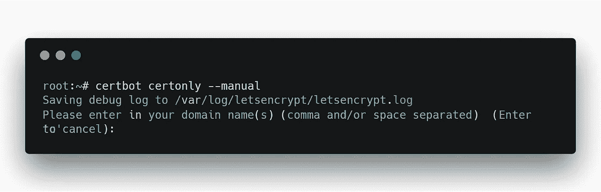
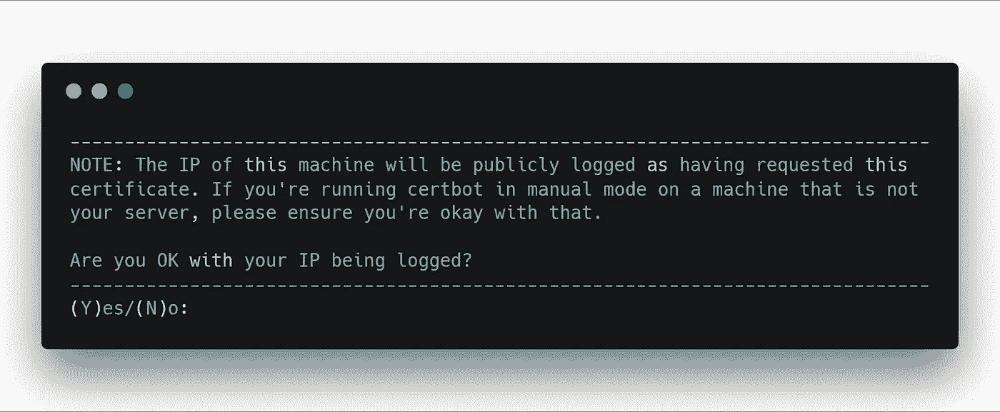
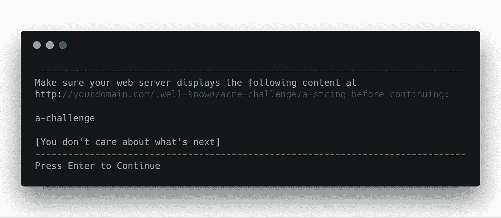
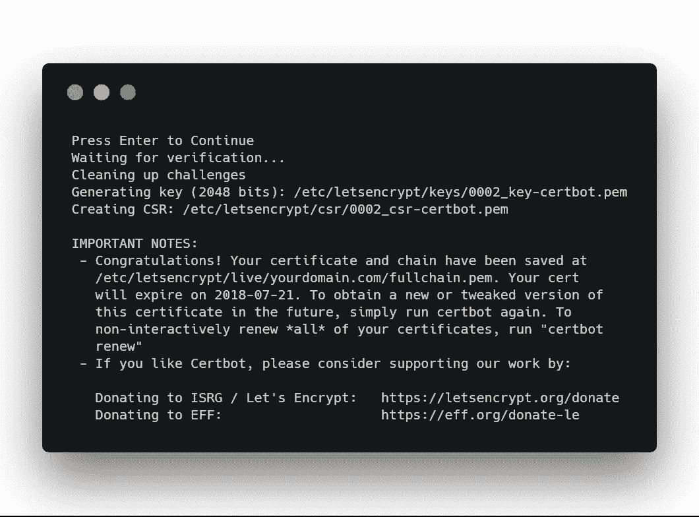

# Node + Express + LetsEncrypt:在 5 分钟或更短时间内生成一个免费的 SSL 证书并运行一个 HTTPS 服务器

> 原文：<https://itnext.io/node-express-letsencrypt-generate-a-free-ssl-certificate-and-run-an-https-server-in-5-minutes-a730fbe528ca?source=collection_archive---------0----------------------->

《一个戴着手表在 MacBook 上打字的男人》由[布拉德·内瑟利](https://unsplash.com/@bradneathery?utm_source=medium&utm_medium=referral)在 [Unsplash](https://unsplash.com?utm_source=medium&utm_medium=referral) 上发表

在写我的上一篇文章的时候，我在处理 LetsEncrypt 生成的 SSL 证书时遇到了很多困难。

我找不到一步一步的教程，就像预期的那样，因此我决定根据对我有用的东西来写我自己的。

> **补充说明:**通常，您的主机会提供一键式解决方案，在您的服务器上设置和更新 SSL 证书。但是如果你像我一样在开发 VPS，你就必须手动处理它。

# 你真正的目的是什么

**首先**，你需要那几样东西:

*   运行在 linux 发行版上的服务器，具有 root 访问权限(通过 SSH)
*   https://nodejs.org/en/
*   快递:`npm install express`
*   Certbot

要安装 certbot，请将这些行复制粘贴到终端中:

`$ sudo add-apt-repository ppa:certbot/certbot`

`$ sudo apt-get update`

`$ sudo apt-get install certbot`

**第二个**，您将使用 certbot 生成一个 SSL 证书:

`$ certbot certonly --manual`

这张图片是用[碳](https://carbon.now.sh/)生成的，我非常喜欢这个工具(谢谢都灵先生)

键入不带协议部分的域名。比如:**yourdomain.com**甚至 **muchdomain.verysite.**

键入 **Y** 然后**回车。**

注意两件事:

*   **字符串:**你现在要创建的文件的名称。只需创建它，我们稍后会处理目录。
*   **a-challenge:** 打开刚刚创建的文件，将这个挑战字符串放入其中。没别的，就这一串挑战。

**现在，不要继续了。您需要使用 Node & Express 运行 web 服务器。**

> 让你的终端在某个地方保持开放

*   **用你想要的名字创建一个目录**，例如:服务器
*   **在这个目录下，创建一个 JS 文件来运行你的服务器。**暂时保留为空，因为我将为您提供一个现成的复制/粘贴源代码。
*   在这个目录中，创建两个目录:`.well-known`，在这个目录中，创建:`acme-challenge`。
*   在目录中:`acme-challenge`放置你之前创建的文件:**一个字符串**

这是你应该有的:

`\server
----\.well-known
--------\acme-challenge
------------a-string
----server.js`

**重要提示:**实际上文件名不是 **a-string，**它是一个很长的字母数字串。出于安全考虑，我不能给你看我的。同样适用于**挑战** …

## 你快完成了！

使用您最喜欢的代码编辑器，复制粘贴以下代码:

要确认一切正常，请打开浏览器并导航至:[**http://yourdomain.com/.well-known/acme-challenge/a-string**](http://yourdomain.com/.well-known/acme-challenge/a-string)

您的浏览器应该会下载您的质询文件。如果不是这样，一切从头再来。不要碰你的外壳，从目录和文件创建重新启动。

如果一切正常，回到您的 shell 并键入 **ENTER。**

万岁，最后一步就完成了！！

复制粘贴下面的代码，你将拥有一个全新的 HTTPS 服务器。

导航到:[**https://yourdomain.com**，](https://yourdomain.com,)你应该会看到“你好！”。

很好，您已经到达本教程的结尾。

遗言:

*   你可能会遇到错误，从头开始重新启动教程，总的来说不要忘记用你实际的域名修改**yourdomain.com**。同样适用于 **a 串**和 **a 挑战**。
*   如果没有效果，让我道歉。StackOverflow 会是你最好的朋友。
*   本教程旨在让您使用手动方法，以便您可以控制几乎一切。对我来说，这是唯一有效的解决方案。

# 感谢阅读

我希望这篇教程足够有帮助。

你可以在这里查看我的上一篇文章:[创建一个可以预订电影票的聊天机器人——第二部分](/creating-a-chatbot-to-book-film-tickets-part-2-435aecdf402d)

请随时通过**David . mell ul @ outlook . fr .**联系我

我对未来文章的建议和要求持开放态度，cya ☕️😃

[吴怡](https://unsplash.com/@takeshi2?utm_source=medium&utm_medium=referral)在 [Unsplash](https://unsplash.com?utm_source=medium&utm_medium=referral) 上的“白色马克杯里的卡布奇诺，白色泡沫艺术在木桌上”