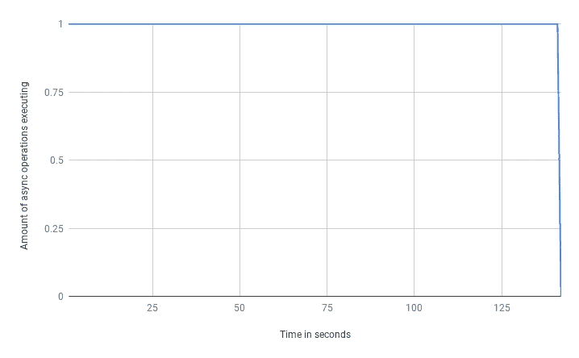
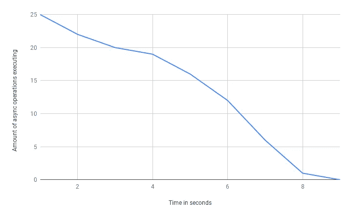
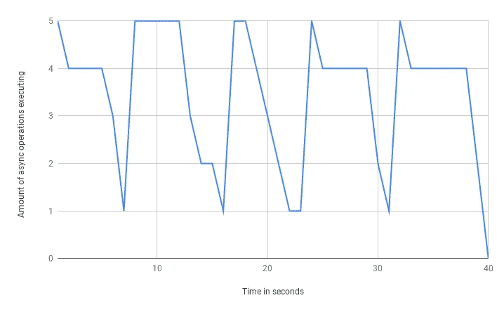
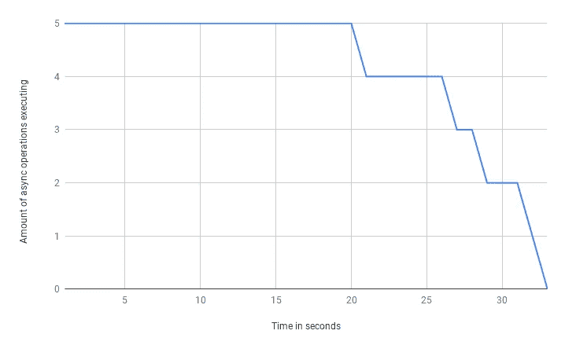

# 在 Node.js 中并行处理异步操作

> 原文：<https://itnext.io/node-js-handling-asynchronous-operations-in-parallel-69679dfae3fc?source=collection_archive---------1----------------------->

Node.js，*简而言之*，是服务器端 JavaScript 执行的单线程环境。你写的 JavaScript 在一个线程上执行。那么 Node.js 如何处理负载并保持性能呢？关键是*非阻塞异步 I/O* 。说实话，根本没那么简单。还有 libuv 的线程池，让某些阻塞的东西表现得像非阻塞。这样或那样，在 Node.js 中，我们异步地做事情，这让成千上万的客户端同时得到服务。有很多不错的文章详细描述了这些方面，因此我不打算深入阐述。

最后，您要处理承诺，它代表一些异步动作。由于回访很容易转化为承诺，所以我不打算考虑它们。我想重点介绍一件事: ***在 Node.js 中并行处理异步操作和正确处理*** *。*

自从 Node.js 4(最初带有`--harmony`标志)以来，我们被赋予了原生承诺。MDN 对承诺的描述如下:

> `**Promise**`对象表示异步操作的最终完成(或失败)及其结果值。

有一点应该牢记在心:一旦承诺产生，它的执行就已经开始了，不管你是否`.then`它。一旦调用`fetch('https://example.com/')`，请求就会被激发；需要`.then`或`.catch`以便仅处理响应。这样，如果创建了几个承诺(例如，我们已经一个接一个地同步调用了几次`fetch`)，请求将被并行触发。

出于演示目的，让我们介绍一个助手函数和一些实用程序:

*   `numberOfOperations`:要执行的异步操作的数量。
*   `listOfArguments`:包含每次执行传递给`asyncOperation`的参数。为简单起见而介绍。
*   `asyncOperation`:伪造异步操作的函数:返回一个承诺，这个承诺会在 1 到 10 秒内解决。
*   `listOfDelays`:数组，包含对应每个`asyncOperation`的解析秒数。`listOfDelays`在开始时填充一次，以后用于所有的镜头和子镜头。*请记住，下面给出的所有时间测量值都与特定的* `*listOfDelays*` *相关，并且可能会因执行而异。无论如何，最终的结果平均起来是一样的*。
*   `watchCounter`:查看当前执行承诺量的功能。每秒将其数据写入控制台。

# 并行执行—取 0

让我们看看下面的代码。我们执行`asyncOperation`并返回结果列表。

说实话，一点都不平行。我们依次等待每个`asyncOperation`完成，因此结果列表按正确的顺序给出。我们在每次迭代中创建一个承诺，并等待它的完成。在任何时候，我们只有一个承诺在执行:

承诺在每一刻都在执行

这种类型的执行需要 142 秒才能完成。执行时间是所有操作执行时间的总和。这种做法，即使我们不屏蔽，似乎也不是一个好的解决办法。

# 并行执行—第一次

这次是平行的，我发誓。让我们稍微改变一下前面的例子。不要在每次迭代中调用并等待`asyncOperation`，让我们预先调用所有的函数。它将为我们提供一份有待兑现的承诺清单:

现在我们所有的承诺都开始并行执行。我们收集等待每个承诺的数据，最终给出正确的结果顺序。

履行承诺的数量随着时间的推移而减少:

并行开始所有的承诺，最后收获

这种执行只花了 9 秒钟。好多了！现在，总时间被绑定到最慢操作的执行时间。

# 并行执行—第二次

我们可以用`Promise.all`缩短前面的代码。它接受一组承诺，并在所有承诺都得到解决时进行解决，或者如果任何承诺被拒绝，则进行拒绝。

执行时间和图表几乎相同，所以我将跳过它。检查之前的拍摄。

虽然我们做得很好，但我们必须牢记一个威胁。

# 并行执行—第三步

前面的两个例子做了我们想要的事情:处理并行承诺的执行。但是它会并行执行*您提供的所有承诺*，这可能会导致一些问题。

如果`asyncOperation`请求有速率限制的第三方 API 怎么办？它可以是请求量或传递的数据量。根据承诺的数量，你可能会碰到这种情况。

重点是:*并行做事情是好的，但你应该考虑实际操作，并防止并行做可能带来的负面后果*。如果能够限制并行执行的请求数量，那就太好了。它将允许更好地控制应用程序的流程。

## 子标签— 0

我们可以很容易地做的是在最开始的时候分割调用的数量。让我们设置一个阈值，在任何给定的时刻，最多并行执行 5 个承诺。这样，让我们将参数列表分散到批列表中，每批 5 个。接下来，我们为每个参数调用`fn`来获得一个承诺列表。最后，我们等待这个列表完成，然后再获取下一个。

嗯，不可否认，我们已经完成了我们需要的。在任何给定时刻，并行执行的承诺的数量被限制为小于或等于 5。我们逐批处理数据并得到结果。整个执行用了 40 秒，比 9 秒差，但比 142 秒好多了。然而，让我们来看看图表。

开始时按批次传播参数，并等待每个批次完成

履行承诺的数量是有峰值的。这意味着负载没有分散，我们可能在峰值之间有一些资源处于空闲状态。问题在于，单个批处理的完成时间与批处理中最慢的操作的完成时间一样长。批处理可能包含 5 个操作，其中 4 个需要 1 秒钟完成，最后一个需要 10 秒钟。由于我们使用的是`Promise.all`，整批也需要 10 秒钟完成。

## 子标签— 1

为了纠正这一点，应该采取另一种方法。让我们逐个承诺地处理数据，而不是将最初的参数数组分散到批中。在前面的子任务中，逻辑是:

*   将参数分散到批次列表中，并对每个批次依次执行以下步骤；
*   为单个批处理中的每个参数调用`fn`以获得承诺列表；
*   等待完成一系列承诺；

现在我们将改变逻辑。我们将创建第一批已解决的承诺，并将以下活动与批中的每个承诺相关联:

*   从参数列表中获取下一个参数；
*   叫`fn`；
*   将相同的步骤链接到返回的承诺(如果我们有要处理的参数)。

这样，一旦当前执行的承诺之一被解决，我们就接受下一个参数，调用`fn`并链接承诺。由于初始批处理的大小等于我们的并发限制，我们不会在一个时刻运行超过 5 个承诺。

因此，我们在任何给定时间最多执行 5 个承诺，但现在我们更好地分配了负载，没有出现峰值:

正确地将执行的承诺数量限制为 5

整个执行过程耗时 33 秒。我们赢了 7 秒，并且更好地分配了负载。

很好，我们现在有了并行执行，并最终获得了对流程的控制。不幸的是，现在喝香槟还为时过早。希望你已经注意到我们遗漏了一件重要的事情:*执行时没有收集到任何结果！让我们来解决这个问题。有几种不同的方法可以做到这一点，我想用一个事实，那就是我们确切地知道在结果数组中应该有多少个元素。因此，我将分配一个空数组，并最终用与最初传递的参数相对应的值填充它。*

每个 Promise 在完成时都会在特定的位置添加一个条目，因此顺序与最初传递的参数相对应。

到目前为止，我们已经完成了所需要的:异步操作被并行执行，我们能够控制这些操作的运行数量。该代码可能在许多地方被缩短，但出于教育目仍保持原样。除此之外，还有很多其他需要改进的地方:

*   只有一个参数被调用，我们将来可能想要传递几个参数；
*   根本没有错误处理，这显然是强制性的，称之为生产就绪的解决方案；
*   在`take3subtake1part0`和`take3subtake1part1`中可以采用另一种方法:我们可以使用索引，而不是增强和复制一系列的参数并耗尽它们；
*   我们可以省略`Promise.resolve`的用法，从真正的操作开始。提示:*我们需要观察最初的参数数量*；

如果有人觉得这篇文章很有趣，我会建议他自己应用这个增强功能来热身。