# Node.js:工作线程的英雄――c++插件

> 原文：<https://itnext.io/node-js-heroes-of-worker-threads-c-addon-76dd11f34c33?source=collection_archive---------3----------------------->

# 碑文

没有哪条龙能抗拒胡扯和浪费时间试图理解它的魅力。― ***J.R.R .托尔金***

# 问题

今天我们将尝试揭示解决 JavaScript 最大的问题之一――CPU 密集型任务的方法。我们将分两部分进行。在第一部分中，我们将讨论并尝试使用纯 CPU 任务。在第二部分中——我们将尝试更多——用于前端、CPU+I/O 绑定任务等的模块。

# 我们有什么？

Node.js 有几种方法可以执行以下任务:
1。只需通过阻塞事件循环在一个进程中运行一个 CPU 绑定的任务。有人会注意到这个选项根本不是一个选项，但是如果流程是专门为这个任务创建的，那为什么不呢。但并不是每个人都有一对额外的内核。
2。创建单独的流程([子流程](https://nodejs.org/docs/latest/api/child_process.html))，在它们之间划分任务。
3。创建一个[集群](https://nodejs.org/docs/latest/api/cluster.html)，强制进程，并使它们工作。
4。使用[工作线程](https://nodejs.org/docs/latest/api/worker_threads.html)并创建一些额外的线程。
5。请 C++开发人员编写一个 [C++插件](https://nodejs.org/docs/latest/api/addons.html)，神秘地执行 CPU 绑定的任务。毕竟，我认为每个人都听过关于编译编程语言的古老传说，并且“本机”实现总是成功的(在这个短语中，世界上的某个地方应该喊 React Native developer，看看他/她的应用程序的性能)。

在本文中，我们将不讨论这些方法的实现，因为这些方法已经在其他文章和报告中详细描述过了。

# 工具

作为 CPU 受限任务的一个例子，我们采用各种散列函数。这些工具将是一个特定模块的“本地”实现，并且是一个纯粹的 js 版本。配备 8 核英特尔酷睿 i7–7700 HQ CPU(2.80 GHz)的硬件

# 会有好玩的吗？

后者提出了如何传达研究的想法、过程和结果的问题……
为此，我选择了 1999 年最流行、最酷、最先进的游戏……
——**《英雄无敌 III》**

# 现在，让我们深入了解这个传说

我们的英雄是 Node.js，和任何英雄一样，他有办法。我们的英雄是强大的，胜利的，已经战胜了许多邪恶，并决定是时候摆脱最糟糕的邪恶之一——CPU 绑定的任务。

# Node.js 团队

我们的英雄必须有一个团队。那么我们要和谁较量呢？集群–7 条黑龙，7 个子进程–7 条红龙和 1 条红龙，名为 JS，因为他总是只向敌人发射一股火焰。7 条工人线程–7 条年轻的绿龙。没有经历过，但是渴望战斗。
1 个 C++插件-1 个大天使。一个经验丰富的战士，他不会透露自己力量的所有秘密，但在过去的战斗中表现得非常好。

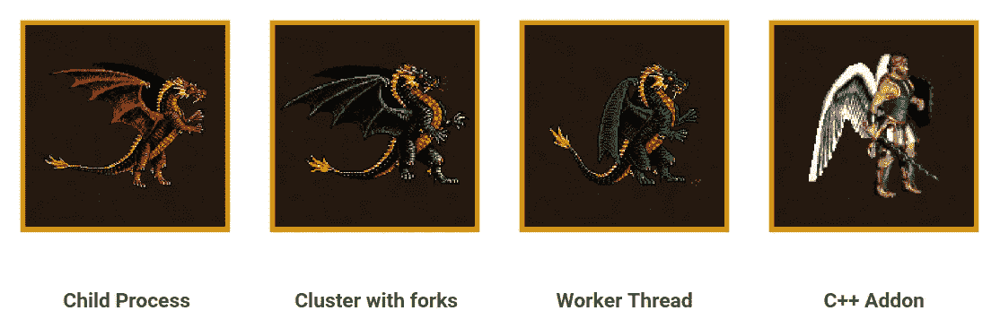

# 第一部分

## 第一次战斗

在他的道路上的第一个恶魔是 140 万个字符串(骷髅步兵)，唯一能让我们打败他们的事情是尽快让他们通过[mur hash](https://en.wikipedia.org/wiki/MurmurHash)(一种适合一般基于哈希的查找的非加密哈希函数)。

模块 [murmurhash3js](https://www.npmjs.com/package/murmurhash3js) 将被用作纯 js 实现，而 [murmurhash-native](https://www.npmjs.com/package/murmurhash-native) 将被用作“本地”实现。

实现(JS 1 进程)-没什么特别的，只是在一个循环中运行哈希函数，并计算前后的时间差:

实现(子进程)–[产生](https://nodejs.org/docs/latest/api/child_process.html#child_processspawncommand-args-options)新进程，并等待所有计算完成(“关闭”事件):

实现(集群)–[分支](https://nodejs.org/docs/latest/api/cluster.html#clusterforkenv)几个(数量取决于 CPU 核心的数量)工作进程，并等待主进程收到来自它们的[消息](https://nodejs.org/docs/latest/api/cluster.html#event-message)(关于工作完成)。由于使用了流程的“消息”号:

实现(工作线程)——几乎与“集群”中的相同——我们创建几个[工作线程](https://nodejs.org/docs/latest/api/worker_threads.html#new-workerfilename-options)，并在[主线程](https://nodejs.org/docs/latest/api/worker_threads.html#workerismainthread)中等待关于已完成作业的[消息](https://nodejs.org/docs/latest/api/worker_threads.html#event-message):

实现(C++插件)-只需在主线程中使用 C++插件(模块)(作为简单的 JS 实现):

…和“开拍！”

第一场战斗的结果:

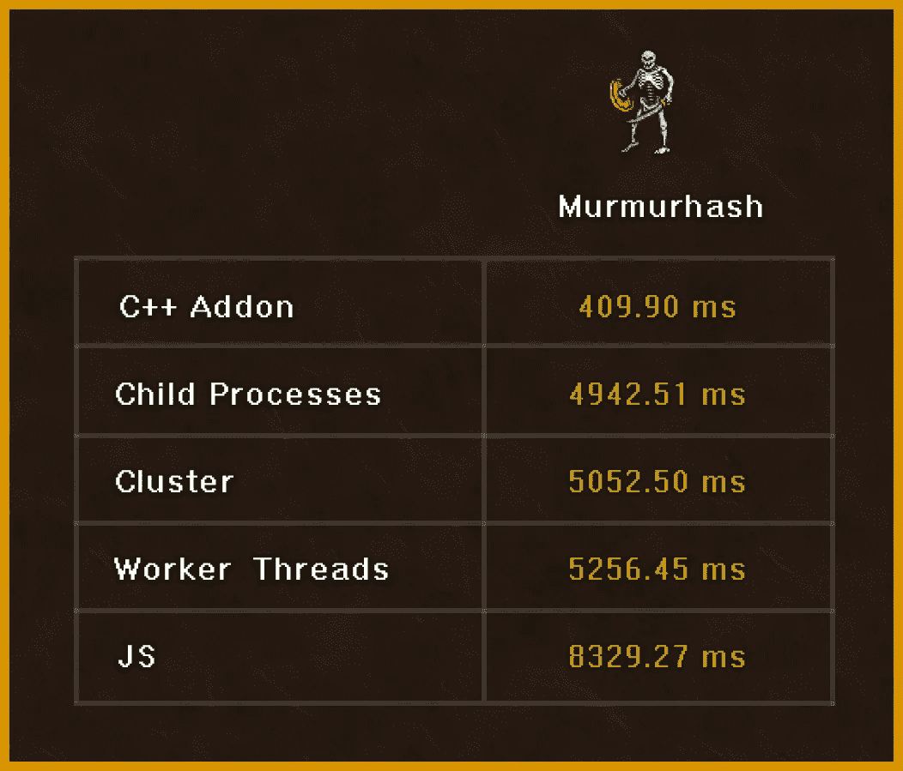

正如我们所见，C++ Addon 是这种情况下最快的实现。子进程/集群/工作线程显示几乎相同的结果。

**第二轮**

他道路上的下一个恶魔是 140 个字符串(骨骼龙)，我们只能用 [Bcrypt](https://en.wikipedia.org/wiki/Bcrypt) (目前是**sync**)——一个基于 [Blowfish](https://en.wikipedia.org/wiki/Blowfish_(cipher)) 密码的密码散列函数来击败它们。这是 OpenBSD 的默认密码散列算法，也是一些 Linux 发行版的默认密码散列算法。

实现与 Murmurhash 完全相同，只是模块不同― [bcryptjs](https://www.npmjs.com/package/bcryptjs) 和 [bcrypt](https://www.npmjs.com/package/bcrypt) 。

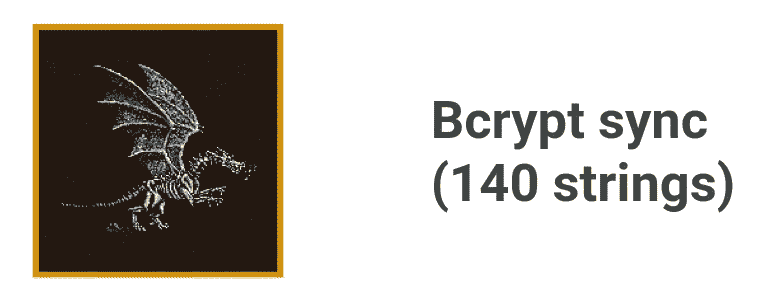

实施示例:

第二轮结果:

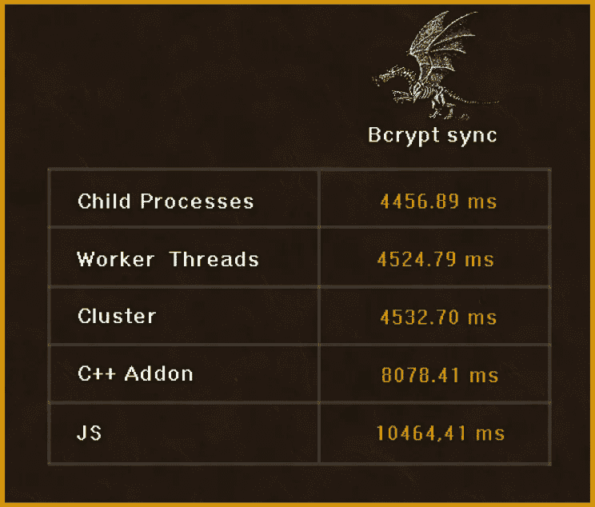

在这种情况下,( sync)最佳选择是划分任务并并行执行，以便子进程/集群/工作线程尽最大努力。

**最后一战**

下一个恶魔是 140 字符串(更强大的骨骼龙),我们可以打败他们，但这次只能用 **async** Bcrypt。实现和之前的战斗完全一样(模块也是)。

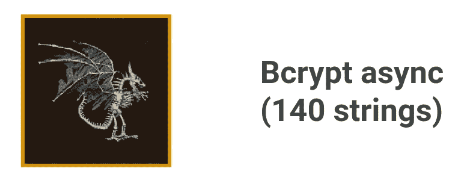

实施示例:

决赛结果:

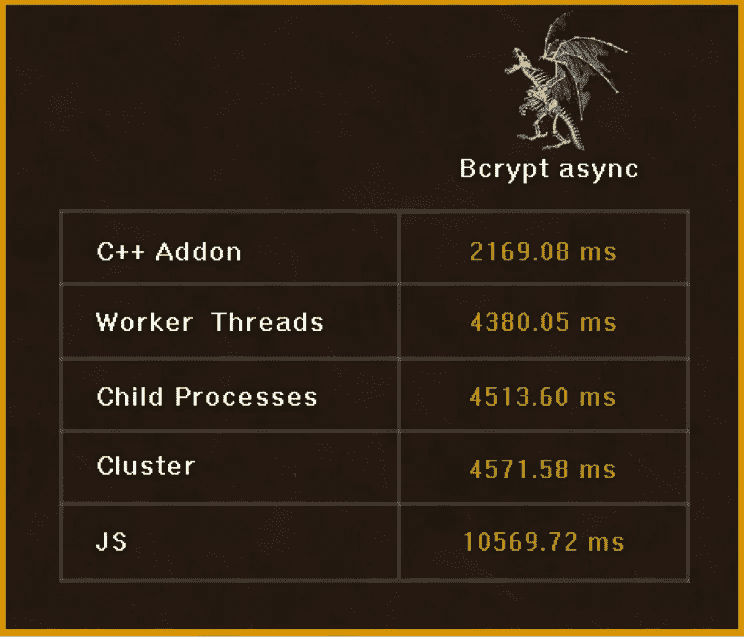

我们没有阻止事件循环并使用 UV 线程池，所以在这种情况下
C++插件再次出现。

…以及之前所有战斗的结果:

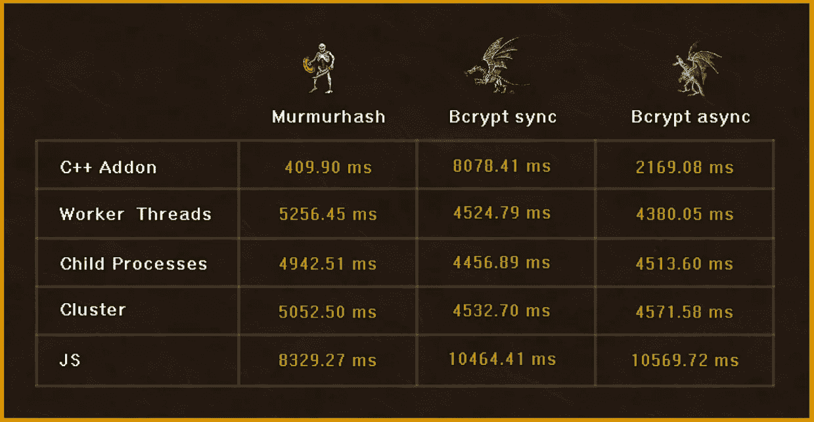

需要提一下，我们的大天使有一个秘密武器。有了它的帮助，他可以更有效地战斗。它是 UV 线程池( [UV_TREADPOOL_SIZE=size](https://nodejs.org/api/cli.html#uv_threadpool_sizesize) )中可以增加的线程数(缺省值为 4)。在我们的例子中，bcrypt 使用[**crypto . random bytes()**](https://nodejs.org/api/cli.html#cli_uv_threadpool_size_size)**，因此这帮助我们将 **bcrypt async** 的执行时间减少了近 2 倍(通过设置 8)。**

# **第二部分**

## **氩 2 堡垒**

**我们史诗故事的第二部分从名为" [Argon 2](https://en.wikipedia.org/wiki/Argon2) "的城堡附近开始。它是由一个密钥派生函数命名的，该函数在 2015 年 7 月的密码哈希比赛中获胜，该比赛有 3 个版本:
- Argon2d 最大限度地抵抗 GPU 破解攻击。它以依赖密码的顺序访问存储器阵列，这降低了[时间-存储器权衡](https://en.wikipedia.org/wiki/Time%E2%80%93memory_trade-off) (TMTO)攻击的可能性，但是引入了可能的[旁路攻击](https://en.wikipedia.org/wiki/Side-channel_attack)。
- Argon2i 优化抗侧信道攻击。它以与密码无关的顺序访问存储器阵列。
- Argon2id 是混动版。它遵循 Argon2i 方法的第一个半遍内存和 Argon2d 方法的后续遍。**

**Node.js 与团队需要使用 [argon2-browser](https://www.npmjs.com/package/argon2-browser) (js)和 [hash-wasm](https://www.npmjs.com/package/hash-wasm) (原生)模块拿下这个堡垒。**

**实施示例:**

****

**战斗结果:**

**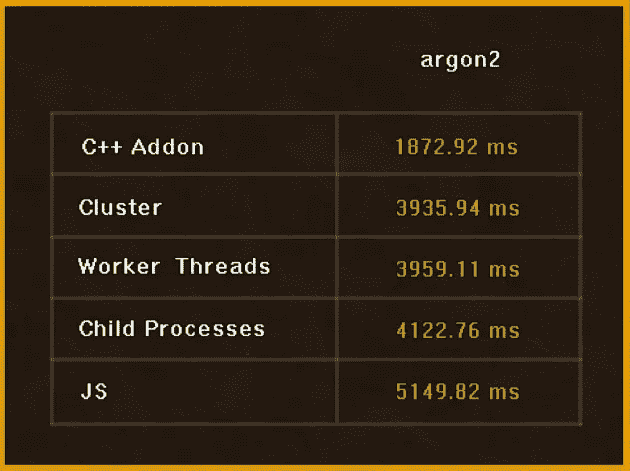**

**C++ Addon 再次处于领先地位，是纯 CPU 绑定任务的最佳选择。**

****重建城堡****

**现在所有的战斗都结束了。我们需要重建这座城市，与当地居民交朋友。为此，我们将阅读所有的法律和传统。幸运的是，所有内容都是在 7 个文件中的 **xlsx** 格式，每个文件有 5000 行(同样，js [xlsx](https://www.npmjs.com/package/xlsx) 和本机 [xlsx-util](https://www.npmjs.com/package/xlsx-util) 模块将被用作“神奇阅读器”)。**

**实现示例(读取并解析文件):**

****

**读取和解析的结果:**

**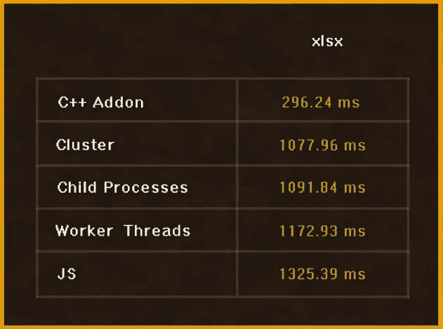**

**在这种情况下，我们混合了 I/O(读取文件)和 CPU(解析)密集型任务。由于第二个任务的组件，C++插件使这个过程更快。**

****变革的时间到了****

**现在我们终于可以改变旧的坏法律，重建一个新的繁荣的社会。为此，我们将使用 [**jsonnet**](https://jsonnet.org) 模板语言。它帮助我们:
-生成配置数据。
-管理扩展配置。没有副作用。
-组织、简化和统一我们的代码。**

**模块 [@rbicker/jsonnet](https://www.npmjs.com/package/@rbicker/jsonnet) (js)和[@ unboundsystems/jsonnet](https://www.npmjs.com/package/@unboundedsystems/jsonnet)(原生)。**

**实施示例:**

****

**有点奇怪的结果，但它主要取决于模块的内部实现。所以无论如何我们都有最后的结果:**

**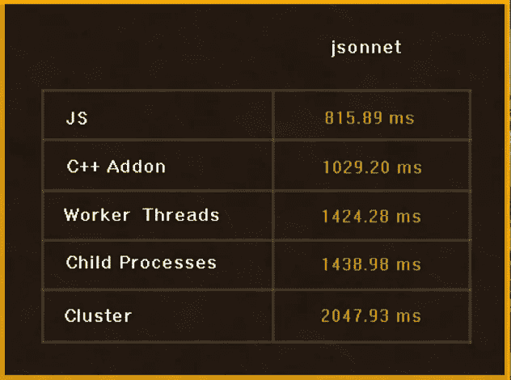**

**第二部分的最终结果:**

**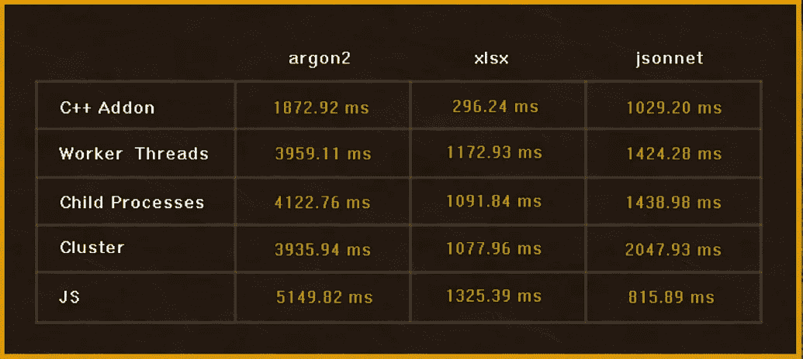**

# **结论**

**从我们的研究中，我们可以得出以下结论:**

1.  **负责任地选择模块。阅读库的代码，并考虑您的应用程序将被部署的环境。模块受欢迎程度并不是最重要的标准。**
2.  **с根据具体任务选择解决方案。子进程、集群、工作线程——这些工具都有自己的特点和使用领域。**
3.  **不要忘记其他可以帮助解决一些任务的编程语言( [C++插件](https://nodejs.org/docs/latest/api/addons.html)、 [Node-API](https://nodejs.org/docs/latest/api/n-api.html) 、 [Neon 库](https://github.com/neon-bindings/neon))。**
4.  **规划您的资源利用率(CPU 或 GPU 核心的数量)。**
5.  **做出合理的架构决策(实现自己的线程池，在单独的微服务中运行 CPU 受限的任务等)。**
6.  **找到可能的最佳组合(C/C++/Rust/Go 可以不在主线程中使用，并且事件循环不会被阻塞),您将得到如下结果:**

****

**感谢阅读。
希望你喜欢这个史诗般的故事，并感受到自己是传奇的一部分。
请鼓掌跟我来，以免错过新文章。**

**要了解更多信息并有可能通过自己运行脚本来检查结果，请访问 github repository。**

** [## novokhatskyioleksii/工人线程](https://github.com/novokhatskyioleksii/WorkerThreadsvsAddons)**