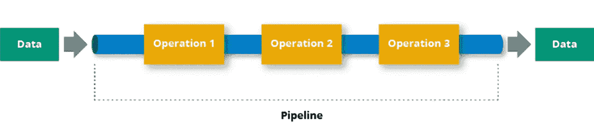

# Node.js 对于数据处理管道来说很糟糕

> 原文：<https://itnext.io/node-js-is-terrible-for-data-processing-pipelines-fe74ee2fd258?source=collection_archive---------1----------------------->



说到数据处理，就像我们在[blockpulsar.com](https://blockpulsar.com)所做的那样，它通常被称为一个以特定格式加载数据，将数据转换成不同的结构，然后返回的函数。这里的逻辑非常简单。有时它如此简单，以至于你认为它会执行得很快，因为它所做的只是改变一个字段的名称或删除一些字段。实际上，所有这些操作都是同步的，如果您同时进行数据转换操作，这将会占用大量 CPU 资源。

Node.js 非常擅长处理异步任务，因为 JavaScript 的事件循环可以执行一些同步操作，同时等待异步函数返回结果。例如，当您有一个与 Node.js 服务器的数据库连接，并且您进行一个异步查询以从中获取一些数据时，您的 Node.js 应用程序有可能执行代码的其他部分。同时，它等待数据库的响应。这使得处理太多的同步操作非常具有挑战性，因为每个同步操作都会阻塞整个过程。甚至异步功能也会被阻塞，直到同步操作完成。

这个问题在使用 Node.js 的相对简单的 Web 服务中经常出现，这些服务提供简单的 JSON 响应。最终，当请求越来越多时，Node.js 开始变得越来越慢，因为 JSON 编码和解码对于 JavaScript 来说是相当繁重的同步操作。

# JSON 解析/字符串性能(慢！)

这是 JavaScript 引擎最常见的性能问题，因为它是一个同步操作，我们在 Node.js 执行期间经常使用它。因此，如果您还没有处理 Node.js 中的 JSON 解析/字符串性能问题，那么您还没有一个高性能的应用程序😃

这并不是说它超级慢，它只是阻塞了整个过程，如果您有许多对象要解析或字符串化，最终会延迟您的异步方法，如从 DB 获取数据或响应 HTTP 请求。

有一些使用工作线程使 JSON 解析和字符串化的方法，但是代码感觉非常 Node。我承认这仍然是可行的，我曾经这样做过，但是它使生产和当地发展变得复杂。

# 在 JS 中滥用对象复制/传播。

假设你已经用 C++、Rust、甚至 Go 等其他低级编程语言做过一些编码(不是低级，而是……)。在这种情况下，您会记得从一个函数到另一个函数复制内存会导致性能下降。这就是为什么大多数开发人员在这些语言中使用指针，他们直接使用引用来改变变量。

我承认，有一条严格的规则，即不改变函数内部的函数参数，适合于代码维护。尽管如此，每次您将一个对象作为给定对象的扩展返回时，JS 引擎都会复制内存，然后删除旧的内存，这当然会导致更多的同步操作。

```
// Not that performant, but good for code readability
function processData(data: Object) {
  return { ...data, changedField: 100};
}// Terrible for code maintanence, but works faster
function processData(data: Object) {
  data.changedField = 100;
  return data;
}
```

我们一直遵循 Eslint 的规则，最终，随着时间的推移，对象扩散/复制成为了真正的性能瓶颈。

# Docker 图像大小(1GB+)

你可能会想，为什么我们甚至在谈论 Docker 图像大小，它与数据处理无关，但它实际上是！拥有 ETL 数据处理系统的关键是根据数据量尽可能快地伸缩，尤其是在第一次数据接收期间，这里有一个对时间敏感的首次同步。但是有一个真正的应用程序太重了，它装满了一个容器。

一些 node-exec 库试图将 Node.js 转换成一个二进制文件，并多次使用。很难管理和跟上其他模块，因为不是所有的支持都与 node _ moduels 文件夹本身分开。如果您正在构建一些简单的 Web API，这是可以的。在数据处理管道中，你通常会尝试使用带有二进制依赖的数据库驱动程序，这样会很容易出错。

# 那么，解决办法是什么？

在[blockpulsar.com](https://blockpulsar.com)，我们切换到 Golang 和 C++，因为编写合适的 JS 代码同步操作优化太难了。我们仍然将 Node.js 作为我们领先的 Web 应用程序 API 服务，因为有这么多优秀的库来处理 Web 集成，如果用其他后端技术来做，将会非常耗时。

并行处理是我们为数据处理管道系统改用另一种语言的主要原因。带有工作线程的 Node.js 比单个常规进程多消耗大约 10 倍的内存，这使我认为我们没有按照设计的方式使用 Node.js。

我们得到了令人震惊的好性能结果和小于 20MB 的容器映像，其中我们只保存一个静态编译的二进制文件。当然，编码需要更多的时间，尤其是在最初，但是如果你打算将数据处理时间从 10 秒降低到 500 毫秒，这就是优化的方法。

# 结论

Node.js 非常适合作为 Web API 运行，但是当您面临繁重的数据处理负载时，它将会非常吃力。一般来说，Node.js 和 JavaScript 有很多库和社区项目，所以用 Node.js 编写项目更令人愉快，但根据项目类型的不同，它可能不太适合

如果您喜欢这篇文章，请让我知道您在生产中是如何与 Node 抗争的😃