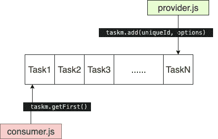
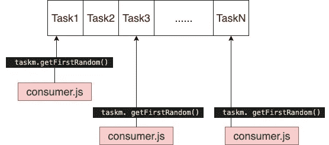
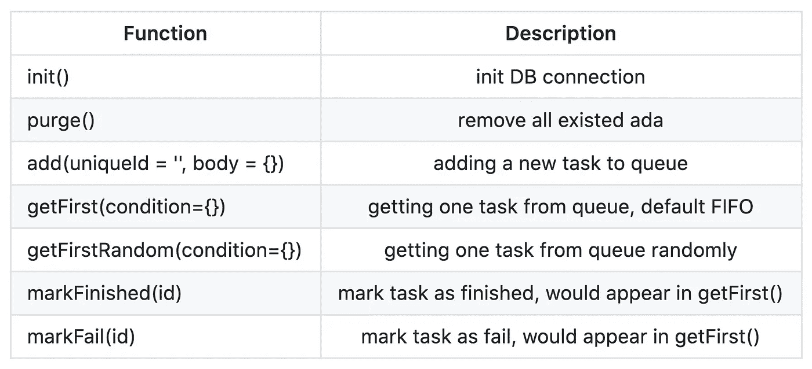

# [Nodejs]管理数千个任务

> 原文：<https://itnext.io/nodejs-managing-thousand-of-task-pscraper-taskm-2eadfb357fc8?source=collection_archive---------4----------------------->


[Nodejs]管理数千个任务

每个程序员都应该经历过，使用 for-loop 来处理大量的任务。比如下载 999，999，999 张图片，从某论坛抓取 999 个网站。如果一切顺利，For-Loop 是好的，但是每当出现异常(尤其是与 HTTP/Internet 相关的作业)并导致程序停止时。我们通常怎么处理是`Restart`，你永远不知道运气什么时候会来结束它。

这个库用于管理大量任务，通过将每个任务添加到队列 *(sqlite)* ，并消化队列中的每个项目。这些是使用`taskm`的原因:

*   你有大量的任务要处理，一个异常可能会导致脚本从头开始
*   你有大量的任务要处理，需要知道有多少是`pending`、`finished`和`fail`
*   你有大量的任务要处理，而这些任务可以被多台计算机消化

(`sqlite`用于管理队列)

# 安装

```
$ yarn add @pscraper/taskmor $ npm install @pscraper/taskm
```

# 示例 1 (FIFO)

查找更多示例:[https://github . com/wahengchang/pscraper/tree/master/packages/demo/taskm](https://github.com/wahengchang/pscraper/tree/master/packages/demo/taskm)

向队列添加新任务(FIFO)



[Nodejs]管理数千个任务

```
const TM = require('@pscraper/taskm')
const taskm = new TM()
await taskm.init()const uniqueId = "amazingId"
const options = {
    title: 'amazingTitle',
    meta: JSON.stringify({key: "key1"})
}
await taskm.add(uniqueId, options)
```

使用队列中的任务

```
const TM = require('@pscraper/taskm')
const taskm = new TM()
await taskm.init()const item = await taskm.getFirst()
// do something
await taskm.markFinished(item.id)
```

# 示例 2(任务分配)



向队列添加新任务

```
const TM = require('@pscraper/taskm')
const taskm = new TM()
await taskm.init()for(let i =0 ; i<999999; i++) {
    const id = `mockId${new Date().getTime()}-${i}`
    const title = `${id}-title-${i}`
    inputList.push({id, title})
    await taskm.add(id, {title})
}
```

从队列中消耗任务，通常在多个 PC 并行上运行

```
const TM = require('@pscraper/taskm')
const taskm = new TM()
await taskm.init()const item = await taskm.getFirstRandom()
// do something
await taskm.markFinished(item.id)
```

# 使用



[Nodejs]管理数千个任务

# 参考:

*   [https://www.freertos.org/Embedded-RTOS-Queues.html](https://www.freertos.org/Embedded-RTOS-Queues.html)
*   [https://github . com/wahengchang/pscraper/tree/master/packages/taskm](https://github.com/wahengchang/pscraper/tree/master/packages/taskm)