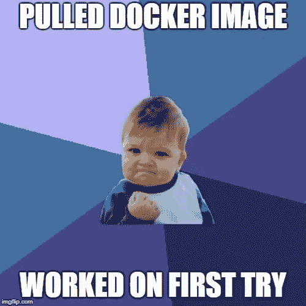

# NodeJS MS-SQL 与 Docker/Mocha 的集成测试

> 原文：<https://itnext.io/nodejs-ms-sql-integration-testing-with-docker-mocha-111fd6b91f25?source=collection_archive---------4----------------------->

# 集成测试与单元测试

单元测试对于测试一个函数的特定行为来说是很棒的，如果你正确地编码并且正确地创建了你的“模拟”依赖项，你就可以合理地保证你的代码的行为。

但是我们的代码并不是孤立存在的，我们需要确保所有的“部分”都是相互连接的，并且以我们期望的方式一起工作。这就是集成测试发挥作用的地方。


查理·西恩没有编写单元测试，看看他现在的处境

解释这种差异的一个好方法是，单元测试将测试一个值(为了简单起见，我们假设是一封电子邮件)是否通过了业务逻辑测试(可能是正则表达式之类的——可能检查 URL ),电子邮件和规则将在测试中作为模拟/存根/硬编码提供，而这种集成测试将检查相同的逻辑，还从数据库中检索规则和值——从而检查所有部分是否匹配和工作。

如果你想要更多的例子或者想在这方面多读一点，介质上有很多资源，还有栈溢出等等。本文的其余部分将假设您熟悉 NodeJS 并测试它(这里我们使用 Mocha——但是您可以随意使用您喜欢的任何东西)。

# 提取 MS-SQL 映像



他使用 Linux 容器:)

首先，你需要提取 Docker 镜像，只需运行命令`docker pull microsoft/mssql-server-linux:2017-latest` *(如果你还没有安装 Docker，你可能也想这样做*😃 *)*

这可能需要几分钟的时间，取决于您在 Docker 缓存中安装了什么。

完成后，请确保右键单击，进入“*设置…* ”并启用:“*显示 tcp://localhost:2375* 上的守护程序”。正如我们将在几节中看到的，这需要设置为`process.env.DOCKER_HOST`才能使 Docker 调制解调器正确运行。

# 推迟摩卡的安装

因为我们需要一些时间来启动容器和部署模式，所以我们将对 Mocha 使用`--delay`标志。

这增加了一个全局函数`run()`，当设置完成时需要调用这个函数。

你也应该使用`--exit`标志，它将在测试运行后杀死 Mocha，即使一个套接字是打开的。

# 准备运行

在这个例子中，我们使用`--require`标志在测试运行之前要求一个文件。在这个文件中使用了 IIFE(立即调用函数表达式),因为我们需要调用一些异步函数并等待它们，然后从上面调用`done()`函数。这可以通过回调来实现，但是不太干净。

生活最终应该是这样的:

```
(async () => {
    const container = require('./infra/container');
    await container.createAsync();
    await container.initializeDbAsync();
    run(); // this kicks off Mocha
    beforeEach(async () => {
        console.log('Clearing db!');
        await container.clearDatabaseAsync();
    });
    after(async () => {
        console.log('Deleting container!');
        await container.deleteAsync();
    });
})();
```

# 从节点旋转容器

在上面的生命中，我们有负责设置容器的方法`container.createAsync();`。

```
const { Docker } = require('node-docker-api');
const docker = new Docker();...async function createAsync() {
    const container = await docker.container.create({
        Image: 'microsoft/mssql-server-linux:2017-latest',
        name: 'mssqltest',
        ExposedPorts: { '1433/tcp': {} },
        HostConfig: {
            PortBindings: {
                '1433/tcp': [{ HostPort: '<EXPOSED_PORT>' }]
            }
        },
        Env: ['SA_PASSWORD=<S00p3rS3cUr3>', 'ACCEPT_EULA=Y']
    });
    console.log('Container built.. starting..');
    await container.start();
    console.log('Container started... waiting for boot...');
    sqlContainer = container;
    await checkSqlBootedAsync(); console.log('Container booted!');
}
```

容器是从`async`方法`docker.container.create`创建的，`docker`实例需要设置`process.env.DOCKER_HOST`，在我们的例子中，我们有一个本地 Docker 服务器正在运行(参见:提取 MS-SQL 映像),所以我们将使用它。

选项来自调制解调器 [dockerode](https://github.com/apocas/dockerode) ，它使用 [Docker API](https://docs.docker.com/engine/api/v1.24/) 。

容器启动后，我们需要检查 SQL 是否运行完毕，我们的端口是 *< EXPOSED_PORT >* ，密码是*<s 00 P3 RS 3 cur 3>***(这些是占位符，所以请确保您输入了有效的内容)。**

如果你想了解更多关于 EULA 期权的信息，等等。点击这里查看微软的指南[。](https://docs.microsoft.com/en-us/sql/linux/quickstart-install-connect-docker?view=sql-server-linux-2017)

由于 SQL server 启动需要几秒钟的时间，我们希望在测试套件启动之前确保它正在运行。我们在这里想出的一个解决方案是每 1/2 秒持续尝试连接 15 秒，当它连接时，退出。

如果它不能在 15 秒内连接，一定是出了问题，我们应该进一步调查。`masterDb.config`选项应该与您托管 Docker 的位置和您将`1433`暴露给主机的端口一致。还要记住你为`sa`设置的密码。

```
async function checkSqlBootedAsync() {
    const timeout = setTimeout(async () => {
        console.log('Was not able to connect to SQL container in 15000 ms. Exiting..');
        await deleteAndExitAsync();
    }, 15000);
    let connecting = true;
    const mssql = require('mssql');
    console.log('Attempting connection... ');
    while (connecting) {
        try {
            mssql.close();// don't use await! It doesn't play nice with the loop 
            mssql.connect(masterDb.config).then(() => {
                clearTimeout(timeout);
                connecting = false;
            }).catch();
        }
        catch (e) {
            // sink
        }
        await sleep(500);
    }
    mssql.close();
}
```

# 使用序列部署数据库模式


有趣的事实:连姆·尼森也用 Docker 发布了北海巨妖。

我们可以通过使用`sync`函数快速使用 Sequelize 来部署模式，然后正如我们将在下面看到的，建议设置某种标志来防止擦除非测试数据库。

首先，我们希望使用主连接实际创建 db。代码最终看起来会像这样:

```
async function initializeDbAsync() {
    const sql = 'CREATE DATABASE [MySuperIntegrationTestDB];';
    await masterDb.queryAsync(sql, {});
    await sequelize.sync();
    return setTestingDbAsync();
}
```

# 安全检查

让我们面对现实吧，如果你从事专业编程已经有一段合理的时间了——你可能已经放弃了一个数据库或文件系统。

*如果你没有跑出去买一张乐透彩票，因为你是幸运的。*

这就是为备份和其他类似的事情建立基础设施的原因，如果你愿意，可以设置路障，以防止人为错误。虽然您刚刚在这里完成的集成测试基础设施非常好，但是您可能错误地配置了环境变量等等。

我将在这里提出一个可能的解决方案，但是请随意使用你自己的(或者在评论中提出更多建议！).

这里我们将使用 SystemConfiguration 表，并在键`TestDB`上有一个键值对，该值需要为 true，表才会被截断。同样，在多个步骤中，我建议将`NODE_ENV`环境变量检查为`test`，这可以确保您不会意外地在非测试环境中运行这段代码。

在上一节的最后我们看到了对`setTestingDbAsync`的调用，内容如下:

```
async function setTestingDbAsync() {
    const configSql =
        "INSERT INTO [SystemConfiguration] ([key], [value]) VALUES (?, '1')";
    return sequelize.query(configSql, {replacements: [systemConfigurations.TestDB]});
}
```

这将设置数据库中的值，我们将在下一个脚本中检查该值。下面是一段代码，它将检查我们刚刚设置的键`TestDB`(由一个常量文件提供)上的值是否存在。

```
const result = await SystemConfiguration.findOne({ where: {key: systemConfigurations.TestDB }});
    if (!result) {
        console.log('Not test environment, missing config key!!!!');
        // bail out and clean up here
    }
// otherwise continue
```

# 每次运行前擦拭测试

将上面的代码与清除数据库的内容结合起来，我们得到了下面的函数:

```
const useSql = 'USE [MySuperIntegrationTestDB];';

async function clearDatabaseAsync() {
    const result = await SystemConfiguration.findOne({ where: {key: systemConfigurations.TestDB }});
    if (!result || !result.value) {
        console.log('Not test environment, missing config key!!!!');
        await deleteAndExitAsync();
    }
    const clearSql = `${useSql}
       EXEC sp_MSForEachTable 'DISABLE TRIGGER ALL ON ?'
       EXEC sp_MSForEachTable 'ALTER TABLE ? NOCHECK CONSTRAINT ALL'
       EXEC sp_MSForEachTable 'DELETE FROM ?'
       EXEC sp_MSForEachTable 'ALTER TABLE ? CHECK CONSTRAINT ALL'
       EXEC sp_MSForEachTable 'ENABLE TRIGGER ALL ON ?'`; await sequelize.query(clearSql);
    return setTestingDbAsync();
}async function setTestingDbAsync() {
    const configSql = "INSERT INTO [SystemConfiguration] ([key], [value]) VALUES (?, '1')";
    return sequelize.query(configSql, {replacements: [systemConfigurations.TestDB]});
}
```

这将在继续之前检查`SystemConfiguration`表中键`TestDB`的值是否存在。如果不存在，它将退出进程。

那么这在摩卡的环境中是如何运行的呢？

如果你还记得在生活中我们调用了`beforeEach`，这是你想要有这个钩子的地方，这样你就有一个干净的数据库用于每个测试。

```
beforeEach(async () => {
        console.log('Clearing db!');
        await container.clearDatabaseAsync();
    });
```

# 关闭/拆卸

你不想让码头工人处于未知状态，所以在运行结束时简单地杀死集装箱，你也会想使用武力。


Docker 联系我们说他们不使用排气口

之后的外观如下所示:

```
after(async () => {
        console.log('Deleting container!');
        await container.deleteAsync();
    });
```

而`container.deleteAsync();`里面的代码看起来是这样的:

```
async function deleteAsync() {
    return sqlContainer.delete({ force: true });
}
```

# 把所有的放在一起

因为这篇文章有点罗嗦，而且跳来跳去，所以下面是让它工作的要点:

*   使用`--delay`延迟摩卡
*   需要一个设置脚本并使用 IIFE 来设置容器/数据库
*   启动 Docker 容器实例，等待 SQL 启动
*   使用 Sequelize 部署模式，并进行安全检查，这样我们就不会删除非测试数据库。
*   将擦拭逻辑钩入`beforeEach`钩
*   将拆卸逻辑钩入`after`钩
*   创建惊人的 codez 并测试它们

我希望你喜欢这篇文章，建议，评论，更正和更多的迷因总是受欢迎的。

## 祝好运，测试愉快！