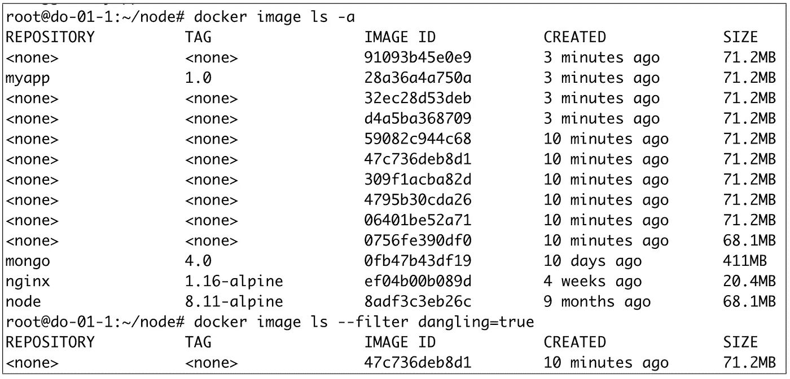

# Docker 提示:关于<none>图片</none>

> 原文：<https://itnext.io/docker-tips-about-none-images-39fb34b20bc5?source=collection_archive---------0----------------------->

## 了解它们是什么以及如何摆脱它们



你是否已经想知道，当你列出你系统上的所有图片时，你能看到的带有 *<无>* 标签的图片是什么？此外，那些被称为悬空图像的呢？在本帖中，我们将仔细观察这些图像，并展示它们是如何创建的。

## **设置 Docker 主机**

让我们从一个全新的虚拟机(本例中使用的虚拟机是在 [DigitalOcean](https://digitalocean.com) 上提供的)开始，使用以下命令以最简单快捷的方式安装 Docker:

```
$ curl [https://get.docker.com](https://get.docker.com) | sh
```

## **从 Docker Hub 获取我们的第一批图像**

因为这个 Docker 主机是全新的，所以上面还没有图像:

```
**$ docker image ls**
REPOSITORY   TAG   IMAGE   ID   CREATED   SIZE
```

让我们来看几张图片:

*   nginx 1.16 版本中的阿尔卑斯风味:*nginx:1.16-阿尔卑斯*
*   mongo 版本 4.0: *mongo:4.0*

```
$ **docker image pull nginx:1.16-alpine**
1.16-alpine: Pulling from library/nginx
e7c96db7181b: Pull complete
8985e402e050: Pull complete
Digest: sha256:04f8a19fce...8a6e7109e0
Status: Downloaded newer image for nginx:1.16-alpine$ **docker image pull mongo:4.0**
4.0: Pulling from library/mongo
9ff7e2e5f967: Pull complete
59856638ac9f: Pull complete
6f317d6d954b: Pull complete
a9dde5e2a643: Pull complete
815c6aedc001: Pull complete
8566b2594855: Pull complete
01c9fe451980: Pull complete
5c9e7bc12cea: Pull complete
c64dd2c4159a: Pull complete
c283cca25ace: Pull complete
051b3304da4a: Pull complete
ab4327c34933: Pull complete
80003bc32b79: Pull complete
Digest: sha256:93bd5412f1...080c203990
Status: Downloaded newer image for mongo:4.0
```

列出主机上呈现的图像，我们显然只得到我们刚刚提取的两个图像:

```
**$ docker image ls**
REPOSITORY  TAG          IMAGE ID      CREATED      SIZE
mongo       4.0          0fb47b43df19  10 days ago  411MB
nginx       1.16-alpine  ef04b00b089d  4 weeks ago  20.4MB
```

没有中间图像，因为我们还没有建立任何东西。如果有一些中间图像，它们将与 *ls* 命令的 *-a* 标志一起列出:

```
**$ docker image ls -a**
REPOSITORY  TAG          IMAGE ID      CREATED      SIZE
mongo       4.0          0fb47b43df19  10 days ago  411MB
nginx       1.16-alpine  ef04b00b089d  4 weeks ago  20.4MB
```

## **构建我们应用程序的映像**

让我们为一个简单的[节点](https://nodejs.org/en/)构建一个图像。js 应用程序由以下文件组成:

*   *index.js* :基于 [expressjs](https://expressjs.com/fr/) 定义一个 web 服务器，它等待/ endpoint 上传入的 HTTP Get 请求，并用一个简单的字符串进行回复

```
// index.jsvar express = require('express');
var util    = require('util');
var app = express();
app.get('/', function(req, res) {
  res.setHeader('Content-Type', 'text/plain');
  res.end(util.format("%s - %s", new Date(), 'Got Request'));
});
app.listen(process.env.PORT || 80);
```

*   *package.json* :定义应用程序的依赖关系，本例中只有*表示*模块

```
// package.json{
  "name": "testnode",
  "version": "0.0.1",
  "main": "index.js",
  "scripts": {
    "start": "node index.js"
  },
  "dependencies": {
    "express": "^4.14.0"
  }
}
```

我们使用下面的 *Dockerfile* 来打包应用程序:

```
# Base image
**FROM** node:8.11-alpine# Copy list of dependencies
**COPY** package.json /app/package.json# Installation of the dependencies
**RUN** cd /app && npm install# Copy application code into the image filesystem
**COPY** . /app/# Define a working directory **WORKDIR** /app# Port use by the web server
**EXPOSE** 80# Command run when a container is created
**CMD** ["npm", "start"]
```

标记为 *myapp:1.0* 的映像可以使用以下命令创建:

```
$ **docker image build -t myapp:1.0 .**
Sending build context to Docker daemon  4.096kB
Step 1/7 : FROM node:8.11-alpine
8.11-alpine: Pulling from library/node
a073c86ecf9e: Pull complete
db7179d8c6cd: Pull complete
66b9cfaecc8c: Pull complete
Digest: sha256:1c38d992f8...8e6449e8e4
Status: Downloaded newer image for node:8.11-alpine
 ---> **8adf3c3eb26c**
Step 2/7 : COPY package.json /app/package.json
 ---> **0756fe390df0**
Step 3/7 : RUN cd /app && npm install
 ---> Running in e6eaedea242c
npm notice created a lockfile as package-lock.json. You should commit this file.
npm WARN testnode@0.0.1 No description
npm WARN testnode@0.0.1 No repository field.
npm WARN testnode@0.0.1 No license field.added 50 packages in 2.601s
Removing intermediate container e6eaedea242c
 ---> **06401be52a71**
Step 4/7 : COPY . /app/
 ---> **309f1acba82d**
Step 5/7 : WORKDIR /app
 ---> Running in 50137f182ee6
Removing intermediate container 50137f182ee6
 ---> **4795b30cda26**
Step 6/7 : EXPOSE 80
 ---> Running in 5b3009be6e2f
Removing intermediate container 5b3009be6e2f
 ---> **59082c944c68**
Step 7/7 : CMD ["npm", "start"]
 ---> Running in bd89f7d79a23
Removing intermediate container bd89f7d79a23
 ---> **47c736deb8d1**
Successfully built 47c736deb8d1
Successfully tagged myapp:1.0
```

上面输出中以粗体突出显示的值是构建过程中生成的中间映像的 id。事实上，在构建的每一步:

*   容器正在运行
*   与步骤中定义的指令相对应的更改在该容器内部完成
*   容器被提交到一个映像(即中间映像)中，该映像将用作下一步的基础映像

这里需要注意几件事:

*   生成的第一个图像(Dockerfile 中的指令)标记有基础图像的值，*节点:8.11-alpine*
*   生成的最后一个映像(Dockerfile 的指令 CMD)标记有正在构建的映像的名称， *myapp:1.0*
*   在构建过程中，生成的 7 个中间图像中有 5 个图像没有任何标签

让我们再次检查主机上显示的图像:

```
**$ docker image ls** REPOSITORY  TAG          IMAGE ID       CREATED         SIZE
myapp       1.0          47c736deb8d1   3 seconds ago   71.2MB
mongo       4.0          0fb47b43df19   10 days ago     411MB
nginx       1.16-alpine  ef04b00b089d   4 weeks ago     20.4MB
node        8.11-alpine  8adf3c3eb26c   9 months ago    68.1MB
```

与之前的列表相比，增加了 2 个图像:

*   myapp:1.0 :我们刚刚创建的图像
*   *节点:8.11-阿尔卑斯*:构建 *myapp:1.0* 时使用的基础镜像

使用-a 标志，我们可以看到现在列出的几个中间图像(其中 5 个),这些是为存储库和标签设置了 *< none >* 值的图像，它们对应于我们讨论过的中间图像。

```
**$ docker image ls -a**
REPOSITORY   TAG         IMAGE ID       CREATED             SIZE
<none>       <none>      309f1acba82d   8 seconds ago       71.2MB
<none>       <none>      59082c944c68   8 seconds ago       71.2MB
myapp        1.0         **47c736deb8d1**   8 seconds ago       71.2MB
<none>       <none>      4795b30cda26   8 seconds ago       71.2MB
<none>       <none>      06401be52a71   9 seconds ago       71.2MB
<none>       <none>      0756fe390df0   14 seconds ago      68.1MB
mongo        4.0         0fb47b43df19   10 days ago         411MB
nginx        1.16-alpine ef04b00b089d   4 weeks ago         20.4MB
node         8.11-alpine 8adf3c3eb26c   9 months ago        68.1MB
```

我们还可以使用 *dangling=true* 过滤器列出悬空图像，即存在但不再被任何标签引用的图像:

```
**$ docker image ls --filter dangling=true** REPOSITORY   TAG      IMAGE ID      CREATED           SIZE
```

在这个阶段，没有发现悬挂图像，我们将在下面看到这种图像是如何创建的。

## **图像的新构建**

让我们稍微修改一下 *index.js* 文件，使其具有以下内容:

```
var express = require(‘express’);
var util    = require(‘util’);
var app = express();
app.get(‘/’, function(req, res) {
    res.setHeader(‘Content-Type’, ‘text/plain’);
    **res.end(util.format("Got Request at %s", new Date());**
});
app.listen(process.env.PORT || 80);
```

我们将使用我们在第一次构建中使用的同一个标记， *myapp:1.0，*再次构建图像:

```
$ docker image build -t myapp:1.0 .
```

我们可以看到新的中间图像被创建，就像第一次构建的情况一样。但是我们也可以看到一个悬空的图像已经生成:

```
**$ docker image ls --filter dangling=true** REPOSITORY   TAG      IMAGE ID      CREATED           SIZE
<none>       <none>   47c736deb8d1  10 minutes ago    71.2MB
```

与中间的图像一样，这个图像的存储库和标签的值为 *< none >* 。正如我们在这里看到的，这个悬空图像的 id， **47c736deb8d1** ，就是之前链接到标签 *myapp:1.0* 的那个。

作为一个记住，下面是第一次建立的形象结束:

```
...
Step 7/7 : CMD ["npm", "start"]
 ---> Running in bd89f7d79a23
Removing intermediate container bd89f7d79a23
 ---> **47c736deb8d1**
Successfully built 47c736deb8d1
Successfully tagged myapp:1.0
```

现在，这个 id 不再链接到 *myapp:1.0* 标签，因为第二次构建已经在新创建的图像(包含我们在 index.js 文件中所做的更改的图像)上设置了这个标签。

以前的图像现在被认为是悬空的，不再被引用。我们可以删除它，但我们可能首先需要确保我们没有在第二次构建中错误地使用相同的标签(这种情况会发生:)

如果错误地重用了标签，仍然可以使用类似于下面的命令向悬挂图像添加标签:

```
$ docker image tag 47c736deb8d1 myapp:1.0-recovered
```

这个图像将不再是一个悬空的图像。

## **清理**

如果我们想去掉所有悬挂的图像(有时甚至不知道我们已经生成了那么多)，我们可以使用 prune 子命令:

```
**$ docker image prune** WARNING! This will remove all dangling images.
Are you sure you want to continue? [y/N] y
Deleted Images:
deleted: sha256:aea2f67f5f...72e221afe0
deleted: sha256:eef519a8cc...f50f2f8140
... 
deleted: sha256:a26154cc03...8716f933ca
deleted: sha256:d1e43f42db...b912ad9792Total reclaimed space: 829.6MB
```

有时我们可以恢复有用的磁盘空间。

希望中间和悬空的图像对你来说不再有秘密:)