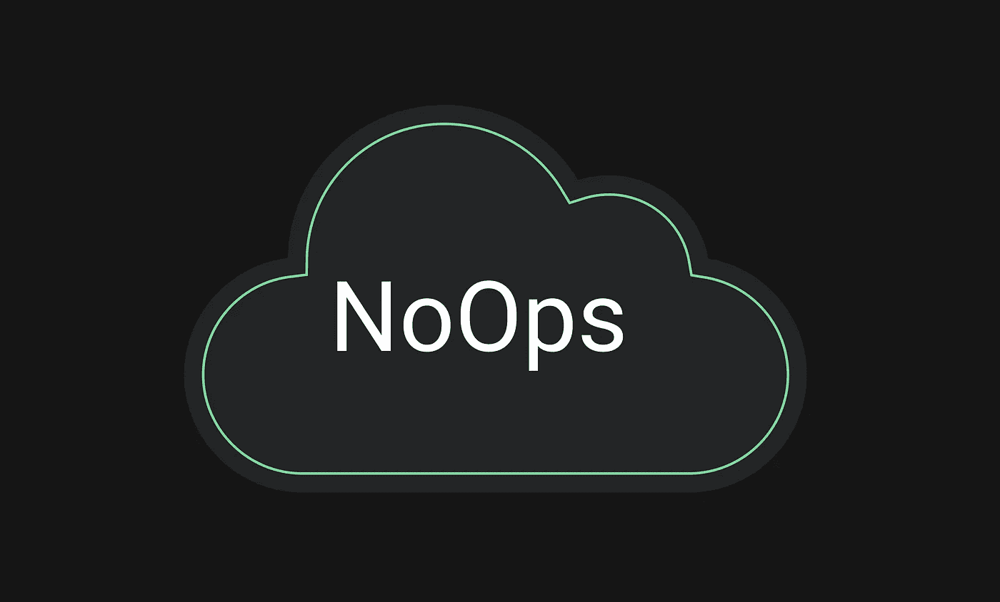

# NoOps:devo PS 工程师的未来会怎样？

> 原文：<https://itnext.io/noops-what-does-the-future-hold-for-devops-engineers-24504ba49a3e?source=collection_archive---------1----------------------->

NoOps 是否意味着 DevOps 时代的终结？或者仅仅是 DevOps 发展的下一步？在本文中，我们将详细探讨这个问题。

随着云应用的增加，应用架构的抽象级别也在增加，从传统的内部部署服务器到容器和无服务器部署。对自动化的关注也增加到不再需要手动干预的程度，即使是备份、安全管理和补丁更新等与基础架构相关的活动也是如此。这种期望的状态等同于 NoOps 环境，它包括可以管理您的应用程序生命周期的较小的团队。理想情况下，在这样的环境中，您的运营团队所需的工作将被消除。

毫无疑问，DevOps 现已深深融入所有云优先组织的 DNA 中，如今已成为一种规范而非罕见现象。云应用需要敏捷性，DevOps 可以满足这一需求。然而，NoOps 是否意味着 DevOps 时代的终结？或者仅仅是 DevOps 发展的下一步？

# DevOps vs. NoOps

DevOps 的成功很大程度上取决于开发和运营团队之间的协作，因为它将系统管理员和开发人员聚集在一起，否则他们将各自为战。同时，持续集成和持续部署的过程在 DevOps 中是至关重要的，这有助于在早期识别问题并避免它们。这反过来导致更快地交付解决方案。但是，请注意，运营团队仍然在很大程度上参与其中。运营团队仍然需要处理一些细节问题，例如:基础架构配置管理、安全设置、备份、补丁管理等。

有了云，抽象和自动化每天都在达到新的高度。只要你能说出它的名字，你就可以在云中拥有它的“即服务”,无论是计算、存储、网络还是安全，等等。云服务提供商也在大力投资他们的自动化生态系统。您可以使用自动化模板或几个 API 调用轻松地配置您的应用程序组件。这些组件的持续管理也可以实现自动化，这意味着维护环境的开销更少，并且最少甚至不需要人工干预。这将我们引向 NoOps——基础设施的高度抽象，与开发工作流紧密集成，不需要运营团队来监督流程。

NoOps 这个术语最初是由 Forrester 创造的，旨在提高生产率，比 DevOps 更快地交付成果。在理想的场景中，开发人员永远不必与运营团队的成员合作。相反，他们可以使用一组工具和服务，以安全的方式负责任地部署所需的云组件，包括代码和基础架构。托管云服务，如 PaaS 或无服务器，是 NoOps 的主干，并利用 CI/CD 作为其部署的核心引擎。因此，请注意，并不是所有的场景都适合 NoOps。

# NoOps:优势与挑战

NoOps 和 DevOps 本质上试图实现同样的事情:改进软件部署过程并缩短上市时间。但是，虽然 DevOps 强调了开发人员和运营团队之间的协作，但在 NoOps 中，重点已经转移到了完全自动化上。这听起来像是一颗银弹，但是这种新方法既有优势也有挑战。

# 优势

## **1。自动化程度更高，员工数量更少**

NoOps 将重点转移到无需人工干预的可部署服务上。从基础设施到管理活动，目标是使用代码控制一切，这意味着每个组件都应该作为代码的一部分进行部署，并且从长远来看是可维护的。NoOps 本质上寻求消除支持代码生态系统所需的人力。

## 2.充分利用云的力量

NoOps 最适合利用 PaaS 和无服务器解决方案的云环境。微服务和基于 API 的应用架构完全符合这一要求，因为它们提供了细粒度的模块化和自动化。领先的云服务提供商，如 AWS、Azure 和 GCP，专注于在 PaaS 和无服务器中提供更多的服务和功能，这将有助于加快 NoOps 的采用。当前云中数据库即服务、容器即服务和[功能即服务](https://azure.microsoft.com/en-in/services/functions/)选项的增加也有利于这一趋势，所有这些技术都支持极端自动化。

## 3.从运营到业务成果的转变

NoOps 还将关注点从运营转移到业务成果。与开发团队和运营团队合作向客户提供价值主张的开发运维团队不同，NoOps 理想地消除了对运营团队的任何依赖，从而进一步缩短了上市时间。焦点再次转移到为客户提供价值的优先任务上——换句话说，“快战胜慢。”

# 挑战

## 1.你仍然需要行动

理论上，不需要运营团队来维护您的基础架构听起来可能有利可图。然而，根据可实现的自动化程度，您可能仍然需要它们来处理异常或监控结果。期望开发人员注意这一点会抵消 NoOps 的好处，并转移他们对交付业务成果的关注。考虑到开发人员不一定具备解决运营问题所需的技能，这也不是一种实用的方法。例如，考虑一个灾难恢复(DR)场景。您仍然需要运营团队的支持来调用灾难恢复计划并将流量切换到故障转移站点。

## 2.考虑你的环境

此外，并不是所有的环境都可以过渡到 NoOps。混合部署和传统基础架构会造成瓶颈—自动化仍然是可能的，但在这些情况下不能完全消除人工干预。虽然目标是 NoOps，但 PaaS 和无服务器也可能成为一个限制因素，尤其是在数字化转型期间。重构遗留单片应用程序以适应 PaaS 范式所需的额外努力将是违反直觉的。在采用 NoOps 方法之前，您需要根据具体情况仔细评估利弊。

## 3.谁来负责安全？

最后但同样重要的是安全性和合规性问题。符合安全最佳实践的自动化部署不会完全消除您保护安全的需要。传统上，运营和开发团队之间有职责分离。运营团队与安全团队合作实施控制，保护应用程序免受威胁和漏洞的侵害。同时，运营团队还负责处理身份和访问管理(IAM)解决方案。

云中的威胁媒介和攻击方法每天都在发展，您的云安全控制也应该如此。合规性也是如此。不是所有的组织都可以将这种责任委托给一组自动化的过程。减少或消除运营团队可能会导致您需要增加对安全团队的投资，以确保环境的安全性和合规性。

# 目的地 NoOps

DevOps 被认为是一个旅程，而不是一个目的地，其重点是持续改进。更保险的说法是，NoOps 是 DevOps 的进化，目标是极端自动化的完美最终状态。它允许组织将时间、精力和资源从运营转向业务成果。然而，这种改变不可能一蹴而就。

NoOps 要成为现实，需要做大量的基础工作。您需要在云中确定正确的应用程序堆栈和托管服务，即 PaaS 和无服务器，以便进行过渡。您需要对组件管理、配置和安全控制进行测试才能开始。即使这样，也会有一些遗留系统需要花费更多的时间和精力来过渡，或者根本无法过渡。即使只剩下一个遗留系统，您仍然需要有人来处理它的操作方面。

在 NoOps 的世界中，DevOps 工程师的角色也发生了变化，因为他们有机会学习 NoOps 所需的新技能和流程。像 DevOps 一样，NoOps 更多的是关于文化和流程的转变，而不是技术。组织需要有意识地进行这种转变，同时对转变的实际性保持清醒的认识。

有关我们的最新见解和更新，[在 LinkedIn 上关注我们](https://www.linkedin.com/company/codersociety)

*原载于*【https://codersociety.com】