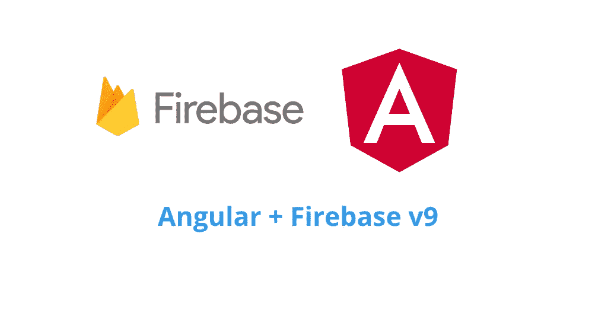

# 使用最新 Firebase v9 的注意事项

> 原文：<https://itnext.io/note-on-using-latest-firebase-v9-in-angular-f6591d48b851?source=collection_archive---------1----------------------->



Angular + Firebase v9

[Firebase v9 发布了一段时间](https://firebase.blog/posts/2021/08/the-new-firebase-js-sdk-now-ga),其优点是树摇动(删除未使用的代码),使您的 web 应用程序尽可能小而快。

感谢 [@angular/fire](https://github.com/angular/angularfire) 的贡献者们，我们有机会迁移我们的 angular 应用程序来利用模块化方法。

这是我从 compat 迁移到真正的 Firebase v9 后的笔记。

# 初始化+仿真器

兼容 v9

```
// app.module.tsimport { AngularFireModule } from '[@angular/fire](http://twitter.com/angular/fire)/compat'
import { AngularFireAuthModule, USE_EMULATOR as USE_AUTH_EMULATOR } from '[@angular/fire](http://twitter.com/angular/fire)/compat/auth'
import { AngularFirestoreModule, USE_EMULATOR as USE_FIRESTORE_EMULATOR } from '[@angular/fire](http://twitter.com/angular/fire)/compat/firestore'
import { AngularFireFunctionsModule, USE_EMULATOR as USE_FUNCTIONS_EMULATOR } from '[@angular/fire](http://twitter.com/angular/fire)/compat/functions'
import { AngularFireStorageModule, BUCKET } from '[@angular/fire](http://twitter.com/angular/fire)/compat/storage'[@NgModule](http://twitter.com/NgModule)({
  ...
  imports: [
    AngularFireAuthModule,
    AngularFirestoreModule,
    AngularFireStorageModule,
    AngularFireFunctionsModule,
    AngularFireModule.initializeApp(environment.firebase),
 ],
  providers: [
    {
      provide: BUCKET,
      useValue: environment.firebase.storageBucket,
    },
    { 
 provide: USE_AUTH_EMULATOR, 
 useValue: environment.useEmulators ? ['[http://localhost:9099'](http://localhost:9099')] : undefined 
    },
    { 
 provide: USE_FIRESTORE_EMULATOR, 
 useValue: environment.useEmulators ? ['localhost', 8080] : undefined 
    },
    { 
 provide: USE_FUNCTIONS_EMULATOR, 
 useValue: environment.useEmulators ? ['localhost', 5001] : undefined 
    },
  ],
})
```

v9

```
// app.module.tsimport { getApp, initializeApp, provideFirebaseApp } from '[@angular/fire](http://twitter.com/angular/fire)/app'
import { connectAuthEmulator, getAuth, provideAuth } from '[@angular/fire](http://twitter.com/angular/fire)/auth'
import { BUCKET } from '[@angular/fire](http://twitter.com/angular/fire)/storage'
import {
  connectFirestoreEmulator,
  Firestore,
  getFirestore,
  initializeFirestore,
  provideFirestore,
} from '[@angular/fire](http://twitter.com/angular/fire)/firestore'
import { connectFunctionsEmulator, Functions, getFunctions, provideFunctions } from '[@angular/fire](http://twitter.com/angular/fire)/functions'
import { connectStorageEmulator, getStorage, provideStorage } from '[@angular/fire](http://twitter.com/angular/fire)/storage'
import { environment } from 'src/environments/environment'[@NgModule](http://twitter.com/NgModule)({
  ...
  imports: [
    provideFirebaseApp(() => initializeApp(environment.firebase)),
    provideAuth(() => {
      let auth = getAuth()
      if (environment.useEmulators) {
        connectAuthEmulator(auth, '[http://localhost:9099'](http://localhost:9099'), { disableWarnings: false })
      }
      return auth
    }),
    provideFirestore(() => {
      let firestore: Firestore
      if (environment.useEmulators) {
        // long polling for Cypress
        firestore = initializeFirestore(getApp(), {
          experimentalForceLongPolling: true,
        })
        connectFirestoreEmulator(firestore, 'localhost', 8080)
      } else {
        firestore = getFirestore()
      }
      return firestore
    }),
    provideStorage(() => {
      const storage = getStorage()
      if (environment.useEmulators) {
        connectStorageEmulator(storage, 'localhost', 9199)
      }
      return storage
    }),
    provideFunctions(() => {
      let functions: Functions
      functions = getFunctions()
      if (environment.useEmulators) {
        connectFunctionsEmulator(functions, 'localhost', 5001)
      }
      return functions
    }),
  ],
  providers: [
    {
      provide: BUCKET,
      useValue: environment.firebase.storageBucket,
    },
  ],
})
```

# 证明

```
import { Auth} from '@angular/fire/auth'constructor(private auth: Auth) {...}
```

**获取用户**

```
import { Auth, authState } from '@angular/fire/auth'this.user$ = authState(this.auth)
```

**谷歌登录**

```
login() {
  const provider = new GoogleAuthProvider()
  return this.oAuthLogin(provider)
}private oAuthLogin(provider) {
  return from(signInWithPopup(this.auth, provider))
  .pipe(
    tap((credential) => this.updateUserData(credential.user))
  )
}
```

# 数据库(Firestore)

```
import {Firestore} from '@angular/fire/firestore'...
firestore = inject(Firestore)
private votesCollectionRef = collectionGroup(this.firestore, Collection.Votes) as CollectionReference<Vote>
```

一些动作

```
// Retrieve data
getUserVotes(userId: string) {
  const colQuery = query(this.votesCollectionRef, 
     where('userId', '==', userId), where('isVoted', '==', true)
  return collectionData(colQuery)
}// Update data
saveFeedback(feedback: Feedback) {
  const docRef = doc(this.firestore, Collection.Feedbacks, feedback.feedbackId)
  setDoc(docRef, feedback, { merge: true })
}// Delete data
deleteFeedback(feedbackId: string) {
  const docRef = doc(this.firestore, Collection.Feedbacks, feedbackId)
  deleteDoc(docRef)
}
```

目前就这些。希望有帮助。