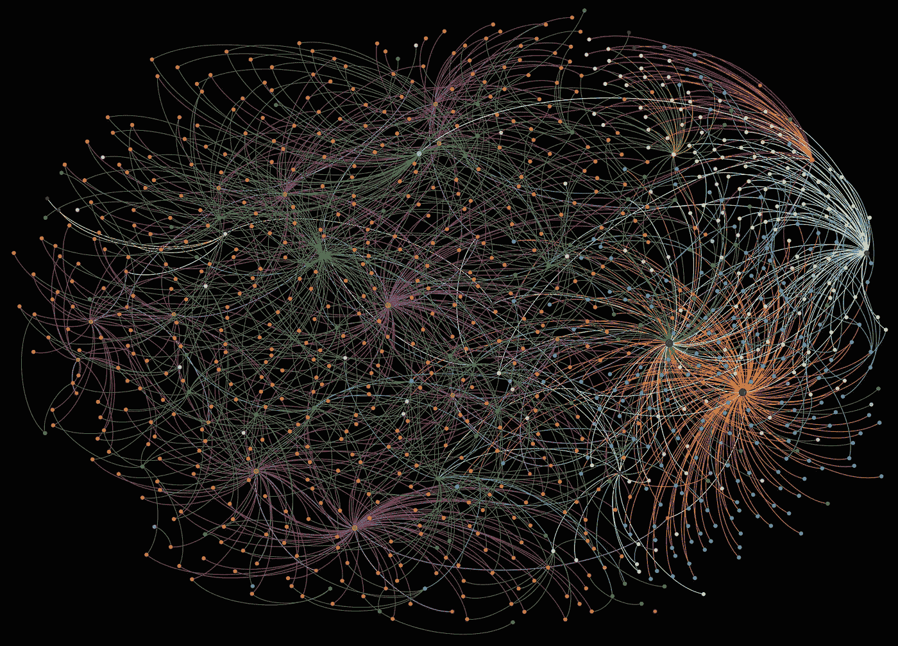
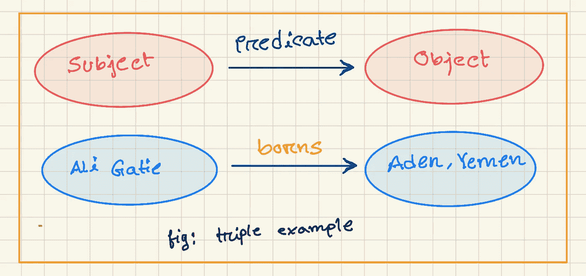

# 关于链接开放数据的注释(知识图)

> 原文：<https://itnext.io/notes-about-linked-open-data-knowledge-graph-7800a36dc228?source=collection_archive---------6----------------------->

> 一切都是有联系的，如果你去寻找，一切都有意义。
> 
> —米歇尔·威廉姆斯

首先，至少我们应该知道关联数据的定义。不是我自己的定义，维基百科说—

> 在[计算](https://en.wikipedia.org/wiki/Computing)中，**关联数据**(通常大写为**关联数据**)是与其他数据相互链接的结构化数据，因此通过[语义查询](https://en.wikipedia.org/wiki/Semantic_query)变得更加有用。



颜色知识

先说一个场景。假设我们创建了一个回答问题的应用程序。我们提问，它会回答。不，我不是要谈论 NLP，ML，而是一个简单的包含 if-else 条件的数据库(NoSQL/SQL 现在不要想太多)。每次你问问题，应用程序在数据库中搜索，如果答案在我们的数据库中找到，那么它的回答就会显示在控制台上，“对不起，我不知道。”。我们在你的电脑和我的电脑上编写并运行两个副本。在这种情况下，我在我的数据库中存储一定数量的问题和答案，而你为你的数据库存储一些数据。现在，想想看，如果你的数据集，我的数据集被公开发布，并使用相同的格式来组织信息，那么这个应用程序就有更多的数据集需要回答。分析大量的数据可能比每个人使用自己的数据集要强大得多。

这是链接开放数据或知识图的粗略概念。

要发布数据，只要是被广泛采用的，我们想互相连接，就有一些标准。到目前为止，链接开放数据需要记住三个关键点—

*   数据必须对所有人开放和可用
*   遵循相同的标准并确保唯一的实体( [W3C 发布数据的标准](https://www.w3.org/TR/ld-bp/)
*   实体之间的关系(三重)

您能想象哪种数据库最适合这种情况吗？

## [为什么是图形数据库？](https://neo4j.com/why-graph-databases/#:~:text=Their%20secret%3F,opportunity%20for%20sustained%20competitive%20advantage.)

图形数据库技术利用数据连接的力量。

图形数据库是专门为处理高度关联的数据而构建的，当今数据的数量和连通性的增加为[持续竞争优势](http://neo4j.com/resources/wp-sustainable-competitive-advantage/)提供了巨大的机会。

*   表演
*   灵活性
*   灵活

# 实体之间的关系

## 三重概念

先说个例子。

问题:`Who is Ali Gatie`？

```
Ali Gatie is a [singer](https://www.youtube.com/watch?v=PXGycbkbtW0&list=RDNKzd_YiW9AQ&index=3). He borns Aden,Yemen.
```

这是我们的主题。我们有兴趣更多地了解这个人，并要求我们的系统去寻找更多关于这个主题的信息。如果我们存储像字符串这样的东西，那么我们的系统将不是最优的。为了使它更好，我们可以把句子分成三部分。
**描述`Ali Gatie singer`和`Aden`关系的主语、谓语、宾语**。在链接开放数据中，它被称为三元组。代表三倍的传统方式。



当我们把三个放在一起时，它们就形成了一个图形，因为三个是相互联系的。谓语连接主语和宾语。
同理，`Ali Gatie →(is) singer.`

# 如何对图表进行编码

图形可以用几种方式编码。
—邻接矩阵
—列表
但这不足以公开交换图形。因此，在 1999 年，RDF(资源描述框架)被引入到网络数据交换中。基本上，RDF 是交换图形的 W3 标准。

**RDF 图:**RDF 图是由以下部分组成的一组三元组:
—主语是 URI 或空白节点
—谓语是 URI
—宾语是 URI、黑色节点或文字

现在有一个问题，由于我们的数据公开发布在网络上，而且在世界上，有这么多的人名叫`Ali gatie`，所以显然这个名字不可能是唯一的标识符。电话，护照号都可以。我们有一个很好的解决方案——URIs。

# URIs 的角色

URI 指的是统一资源标识符。URI 帮助我们消除了所有不同人之间的歧义。URI 和 URL 的区别在于，URL 负责定位 web 上的某些内容，而 URL 是 URL +特定数据/文件。所有的网址是 URI，但所有的 URI 不是网址。我们创建一个唯一的标识符，并将其发布在 URI 的网站上，然后我们就可以找到这个人的所有信息。等等，如果你已经有一个可以使用的 URI，不要发表不必要的。

# RDF 序列化

[连载](https://en.wikipedia.org/wiki/Serialization)是“你如何写下事情”的专业术语。

## 龟

表达 RDF 三元组的一种常见且相当简单的语言叫做 [Turtle](https://www.w3.org/TeamSubmission/turtle/) 。一个简单的样本 turtle 文件(。ttl)长这样。

注意`ab`在第一行被描述为前缀。前缀(或者更恰当地说， [QNames](https://en.wikipedia.org/wiki/QName) )是数据库主体中的速记。我们不用在数据库的任何地方都写完整的`URI`，我们只使用`@prefix`，我们可以认为`ab`是这个`URI`的一个变量。

`ab:ali_gatie = http://learningsparql.com/ns/addressbook#ali_gatie`

`borns`、`homeTel`和`emai`也是遵循同样的方式。A `full stop(.)`表示语句的终止。我们这里有 6 个三连音，我是说每一行都是三连音。注意，`ab: ali_gatie`和`ab: richard`，我们反复写道，我们可以使用`comma (,)`和`semicolon (;)`来删除重复。`Comma(,)`用于主语和谓语相同，但宾语不同的情况。`Semicolon(;)`用于主语相同，但谓语和宾语不同时。

我刚刚解释了一个关于 RDF 的粗略解释，这将有助于深入这些主题。如果你想了解更多你可以关注[这个链接](https://github.com/whanley/RDF-tutorial/blob/master/making-a-small-rdf-database.md)。

# 查询 RDF

到目前为止，我们已经做好了数据库准备。显然，我们必须添加更多的三元组来获得更多的数据。现在该查询了。

## SPARQL

SPARQL 是一种 RDF 查询语言。这么多东西要学对不对？

`Prefix`同龟档。你可以把`?name`看成一个变量。那些有 PHP 语言知识的人很容易理解`$variable_name`的意思。在`where`子句中，有一个条件/三元模式`(?subject ?predicate ?object)`。这意味着如果这个三元模式与我们数据库中的任何三元模式相匹配，就返回那个人的信息。`?name`变量将取代匹配图形的`value`。在我们的例子中，值是`richard`。因为我们只选择了`name`，所以如果你运行这个查询，它将只显示名字`richard`。

```
SELECT name FROM *table_name* 
WHERE email='richard49@hotmail.com';
```

如果我们编写一个 SQL 查询，它看起来会像这样。

## 参考

*   德国德累斯顿的知识图谱有非常好的详细讲座。

*   [链接开放数据原理介绍](https://programminghistorian.org/en/lessons/intro-to-linked-data)