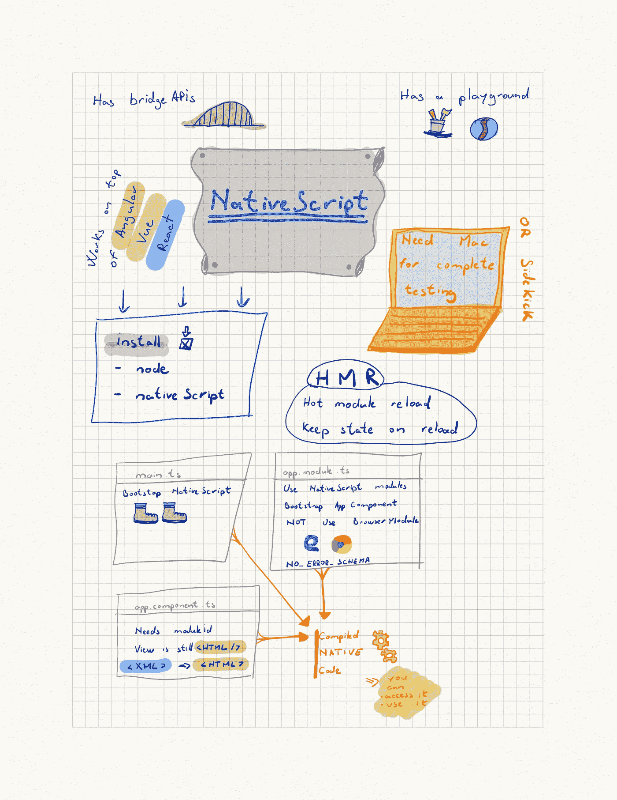
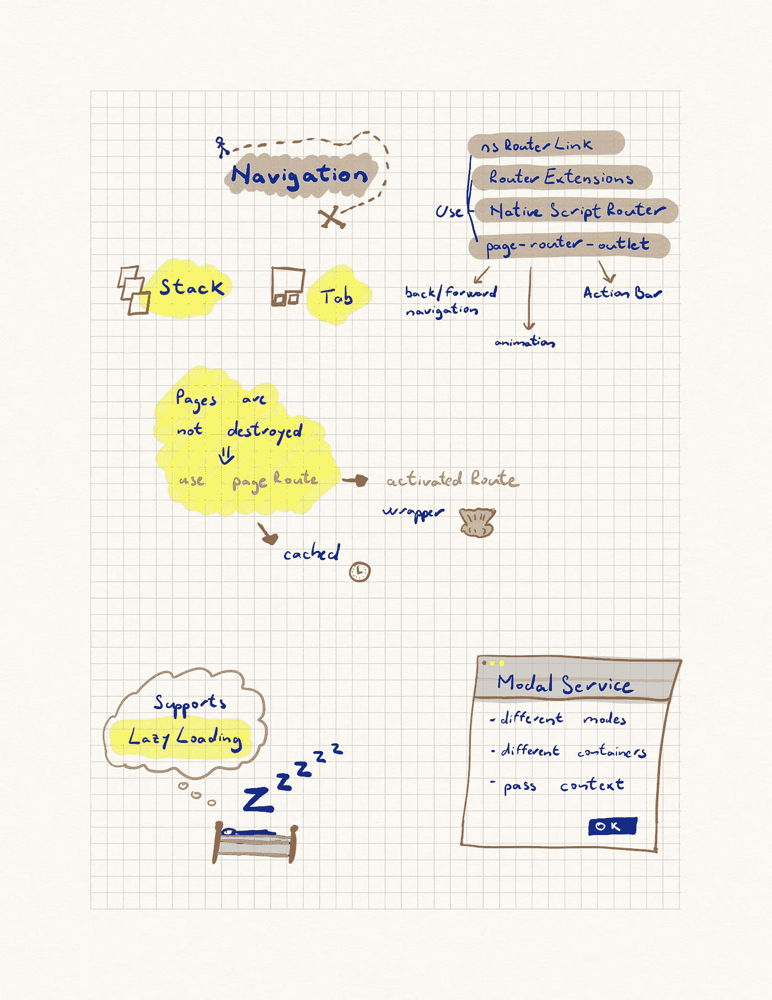
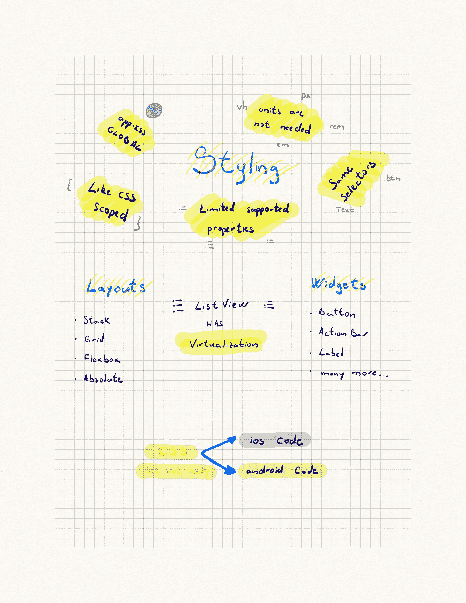
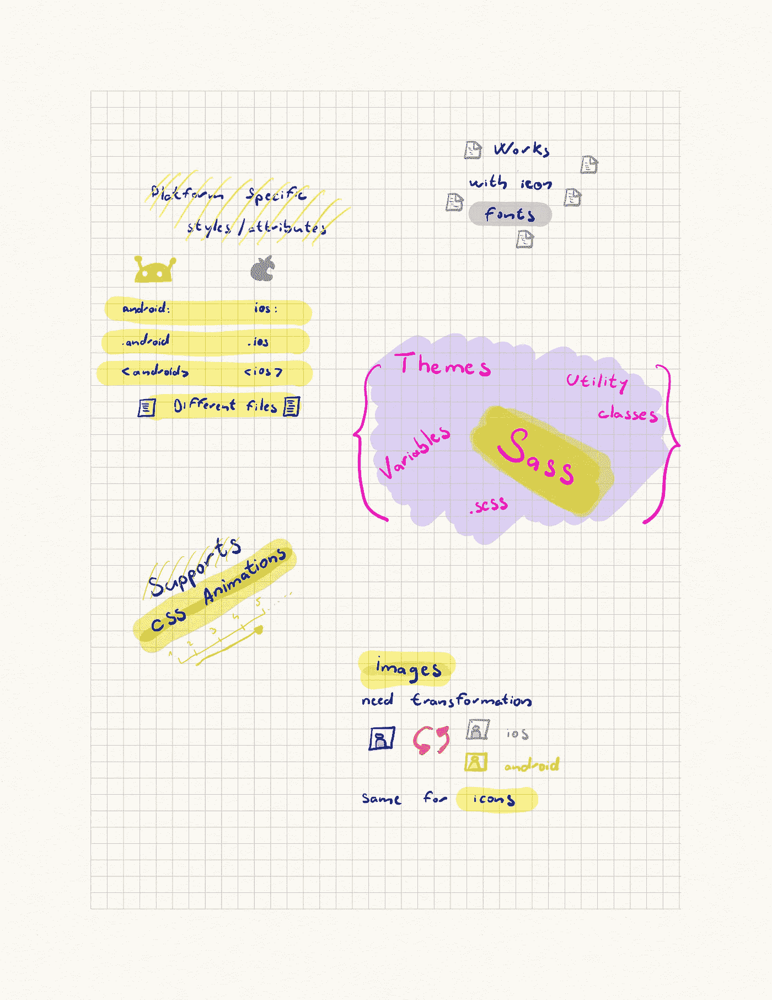
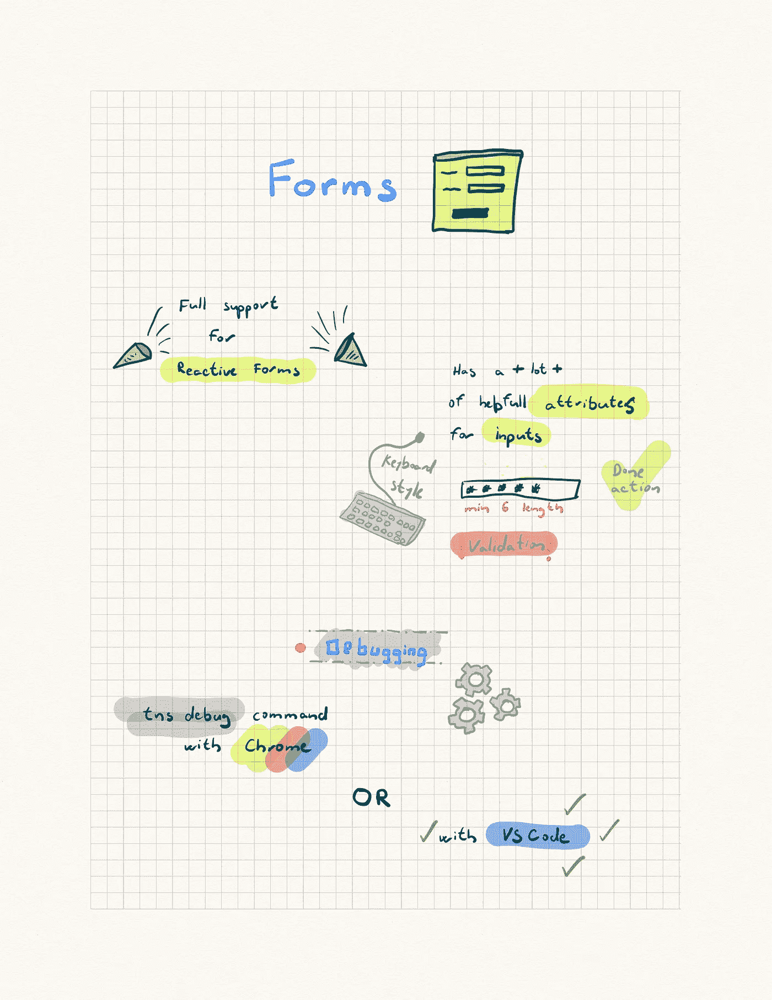
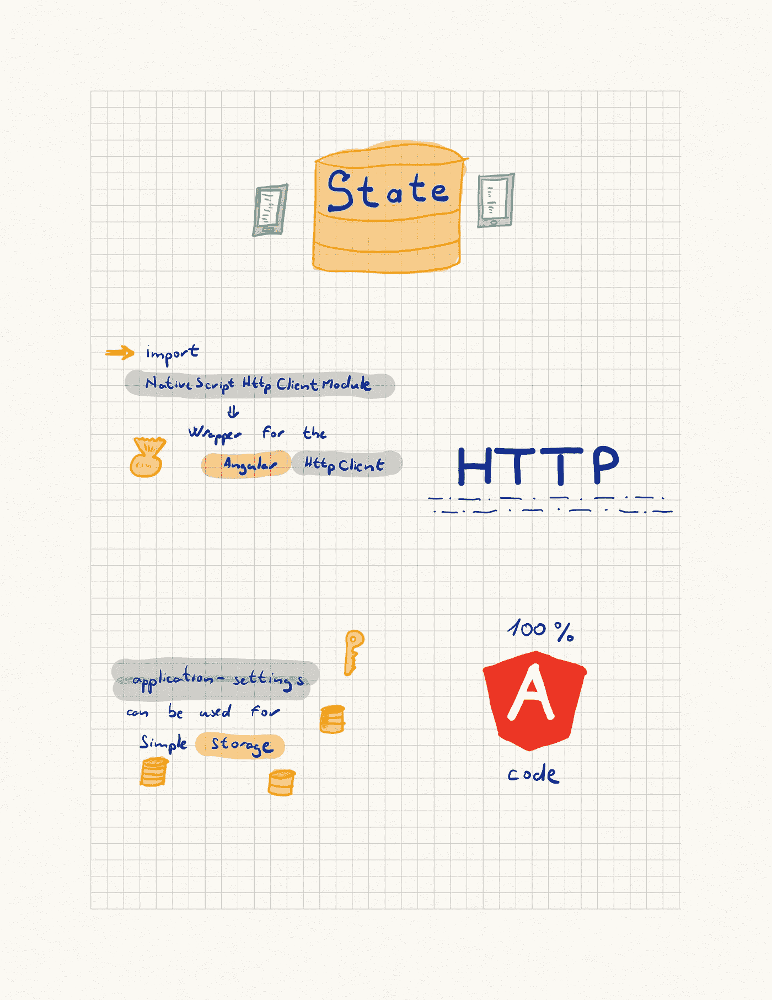
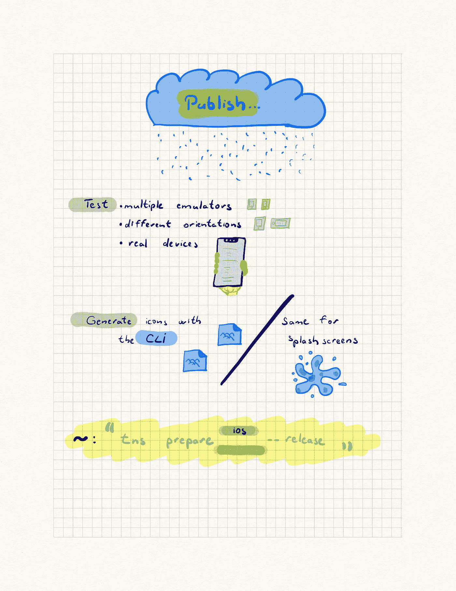

# 注释:原生脚本+角度

> 原文：<https://itnext.io/notes-nativescript-angular-5ae7dbe18672?source=collection_archive---------4----------------------->

# 我一直在想…

…既然我从中获益良多，我如何才能对社区更有用(利用优势？😅).所以，我想出了一个主意，这里什么都没有:

> 由于我在空闲时间学习很多课程，也许我可以和感兴趣的人分享我的笔记。这将提供对技术/框架/算法等的一瞥。它不会是一门综合课程或任何东西，只是一个 T2 的惊鸿一瞥。

所以，事不宜迟，以下是我在一门关于**自然文字**和**角度文字**的课程中的笔记。它们可能没有太多意义，但以防万一:

如果有什么不清楚的地方或者你想知道更多，请随时问我。我也许能帮上忙。

一些有棱角的万能小贴士🖥:

1.  [Angular life:带 Angular Universal 的服务器状态代码](/angular-life-server-status-codes-with-angular-universal-8b2b8f0163ff)
2.  [Angular life:用户首选语言带 Angular Universal](/angular-life-user-preferred-language-with-angular-universal-6d35548e0d48#5177-d988d3a722b)

同样，如果你对**测试驱动开发**感兴趣:

1.  [角度世界中的测试驱动开发:第 1 部分](/test-driven-development-in-an-angular-world-92c0c42a54d0?source=friends_link&sk=4285aa50826a53f30bb30ff7dbc33463)
2.  [角度世界中的测试驱动开发:第二部分](/test-driven-development-in-an-angular-world-d6475d6f4bfa?source=friends_link&sk=07703c745ed7bfd90490fdf6aacfd1f5)
3.  [角度世界中的测试驱动开发:第 3 部分](/test-driven-development-in-an-angular-world-part-3-fc65f0d44383?source=friends_link&sk=b5ea512fdd05216f488bc19b4f496da4)

 [## JavaScript 不可用。

### 编辑描述

twitter.com](https://twitter.com/c5n_c8u)