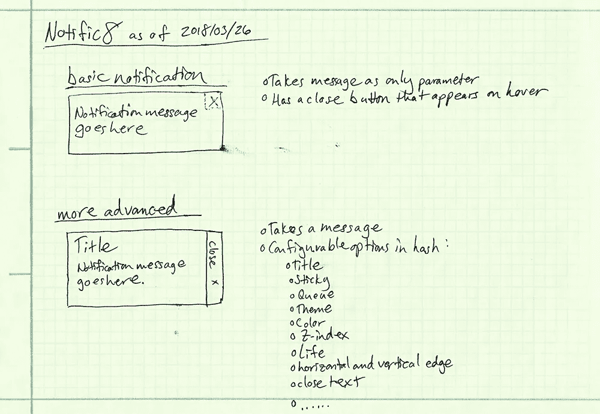

# 通知 8 —从老派到现代:第 1 部分—规划

> 原文：<https://itnext.io/notific8-from-old-school-to-modern-part-1-planning-ff7dd7bff65e?source=collection_archive---------6----------------------->

Notific8 是一个小型的模块化 JavaScript 库，用于呈现终端用户通知，我从 2013 年开始就一直致力于此。随着时间的推移，我添加了更多的功能和主题，以及一个模块系统来扩展它。

诚然，在过去的几年里，我没有太多的时间投入其中，所以这个项目有点停滞不前。2018 年我想做的一件大事，就是重新开始为了好玩而做自己的编程项目。第一个是将 Notific8 从附加到`window`对象的基本 JavaScript 库更新到用 Typescript 编写的 ES2015+兼容模块。

考虑到我正在开发的代码库已经经历了 5 年的变化，这将是一个有点复杂的过程。然而，我认为这是一个值得分享的过程，可能对其他考虑更新项目的人有用。这篇文章是 Notific8 更新后系列文章的第一篇。

# 为什么是打字稿

在我高中和大学期间，我们被迫使用强类型语言。每当我开始以编程为乐，开始学习动态类型的语言时，我年轻时的无知就会欣喜若狂。我可以做任何我想要的东西，并且不用担心类型是否匹配，因为这无关紧要！哦，年轻天真的威尔...

几年后，我的职业生涯已经深入到了腰部，很明显，打字并不像我以前想的那么糟糕或烦人。事实上，我开始更喜欢它，不为别的，只为它能帮助我拯救自己，嗯，我自己！虽然 Typescript 的类型检查只发生在为浏览器/节点传输代码之前的编写代码时，但它仍然有助于迫使开发人员既向前又向后思考，并明智地对待他们编写的内容。

打字并不是我选择 Typescript 的唯一原因。我也喜欢在 C#这样的常规强类型语言中工作的感觉。还有一些实验性的特性还没有成为正式的 es 规范，比如 decorator(Java 世界中的注释，C#世界中的属性),我觉得它非常有用。

说到底，这是一门我很熟悉的语言，而且我发现用它来写我的代码非常有帮助和愉快。它非常适合编写干净、易读、易懂的代码。任何优秀开发人员的目标之一就是让代码比你发现时更干净，即使是你写的原始代码。

# 朋友们，今天没有代码

为什么今天没有代码？这很简单:一个优秀的开发人员在编写(或重写)任何代码之前，总是至少要花几分钟来做计划！一个飞行员在起飞前没有记录飞行计划是不会开飞机的，那么我们为什么要开飞机呢？

让我们在记事本上分解 Notific8 的基础知识:

通知 8 背后的当前想法概述

最基本的是，Notific8 在屏幕的右上角显示一条简单的通知消息，当用户将鼠标悬停在通知上时，会出现一个关闭按钮。在更高级的用法中，可以传递许多选项来配置单个通知或用于配置所有未来的通知。

# 分解当前的用法

当前的用法如下所示:

作为令人敬畏的软件架构师，我们可以很容易地看到两个需要关注的通知调用行:

*   `notific8`函数调用
*   包含配置的`notific8Options`对象

# notific8 函数调用

有幸在 MV*前端世界(具体来说是 Angular)呆了几年，我很快就能从例子中挑选出不同类型的结构。`notific8`库操纵 DOM 并在页面上创建一个新元素集。虽然它没有自己的标签，但它的行为非常像一个组件。我们可以利用这些知识来告知我们在重新设计中是如何考虑的。

# notific8Options 对象文本

notific8Options 对象文本包含通知的选项。这个例子只是可以传入的许多选项中的几个。当我们编写代码来创建一个新的通知时，知道有哪些选项对我们是有用的。当我们使用 Typescript 时，在一个接口中定义最少的可用选项是很有用的。

# 无限远…嗯，至少是起点

当前实现的一个非常明显的问题是它依附于`window`对象。这不是一件好事。当然，这让它很容易被访问，但也让它很容易被攻击。这也意味着开发者不能只在他们想用的地方导入它，所以它总是可用的，不太可能在捆绑时经过适当的树抖动。说到捆绑，开发人员可能不得不编写一个包装器来与 webpack 这样的捆绑工具一起使用。图书馆内部也在进行大量的隐蔽工作。

我们如何解决这个问题？当然是 ES2015+兼容模块！

我们想把一些控制权还给开发者。我们可能要考虑向开发者提供的一些东西的快速头脑风暴:

**一个可导入的模块**

**易于使用和理解的打字方式**

**一个工厂到**

*   创建通知
*   管理队列
*   管理默认值

**包含**的通知对象

*   一种配置通知的方法
*   启动通知的方法
*   关闭通知的方法
*   销毁通知的方法

上面的一些部分现在是 Notific8 的一部分，但是隐藏在系统中。许多零件都是新的。

光是这个列表就足以让我们理清头绪，所以这可能是第 1 部分的一个很好的结束点。

*最初发表于*[*【gist.github.com】*](https://gist.github.com/1bfacf34c31b190821bcd4c584e5bf00)*。*