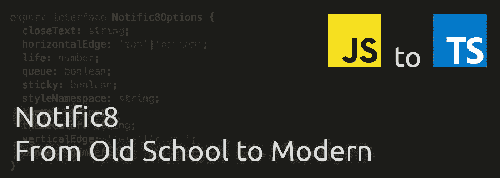

# 通知 8 —从旧派到现代:第 2 部分—选项对象

> 原文：<https://itnext.io/notific8-from-old-school-to-modern-part-2-options-object-e4e9bd9150ac?source=collection_archive---------5----------------------->

> [点击这里在 LinkedIn 上分享这篇文章](https://www.linkedin.com/cws/share?url=https%3A%2F%2Fitnext.io%2Fnotific8-from-old-school-to-modern-part-2-options-object-e4e9bd9150ac%3Futm_source%3Dmedium_sharelink%26utm_medium%3Dsocial%26utm_campaign%3Dbuffer)

是时候开始写一些新代码了。我决定从 Notific8 options 对象的基础开始。让我们看看最新的 4.x 版本中的默认选项。

快速注意:代码片段中有三个选项被注释掉了。这些选项是事件处理程序。我一直在思考如何解决这些问题，所以我们会在以后的文章中再讨论这些问题。

# 使用什么数据结构？

Notific8 的原始版本将选项定义为对象文字。ES2015+和 Typescript 给了我们使用类的能力。也就是说，类是可以使用的正确的数据结构吗？

让我们看看一门课会给我们的一些东西，看看我们是否需要它们:

*   **对象结构** —这很有用，但也可以在对象文字中使用
*   **创建实例的能力**——可能有些过头了
*   **对对象进行操作的方法** —不需要

仔细看看，看起来我们可以坚持使用对象字面量。然而，利用 Typescript，我们肯定希望用一个接口来键入属性。

# 让我们来定义这个接口！

快速的第一遍给了我们这个界面:

大多数人会注意到我们必须更改一个属性名。`namespace`是 Typescript 中的关键字，因此需要更改。由于名称空间用于样式，我们可以轻松地将属性更改为`styleNamespace`。

干净的编程是每个开发人员努力的目标。一个重要的干净编程实践是使用强有力的、准确的、尽可能简洁的变量名。因为这种重写是一种重置，所以让我们再检查一下那个接口，看看是否可以更新任何其他的接口。

因为颜色与主题`color`有关，我们选择更具体一点。`zindex`引用 CSS `z-index`属性，所以我们将其更新为 camelcase。

我们还可以对界面进行其他更新吗？`horizontalEdge`和`verticalEdge`各只允许两个有效值。为了让开发人员更容易使用 Typescript，我们将为他们提供一些这些属性的有效值的提示。

纵观界面，我认为我们有了一个良好的开端！在下一篇文章中，我们将开始考虑通知工厂，这对于这次重写来说是全新的。

# 跟着走

该项目托管在 GitHub 上的[https://github.com/willsteinmetz/notific8](https://github.com/willsteinmetz/notific8)我将从`[ts-2018](https://github.com/willsteinmetz/notific8/tree/ts-2018)`分支开始工作，并在每篇介绍代码更改的帖子末尾发布相关的提交散列。

*   [7e6c98f0](https://github.com/willsteinmetz/notific8/commit/7e6c98f07fbcaa9ca1d16485244b3c79c82b5f2c) —增加 tsconfig 和 tslint。创建了选项界面。

*原载于***。**