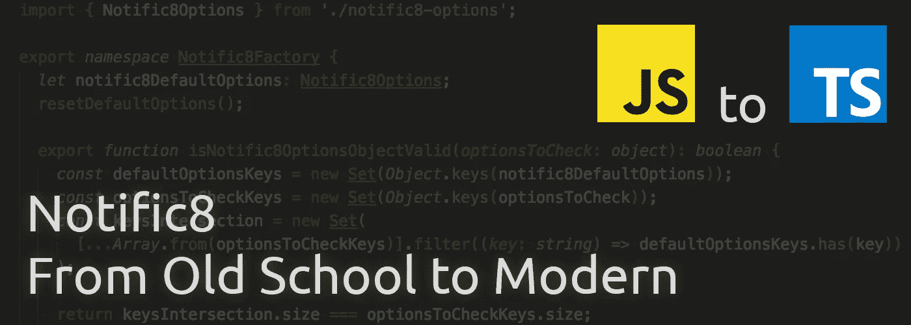

# 通知 8 —从老派到现代:第 3 部分—启动工厂

> 原文：<https://itnext.io/notific8-from-old-school-to-modern-part-3-starting-the-factory-ee863454389b?source=collection_archive---------5----------------------->

> [点击这里在 LinkedIn 上分享这篇文章](https://www.linkedin.com/cws/share?url=https%3A%2F%2Fitnext.io%2Fnotific8-from-old-school-to-modern-part-3-starting-the-factory-ee863454389b%3Futm_source%3Dmedium_sharelink%26utm_medium%3Dsocial%26utm_campaign%3Dbuffer)

在上一篇博文中，我们致力于启动 Notific8Options 接口。既然接口已经启动，下一个逻辑位置就是我在第 1 部分中简要提到的新 Notific8 工厂。

# 工厂的职责

工厂将管理的工作包括:

*   跟踪默认值(设置和返回)
*   初始化通知容器
*   销毁通知容器
*   创建通知

在这篇文章中，我将重点讨论第一点。

和任何项目一样，单元测试是必须的。除非有正当理由，否则我不会在这篇或以后的文章中列举单元测试代码。然而，我将在每篇文章末尾的提交散列列表中包含与每篇文章相关的单元测试的提交散列。

# 工厂结构

将有一个工厂维护上面列出的功能。一种选择是创建一个只允许创建一个实例的类。然而，使用 Typescript，很容易利用`namespace`结构，因此不需要实例化。

工厂将维护通知的默认选项列表。该模块开始时有一些默认值。提供一种简单的方法将它们重置回初始值也是一个好主意。这个方法也可以用来初始化变量，保持代码干燥(不要重复)。

在上面的代码中，初始化了具有在`Notific8Options`接口中定义的属性的`notific8DefaultOptions`变量。然后调用下面定义的`resetDefaultOptions()`方法来设置模块默认值。

很有可能开发者想要使用一些默认选项，所以工厂需要提供一个方法来实现。

下一个任务是给开发者一个方法来设置他们自己的默认值。开发人员可能希望一次设置一组默认值，或者只设置一个默认值。

需要对现有的接口代码进行两处更改。第一种方法是通过在每个属性的末尾添加`?`来标记可选，从而只允许`Notific8Options`中的选项子集。第二种方法是修复以下错误:

可以通过为接口创建索引签名来修复该错误。更新后的界面如下:

索引签名必须与接口中的属性相匹配。每个索引都是一个字符串。每个值都有字符串、数字或布尔类型。还添加了 Undefined，因为每个索引都是可选的。

# 为 JavaScript 提供更多保护

对于使用 Typescript 的开发人员来说，如果存在无效的属性，项目中可用的类型将阻止他们的代码进行转换。对于 JavaScript 开发人员来说，需要在代码中添加一些保护措施来警告他们无效的属性。

相同的属性检查可用于设置单个选项和多个选项，因此它被提取到一个方法中。如果开发人员试图使用无效的属性，代码将抛出一个带有适当消息的`TypeError`。

# 后期总结

把这些放在一起，我们就有了通知工厂的开端！这篇文章初始化了管理通知默认值的能力。

在下一篇文章中，我将开始研究由工厂创建的实际通知类。

# 跟着走！

该项目托管在 https://github.com/willsteinmetz/notific8[的 GitHub 上](https://github.com/willsteinmetz/notific8)我将从`[ts-2018](https://github.com/willsteinmetz/notific8/tree/ts-2018)`分支开始工作，并在每篇介绍代码更改的帖子末尾发布相关的提交散列。

*   [3ec0ebc](https://github.com/willsteinmetz/notific8/commit/3ec0ebcdc898e1a745a8931312d77bdc8d2ad732) —增加启动 Notific8Factory 的单元测试
*   [f867948](https://github.com/willsteinmetz/notific8/commit/f8679480f9901a21985a3c9933ed67bf391d7bf8) —使用与默认选项相关的方法启动通知工厂

*最初发表于*[*gist.github.com*](https://gist.github.com/3ae0aaec7d2b2a37adfd98635a1f9b4e)*。*