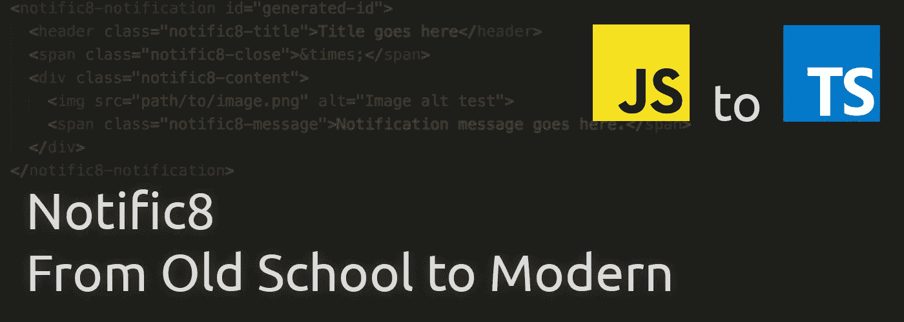

# 通知 8 —从老派到现代:第 4 部分—是否自定义标签？

> 原文：<https://itnext.io/notific8-from-old-school-to-modern-part-4-to-custom-tag-or-not-81d5c2071399?source=collection_archive---------7----------------------->

在上一篇文章中，我开始了该项目的工厂工作，并创建了管理默认值的方法。自从上一篇文章以来，我做了更多的工作，将工厂的名称改为 Notific8，并添加了一些方法来检查通知容器，通知将在该容器中显示。

这个帖子是另一个严格用于计划的帖子。将会有一些 HTML 片段，但它们不会被插入到新版本的代码中。

# 从头开始

我想从头开始编写 HTML 模板，以更好地了解我想在项目中包含什么。除了通知包装之外，我知道我需要在通知中包含以下内容，并设置所有选项以显示完整的组合集:

*   一条信息
*   一个标题
*   图像(将从外部模块移动到代码库进行重写)
*   带有粘性通知文本的关闭按钮
*   非粘性通知的关闭按钮

上面划掉了几个东西。我已经仔细考虑过了，很奇怪在通知中有两种不同的关闭体验，这取决于它是否是一个粘性通知。手动通知关闭体验(用户点击关闭按钮)应该是一致的，不管它是否有粘性。如果开发人员决定以后添加一些文本，使用 CSS 在自定义样式表中使用`::before` / `::after`和`content`很容易添加。

一个非常基本的伪代码示例是:

# 未来规划更进一步

任何至少在过去 3-5 年从事前端 web 开发的人都会在某个时候遇到 [web 组件](https://www.webcomponents.org/)的概念。W3C 多年来一直致力于开发人员创建自定义标签的规范。像 [Polymer](https://www.polymer-project.org/) 这样的库已经出现，使它们现在可用。甚至 Angular 团队也在从事 [Angular Elements 项目](https://angular.io/guide/elements)的工作，以便能够在 Angular 中创建定制组件，这些组件可以导出用于任何库，并与 web 组件标准兼容。

我最近好奇的一件事是，是否值得为通知创建一个自定义标签。现在它还不是一个真正的 web 组件，而只是一个描述通知的语义标签。背后的想法是，这个项目有可能被转换成一个 web 组件。

我仍然需要在 Edge 中测试它，但在 Chrome、Safari 和 Firefox 中，这是一个将元素附加到主体并对其进行样式化的问题，确保相应地设置其显示属性。但就因为我能做到，我就应该吗？我对此很矛盾，因为我很喜欢 HTML 中有语义标签的能力，并且我大量使用 HTML5 中提供的新标签来避免`
`混乱。

我设想的最佳 HTML 的一个例子:

# 从这里去哪里

对我来说，下一步是删除粘性通知关闭消息选项，并添加图像选项(路径和替代文本)。一旦完成，就从通知类本身开始，包括模板。到那时，我将决定是使用自定义标签还是更合适的标签，比如`<article>`标签。如果有这样或那样的想法，请留下评论。

# 跟着走！

首先，感谢您关注这个博客系列！如果你想跟踪项目的进展，代码托管在 GitHub 的[https://github.com/willsteinmetz/notific8](https://github.com/willsteinmetz/notific8)我将在`[ts-2018](https://github.com/willsteinmetz/notific8/tree/ts-2018)`分部工作，并在每篇介绍代码变更(包括帖子之间的提交)的帖子末尾发布相关的提交散列。

*   [45055b1](https://github.com/willsteinmetz/notific8/commit/45055b194af6557c1c2f7fba97847fbdc214fce0) —将 Notific8Factory 重命名为 Notific8，并创建了检查和创建容器的方法

*最初发表于*[*gist.github.com*](https://gist.github.com/4d9e324bee115db96bb534134083794e)*。*