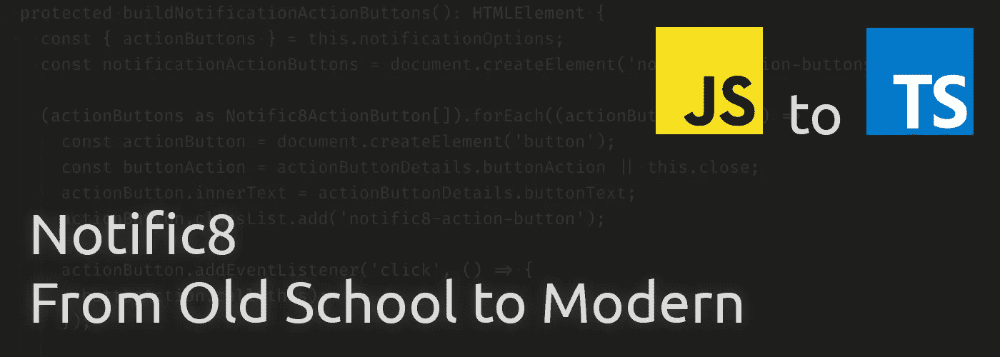

# 通知 8 —从老派到现代:第五部分—教老狗新把戏

> 原文：<https://itnext.io/notific8-from-old-school-to-modern-part-5-teaching-an-old-dog-a-new-trick-ae76040d15b6?source=collection_archive---------6----------------------->

我已经有一段时间没有写帖子了，但是在这段时间里，重写已经完成了！这是我写文章总结这个项目之前计划的最后一篇文章。

除了重写之外，我还想考虑一些有用的基本特性。其中一个功能是在通知中添加动作按钮。在最近几个版本中，Windows、Mac 和 Linux 通知都添加了该功能。该功能增加了一种对用户和开发人员更加友好的方法来触发其他动作。

# 动作按钮

动作按钮需要具有以下功能:

*   可选—根据需要包含尽可能多的内容(限制由开发人员决定，但只能包含这么多)，包括无
*   为每个按钮附加一个操作
*   如果按钮没有附加动作，则自动附加关闭动作
*   每个按钮的自定义文本

因为选项将是一组动作按钮，所以在使用 Typescript 时，我们需要一些选项结构:

我们需要确保它是`Notific8Options`中的一个可选数组:

当该库构建动作按钮时，它还将属性`action-buttons`添加到通知中，以考虑样式。基于属性设计风格的决定来自于对未来的思考。我在[系列的第 4 部分](/notific8-from-old-school-to-modern-part-4-to-custom-tag-or-not-81d5c2071399)中提到过决定使用定制标签，并考虑有朝一日将它变成 web 组件的可能性。

这个新特性生成的额外代码非常少。就 DOM 的影响而言，它是一个包装器元素加上每个按钮。每个按钮还有一个 click 事件的事件侦听器。

# 包裹

这篇文章很短。然而，我认为值得写的是最终版本中的新特性，而不仅仅是现有功能的更新。

# 从这里去哪里

下一篇文章将是这个系列的最后一篇，也是这个项目的总结。

# 跟着走！

首先，感谢您关注这个博客系列！如果你想跟踪项目的进展，代码被托管在 https://github.com/willsteinmetz/notific8[的 GitHub 上。完整的代码在版本中发布，这是目前可以查看的示例版本。](https://github.com/willsteinmetz/notific8)