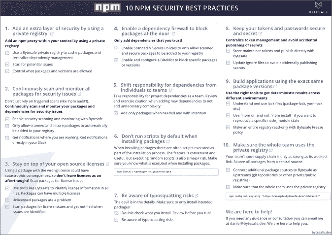

# Npm 安全性和许可证合规性最佳实践

> 原文：<https://itnext.io/npm-security-and-license-compliance-best-practices-3ec15e9f2878?source=collection_archive---------4----------------------->

## Javascript 安全性

## Javascript 陷阱以及如何避免它们

## 使用这 10 个最佳实践，更好、更安全地构建它

在这篇文章中，我们将看看我和我的团队在构建 JavaScript 生态圈时相信的一些最佳实践，无论你是在一个快速发展的初创企业还是一个更大的组织。我们将看看如何最好地避免我们的十大潜在陷阱，这样你就可以充满信心地建立在他人的成功之上！


Johannes Plenio 在 [Unsplash](https://unsplash.com?utm_source=medium&utm_medium=referral) 上拍摄的照片

# 漏洞、许可证、依赖性…

如今，依赖性管理以及安全性和许可证合规性都是任何团队或组织需要优先考虑的问题。


[制作者 UX 设计工作室](https://unsplash.com/@weareprocreator?utm_source=medium&utm_medium=referral)在 [Unsplash](https://unsplash.com?utm_source=medium&utm_medium=referral) 拍摄的照片

> 公共 npm 注册表中有近 150 万个可用的包，现代应用程序中高达 90%的代码是由他人开发的开源代码。

那么，除了我们喜欢有机会挑选我们需要的东西、安装它并继续前进之外，这实际上告诉了我们什么呢？

下面我们编制了一份**清单**，列出了我们认为的最佳实践。再往下是关于 10 大最佳实践的更多信息。

# TL；速度三角形定位法(dead reckoning)

有许多方法可以保护您的代码供应链。我们在[bytes safe](https://bytesafe.dev/)编辑了一份 PDF，其中包含了我们认为所有开发者和公司都应该考虑的 10 大安全最佳实践。因此，如果您很急或者想要一份关于 10 个 npm 安全最佳实践的单页报告，那么[这份快速指南](https://bytesafe.dev/posts/npm-security-best-practices/)就是为您准备的。

[](https://bytesafe.dev/posts/npm-security-best-practices/)

点击下载打印机友好版本(文章中的 PDF)

# 10 项国家预防机制最佳做法

## 1.使用私有注册表获得额外的安全性

使用像 Bytesafe 这样的私有注册中心，可以为您的所有包添加一个中心，您可以在这里添加控制和规则。

团队成员可以下载和安装任何包，而不是依赖于公共注册表，您可以通过管理您的私有注册表来增加额外的安全性，查看所有包的依赖关系，允许缓存包，最重要的是:扫描安全性和许可证问题。

## 2.扫描包中的安全问题

npm 团队与整个社区一起为提高安全性付出了巨大努力，但新的恶意软件包不断被检测到并添加到咨询数据库中。

大多数情况下，在检测到有安全问题的包并从您的应用程序中移除依赖关系之前，需要一段时间。因此，持续扫描安全问题非常重要，以便尽快通知您。

不要仅仅依赖安装期间的触发扫描(如`npm audit`)。

## 3.利用您的开源许可证保持领先

使用带有错误许可证的软件包可能会导致灾难性的后果。许可信息可以存储在包的任何文件中，而不仅仅是`package.json`，所以不要把许可看作是事后的想法！

*   使用 Bytesafe 等工具识别所有文件中的许可证信息
*   限制有问题或未经许可的软件包
*   扫描所有软件包文件中有问题的许可证。发现许可问题时获得通知

## 4.启用依赖性防火墙来阻止包

太好了，现在你可以使用一个私有注册表来扫描你的包的安全和许可问题了！

这时，您应该启用规则(策略)来阻止“坏包”，这意味着它们甚至不会出现在您的注册表中。确保您启用强制软件包必须被扫描、安全且不包含要添加到您的私有注册表的限制性许可证的策略是一个良好的开端。

更多关于如何使用[策略阻止软件包](https://docs.bytesafe.dev/policies/)的信息。

## 5.将责任转移到团队，而不是个人

即使当你使用私有注册表时，当你添加新的包到一个项目中时，你也应该有意识地进行修改。

您使用的软件包越多，其中一个软件包包含安全漏洞的风险就越大。因此，最佳实践是在添加新的依赖项时，手边有更多的眼睛，并有正确的工具来做出明智的决策。

像 Bytesafe 这样为所有用户缓存和可视化依赖关系的工具，可以用来使这些信息大众化，并使其对所有团队成员可用。

## 6.安装软件包时，避免默认情况下运行脚本

您知道执行脚本是安装过程的一部分吗？非常方便和有用，但不幸的是这个功能也被黑客用来执行随机脚本。因此，执行安装后脚本是一个很大的风险，除非你已经检查过了。

除非你有信心并且知道执行了什么，否则你应该安装带有`--ignore-scripts`标志的软件。

```
npm install PACKAGE@VERSION --ignore-scripts
```

## 7.注意域名抢注的风险

哪个套餐是官方的——*twilio-NPM*还是 *twilio* ？域名仿冒攻击，这意味着攻击者创建与官方名称相似的包。目的是让开发者下载恶意软件包。

确保你仔细检查你安装的东西，最好使用管理的私有注册表。

(BTW，twilio 是官方的包名)

## 8.保护您的令牌和凭据的安全

如果您要将包发布到公共存储库，集中令牌管理是一个好主意。存储维护者令牌并用 Bytesafe 发布。避免将令牌分发给所有开发人员的风险和麻烦。

避免敏感凭据的意外泄露。尽管 npm 增加了检测秘密的功能，但还是要养成更新忽略文件的习惯(例如 npmignore，。gitignore 等)。

## 9.让您的不同环境使用完全相同的软件包版本

对于任何开发团队来说，在不同的环境中获得一致和确定的结果都是一个持续的问题。根据您的设置和状态，如果您的项目文件完全同步，您可能会测试其他版本的包，而不是预期的版本。

听起来像是一个很容易解决的问题，但事实上，你的团队需要非常熟练(包锁、纱锁收缩包装等)才能实现 100%确定的结果。使用`npm ci` (npm 全新安装)有助于复制`node_modules`的特定状态，但不涵盖传递依赖(依赖的依赖)。

有更简单的解决方案吗？对于需要完全确定性结果的团队，bytesafe 提供了冻结策略❄️.冻结策略使得整个注册表为只读，从而允许完全一致的结果。

您可以准确地拍摄所使用的版本的快照，并在任何环境下使用该快照。由于所有依赖项都被冻结，这也包括完全复制的传递性依赖项。

## 10.确保整个团队都使用私有注册表

哇，你把上面的都勾上了！现在你只需要让每个人都使用你的私有注册表，在那里你可以信任你的依赖。通过这种方式，您可以控制团队或公司中使用的 npm 包的流程。

```
npm config set registry 'https://example.bytesafe.dev/r/default/'
```