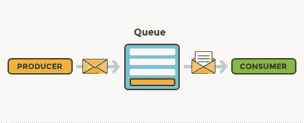

# NSQ 教程:使用 NSQ 构建一个简单的消息队列

> 原文：<https://itnext.io/nsq-tutorial-build-a-simple-message-queue-using-nsq-1ae1a279dfab?source=collection_archive---------1----------------------->

你好，亲爱的程序员，欢迎来到我献给 *NSQ* 的技术文章系列。没有太多关于这项技术的教程，所以我决定做一个。希望你喜欢！


由[安娜斯塔西娅·杜尔吉尔](https://unsplash.com/@dulgier?utm_source=medium&utm_medium=referral)在 [Unsplash](https://unsplash.com?utm_source=medium&utm_medium=referral) 上拍摄的照片

# 为什么是 NSQ？

NSQ 是一个用 Go 编写的实时分布式消息平台，由知名服务 bit.ly 创建

与类似的系统(如 RabbitMQ)相比，它简单明了，易于使用，有一个很好的直观的管理用户界面。如果您以前从未使用过任何消息队列系统，NSQ 是了解其原理的最佳选择。

# 消息队列的概念:

消息队列是[发布者/订阅者](https://en.wikipedia.org/wiki/Publish%E2%80%93subscribe_pattern)架构模式的实现，用于系统不同部分(应用程序、服务等)之间的通信。



换句话说，当一个事件发生时(比如创建一个新用户)，一个消息被发布到一个消息队列。任何对该事件感兴趣的服务都会订阅该消息。

消息一发布，感兴趣的服务(消费者)就会收到消息并执行一些操作。(例如，向新用户发送电子邮件)。

# 1.下载 NSQ

去[https://nsq.io/deployment/installing.html](https://nsq.io/deployment/installing.html)为你的操作系统下载 nsq 二进制文件。

打开提取的文件夹，你可以看到不同的可执行文件:

*   nsqlookupd.exe
*   nsqd.exe
*   nsqadmin.exe
*   ..*还有很多其他的，但对我们来说并不重要*

# 2.运行 nsqlookupd

在您喜欢的 shell/命令终端中打开提取的目录并运行:

您应该会看到以下输出:

```
$ ./nsqlookupd 
[nsqlookupd] 2019/10/21 13:21:18.830625 INFO: nsqlookupd v1.2.0 (built w/go1.12.9) 
[nsqlookupd] 2019/10/21 13:21:18.832649 INFO: TCP: listening on [::]:4160 
[nsqlookupd] 2019/10/21 13:21:18.832649 INFO: HTTP: listening on [::]:4161
```

它表示 nsqlookupd 正在运行，并且有两个接口:
一个使用 TCP，端口为 4160，另一个使用 HTTP，端口为 4161。

为了检查它是否工作，我们可以打开浏览器并访问[http://localhost:4161/topics](http://localhost:4161/topics)

这是你应该得到的答案，没关系。目前我们还没有任何注册的主题。

您还可以获得所有频道、特定主题的制作者、nsqd 的节点、创建主题、频道等。在文档[中找到更多信息。](https://nsq.io/components/nsqlookupd.html)

基本上 **nsqlookupd** 是一个发现服务，帮助消费者找到特定主题的 nsqd 生产者。

**nsqlookupd** 是管理拓扑信息的守护程序。客户端查询 nsqlookupd 以发现特定主题的 nsqd 生产者，nsqd 节点广播主题和频道信息。

# 3.运行 nsqd

现在在 shell nsqd 中运行:

您应该会看到以下输出:

```
[nsqd] 2019/10/21 13:39:56.997863 INFO: nsqd v1.2.0 (built w/go1.12.9) 
[nsqd] 2019/10/21 13:39:56.998861 INFO: ID: 791 
[nsqd] 2019/10/21 13:39:57.000861 INFO: NSQ: persisting topic/channel metadata to nsqd.dat 
[nsqd] 2019/10/21 13:39:57.011825 INFO: HTTP: listening on [::]:4151 [nsqd] 2019/10/21 13:39:57.011825 INFO: TCP: listening on [::]:4150
```

# 4.发布消息

现在是时候向队列发布我们的第一条消息了。打开[邮差](https://www.getpostman.com/)或任何其他工具进行 HTTP 调用，向**POST:**[**HTTP://localhost:4151/pub？用 JSON 体测试**](http://localhost:4151/pub?topic=test)

/pub 是创建消息的 NSQ 端点。它需要一个名为**“topic”**的查询参数。Topic 表示消息的名称，任何以相同主题发布的消息都将被该主题的每个收听者使用。📨

如果请求是 200 OK，我们的新主题将自动创建。您将在 nsqd 的控制台中收到一个通知:

```
[nsqd] 2019/10/21 13:49:04.740353 INFO: TOPIC(test): created 
[nsqd] 2019/10/21 13:49:04.740353 INFO: NSQ: persisting topic/channel metadata to nsqd.dat
```

另一行表示关于创建的主题的信息被持久化到元数据 nsqd.dat 文件中。

用任何文本编辑器打开 bin 目录中的 nsqd.dat 文件，您将在那里看到您的主题。但是我们有一个更好的选项来查看和维护主题。使用 **NSQ 管理**的时间。

# 5.启动 NSQ 管理

现在在 shell nsqadmin 中运行:

您将在控制台❌中看到一个错误

```
[nsqadmin] 2019/10/21 14:18:04.255018 FATAL: failed to instantiate nsqadmin - --nsqd-http-address or --lookupd-http-address required
```

错误提示您需要向 nsqd 或 nsqdlookup 提供地址。我们开始吧！

```
./nsqadmin --nsqd-http-address localhost:4151
```

现在，您将看到一条消息，表明 nsqadmin 正在运行:

```
[nsqadmin] 2019/10/21 14:21:41.223806 INFO: nsqadmin v1.2.0 (built w/go1.12.9) 
[nsqadmin] 2019/10/21 14:21:41.224804 INFO: HTTP: listening on [::]:4171
```

在浏览器中打开该地址 [http://localhost:4171](http://localhost:4171)

你应该能在那里看到一个主题“测试”。此外，如果您转到**节点**选项卡，您可以看到我们的 nsqd 实例正在运行并已连接。👍

如果您按下**查找**选项卡，您将看到一条警告。这是因为现在我们直接连接到 nsqd，避免使用 nsqdlookup,《NSQ》的创作者不推荐使用它。

现在使用特定的 lookupd 地址运行该命令:

```
$ ./nsqadmin --lookupd-http-address localhost:4161
```

打开 NSQ 管理界面，点击查找标签…似乎可以。但是再次检查**节点**标签。等待..零节点？为什么？

现在，我们将 **nsqadmin** 连接到 **nsqlookupd** ，但是 **nsqd** 实例没有连接到任何东西。所以我们的链条断了💥！

正确的依赖关系应该是*nsq admin->nsqlookupd<-nsqd*。让我们修理它。

只需关闭 nsqd 实例，然后指定 nsqlookupd 地址再次运行它:

```
./nsqd -lookupd-tcp-address localhost:4160
```

这次我们要用 lookupd 的 TCP 地址，端口是 4160。

刷新管理界面，一切都应该再次工作。两个标签工作完美！✨

# 6.创建消费者应用程序

我们需要一个基本的应用程序来使用我们的消息。让我们为此创建一个简单的 Node.js 应用程序。

用任意名称创建一个新文件夹，并运行以下命令:

```
npm init -y npm i express nsqjs
```

创建 http 服务器需要 Express 库，nsqjs 是 NSQ 团队提供的官方客户端库。[链接此处](https://github.com/dudleycarr/nsqjs)

创建 server.js 文件

在我们的项目目录中运行:

您现在将接收所有排队的消息。消费者应用程序控制台应显示以下内容:

```
NSQ Consumer is listening on port 3000! Received message [0c6020dfa34cf000]: { "text": "some message" }
```

这是因为我们的消息在队列中等待，直到被使用。

在“NSQ 管理”中，如果您选择“节点”,您将看到几秒钟前新的客户端主机已连接。

# 7.测试接收消息

保持 server.js 运行，现在请求 POSTMAN 发布新消息到主题“test”

**POST**[**http://localhost:4151/pub？topic=test**](http://localhost:4151/pub?topic=test)
同体

```
{ "text": "CONNNCTED!!! YEAH!!" }
```

您应该会立即在控制台中看到它。恭喜你。🎉您有一个工作的消息队列系统。🖅 🖅 🖅

⚠️:如果你在 NSQ Admin 中按 Counter，你会看到它不再是零了。

如果你向其他主题发送消息，你不会看到它，因为我们只订阅了一个主题“测试”。

🚀如果你从那篇文章中读到了一些有趣的东西，请喜欢并关注我的更多帖子。谢谢你亲爱的编码员！😏

*原发布于 2019 年 11 月 22 日*[*https://dev . to*](https://dev.to/vguleaev/nsq-tutorial-build-a-simple-message-queue-using-nsq-43eh)*。*