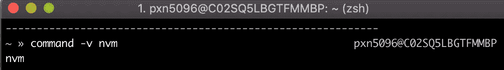
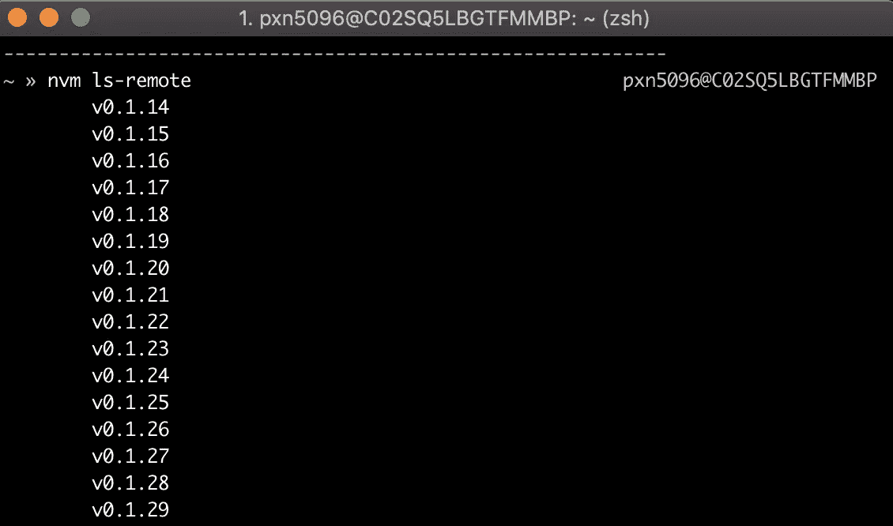
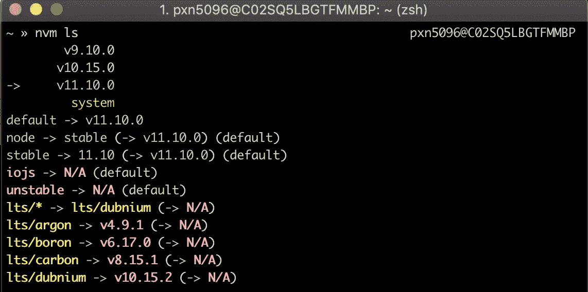
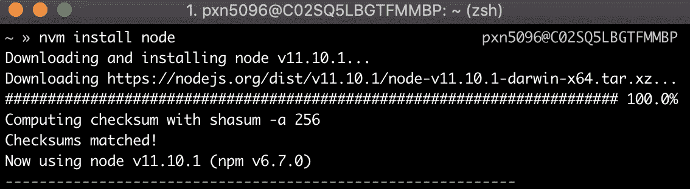
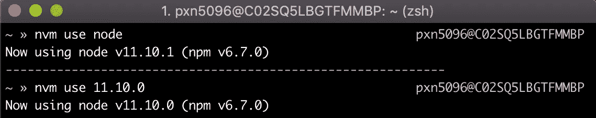
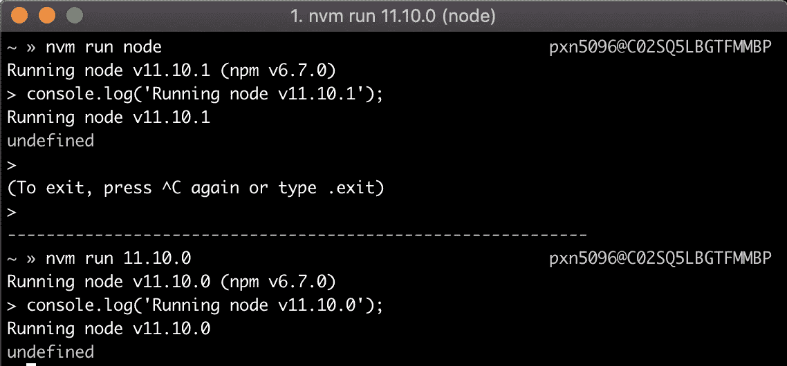
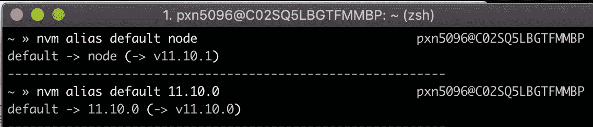

# NVM，这是在您的机器上快速切换 Node.js 环境的最简单方法

> 原文：<https://itnext.io/nvm-the-easiest-way-to-switch-node-js-environments-on-your-machine-in-a-flash-17babb7d5f1b?source=collection_archive---------0----------------------->

# 不，我没有拼错 NPM——节点版本管理器是它自己方便的开发工具


NVM——管理多个活动 Node.js 版本的简单 bash 脚本

# 在本地开发多节点环境是一件痛苦的事情

当我告诉你我目前的开发团队拥有两个不同的 UI 应用程序时，我相信我不是一个人:一个内置于 AngularJS(旧版本)，另一个内置于 React(新版本)。这两者共同提供单一用户体验，同时我们慢慢地将现有屏幕和功能从旧的 AngularJS 应用程序迁移到新的 React 应用程序中。最终目标是，React 应用程序有一天将自己托管整个应用程序。

我相信我也不是唯一一个告诉你 AngularJS 应用程序只能在 Node.js 版本 9 上运行的人(如果不是这样，它会崩溃并导致奇怪的错误)，我们的 React 应用程序需要 Node 版本 10 或更高版本才能利用所有 ES6 及更高版本的功能。

你知道吗？为了本地开发而在节点环境之间切换是一件痛苦的事情。这并不容易，这是我经常忘记做的事情(直到我在开发过程中遇到一个无法解释的问题)，坦率地说，这不是在 Mac 上最容易做的事情。

> 这是我一生中的命运，直到一位同事向我介绍了一个名为[节点版本管理器(NVM)](https://github.com/creationix/nvm) 的可怕工具。

NVM 是本地开发游戏改变者。让我告诉你怎么做。

# 节点版本管理器

## 这是什么？

节点版本管理器顾名思义:

> [NVM 是]管理多个活动 node.js 版本的简单 bash 脚本。— NVM，Github

虽然听起来并不复杂，但 NVM 能做的事情非常棒。它可以:

*   访问 Node.js 的每个长期支持(LTS)版本，从`v0.1.14`到今天的最新版本，恰好是`v.11.10.1`，当我写这篇文章的时候，
*   用一个简单的命令在本地下载 Node 的任何一个远程 LTS 版本，
*   设置别名以在不同下载版本的 Node 之间轻松切换，
*   默认情况下，如果 repo 中存在一个`.nvmrc`文件，将自动使用指定的 Node.js 版本，
*   它可以与多种类型的 shells 一起工作:Sh、Bash、Zsh、Dash、Ksh(但不是 Fish)。

只要您对命令行相当熟悉，就可以使用 NVM。

# 设置 NVM

NVM 也相对容易设置——在听说它的好处后，我能够使用 [Github](https://github.com/nvm-sh/nvm#installation-and-update) `[README.md](https://github.com/nvm-sh/nvm#installation-and-update)`在我的电脑上快速设置它。

## 步骤 1:安装 NVM

第一步最简单:只需用文档中提供的 curl 或 wget 命令安装 NVM。

卷曲命令:

```
curl -o- https://raw.githubusercontent.com/nvm-sh/nvm/v0.35.3/install.sh | bash
```

Wget 命令:

```
wget -qO- https://raw.githubusercontent.com/nvm-sh/nvm/v0.35.3/install.sh | bash
```

## 步骤 1.5 在命令行中验证 NVM

关闭您的终端，打开一个新窗口并键入:

`command -v nvm`

如果安装了它，您将会收到一条类似如下的消息:



这是你想看到的 nvm 反应。如果您得到类似“未找到 nvm 命令”的响应，则它还没有准备好使用。

如果发生这种情况，您就可以跳过第 2 步了。

否则，如果你得到一个错误，你会像我一样，需要做更多的手动安装来设置你的外壳指向 NVM 的主目录。继续读。

## 步骤 2:将 NVM 目录路径添加到您的 Shell 配置文件中(需要时)

对我来说，即使在使用 curl 命令安装了 NVM 之后，当我键入`command -v nvm`来验证安装时，我仍然会在终端中得到一条错误消息。

在这一点上，我跳到了文档的 [Git install](https://github.com/creationix/nvm#git-install) 部分，该部分有关于如何将 NVM 目录路径添加到各种 shell 配置文件的附加说明，比如`~/.bashrc`或`~/.zshrc`，在我的例子中，因为我更喜欢使用 Zsh。

要编辑我的`.zshrc`，我只需运行:

`nano .zshrc`

向下滚动到文件的底部，粘贴以下几行。

```
export NVM_DIR="$HOME/.nvm"
[ -s "$NVM_DIR/nvm.sh" ] && \. "$NVM_DIR/nvm.sh"  # This loads nvm
[ -s "$NVM_DIR/bash_completion" ] && \. "$NVM_DIR/bash_completion"  # This loads nvm bash_completion
```

然后在 Mac 上输入`CTRL + X`，输入`Y`保存修改，输入`Enter`，你应该回到你在终端上开始的地方。

如果你想再次检查你的更改，你可以运行`cat .zshrc`并使用向下箭头键向下滚动，检查新的 NVM 脚本是否在文件的底部。

一旦您确定它在那里，完全退出终端程序并重新打开它，然后键入:

`command -v nvm`同样，您应该看到:


现在你开始做生意了。NVM 已安装，可以使用了。

我们现在可以使用 NVM 了。

# 使用 NVM

NVM 使用起来超级简单。当您想在命令行中使用 NVM 时，下面是您需要知道的命令。

## `nvm ls-remote`

这将显示 Node.js 的所有可用 LTS 版本



这只是 NVM 提供的所有 Node.js 版本的一小部分。

## nvm ls

显示您计算机上本地可用的所有已安装版本。



我本地机器上安装的 Node.js 版本。

## nvm 安装节点或 nvm 安装 8.15.1

键入`nvm install node`会将 Node.js 的最新版本安装到您的机器上，或者`nvm install <SPECIFIC_NODE_VERSION>`会安装指定的版本。



我刚刚在本地开发机器上安装了最新版本的 Node.js。

## `nvm use node OR nvm use 11.10.0`

该命令会将本地运行的 Node.js 的版本设置为下载的最新版本(如果您只键入`nvm use node`)，或者指定的版本(如果您在命令后添加了版本号`nvm use --version`，例如`nvm use 8.15.1`)。



两个 use 命令:第一个默认为最新版本(11.10.1)，第二个将版本设置为 11.10.0。

*   **注意:**您想要在本地运行的版本必须首先安装在您的机器上，否则 Node 将退回到发出命令之前运行的版本。

## nvm 运行节点或 nvm 运行 11.10.0

这个命令与上面的命令几乎相同，唯一的区别是键入`nvm run node`或`nvm run --version`，就像`nvm run 11.10.0`将切换到 Node.js 的指定版本，并打开一个节点命令行供您以后手动运行命令。



从 nvm run node，我可以在切换到 node 版本后立即运行像`console.log(‘hello world’)`或 server.js 这样的命令。

这样，您就有可能同时打开多个终端运行 Node 的多个版本。🤔非常方便…

## nvm 别名默认节点或 nvm 别名默认 11.10.0

这些命令会将一个名为“默认”的 NVM 别名设置为带有`nvm alias default node`的节点的最新下载版本，或带有`nvm alias default --version`的指定版本，如`nvm alias default 11.10.0`。

一旦设置了这个默认别名，任何新的 shell 都将默认使用该版本的 Node 运行。



在进行本地 web 开发时，您可能会使用这些主要命令来下载 Node.js 版本并在它们之间切换。至少，它们是我大部分时间使用的。

NVM 文档非常好，如果你想了解你的 NVM，它会非常深入。

# 结论

在节点版本成为开发过程中的一个问题之前，我们很少考虑它。如果你的情况和我相似，你可能需要定期在多个版本之间切换，因为你的各种 ui 都需要它。

Node Version Manager 使得直接从命令行完成这项工作变得非常容易。从安装到实际使用，NVM 都很简单，它使得在任何需要的 Node.js 版本中进行开发也变得简单得多。我希望你能好好利用它。

过几周再来看看，我会写一些关于 React 或者其他与 web 开发相关的东西，所以请关注我，这样你就不会错过。

感谢您的阅读，我希望在您编写各种 JavaScript 应用程序时，NVM 能够对您和您的开发团队有所帮助。非常感谢鼓掌和分享！

如果你喜欢读这篇文章，你可能也会喜欢我的其他一些博客:

*   [调试 Node.js 最简单的方法——用 VS 代码](/the-absolute-easiest-way-to-debug-node-js-with-vscode-2e02ef5b1bad)
*   [使用 Node.js 读取非常非常大的文件(Pt 1)](/using-node-js-to-read-really-really-large-files-pt-1-d2057fe76b33)
*   [Web 应用程序 API 中标准化错误处理的案例](/the-case-for-standardized-error-handling-in-your-web-application-6428ff60cc31)

**参考资料和更多资源:**

*   NVM，Github:[https://github.com/nvm-sh/nvm](https://github.com/nvm-sh/nvm)