# Nx + Nest + Firebase =梦想

> 原文：<https://itnext.io/nx-nest-firebase-the-dream-616e8ee71920?source=collection_archive---------1----------------------->


我使用 Nrwl.io Nx 进行 Angular 开发已经超过 3 年了，我喜欢在一个 Monorepo 中拥有多个应用程序和库的开发者体验。

在我最近的开发中，我开始使用 Firebase，并对使用主工作区下的子目录设置 Firebase 函数的方式越来越失望。这与 Nx 应用程序和 libs 开发不一致，因为 Firebase 函数位于一个单独的文件夹下，有自己的 *package.json* 和 *node_modules* 安装。

这给在前端应用程序和 firebase 后端之间共享代码带来了很多困难。我在 Firebase Functions 文件夹中使用手工制作的 *tsconfig.json* 文件来提供引用 Nx 工作区中的公共代码的能力。这并没有提供很好的开发者体验。我想我被 Nx 的功能宠坏了。

在通读了 Jeff Delaney 等人的无数文章和各种 Github 问题之后，我终于能够将我的开发人员体验问题缝合在一起，并在这个过程中简化我的开发。

虽然这可能不是最优雅的解决方案，但我认为它会对社区有用。可以写一个原理图来自动化这个手动过程。

# 初始化 Nx 工作空间

让我们从使用 Nx workspace 创建一个新的 coffee 应用程序开始，命令如下:

```
> npx create-nx-workspace@latest
```

在为我的 Angular 指定各种配置选项后，Nx 将使用**应用**和**库**搭建一个工作空间。

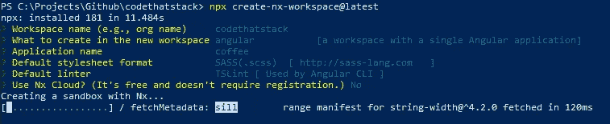

使用您喜欢的 IDE 打开新生成的工作区。在 **apps** 文件夹下，您应该会看到两个应用程序， **coffee** 应用程序和 **coffee-e2e** 用于端到端测试。


> 以下所有命令都将从工作区的根目录运行。

# 嵌套应用

## 安装嵌套插件

将嵌套插件安装到工作区可以通过以下方式完成:

```
> npm install -D @nrwl/nest
```

## 生成嵌套应用程序

生成新的嵌套应用程序可以通过以下方式完成:

```
> nx generate [@nrwl/nest](http://twitter.com/nrwl/nest):application <nest-app>
```

示例:

```
> nx generate [@nrwl/nest](http://twitter.com/nrwl/nest):application coffee-api
```

## 服务嵌套应用程序

您的嵌套应用程序可以使用以下命令:

```
> nx serve coffee-api
```

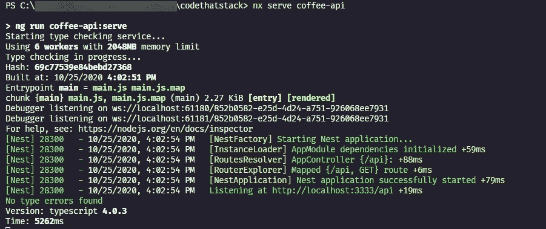

nx 服务咖啡-api

Nx 将构建 API 并提供给指定的端口。对 API 的任何更改都将再次触发构建过程。

生成的嵌套应用程序文件结构应该如下所示:

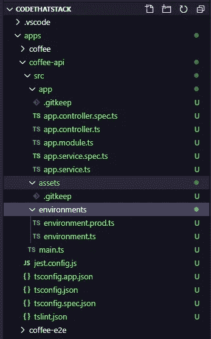

# 重火力点

下一步是将 firebase 初始化到工作区中，如果您知道自己在做什么，请跳过这一部分。

## Firebase 初始化

使用以下命令确保 Firebase 工具已在全球范围内安装:

```
> npm install -g firebase-tools@latest
```

下一步是将 firebase 初始化到当前工作区。

```
> firebase init
```

选择 Firebase 部署所需的各种选项，需要为 API 设置**功能**。

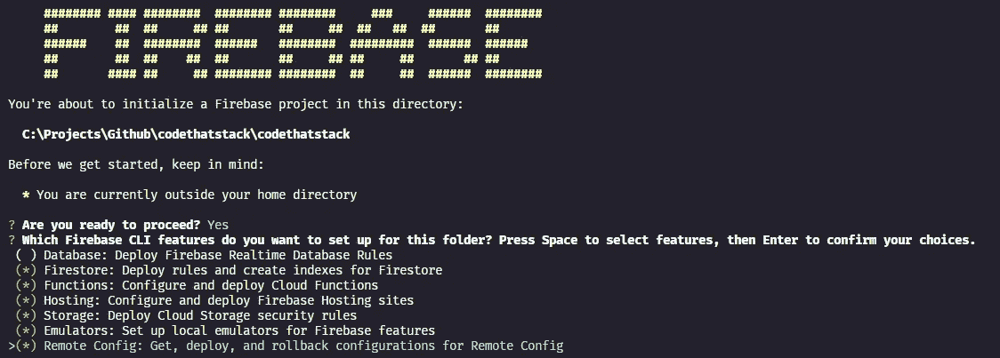

安装选件—功能是必需的

选择一个现有的 Firebase 项目或创建一个新项目。

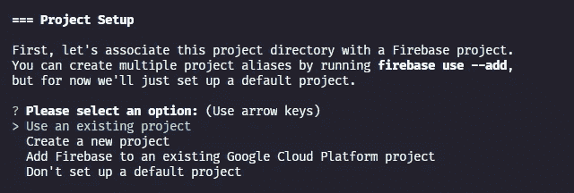

接受所有 Firebase 默认值或根据需要进行修改。确保选择 Typescript 作为云函数的语言，并且不要**而不是**安装依赖项。

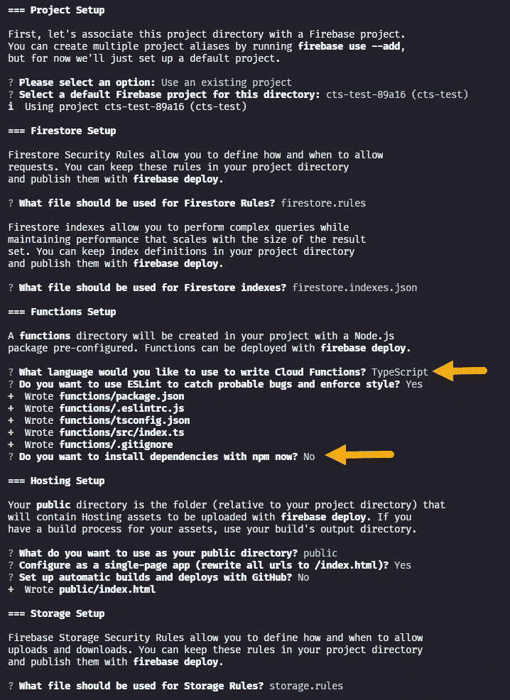

指定要设置的每个仿真器，确保选择了**功能仿真器**。

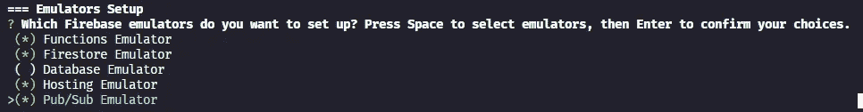

接受各种端口的所有 Firebase 仿真器默认值。请注意，如果需要，可以在以后进行更改。

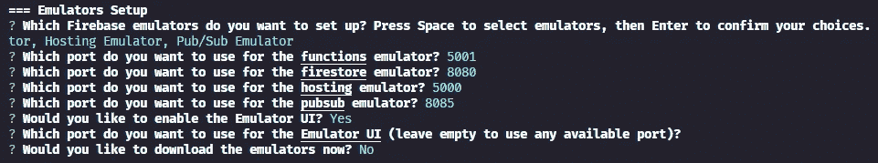

Firebase 现在安装在名为 **functions 的子目录中。**

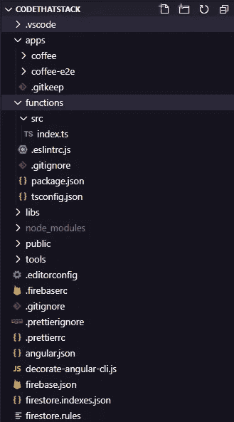

# 将巢穴改造成燃烧基地

要将当前的 Nest 应用程序转换成 Firebase ready，需要一点人工干预。

所以让我们开始吧…

将各种 Firebase 依赖项安装到根工作区中。

```
> npm install firebase-admin firebase-functions
```

将开发依赖项安装到工作空间中。

```
> npm install -D firebase-functions-test
```

在嵌套应用程序的根源文件夹中创建一个 **package.json** 。

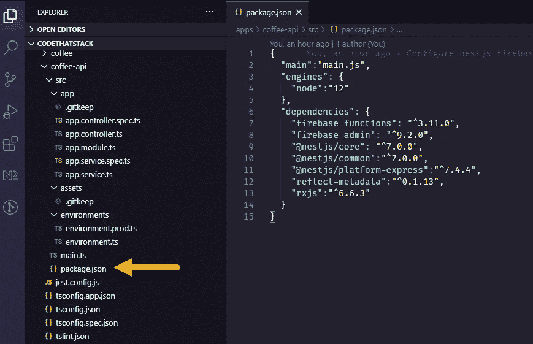

Nest App — package.json

接下来是修改工作区根文件夹中的 **angular.json** 。搜索您的应用程序的名称，在本例中我使用了 **coffee-api** 。

配置应该如下所示:

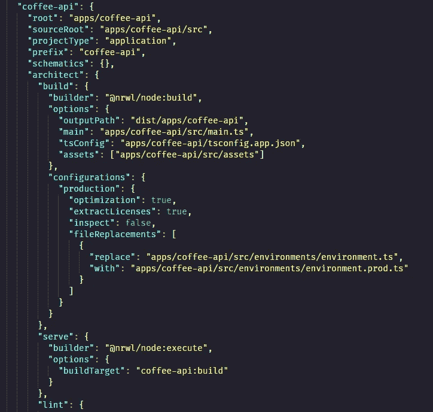

我们需要修改 **nx serve** 命令的当前行为，因为它将构建和启动嵌套应用程序并监听传入的请求。Firebase 模拟器需要为我们启动开发服务器。

## 我们开始吧

将 **build** 重命名为 **build-node** ，并在 architect 下添加另一个名为 **build** 的条目，该条目将使用 **nx run** 命令。


新的**构建**命令只是执行**构建节点。**这个更新改变了 **serve** 命令的行为，只是构建并观察变化。

记住 **package.json** 文件，它需要进入构建输出。将条目添加到**资产**文件夹，如下所示:

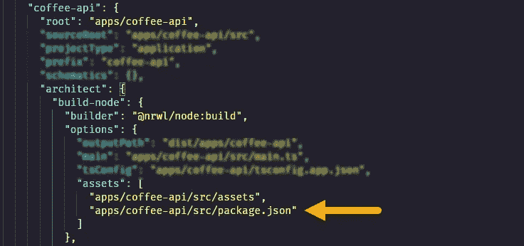

删除工作区根目录中的 Firebase **functions** 文件夹，因为不再需要它。

更新嵌套应用程序引导以将 express server 连接到 Firebase 函数。

最后更新 **firebase.json** functions 部分，删除**预部署**，因为 lint 和 build 都是通过 deploy 命令完成的，添加 **source** 让 firebase 知道编译输出的位置，添加**忽略**部分，这样 firebase 就不会打包这些内容进行部署。稍后将详细介绍部署。

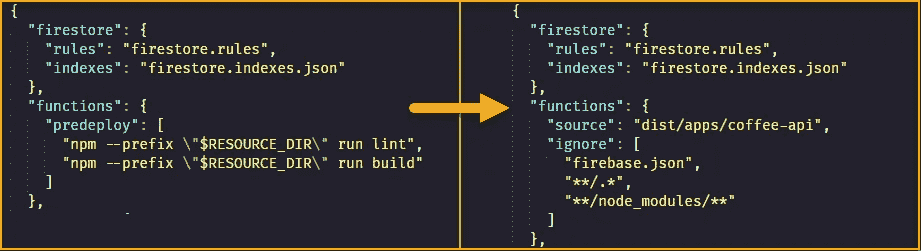

## 点燃它

启动 Nest 应用程序来观察变化。使用以下命令打开命令提示符:

```
> nx serve coffee-api
```

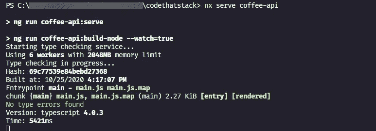

启动后，在另一个命令窗口中启动 Firebase 模拟器:

```
> firebase emulators:start --only functions --inspect-functions
```

> 这可以作为一个 **npm** 脚本添加

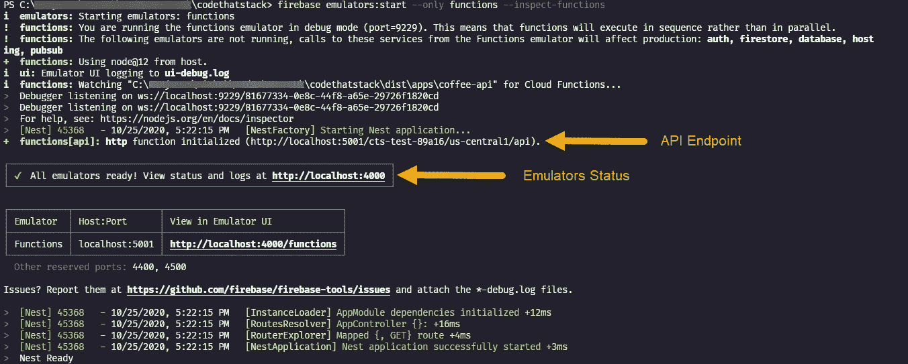

启动 Firebase 模拟器后，您将在输出中看到用于进行 Http 调用的 API 端点，以及可用于检查日志的模拟器状态端点。

## 安装调试

为正在运行的 Nest 应用程序配置调试器:

1.  点击菜单中的**运行**
2.  点击**创建一个 launch.json 文件**
3.  从下拉列表中选择 **Node.js** 。

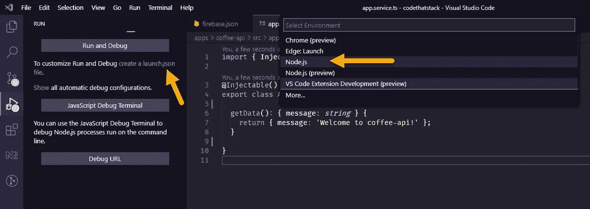

按照以下方式修改配置。

这个启动配置将使用默认端口 9229 连接到正在运行的 Firebase 模拟器。需要确保 **outFiles** 指向嵌套应用程序的构建输出。添加 **skipFiles** 很重要，因为这会加速调试断点的连接。

# 部署到火力基地

如果您希望简化 Firebase 函数的构建和部署，您可以向 **angular.json** 文件添加额外的命令。

**deploy** 命令将首先调用 API 的 build，然后调用 firebase deploy，只将功能部署到 firebase。

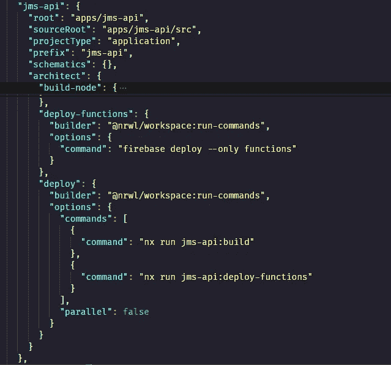

Nx 部署命令

让我们测试一下部署。

```
> nx deploy coffee-api
```

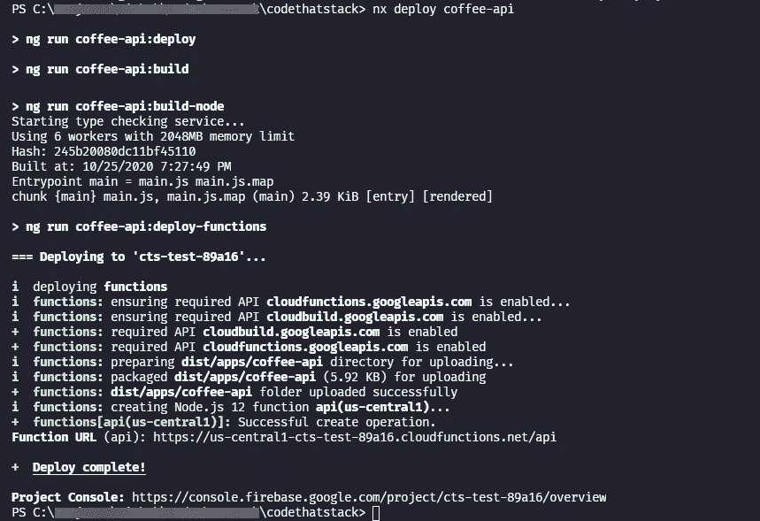

部署到 Firebase 功能

# 摘要

我使用 Nx-Nest-Firebase 的这个设置已经快 2 个月了，我喜欢这种开发者体验。

我希望这能对社区有所帮助。

这里使用的完整源代码可以在这里找到:

[](https://github.com/codethatstack/nest-firebase) [## codethatstack/nest-firebase

### 这个项目是用 Nx 生成的。🔎Nx 是一套用于 Monorepos 的可扩展开发工具。Nx 文档 10 分钟…

github.com](https://github.com/codethatstack/nest-firebase) 

# 参考

启发了这篇文章的各种参考点。

[](https://fireship.io/snippets/setup-nestjs-on-cloud-functions/) [## 在云函数上设置嵌套

### 在 Firebase 云函数上运行 NestJS 的步骤。创建时间最后更新时间下面的代码片段演示了两个…

火船. io](https://fireship.io/snippets/setup-nestjs-on-cloud-functions/) [](https://github.com/nrwl/nx/issues/836) [## 允许开发 Firebase 云函数问题#836 nrwl/nx

### 云功能是开发基于微服务的后端的好方法。就像节点后端一样，这很常见…

github.com](https://github.com/nrwl/nx/issues/836) [](https://github.com/nrwl/nx/issues/1175) [## 如何使用 vscode 配置和调试 NestJS？问题#1175 nrwl/nx

### 我正在努力使用 vscode 进行调试(使用断点和检查应用程序流)。有人能分享我如何…

github.com](https://github.com/nrwl/nx/issues/1175) [](https://stackoverflow.com/questions/61671958/how-do-you-add-firebase-firestore-to-an-existing-nestjs-app-inside-of-a-nrwl-mon) [## 如何将 Firebase/Firestore 添加到 NRWL monorepo 中现有的 NestJS 应用程序中？

### 步骤 1 -创建 Nest App NX generate @ nrwl/Nest:App myapp 步骤 2 -添加函数(不在 apps 文件夹内)。npm…

stackoverflow.com](https://stackoverflow.com/questions/61671958/how-do-you-add-firebase-firestore-to-an-existing-nestjs-app-inside-of-a-nrwl-mon)  [## Nx Nrwl Firebase 函数

### 自从 Nrwl 发布了对节点应用程序的支持后，我一直在期待 Firebase 函数。我甚至创造了…

medium.com](https://medium.com/mean-fire/nx-nrwl-firebase-functions-98f96f514055)