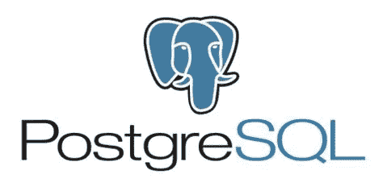

# PostgreSQL 中的对象管理

> 原文：<https://itnext.io/object-management-in-postgresql-36ab896b4c07?source=collection_archive---------5----------------------->

PostgreSQL 有着丰富的历史。它是由加州伯克利大学开发的 Ingres 数据库系统的继承者。Postgres *的开发(原名，因为它使用了* [*QUEL*](https://en.wikipedia.org/wiki/QUEL_query_languages) *语言进行查询。后来，它采用了 SQL 标准，导致了现在的 PostgreSQL 名称)*是由伯克利的 Ingres 项目负责人迈克尔·斯通布雷克领导的。他在数据库领域有着光辉的表现，这是本文无法完整描述的。然而，我们将研究他的两篇重要论文。

1.  [Postgres 的设计](https://dl.acm.org/doi/pdf/10.1145/16856.16888)
2.  [Postgres 使用过程中的对象管理](https://dl.acm.org/doi/pdf/10.5555/318826.318840)

我也鼓励读者看一看“[让数据库工作](https://dl.acm.org/doi/pdf/10.1145/3226595)”，这是一本关于迈克尔和他的工作的很棒的书。

这些论文在很多方面都很出色。我在这里简明扼要地总结了论文。

## **POSTGRES 的设计**

本文从以下目标开始，详述了为什么需要一个新的数据库系统。我列出了最重要的几个

*   为复杂对象提供更好的支持。
*   为用户提供扩展数据类型、运算符和访问方法的能力。

所以，设计目标是使数据库**智能并允许用户对数据库 [***编程***](https://dl.acm.org/doi/pdf/10.1145/3226595) 。**

**作者认为，虽然关系系统在很大程度上满足了各种商业系统中数据处理的需求，但在许多领域它们还不够。具体来说，它们在表达许多工程领域(如 CAD 系统、编程环境、地理数据和图形)的数据存储需求方面缺乏深度。**

**为了探究这种缺乏表现力的现象，他们详细阐述了 CAD 系统中的一个例子。**

****复杂类型****

**考虑一个系统，其中用户存储属于图形系统的各种形状。假设用户想要以一种叫做多边形的类型存储形状。该形状有两种不同类别的属性。**

*   **ID、形状类型、节点、几何坐标等。(每个多边形不同)**
*   **线型、线条尺寸、颜色、缩放比例等。(常见于许多多边形)**

**在正常的关系系统中，公共属性可能在一个单独的表中，用一个外键链接。为了获得一个多边形对象的完整数据，我们可以使用一个查询来适当地连接两个表。然而，这是非常缓慢和繁琐的。无论您的软件和硬件栈有多快，关系系统都不能足够快地处理这些查询。主要问题是 ***系统没有关于系统正在存储*** 的 ***复杂类型的信息*** 。**

**解决方案是给 Postgres 提供支持复杂对象类型的能力，并支持它们的多种表示。虽然本文探索了 PostgreSQL 语言的设计，但是 PostgreSQL 文档的“ [**复合类型**](https://www.postgresql.org/docs/current/rowtypes.html) ”部分详细介绍了现代 SQL 中的相同概念。**

**因此，我们可以构建一个丰富的类型化数据系统，该系统在数据库系统中完全受查询语言的支持。**

****扩展性****

**当然，仅仅能够定义自定义类型是不够的。我们应该使用这些类型并对它们执行复杂的操作。为此，Postgres 有三个特点**

*   **现有访问方法能够与用户定义的类型一起使用。**
*   **能够在数据类型上创建新的运算符**
*   **能够根据域需求创建新的访问方法。**

***注:访问方法是指从表中搜索、排序和过滤记录的方法和操作符。***

**此外，可扩展性的目标之一是允许系统优化查询性能，即使是对于新定义的访问方法和数据类型。**

**当时，大多数传统的关系系统通常是用一组固定的数据类型(数字、字符串、键等)来定义的。)和一组固定的访问方法(聚合、简单计算等)。**

**如何实现复杂类型和可扩展性的双重目标可以从下一篇文章中了解。**

## **POSTGRES 中使用过程的对象管理**

**这篇论文，在我看来，更有影响力。它解释了 Postgres 系统中支持复杂对象管理的底层机制。虽然对机制的描述非常有趣，但这篇论文也让我们一窥作者们对如何使用他们的系统的设想。**

**本文以关系模型的论点开始，反对一些论点，即它是“语义贫乏的”，即关系模型本身不够表达。作者认为，虽然不同的领域对数据库有不同的语义要求，但在数据库中构建一个支持不同领域的通用语义集几乎是不可能的。换句话说**

> **~“人们不能简单地创建一个通用的数据模型”~**

**所以作者提出了一个不同的解决方案。 ***赋予数据库模拟这些语义构造*** *的能力。***

****抽象数据类型****

**Postgres 允许用户定义自定义类型，然后可以将其用作表中任何列的数据类型。然而，就性能而言，本文指出了 ADT 系统的三个主要故障。**

*   **具有多级子对象的对象(CAD 系统中的一个建筑可能有数百个子对象，如房间等，它们又可能有数百个子对象，如桌子、椅子等)**
*   **具有不可预测组成的对象(CAD 系统中的同一建筑可能没有预定义的特定顺序或数量的子对象。一个房间可以有一把椅子或一个 100)**
*   **具有共享子对象的对象(例如，同一建筑中跨越多个楼层的加热管道)**

**访问方法中出现性能瓶颈是因为用户希望“打开”复杂的对象，并处理这些子对象中的数据。在 CAD 系统中的建筑物的情况下，用户可能想要读取或修改与特定房间中的桌子或桌子的手柄相关的数据。或者，在电子商务系统中，用户可能希望读取或写入包含在发票中的数据，或者包装中产品系列项目的规格。因为所有的上述对象都是用户定义的类型，为了允许用户进行上述任何操作，要求用户为每个用户定义的类型编写自定义程序。这很快变得很麻烦。由于子对象的不可预测性，性能问题变得更加突出。**

****程序****

**为了缓解上述问题，Postgres 使得**存储过程**成为**完全成熟的数据库对象。****

**Postgres 期望用户**注册**一个过程。该过程可以用任何通用编程语言来定义。然后，Postgres 将与该过程相关的所有数据和元数据存储在其系统表中，并将其提升为数据库对象。它还执行过程的异步编译。然后可以在查询语言中任何可以使用函数的地方使用它。**

**检查完文件后，你可能会问我，这有什么新鲜的？存储过程和自定义数据类型在所有 SQL 数据库中总是可用的。**从以上两篇文章中得出的重要结论与数据库在应用程序中的作用有关。****

****系统架构****

**现代软件栈，尤其是在 web 应用程序中，倾向于将数据库作为一个哑存储系统。即使在早期，当 NoSQL 还不流行的时候，也是如此。存储过程过去和现在都不受欢迎。**

**Postgres 的历史表明关系数据库的作用更大。它的设计是建立在数据库系统不能是一个哑系统的需求之上的。它期望用户充分和广泛地使用自定义类型和过程来构建丰富的语义系统。**

**虽然您可能不希望将不断变化的业务逻辑放在数据库过程中，但是数据完整性逻辑应该是数据库的一部分。**

**由于其创始人的强大潜在愿景，Postgres 仍然是数据库市场的领导者之一(SQL server 和 PostgreSQL 是所有微软、谷歌和亚马逊提供的最常见的云数据库服务中的两种)，通常[优于](https://www.arangodb.com/2018/02/nosql-performance-benchmark-2018-mongodb-postgresql-orientdb-neo4j-arangodb/)现代变体。它具有丰富的类型系统和丰富的语义模拟系统，适用于现代范例和应用程序架构。**

**将关系数据库视为构建丰富的复杂类型和过程集合的系统是非常有意义的，应用层可以依赖于这些系统。分页查询、JSON 转换、计算、转换、数据完整性实施、数据的多种表示等。都可以作为数据库中的过程来实现。此外，借助现代的无服务器云服务，将逻辑移入数据库有助于降低系统复杂性和成本。拥有一个纯粹的功能性无服务器代码来服务来自 cdn 的静态内容和来自关系数据库的数据，将允许更好地扩展应用程序和更好的部署体验。**