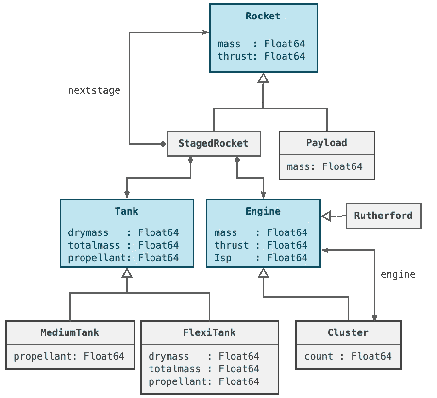
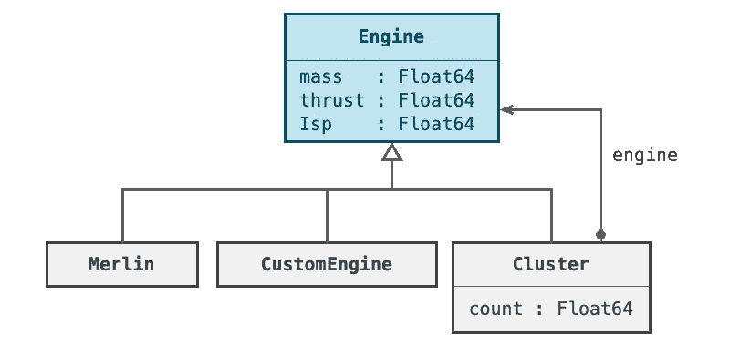
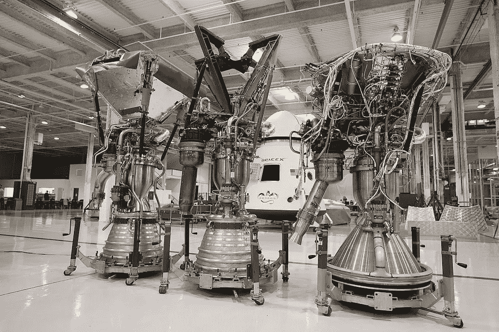
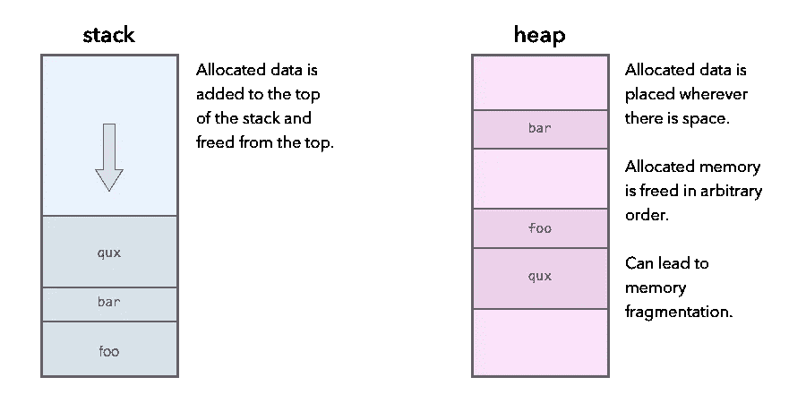

# 面向对象的 Carbon，C++和 Go 比较

> 原文：<https://itnext.io/object-oriented-carbon-c-and-go-compared-e434fb78c4a8?source=collection_archive---------1----------------------->

## 在 Go、C++和 Carbon 编程语言中创建类或类型层次结构


L 让我们看一个简单的例子，用 go、C++和谷歌的新 Carbon 语言创建一个代表火箭引擎的抽象基类。准确地说，Carbon 不是谷歌的官方项目，而是由在谷歌工作的人完成的。

目前还没有 Carbon 编译器，解释器非常简单，缺少很多功能，所以我在这里写的代码是基于语言规范的，而不是由编译器验证的。记住这一点，因为可能会有错误。

在我即将出版的编程书籍 [Julia as a Second Language](https://www.manning.com/books/julia-as-a-second-language) 中，我将带领读者用代码建造一艘太空火箭。这个代码项目是专门教读者如何对类型层次结构建模，以及如何进行对象组合的。



分级火箭的类型层次和对象组成

我发现这个例子非常有用，足以[在 Go code](https://github.com/ordovician/rocket) 中复制它，打算有一天以此为主题写一本 Go 编程书。在本文中，我将用 C++和 Carbon 建模这种类型层次和对象组合的子集。

由于整个类型层次结构的例子在我的 Julia 书的多个章节中进行了探讨，所以在这个故事中我们只能涵盖它的一小部分。我选择放大火箭发动机的类型层次。



火箭发动机的 UML 图

火箭发动机集群是多个发动机的集合。例如，土星 V 月球火箭的第一级有一个由五个 F1 发动机组成的发动机组。SpaceX 公司的现代猎鹰 9 号火箭第一级有 9 个梅林引擎，第二级有一个梅林引擎。

## 定义接口

[原始 Go 代码](https://github.com/ordovician/rocket)定义了一个抽象接口`Engine`，供所有具体引擎`Merlin`和`CustomeEngine`实现。

```
// Go code - Base interface
**package** engine

// Force that causes 1kg to move 1m in one second.
**type** Newton float64

// standard measurement unit for mass, a kilogram
**type** Kg float64

**type** Engine **interface** {
    Mass() Kg       // Mass of whole engine
    Thrust() Newton // How much engine pushes
    Isp() float64   // Fuel efficiency of engine
}
```

你可能会注意到，我利用 Go 的能力让你定义像牛顿和千克这样的单位，这可以防止开发人员不小心混淆不兼容的单位。例如，我不能，偶然地，在没有编译错误的情况下增加推力的质量。

在 C++中，我们没有为单元创建类型安全的能力，除非我们为每个单元类型定义全新的类。相反，移植的 C++代码将使用`typedef`。`typedef`就像一个别名，不提供任何实际的类型安全。C++没有 Go 和 Java 这样的接口。因此，我们必须定义一个抽象类。我们通过添加未实现的虚拟方法来实现这一点。

```
// C++ code - Base interface
**namespace** engine {

    // Force that causes 1kg to move 1m in one second.
    **typedef** double Newton;

    // standard measurement unit for mass, a kilogram.
    **typedef** double Kg;

    **class** Engine {
    **public**:
        **virtual** Kg Mass() **= 0**;   // Mass of whole engine
        **virtual** Newton Thrust() **= 0**; // Power of engine
        **virtual** double Isp() **= 0**;    // Fuel efficiency
    };
}
```

我不喜欢 C++解决方案的几个方面。因为我们没有接口的概念，我们需要通过为每个方法重复关键字`virtual`来创建更多的样板文件。我们指出该方法必须以`= 0`表达式作为结尾来实现，这非常奇怪而且不直观。`namespace`在 C++中引起嵌套，这在我看来是非常不切实际的。在我看来，在代码中应该避免深度嵌套。直观地跟踪多级嵌套并不容易。

Carbon 解决方案解决了其中一些问题，同时保留了一些 C++的问题并引入了新的问题。使用`package`关键字可以避免名称空间嵌套。`alias`类似于 C++ `typedef`，因此不为不同的单元提供任何类型安全。

```
// Carbon code - Base class
**package** Engine **api**;

**alias** Kg = f64;
**alias** Newton = f64;

**abstract** **class** Engine {
    **abstract** **fn** Mass[me: Self]() -> Kg;
    **abstract** **fn** Thrust[me: Self]() -> Kg;
    **abstract** **fn** Isp[me: Self]() -> f64;
}
```

你会注意到 Go 和 C++有几个重要的区别:

*   我们的包附加了一个额外的关键字`api`，默认情况下，该关键字用于将文件中声明的所有类型和函数设为公共。在 Go 中，大写的类型和函数是公共的。
*   你通过添加`[me: Self]`澄清了一个函数是一个方法而不是一个类方法。
*   未实现的方法必须标记为`abstract`。

相对于 Go 和 C++我认为使用`[me: Self]`是一种否定。它增加了代码的冗长性和噪声。另一方面，使用*介绍者*关键字，比如`fn`意味着方法名容易对齐，并且更容易浏览。在 C++中，程序员被迫手动缩进代码来达到同样的效果。

我还要说的是，对整个类使用`abstract`关键字使得这个类的用途更加明确。在 C++中，类是通过使用未实现的虚方法隐式抽象出来的。



猎鹰 9 号火箭上使用的 SpaceX 公司的三个梅林火箭发动机。

## 实现类

让我们看看如何在各种具体的类中实现我们的`Engine`接口。我们将首先看一个只包含方法实现而不包含数据成员的引擎实现。

Go 使用了所谓的*结构类型化，*这意味着你只需通过在一个接口上定义所有的方法来实现一个接口。您不需要明确声明您正在实现该接口。

```
// Go code - Merlin rocket engine
// Engine used on the Falcon 9 rocket made by SpaceX
**type** Merlin **struct** {
}

// The mass of the rocket engine.
**func** (engine Merlin) Mass() Kg {
	**return** 470
}

// Think of this as similar to the horse power of a car.
**func** (engine Merlin) Thrust() Newton {
	**return** 845e3
}

// Specific impulse of the rocket engine. 
// A measure of fuel efficiency.
**func** (engine Merlin) Isp() float64 {
	**return** 282
}
```

C++和 Carbon 都使用*名义类型*，这意味着我们必须明确声明我们正在实现什么类或接口。从 C++开始，我们就有了`override`关键字，它允许编译器检查我们正在实现的方法实际上是否覆盖了在基本接口中定义为虚拟的函数。然而，没有使用`override`的要求，所以这里我们得到了一个潜在的 bug 源。

```
// C++ code - Merlin rocket engine**class** Merlin : **public** Engine {
**public**:
  Engine() {}   // constructor
  ~Engine() {}  // destructor

  Kg Mass() **override** {
  	return 470;
  }

  Newton Thrust() **override** {
    	return 845e3;
  }

  double Isp() **override** {
    	return 282;
  }
};
```

与 Go 和 Carbon 不同，C++有构造函数。创建 C++对象时，总是运行构造函数。当 C++对象被释放时，析构函数将被运行。Go 避免了析构函数，因为当 Go 对象被释放时，它是不确定的，因为它使用垃圾收集器来管理内存。Go 解决方案是使用`defer`语句，它通常用于运行清理代码。

Carbon 被设计成与 C++兼容，并且容易与 C++代码接口。出于这个原因，Carbon 不使用垃圾收集，实际上有析构函数。在下面的例子中，我们还没有显示析构函数，但是我们已经创建了一个`Make`类方法来在堆上分配`Merlin`的实例。

```
// Carbon code - Merlin rocket engine**final** **class** Merlin **extends** Engine {
    **fn** Make() -> Merlin* {
        **let** engine: Merlin = {};
        **return** heap.New(engine);
    }

    **impl** **fn** Mass[me: Self]() -> Kg {
        **return** 470;
    }

    **impl** **fn** Thrust[me: Self]() -> Newton {
        **return** 845000;
    }

    **impl** **fn** Isp[me: Self]() -> f32 {
        **return** 282;
    }
}
```

在 Carbon 中，我们使用`final`关键字来表示该类不能再进一步成为子类。使用`final`可以实现更好的优化。如果你有一个类型为`Merlin`的指针，那么当一个类是 final 的时候就不需要查找虚方法。在 Go 中，每个`struct`都是隐式 final，因为你不能继承 structs。实际上，final 在 Carbon 中是默认的，所以实际上你不必写它。

在 Carbon 中，我们用关键字`virtual`、`abstract`和`impl`修改方法。与 C++相比，这些方法允许更好的编译器检查。如果你没有在一个方法前面写这些关键字中的任何一个，那意味着这个方法不能在子类中被覆盖，也不能覆盖在基类中定义的方法。

因此，如果您打算以后允许子类覆盖您的方法，您需要将其定义为`virtual`或`abstract`。前者就好比 C++里的`virtual`。您声明在提供默认实现的同时可以覆盖该方法。

请记住，在 C++中，当我们不实现虚方法时，我们会将奇数`= 0`添加到虚方法中。在 Carbon 中，我们使用`abstract`关键字。我认为这是一个更明智的选择。

你可能认为`impl`和 C++里的`override`一样，其实不然。你必须在 Carbon 中使用`impl`来覆盖一个方法，否则你会得到一个编译器错误。换句话说，Carbon 编译器会发现更多的问题。在 C++中，您可能会无意中覆盖一个方法。


俄罗斯联盟号火箭上的火箭发动机组

让我们用成员变量做一个类。今天大多数火箭的第一级，即所谓的助推级，都有多个火箭发动机。土星五号月球火箭有五个 F1 火箭发动机。猎鹰 9 号火箭的第一级有九个梅林引擎。为了简化火箭的建模，我们可以将一组引擎表示为另一种引擎。这就是`Cluster`的作用。`Cluster`类型实现了与其他引擎类型相同的所有方法。

我们使用一个`Count`变量来跟踪集群中有多少个引擎。在 Go 中，我们可以利用嵌入的概念，它允许我们嵌入另一种类型并公开其接口。

```
// Go code - Rocket engine cluster
**package** engine

**type** Cluster **struct** {
    Engine
    count uint8
}

**func** (cluster *Cluster) Mass() Kg {
    **return** cluster.Engine.Mass() * Kg(cluster.count)
}

**func** (cluster *Cluster) Thrust() Newton {
    **return** cluster.Engine.Thrust() * Newton(cluster.count)
}

// Create a cluster. Go does not have constructors
**func** NewCluster(engine Engine, count uint8) *Cluster {
    cluster := Cluster{
        Engine: engine,
        count: math.Max(count, 1.0)
    }
    **return** &cluster
}
```

在这种情况下，我们嵌入了`Engine`接口，该接口向`Cluster`添加了`Mass`、`Thrust`和`Isp`方法。

然而，我们显式地隐藏了`Mass`和`Thrust`方法。这种隐藏不同于重写。如果`Isp`调用了`Mass`和`Thrust`，它们仍然会调用由嵌入的`Engine`对象提供的实现，而不是由`Cluster`类型提供的实现。

与 C++不同，Go 没有构造函数。如果我们希望防止包的用户可能错误地初始化对象，我们将一个或多个结构成员设为私有。因为`count`字段是私有的，所以`engine`包外的代码不能用结构文字初始化`Cluster`对象。在`engine`包之外创建`Cluster`对象的唯一方法是调用`NewCluster`函数。

没有必要在 Go 中的堆上显式分配。在`NewCluster`方法中，我们创建了`cluster`对象，它通常会被分配到堆栈中。然而，当 Go 编译器分析代码时，它会注意到返回了`cluster`对象的地址。在 Carbon 或 C++代码中，这将导致灾难。你将返回一个指向堆栈上已经被释放的内存的指针。在围棋中，这不是问题。编译器将简单地切换到在堆上分配`cluster`。堆分配的对象由 Go 垃圾收集器管理，所以内存不会泄漏。



内存堆栈和堆分配的区别。

正如你将看到的，Carbon 使用非常相似的方法来创造物体。我已经选择调用为`Make`创建集群对象的函数，但是我可以把它命名为任何东西。你可以通过它不包含`[me: Self]`部分来判断它是一个类函数而不是一个方法，T5 部分指的是所有实例方法都有的隐式`me`变量。

`Make`比 Go 版本更复杂，因为我们没有垃圾收集器来跟踪有多少其他对象指向我们的`engine`对象。因此，安全的选择是复制引擎对象。

```
**class** Cluster **extends** Engine {
    **fn** Make(engine: Engine, count: i32) -> Cluster* {
        **let** cluster: Cluster = {
            .engine = heap.New(*engine),  // create copy
            .count = Math.Max(count, 1)};
        **return** heap.New(cluster);
    }

    **impl** **fn** Mass[me: Self]() -> Kg {
        **return** me.engine.Mass() * me.count;
    }

    **impl** **fn** Thrust[me: Self]() -> Newton {
        **return** me.engine.Thrust() * me.count;
    }

    **impl** **fn** Isp[me: Self]() -> f32 {
        **return** me.engine.Isp();
    }

    **destructor** [addr me: Self*] {
        heap.Delete(me->engine);     // deallocate copy we made
    }

    **var** engine: Engine*;
    **var** count: i32;
}
```

要创建一个集群对象，我们可以编写如下代码:

```
**var** merlin: Merlin* = Merlin.Make();
**var** cluster: Cluster* = Cluster.Make(merlin, 9);
```

我们的 Go 实现还有其他一些不同之处。在 Go 中，我们写`Cluster{ ... }`，而在 Carbon 中，当创建一个集群对象时，我们写`{ ... }`。当名称在任何地方都不存在时，Carbon 如何知道我们正在制造一个`Cluster`对象？事实上，我们不是在用碳制造`Cluster`物体。Carbon 中的结构文字有*结构类型*。这意味着任何两个具有相同字段的结构都是相同的类型。

然而，Carbon 允许将结构类型转换为类类型，当它们具有相同的字段时。在这种情况下，当我们返回时，我们的 struct 文本被转换成一个`Cluster`类型，因为它们有相同的字段。

Carbon 没有 Go 嵌入特性，所以我们需要显式实现`Isp`方法。然而，结果是一样的。

# 反光

作为一个 Go 编程语言的粉丝，我喜欢 Carbon 中的许多东西与 Go 有相似之处，比如去掉构造函数。我认为构造函数是 C++中许多问题的根源。如果从构造函数中间接调用虚方法，将会得到未定义的行为。对于较大的班级，这种情况时有发生。

也有很多情况下，想要构造不同类型的对象，同时使用相同类型的参数。假设你有一门`Point`课。您可能希望创建一个代表原点、最小值和最大值的点。有了碳，你可以写`Point.Origin()`在`(0, 0)`发表观点。当然，你可以在 C++中做同样的事情，但是现在你缺乏对称性，因为不同的构造和对象的方法有不同的语法。

Swift 和 Objective-C 是其他正确理解这一点的语言。两者都使用初始化函数，它可以被命名为任何名字，所以你可以告诉用户正在创建什么类型的对象。考虑一个文件类:

```
**var** foo: **auto** = File.Open("foo/bar.txt");
**var** qux: **auto** = File.Create("foo/qux.txt");
```

在这个例子中，因为我们使用命名函数来创建文件对象，所以我们可以传达通过打开现有文件创建文件对象与创建新文件之间的区别。在 C++中，你可能一开始用一个构造函数`File(path)`来打开一个文件，后来才意识到你想要支持创建。你如何解决这个问题？你可以创建一个`File::Create(path)`函数调用，但是这会在 API 中引入一个丑陋的不对称。

我不喜欢碳的什么？如前所述，我认为`[me: Self]`的使用有些不和谐。尽管有一些逻辑与 Carbon generics 非常匹配。碳将任何隐含定义的东西放在方括号内。这不仅仅是经典的`this`和`self`指针，还包括由类型系统推断出的任何类型参数。我们可以在 Carbon 快速排序示例代码中看到这样的示例:

```
**fn** QuickSort[T:! Comparable & Movable](s: Slice(T)) {
  **if** (s.Size() <= 1) {
    **return**;
  }
  **let** p: i64 = Partition(s);
  QuickSort(s[:p - 1]);
  QuickSort(s[p + 1:]);
}
```

`QuickSort`是递归函数。您会注意到，在`QuickSort`的调用位置，我们不必指定`T`。它不是函数的常规参数，而是可以经常推断出来的东西。

我们在`me`和`Self`之间写了一个冒号`:`，因为`me`是方法体中使用的一个实际变量。`T`在快速排序中不支持被当作变量，而是当作类型参数。Carbon 编译器如何知道它应该把`T`当作类型参数而不是对象？因为我们使用了`:!`而不是单个冒号。`:!`用来表示我们正在指定某个约束的类型参数。我们告诉 Carbon，`T`必须是一个既是`Comparable`又是`Movable`的类型。

因此，虽然`me`和`Self`在概念上是有意义的，但是它们看起来并不好，并且会在所有的类中导致许多看起来相似的代码的重复。这样写类方法会更简洁，但是那些很少被使用。我们不应该为最常见的情况优化语法吗？

在编写这些代码示例时，我发现在 Carbon 中管理内存有点棘手。语言规范中没有太多关于这方面的内容，我们使用的 Carbon 解释器缺少语言规范中描述的许多特性。有人提醒我，碳含量非常低。Swift 继承了 Objective-C 对所有对象的引用计数。这给了我们 ARC(自动引用计数),这意味着在 Swift 中，内存分配和取消分配不是你需要考虑很多的事情。

相比之下，Carbon 继承了 C++世界的语义，这意味着引用计数和其他形式的内存管理可能来自类似于 C++模板库的东西。