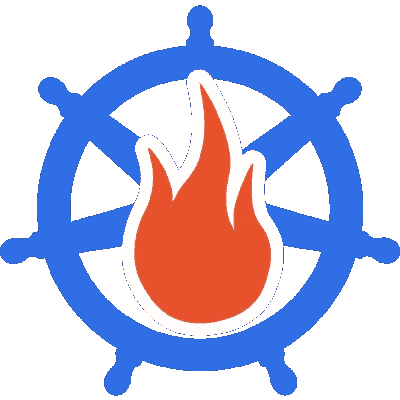
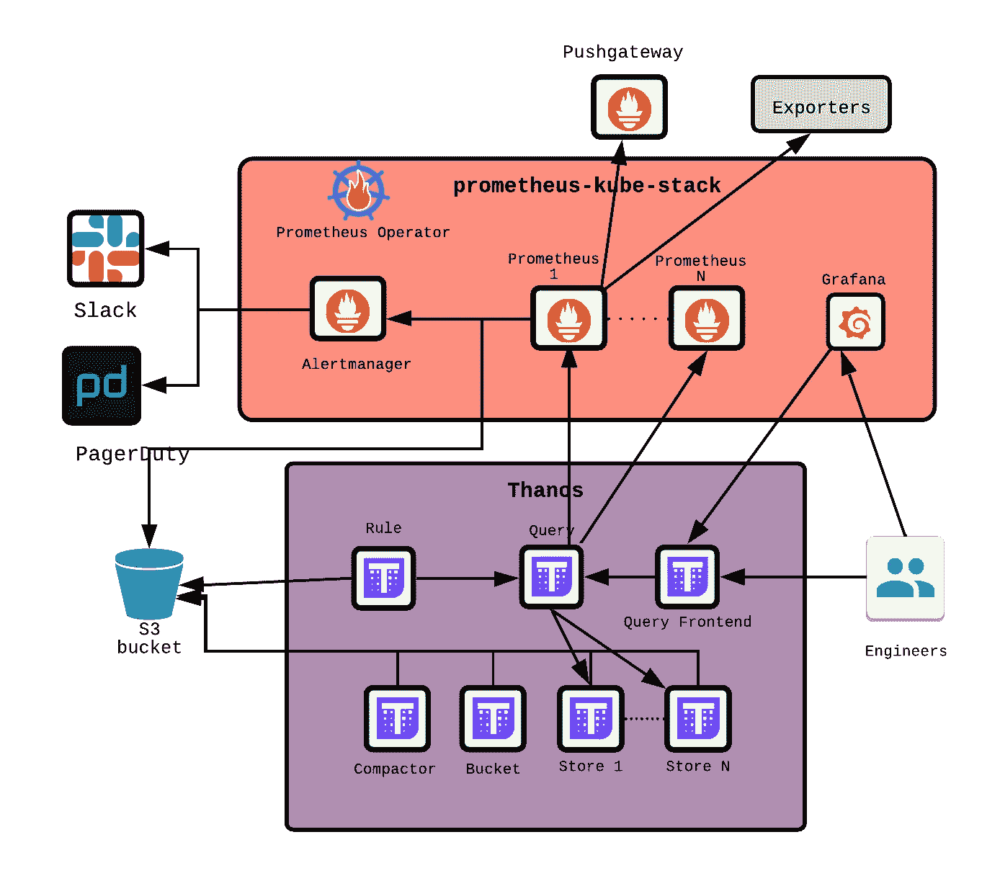
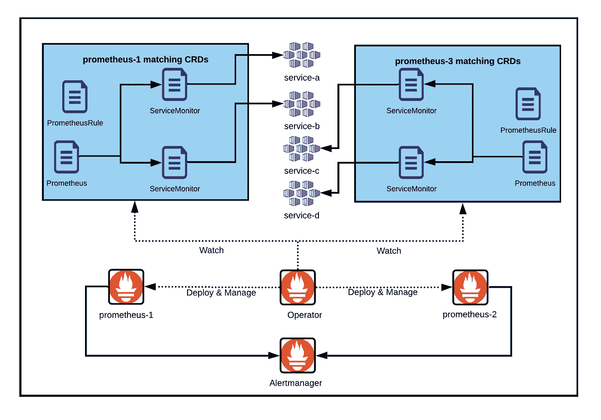

# 大规模可观测性

> 原文：<https://itnext.io/observability-at-scale-52d0d9a5fb9b?source=collection_archive---------6----------------------->



最近，我们在一个名为 Coralogix 的专业可观测性软件公司的博客中发现了一篇文章[](https://coralogix.com/log-analytics-blog/prometheus-federation-with-thanos-how-does-thanos-work/)**，讨论了大规模可观测性的问题。看到他们将我们的架构作为如何扩展可观测性平台的参考点，我们激动不已。更让我们惊讶的是，自从我们第一次写 [**it**](https://matiasmct.medium.com/monitoring-at-giffgaff-a4e7f5fe2bdd) 以来，我们的架构发生了多大的变化。**

**那么我们目前的设置是什么样的呢？**

****

**可观测性堆栈**

****比以前的**[](https://matiasmct.medium.com/monitoring-at-giffgaff-a4e7f5fe2bdd)****更简单、更高性能、更易维护、更易扩展。******

****在这篇文章中，我们将通过我们的新设置，解释为什么我们决定更换/升级它的一些组件。强烈推荐阅读我们之前的 [**文章**](https://matiasmct.medium.com/monitoring-at-giffgaff-a4e7f5fe2bdd) ！****

****为了简单起见，我们没有在图中绘制边车，也没有绘制 Prometheus 和 Alertmanager 的复制实例:****

*   ****普罗米修斯实例使用一个配置重装程序边车和一个灭霸边车运行****
*   ****Alertmanager 实例使用配置重新加载器边车运行****
*   ****格拉夫纳运行与仪表板装载机边车****

****我们还省略了 kube-state-metrics 和节点导出器 daemonset，它们都是作为[**kube-Prometheus-stack**](https://github.com/prometheus-community/helm-charts/tree/main/charts/kube-prometheus-stack)的一部分部署的(稍后会详细介绍)。****

# ****普罗米修斯算子****

****最重要的变化是引入了 [**普罗米修斯操作符**](https://github.com/prometheus-operator/prometheus-operator) ，部署使用了[**kube-Prometheus-stack**](https://github.com/prometheus-community/helm-charts/tree/main/charts/kube-prometheus-stack)图表。随着我们的服务生成的时间序列数量的增长，很大程度上是由 [**Istio**](https://istio.io/) 的引入所驱动的，我们需要横向扩展 Prometheus。我们希望为 Istio 提供在 HA 中配置的自己的 Prometheus 实例。直到那时，他们这样做的方法是:****

*   ****运行两个完全独立的普罗米修斯部署(我们用 Helm)。****
*   ****每个部署都有自己的(复制的)临时配置、警报和记录规则。****
*   ****每个部署都有自己的 Alertmanager，配置为 HA 的对等体。所有 Alertmanager 配置也被复制。****
*   ****每当我们需要对这些配置文件中的任何一个进行更改时，我们都必须在两个部署中进行，并运行两个管道来保持它们的同步。这一过程很容易出错，这意味着 HA 的潜在损失。****

****普罗米修斯算子解决了所有这些问题。它使用 Kubernetes [**CRs**](https://kubernetes.io/docs/concepts/extend-kubernetes/api-extension/custom-resources/) 来简化 Prometheus、Alertmanager 和相关监控组件的部署和配置。****

****Prometheus 操作员监控 Kubernetes API 服务器以发现对特定对象的更改，并确保当前 Prometheus 部署与这些对象相匹配。操作员根据以下自定义资源定义(CRD)进行操作:****

*   ******普罗米修斯**，它定义了一个期望的普罗米修斯部署。****
*   ******Alertmanager** ，它定义了所需的 Alertmanager 部署。****
*   ******ThanosRuler** ，它定义了一个期望的灭霸标尺部署。****
*   ******ServiceMonitor** ，它声明性地指定了应该如何监控 Kubernetes 服务组。****
*   ******PodMonitor** ，它声明性地指定应该如何监控一组 pod。****
*   ******探测器**，它以声明的方式指定如何监控入侵组或静态目标。****
*   ******PrometheusRule** ，定义一组所需的 Prometheus 报警和/或记录规则。****
*   ******AlertmanagerConfig** ，声明性地指定 Alertmanager 配置的子部分，允许将警报路由到自定义接收器，并设置禁止规则。请注意**这个 CRD 还不稳定**，我们还没有利用它。****

****Prometheus 操作员自动检测 Kubernetes API 服务器对上述任何对象的更改，并确保匹配的部署和配置保持同步。****

# ****运行多个 Prometheus 实例****

****在 HA 模式下运行多个 Prometheus 实例的方法是通过[**kube-Prometheus-stack**](https://github.com/prometheus-community/helm-charts/tree/main/charts/kube-prometheus-stack)图表，只需执行多个部署并将副本数量设置为(至少)2。务必只运行一个 prometheus-operator 实例和一个至少有 2 个 pod 的 Alertmanager 部署(对于 HA ),并禁用所有部署中的所有其他组件，只保留一个组件。您可以通过在 kube-prometheus-stack 图表的值文件中除一个版本之外的所有版本中应用以下配置来实现这一点:****

```
**prometheusOperator.enabled = false
alertmanager.enabled = false
kubeStateMetrics.enabled = false
nodeExporter.enabled = false
grafana.enabled = false**
```

****这些实例中的每一个都可以被配置为监控一组 Kubernetes 服务，并对它们生成的指标发出警报。在我们的例子中，一个 Prometheus 监控 Kubernetes 集群中的所有应用程序，而另一个 Prometheus 只监控 Istio 代理。在接下来的几节中，我们将解释如何实现这一点。****

# ****服务监视器****

****ServiceMonitor 是描述应该如何监控 Kubernetes 服务组的资源。服务监视器比临时配置简单。它们与 Prometheus 相分离，可以作为它们应该监控的应用程序的一部分进行部署/更新。通过这种方式，它们可以成为服务部署的一部分，从而灵活地配置特定服务的监控方式(即端点、端口、临时间隔等)。).****

```
**apiVersion: monitoring.coreos.com/v1
kind: ServiceMonitor
metadata:
  annotations:
    meta.helm.sh/release-name: thanos
    meta.helm.sh/release-namespace: monitoring
  labels:
    app.kubernetes.io/component: compact
    app.kubernetes.io/instance: thanos
    app.kubernetes.io/managed-by: Helm
    app.kubernetes.io/name: thanos
    app.kubernetes.io/version: 0.18.0
spec:
  endpoints:
  - interval: 15s
    port: http
  jobLabel: thanos-compact
  namespaceSelector:
    matchNames:
    - monitoring
  selector:
    matchLabels:
      app.kubernetes.io/component: compact
      app.kubernetes.io/instance: thanos
      app.kubernetes.io/name: thanos**
```

****Prometheus 操作员持续观察服务监视器的变化，在 Prometheus 中进行所需的更改。您可以通过 Prometheus CR 指定哪些 ServiceMonitors 对象应该应用于特定的 Prometheus 实例(如果您使用 kube-stack-prometheus，请在 [**值**](https://github.com/giffgaff/prometheus-charts/blob/main/charts/kube-prometheus-stack/values.yaml) 文件中查找`serviceMonitorSelector`和`serviceMonitorNamespaceSelector`参数)。****

****这也意味着您可以有两个 Prometheus 实例使用一组不同的 ServiceMonitors。****

# ****普罗米修斯规则****

****PrometheusRule 对象定义了一组 Prometheus 警报和/或记录规则。与 ServiceMonitors 一样，PrometheusRules 可以作为它们应该监视的应用程序的一部分进行部署/更新。您可以通过 [**值**](https://github.com/giffgaff/prometheus-charts/blob/main/charts/kube-prometheus-stack/values.yaml) 文件中的`ruleSelector`和`ruleNamespaceSelector`参数来选择一个 Prometheus 实例应该使用哪些 PrometheusRules 对象，从而将这些值应用到 Prometheus CR。****

```
**apiVersion: monitoring.coreos.com/v1
kind: PrometheusRule
metadata:
  annotations:
    meta.helm.sh/release-name: prometheus-operator-config
    meta.helm.sh/release-namespace: monitoring
    prometheus-operator-validated: "true"
  labels:
    app: kube-prometheus-stack
    app.kubernetes.io/managed-by: Helm
    release: prometheus-operator
spec:
  groups:
  - name: thanos-compact.rules
    rules:
    - alert: ThanosCompactMultipleRunning
      annotations:
        description: No more than one Thanos Compact instance should be running at
          once. There are {{ $value }}
        runbook_url: https://github.com/thanos-io/thanos/tree/master/mixin/runbook.md#alert-name-thanoscompactmultiplerunning
        summary: Thanos Compact has multiple instances running.
      expr: sum(up{job=~"thanos-compact.*"}) > 1
      for: 5m
      labels:
        severity: warning**
```

# ****把所有的放在一起****

****该流程涉及三个 CRD:****

*   ****普罗米修斯 CRD 号****
*   ****服务监控 CRD****
*   ****普罗米修斯统治 CRD****

****Prometheus 对象筛选并选择 N 个 ServiceMonitor 对象，这些对象依次筛选并选择 N 个 Prometheus 指标端点。如果有符合 ServiceMonitor 标准的新指标端点，此目标将自动添加到选择该 ServiceMonitor 的所有 Prometheus 服务器中。以类似的方式，Prometheus 对象筛选并选择 N 个 PrometheusRule 对象，这些对象将用于向 Alertmanager 触发警报。****

********

****普罗米修斯算子****

# ****格拉夫纳****

****我们使用 Grafana 的方式没有太多变化。然而，您可能已经注意到，在本文开头的架构图中，它现在是 kube-stack-prometheus 盒子的一部分。Grafana 可以使用这个舵图进行部署，因为它是同一个舵图的依赖。我们发现这是有益的，但是如果您喜欢的话，您可以禁用 Grafana 并将其作为独立的部署。****

# ****查询前端****

****灭霸 v0.15.0 引入了一个新的组件，查询前端，这是一个可以放在灭霸查询者前面以改善读取路径的服务。它基于 [**皮层查询前端**](https://cortexmetrics.io/docs/architecture/#query-frontend) 。****

****查询前端是完全无状态和水平可伸缩的。****

> *****目前只有范围查询(/api/v1/query_range API 调用)通过查询前端处理。所有其他 API 调用都直接进入下游的查询程序，这意味着只有范围查询被拆分和缓存。尽管有支持即时查询的计划。*****

****查询前端有一些值得一提的特性:****

*   ******拆分**:根据配置值将一个长查询拆分成多个短查询。****
*   ******重试**:当 HTTP 请求失败时重试查询的重试机制。****
*   ******缓存**:缓存查询结果，并在后续查询中重用它们。如果缓存的结果不完整，查询前端会计算所需的子查询，并在下游查询机上并行执行它们。目前支持内存缓存(fifo 缓存)和 memcached。****
*   ******慢速查询日志**:记录运行时间超过指定持续时间的查询。****

****我们用查询前端替换了 [**骗子**](https://github.com/tricksterproxy/trickster) 。Trickster 并不总是像预期的那样工作，可能是因为它不理解 Querier 允许的 PartialResponse 策略，或者因为我们没有设法正确地配置它(尽管我们已经尽力了！).无论如何，用一个能给我们带来更好性能并得到灭霸社区支持的组件来替换它似乎是一个正确的决定。****

# ****结论****

****Prometheus 算子引入使我们能够更容易地扩展我们的可观测性平台，减少在配置和管理上花费的时间。我们现在可以毫无困难地水平扩展普罗米修斯了。通过 kube-prometheus-stack 图表，我们可以轻松地部署和管理 Prometheus stack 以及 Grafana。****

****另一方面，灭霸查询前端的引入，加上灭霸在过去一年中的性能改进，使我们能够保留和查询大量对我们的工程团队非常有用的数据。****

*****原载于*[*https://www . giffgaff . io*](https://www.giffgaff.io/tech/observability-at-scale/)*。*****