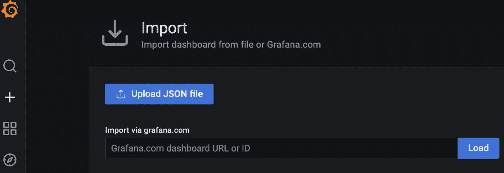
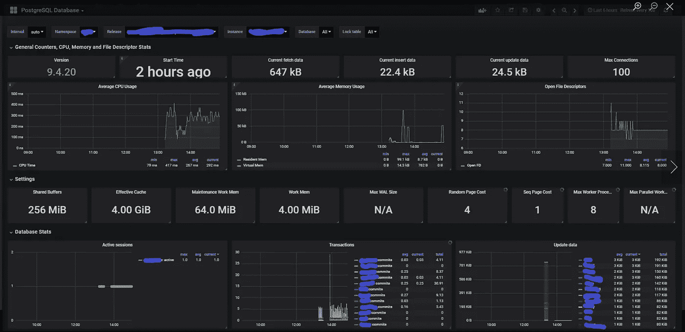

# 可观察性，第 1 部分:介绍和介绍导出器

> 原文：<https://itnext.io/observability-part-1-intro-postgres-exporter-efe57ee2d534?source=collection_archive---------2----------------------->


Julian Hochgesang 在 [Unsplash](https://unsplash.com?utm_source=medium&utm_medium=referral) 上拍摄的照片

# 介绍

高管们喜欢仪表盘，很多时候他们并不真正理解他们在看什么，但图表很容易消化和理解事情是上升还是下降。

为了向内部团队展示尽可能多的指标，我已经开始检查我们可以添加指标的地方。当然，这包括已经为 Prometheus 提供的普通服务，这些服务很容易在本地引入，但也利用了导出器。

这将是一个多部分系列，涵盖我们目前使用的不同出口商。这个系列将不包括我在上一篇文章中提到的 [GitLab Prometheus Exporter。](https://medium.com/analytics-vidhya/trending-gitlab-iteration-data-in-prometheus-4ca78749e6b0)

## 到处都是仪表板

对于不熟悉 Grafana 的人，我建议你熟悉一下 [Grafana 仪表盘库](https://grafana.com/grafana/dashboards/)。对于不同的产品、出口商等，这是一个绝对惊人的仪表盘资源。这是我寻找图表/仪表盘的第一站！

我个人会循环浏览每一个仪表盘，寻找我要引入的特定来源。只需获取仪表板的 ID，并通过 Grafana 中的导入选项加载它。



仪表板导入

如果你不喜欢这个仪表盘，或者它不能真正满足你的需求，你可以快速轻松地删除它！只需进入仪表板的设置(齿轮图标)并滚动到底部，点击红色的“删除仪表板”按钮！

# PostgreSQL 服务器导出程序

如果您在自己的环境中运行 Postgres，我强烈建议您部署 [PostgreSQL 服务器导出器](https://github.com/prometheus-community/postgres_exporter)。它允许您获取数据库实例的各种指标。开箱即用的 PostgreSQL Server Exporter 将支持一个漂亮的仪表板，如下所示。这个仪表盘可以在[这里](https://grafana.com/grafana/dashboards/9628)找到。



Lucas Estienne 的 PostgreSQL 数据库仪表板

## 但是等等，还有更多

Postgres-Exporter 还提供了通过 SQL 查询创建定制指标的能力。这是一个非常有用的工具，可以向管理团队展示生产统计数据，如事件计数、已加入的客户数量、事件类型等。主要是比实例使用多少 RAM 或页面大小等更高级别的东西。

# 添加查询

我使用 postgres-exporter 的 [Bitnami](https://bitnami.com/stack/postgresql-exporter) 容器，所以如果你遵循这个，你的目录可能会不同。

## Queries.yaml

[quries.yaml](https://github.com/prometheus-community/postgres_exporter/blob/master/queries.yaml) 文件存放了您的查询，这些查询将与一些元数据一起运行。[postgres _ exporter Github repo](https://github.com/prometheus-community/postgres_exporter/blob/master/queries.yaml)有一个示例 queries.yaml，可以帮助您入门。它可能包含您不需要或不想要的项目，但它将让您开始了解条目的结构。

我们还有一个 PostgreSQL 函数，称为 row_estimator，它将处理大表的行数估计，因此我们不会进行全表扫描。您可以看到第二个指标使用了这个函数。

## 构建您的容器

现在您已经构建好了查询文件，您需要将它包含在容器中。我使用一个非常简单的 Dockerfile 文件，它包含两行:

```
FROM bitnami/postgres-exporter:latest AS BASE
# these are custom queries
COPY queries.yaml /opt/bitnami/
```

## 部署您的容器

当您部署容器时，您需要通过**PG _ EXPORTER _ EXTEND _ QUERY _ PATH e**n 环境变量告诉 postgres-exporter 查询文件在哪里。如果您使用的是我的同一个 docker 文件，您需要将它设置为:/opt/bitnami/queries.yaml。

# 现在构建您的仪表板

现在您已经部署了您的容器，现在您可以在 Prometheus 中找到您的指标。这些指标将被命名为 whatever your queries.yaml。因此，在我上面的示例中，我创建了两个指标，分别名为 *portal_customers* 和 *portal_endpoints* 。

# 摘要

希望这能帮助人们对他们的 Postgres 数据库及其内容有更多的了解。欢迎对您创建的任何有趣的指标发表评论！

在这个故事的下一部分，我将报道另一个出口商。

如果你喜欢这篇文章或者期待更多的观察性谈话，请随时关注我。