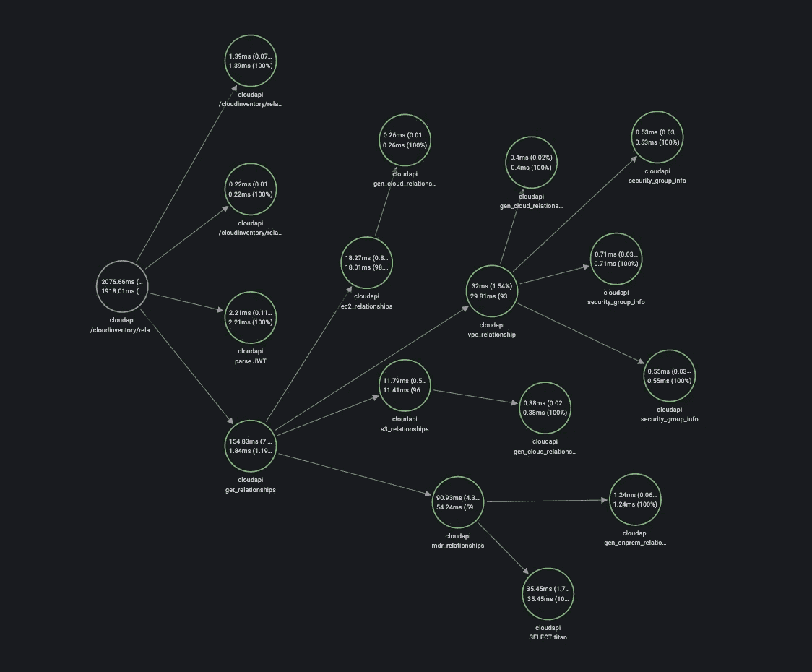
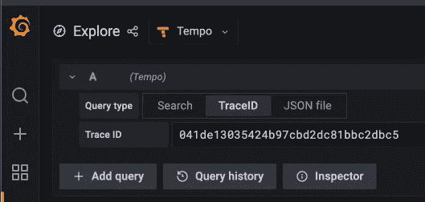
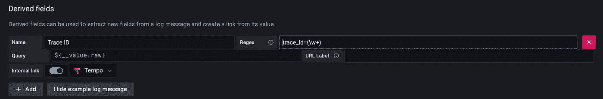
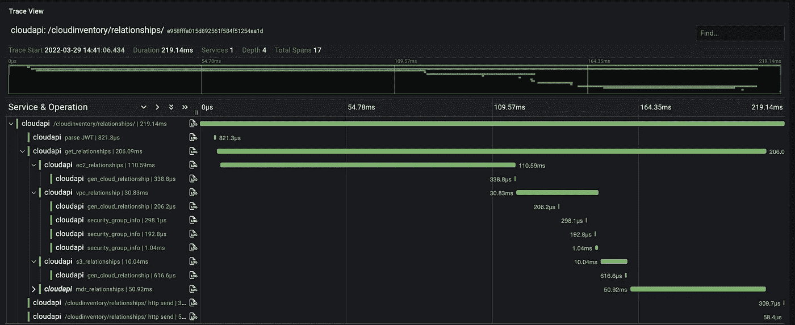

# 可观察性，第 2 部分跟踪

> 原文：<https://itnext.io/observability-part-2-tracing-1537e8d79933?source=collection_archive---------0----------------------->

Grafana 速度的节点图视图

我最初的计划是涵盖我们用来收集普罗米修斯指标的许多出口商，这也是第 1 部分开始的地方。但是，我会根据我目前玩的游戏做一点调整。我将很快回到这项任务上来。然而这东西太酷了，不能等。

对于那些读过我以前文章的人来说，你知道我最近一直在进行一项观察任务。我们已经在 Grafana Stack (Grafana，Prometheus，Loki)上全押了，现在正在增加节奏。这将涵盖我们试图解决的所有三个可观察性领域:日志(Loki)、度量(Prometheus)和现在的跟踪(Tempo)。

我简要介绍了我们对 [Loki](/loki-to-the-rescue-7c3cc0989a7) 的使用，并将在未来继续探索。[第一部分](/observability-part-1-intro-postgres-exporter-efe57ee2d534)和 [Gitlab Prometheus exporter](https://medium.com/analytics-vidhya/trending-gitlab-iteration-data-in-prometheus-4ca78749e6b0) 展示了一点我们的 Prometheus 用法。现在是三脚架的最后一脚，拍子。

# 追踪，快速入门

对于那些可能不熟悉跟踪或者听说过跟踪但不知道行话的人来说，这部分是以一种 EIL5 的方式为你准备的。

## 技术

有多种技术可以让你完成从 Zipkin 到 Jaeger 到 OpenCensus 和 may 付费选项的追踪。这些开源技术中的许多都被 [OpenTelemetry](https://opentelemetry.io/) 决定或吸收。OpenTelemetry(简称 Otel)是 CNCF 的一个[孵化项目，目前有很多活跃的开发。Otel 支持大量现成的语言。每种语言对日志、指标和跟踪都有不同的支持。他们正试图将所有 3 个标准化成通用的包和支持，以使可观察性变得容易！](https://www.cncf.io/projects/opentelemetry/)

## 条款

**跟踪** —跟踪是应用程序正在进行的从开始到结束的活动。这方面的一个例子是被访问的 API 端点。

**Span**—Span 是跟踪的一部分，可以是内部函数、数据库查询或程序完成动作的其他离散活动(也称为跟踪)

**自动插装** — Otel 提供了许多不同代码领域的自动插装，但这实际上取决于您使用的语言。

# **Python 应用入门**

在这篇文章中，我使用了一个 Python FastAPI 应用程序。这个应用程序是一个 API，它有许多端点，并使用 SQLAlchemy 进行数据库访问。

我通过 docker-compose.yaml 文件运行所有这些，该文件中有 Postgres、Grafana、Tempo、Loki 和我的应用程序。

## 添加依赖项

您需要在您的机器、venv、容器等上安装 OpenTelemetry 模块。我个人使用 pip 来安装这些，并让它处理所有其他需求，但这些将让您继续工作，并将为 OpenTelemetry 带来 API 和 SDK

*   opentelemetry-exporter-otlp
*   open telemetry-instrumentation-fast API
*   开放式遥测-仪器-记录
*   开放式遥测-仪器-sqlalchemy

安装后，您可以将它们添加到您的代码中:

## 启用自动检测

这将为您提供一个跟踪 ID 和一两个跨度，但没有我个人所希望的那么详细，但是我将在下面的部分中介绍这一点！

请注意，我在 docker-compose 中发送到本地速度，因此您可能需要根据您的速度安装或 OtelCollector 进行必要的调整，如果您走这条路线的话。

## 对我个人来说缺失的一环

我想，嘿，这太棒了，都完成了，但不是为我个人。我从未在日志中看到任何 traceIDs。对我来说，缺少的部分是确保“包含日志记录”，然后在我的 API 内部调用 logging.info(“一些文本”)。

因为我们正在使用来自 Otel 的 LoggingIntrumentation，它将把跟踪 id 和跨度 id 添加到日志行中，如下所示。第一行是日志调用，第二行是它的输出。

logging.info("调用配置 API ")

2022–03–29 15:01:27，658 INFO[root][relationships . py:366][trace _ id = 041 de 13035424 b 97 CBD 2 DC 81 BBC 2c DBC 5 span _ id = AE 96466432775 bb 7 resource . service . name = cloud api]—调用配置 API

如果没有日志行(默认情况下我没有)，您将看不到 trace_id。

## 以速度查看轨迹

一旦你有了你的 trace ID，你就可以通过 Grafana 把这个 ID 输入到 Tempo 中。导航到 Grafana 的 Explore 部分，选择速度数据源，输入 Trace ID 并点击“运行查询”

查询跟踪 ID

您也可以让 Loki 识别日志中的跟踪 id，并通过衍生栏提供直接指向速度的链接。您将把它添加到 Loki 数据源，如下所示。

## 添加对 SQLAlchemy 的支持

如果你注意到在我们上面的 includes 部分，我们用 OpenTelemetry 增加了对 SQLAlchemy 的支持。要实现这种支持，非常简单，只需在运行 create_engine 命令后添加一行即可(如下面的 engine=行所示)

engine = sqlalchemy . create _ engine(DB _ URL)

SQLAlchemyInstrumentor()。仪表(发动机=发动机，)

现在，您将看到应用程序通过 SQLAlchemy 与数据库对话的时间跨度

# 增加更有价值的跨度

自动检测获得了一些流向 Tempo 的数据，这很有价值，但我希望看到我正在运行的不同函数的跨度，以便我可以了解这些函数对性能的影响，并从性能角度隔离我需要攻击的地方。

这是通过创建一个新的 span，然后用 with 语句包装函数调用来实现的。

您可以在任何想要添加额外跨度的地方添加这些，这样您就可以在任何需要的地方添加。

完全装备的 API 调用

# 摘要

这是我第一次尝试追踪，总之只花了几个小时。大部分时间都花在了试图弄清楚我必须在我想要检测的 API 中有一个日志行上。一旦我发现了那块宝石，就一帆风顺了。

我确信我只是触及了这里的表面，但是想分享一下我目前为止的发现。

希望你觉得这有用，如果是这样，给我一个关注和鼓掌！