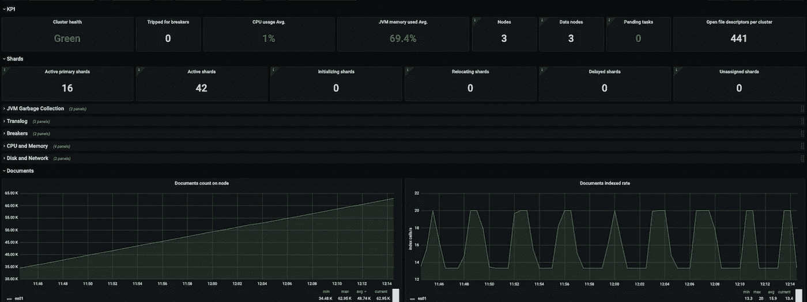

# 可观察性，第 3 部分——弹性导出器

> 原文：<https://itnext.io/observability-part-3-elastic-exporter-318b70a258e6?source=collection_archive---------1----------------------->

弹性导出器仪表板

对于那些读过我其他文章的人来说，你会知道我们正在从弹性堆栈中脱离出来，转而支持 T2 洛基。虽然我们正接近这一转变的尾声，但我们仍然需要监控我们的弹性搜索实例。

我们在我们的产品中使用了 AWS 中的 OpenSearch，虽然 AWS 有一整套的监控和警报功能，当然都是收费的，但并不是我们所有的弹性搜索实例都在 AWS 中。开发和 QA 在我们的本地数据中心，所以我们没有 AWS 提供的相同功能。我们尽最大努力为我们所有的环境标准化一个单一的模式，包括可观察性。我们还希望将我们的监控保持在单一的玻璃面板上，这对于我们来说是 Grafana。

既然我们已经有了一个模式，是时候找到一个好的监控解决方案了。谢天谢地，有人在我们之前解决了这个问题，并通过普罗米修斯项目[弹性出口商](https://github.com/prometheus-community/elasticsearch_exporter)发表了他们的成果。

## 部署和配置

弹性导出器的部署再简单不过了！已经有几个 docker 容器了，我们只是利用了其中的一个，并通过 Kubernetes 部署了它。如果你也想走这条路，弹性出口商团队也有一个掌舵图。对我们来说，我们只是像在我们的环境中做的任何其他容器一样部署容器，尽管我们自己的掌舵图由 DevSecOps 团队维护。

而弹性导出器可能有很多配置项，这些都在 [README.md](https://github.com/prometheus-community/elasticsearch_exporter/blob/master/README.md) 中定义。我们最终只是使用默认设置运行所有内容，并通过 Entrypoint 设置定义了 es.uri 和 es.all 设置。所以我们的入口点看起来像这样:

*/bin/elastic search _ exporter—es . uri = https://VPC-AWS-id . region . es . Amazon AWS . com:443—es . all*

## 形象化

既然我们已经有了想要的所有指标，是时候构建一个仪表板了。谢天谢地，开源社区再次出击了！Grafana Dashboard 页面上有很多 Elasticsearch 仪表盘，但我们最终选择了为 Elastic Exporter 开发的[仪表盘。您可以在本文的顶部看到这个仪表板的示例。](https://grafana.com/grafana/dashboards/14191)

现在我们已经有了可视化工具，我们可以利用 Grafana 警报来告诉我们什么时候关键项目出错了。对我们来说，警报只是我们都在监控的 MS 团队的消息。这将在不久的将来改变，我们将改进我们的警告/警报策略，但它现在对我们有效。

## 摘要

我们当然没有在这里开辟任何道路，只是利用了其他人已经做的相同的模式！这就是开源社区如此神奇的原因。这并不总是创造一切，而是将正确的部件组装在一起以满足您的需求！