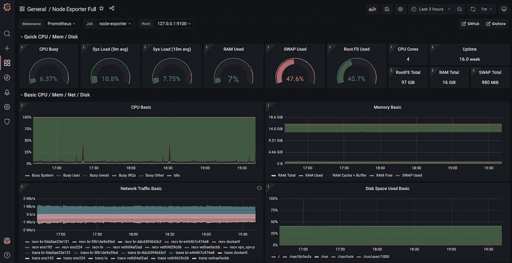

# 可观察性，第 4 部分—节点导出器

> 原文：<https://itnext.io/observability-part-4-node-exporter-a79d9c7e53db?source=collection_archive---------4----------------------->

通过 Otel 收集器的节点导出器

Node Exporter 收集有关运行它的设备的指标，包括从 CPU 到内存/交换到网络流量到磁盘的所有信息，以及两者之间的所有信息。如果您试图确定 Linux 机器的性能，这是一个很好的方法。还有一个 Windows 导出器，可以让你从 Windows 机器上提取相同的数据。

# 远程设备上的节点导出器

我们希望监控部署在核心数据中心之外的许多设备。这些设备利用 DHCP，因此设置这些设备的标准普罗米修斯刮擦将是一个管理噩梦！

## 利用 OpenTelemetry 收集器

Prometheus 能够接受来自其他 Prometheus 实例的远程写入。我们将通过 OpenTelemetry (otel)收集器利用这一点。Grafana 代理在这里也是一个选项，但是在使用 OpenTelemetry Collector 完成其他任务之后，它似乎是一个合理的选择！

安装 otel 收集器非常容易，有一个版本可以支持几乎所有主要的操作系统和 linux 版本。你可以在[项目的 GitHub 发布页面](https://github.com/open-telemetry/opentelemetry-collector-releases/releases)上找到安装。对于这个讨论，我们使用的是 ubuntu 机器，所以我抓取了。deb 版本的 otel collector 用 wget 然后用 dpkg 安装。

OpenTelemetry Collector 支持所有三大支柱可观测性:度量、日志和跟踪；然而，对于我当前的用例，我只对指标感兴趣。正在安装它的机器已经使用 fluentd fluentd 进行日志记录，并且没有提供跟踪数据，所以可以这样配置。

要调整配置，您需要编辑/etc/otelcol/config.yaml。因为我们只想收集指标，所以我们可以稍微缩减配置，并为节点导出器添加一个额外的 scrape_config。除了 scrape_config 之外，您还需要将“prometheusremotewrite”部分设置为 prometheus 服务器的正确 IP/URL。下面是我正在使用的配置的副本。

# 普罗米修斯配置

默认情况下，Prometheus 没有配置为允许远程写入，但这很容易更改。你只需要用一个标志启动 Prometheus 来启用它:*—web . enable-remote-write-receiver*

一旦使用该标志启动 prometheus，默认情况下，它将启用对/api/v1/write URL 的远程写入。当然，如果你愿意，你可以通过 prometheus.yml 文件来改变它。

# Grafana 仪表板

现在，您可以使用任何节点导出器面板来显示数据。我个人更喜欢[节点输出器全](https://grafana.com/grafana/dashboards/1860)。您可以像导入任何其他仪表板一样导入该仪表板，它将自动填充。

# 摘要

这是本系列的最后一部分。我希望您喜欢它，并获得了一两个提示，甚至更好地了解了如何为您的环境增加可观察性。

如果你喜欢这篇文章或这个系列，请关注这篇文章并为之鼓掌。我很感谢你阅读这篇文章！