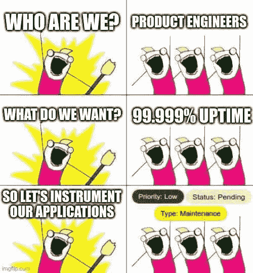

# 不使工程团队超负荷的可观察性策略。

> 原文：<https://itnext.io/observability-strategies-to-not-overload-engineering-teams-b2b53cc2b22f?source=collection_archive---------2----------------------->

## 毫无疑问，在不需要工程努力的情况下，在你的公司实现一定程度的可观测性，是每个人在这个旅程中的梦想。

今天我将与你们分享一些策略，来帮助你们实现可观测性，而不增加你们工程团队的认知负荷。

## 为什么仪器仪表是一项挑战？

嗯，大多数团队可能已经经历了类似下图的事情。

不幸的是，仪器代码在许多情况下并不是优先考虑的，尤其是当这种类型的工作通常不会给产品带来即时价值的时候。

但是，当业务需要较短的周转时间来解决问题并确保 SLA 不会受到损害，并且客户满意度不会降低时，整个公司开始错过更多的工具。

## 空谈是廉价的，现在让我看看它的价值。

使用 essentials 可观察性信号是证明定制工具重要性的最佳方式，它将帮助您解决问题并改进产品，然后向您的产品经理展示可观察性信号如何帮助团队改进产品，或确保不违反 SLA。

有几个默认的可观察性信号可以使用自动仪器策略来收集，这将为您提供足够的信息来实现我上面描述的内容。

## 自动仪器策略

主要有三种策略可以在不需要对服务代码进行任何更改的情况下公开遥测数据。

[**1 —代理**](/observability-strategies-to-not-overload-engineering-teams-proxy-strategy-607d1007688)

很可能您的服务前面已经有一个代理，它做很多事情，比如:

*   TLS 终止
*   断路器
*   限速

这是收集关于您的 HTTP 或 GRPC 服务的遥测数据的最佳位置，因为所有的流量都将通过这个代理，并且您有现成的度量、日志和跟踪。

大多数主流解决方案，如 Nginx、HAProxy 和 Envoy，已经公开了这些遥测数据，并提供了与可观测性平台的集成。

[T5 2—open telemetry](/observability-strategies-to-not-overload-engineering-teams-opentelemetry-strategy-d064b806435c)

OpenTelemetry 旨在成为收集遥测数据并将其发送到其他可观测性后端的事实上的标准，如 **Prometheus** 、 **Jaeger、**和 **ElasticSearch** 。

OpenTelemetry 有一个特性叫做[自动插桩](https://opentelemetry.io/docs/instrumentation/java/automatic/)，这个特性将插桩代码注入到你的服务代码中来收集遥测数据，每种语言都有它的实现，你可以查看[官方文档](https://opentelemetry.io/docs/instrumentation)上的所有细节。

这一策略并不适用于所有语言。尽管如此，我还是认为记住这一点很重要，因为它为所有类型的服务提供了自动检测，而不仅仅是基于 HTTP 或 GRPC 的应用程序。

**3 — eBPF**

eBPF 的工作原理是监听 Linux 内核系统调用，并使您能够在执行这些系统调用时执行操作，公司和开源项目正在使用它来自动收集遥测数据，而无需更改应用程序代码。

如今，已经有一些工具可以使用 eBPF 提供现成的可观察性，比如 [Pixie](https://pixielabs.ai/) ，如果您愿意，您也可以使用 Go、Rust 或 Python 构建您的 eBPF 程序。

eBPF 是一项强大的技术，可以帮助您在不改变应用程序代码的情况下收集遥测数据，但它也需要很高的 Linux 知识水平，如果您对此还不熟悉，我建议您阅读[这篇](https://www.brendangregg.com/blog/2019-01-01/learn-ebpf-tracing.html)博客文章，它将为您提供一个很好的概述，也是继续您的研究的资源。

## 结论

在我看来，更快实现的策略是代理策略，因为大多数分布式系统在它们的层中使用代理，这使得它更容易实现，并且可以从所有服务统一收集遥测数据，而无需向工程团队请求代码更改。

*还需要强调的是，代理策略只适用于基于 HTTP 或 GRPC 的服务。*

在下一篇博文中，我将向您展示每种策略的一个简单实现，从最快的代理策略开始。

我希望你喜欢这篇博文，如果你有任何疑问或建议，欢迎发表评论或联系 Twitter😃。