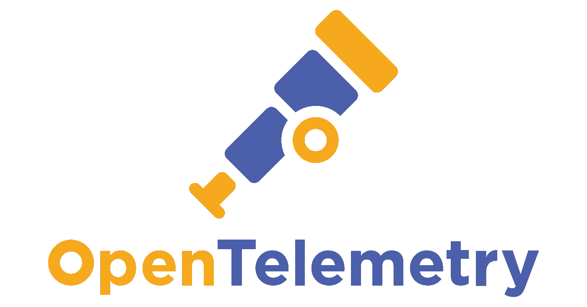
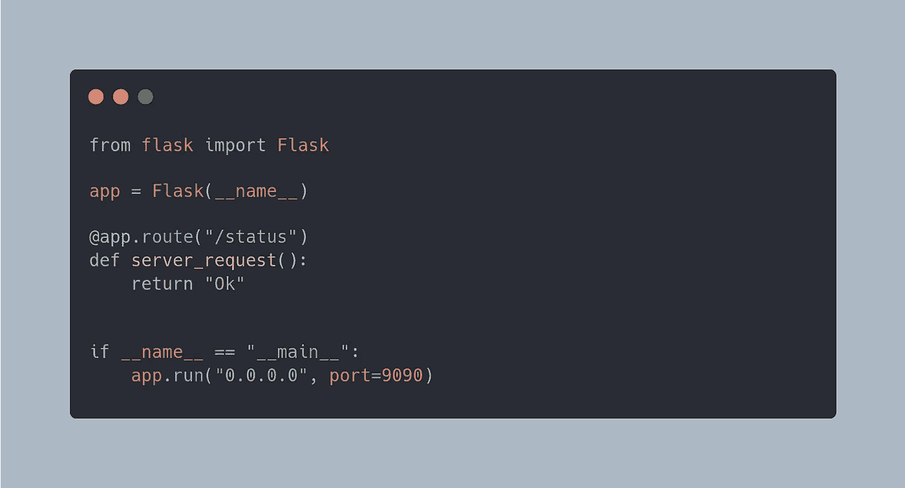
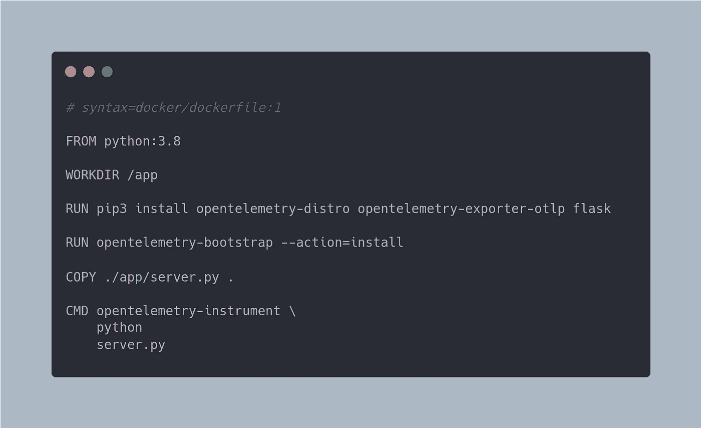
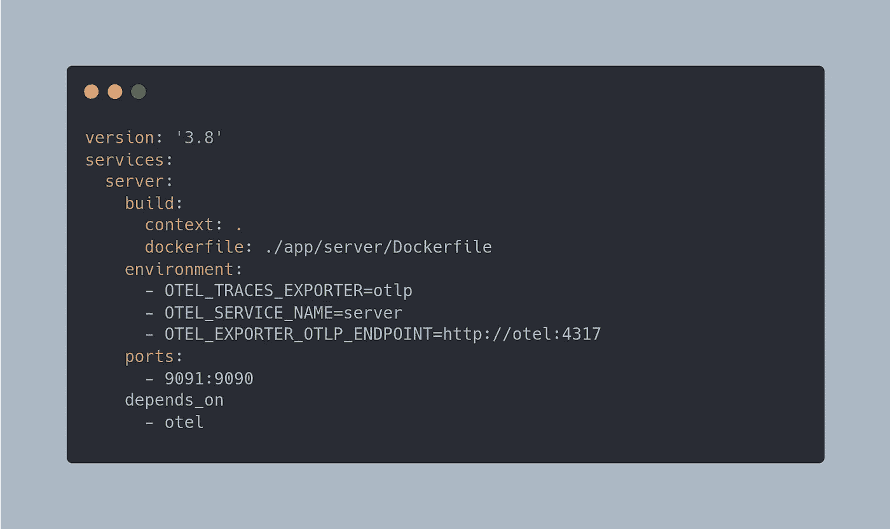
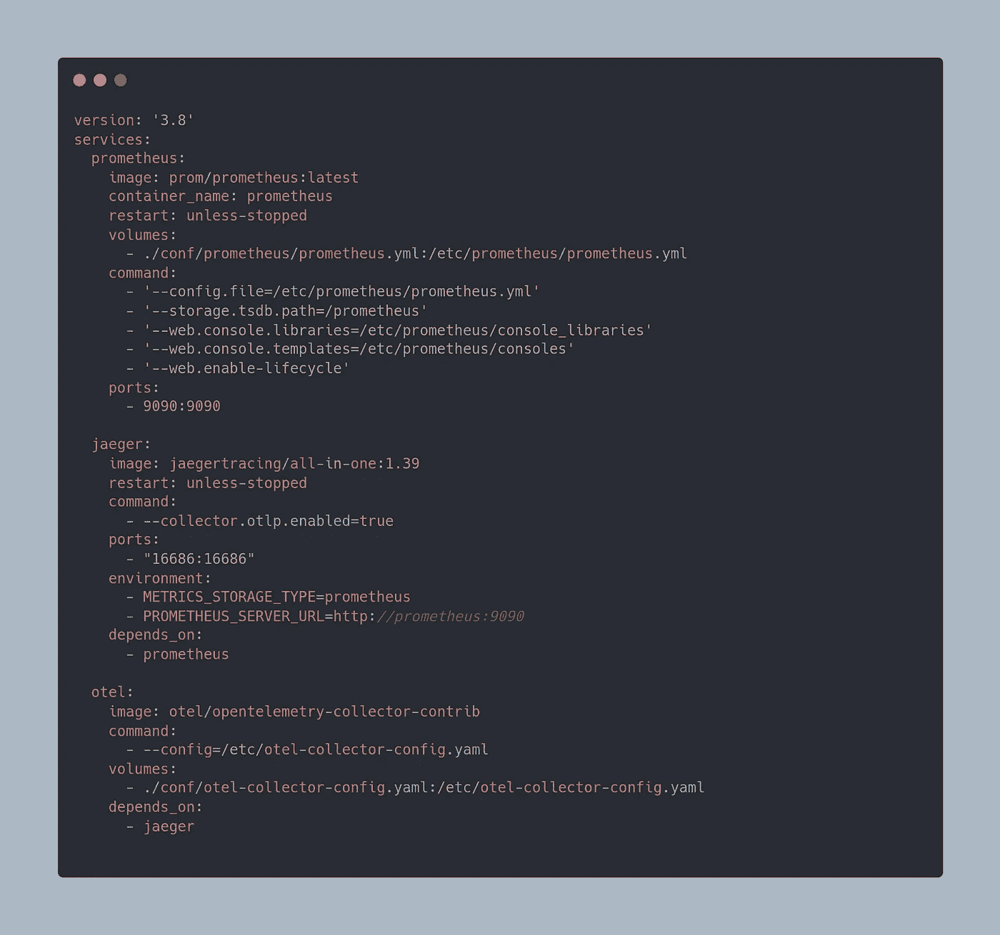
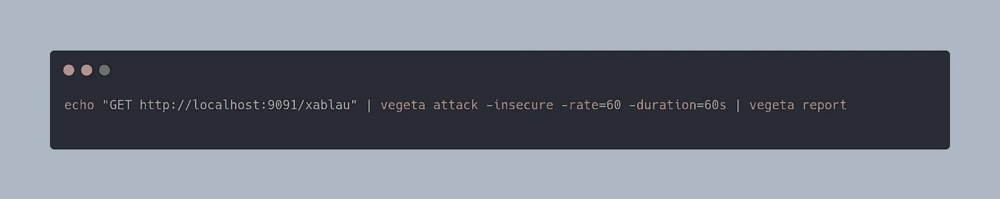
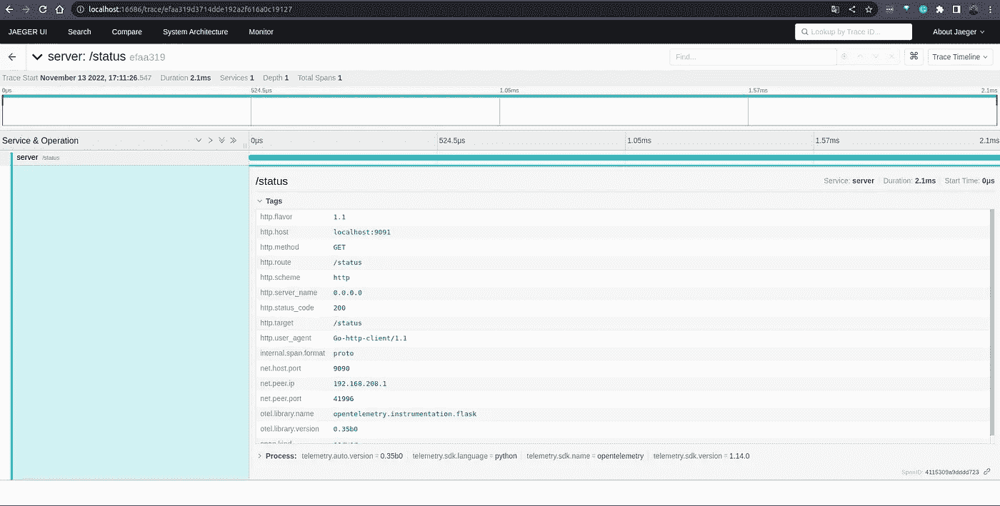
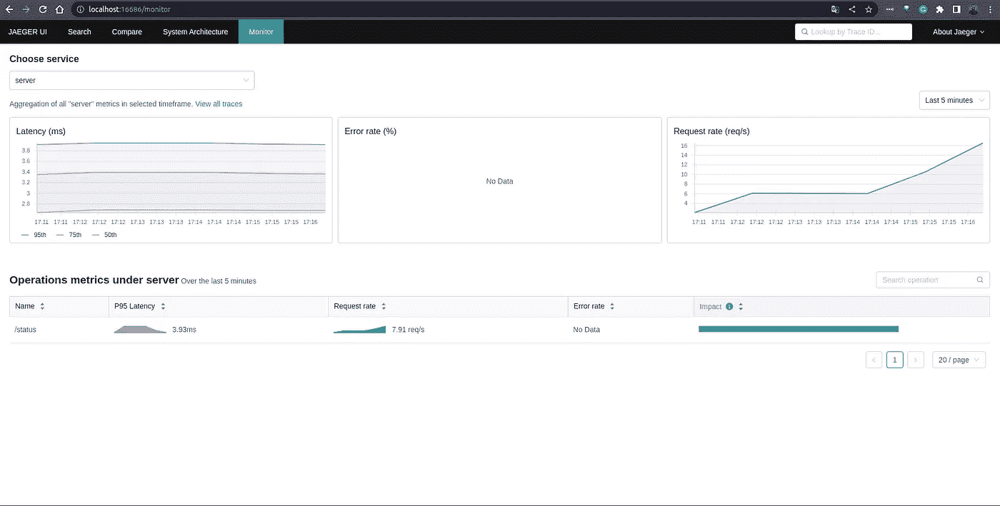
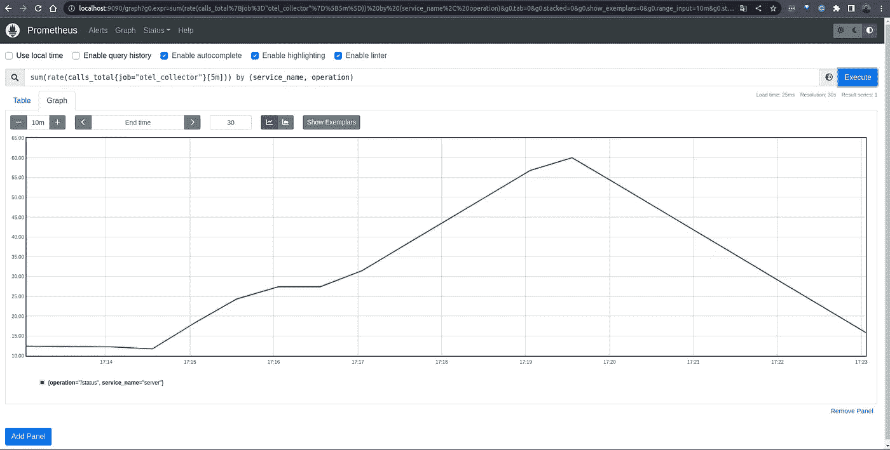

# 不使工程团队超负荷的可观测性策略——开放式遥测策略

> 原文：<https://itnext.io/observability-strategies-to-not-overload-engineering-teams-opentelemetry-strategy-d064b806435c?source=collection_archive---------0----------------------->

## **OpenTelemetry** 提供了将可观测性数据大众化的能力，并赋予工程团队力量。

我在第一篇博文中提到的策略之一[不使工程团队超负荷的可观测性策略](/observability-strategies-to-not-overload-engineering-teams-b2b53cc2b22f)，是利用 open telemetry auto instrumentation 方法，帮助我们在不需要工程努力的情况下实现可观测性。

OpenTelemetry 徽标

今天，我将向您展示如何在不修改代码的情况下从 python 服务中收集指标和跟踪。

*为了保持内容的整洁，我将保留一些设置，如 Prometheus 配置文件。*

## 什么是开放式遥测自动仪器

OpenTelemetry 提供了一个自动插装特性，旨在充当一个从非插装应用程序收集遥测数据的代理。

这是大多数 O11y 供应商(如 New Relic 和 Data Dog)收集遥测数据并将其推送到他们的平台的做法，这是一个有价值的功能，因为工程团队可以通过零仪器工作实现可观测性。

## 演示应用程序

为了帮助我们理解 auto instrument 如何工作，我创建了以下简单的 python 服务。

[Python 服务](https://carbon.now.sh/)

**Docker 图像**

这个 Docker 映像具有所有必需的依赖项，包括 OpenTelemetry 自动仪器包。

[Dockerfile](https://carbon.now.sh/)

在我们继续之前，我想强调一下`cmd`条目，我们用`opentelemetry-instrument`命令修饰了`python server.py`命令，这是要做的自动仪器工作，我们不需要改变应用程序端的任何东西来收集遥测数据。

## 服务基础设施

使用下面的配置，让我们构建上面创建的 docker 映像。

`opentelemetry-instrument`接受几个标志或环境变量，允许您配置协议和属性，有关可用环境变量的更多信息，请查看[此](https://opentelemetry.io/docs/reference/specification/sdk-environment-variables/)链接。

[服务 docker-compose](https://carbon.now.sh/)

上面，我们配置跟踪导出器使用`otel`格式，设置将出现在跟踪上的服务名为`server`，并提供`opentelemetry-collector`端点。

## 可观测性基础设施

现在让我们添加构建块来提供可观察性工具基础设施。

**打开遥测采集器**

Opentelemetry collector 是一个组件，它将接收、处理 python 应用程序生成的遥测数据，并将其导出到后端，如 **Prometheus** 和 **Jaeger。**

**打开遥测采集器配置**

下面的配置将接收应用程序产生的轨迹，然后处理所有跨度以将其导出到 jaeger。

[打开遥测采集器配置](https://carbon.now.sh/)

由于所有跨度都通过收集器，我们可以利用一个名为`spanmetrics`的处理器，该处理器使用 Prometheus 标准公开关于调用数量和每个操作延迟的指标。

这种方法有助于我们根据跨度生成指标，并获得两种不同的现成遥测数据。

**Docker-撰写文件**

现在我们有了开放式遥测收集器配置，我们可以使用以下配置启动 Jaeger 和 Prometheus

[docker-compose.yaml](https://carbon.now.sh/?bg=rgba%28171%2C184%2C195%2C0%29&t=one-dark&wt=none&l=application%2Fjson&width=680&ds=false&dsyoff=20px&dsblur=68px&wc=true&wa=true&pv=56px&ph=56px&ln=false&fl=1&fm=Hack&fs=14px&lh=133%25&si=false&es=2x&wm=false)

我只想强调 jaeger 服务中的环境变量，因为我们在 OpenTelemetry Collector 上激活了`spanmetrics`处理器，我们可以利用 jaeger 的 SPM 功能，有关更多信息，请查看[此](https://www.jaegertracing.io/docs/1.39/spm/)链接。

## 最后的结果

是时候看结果了；所有这些配置将支持我们收集遥测数据，这些数据将有助于整个公司开始采用可观测性，而无需工程努力。

## HTTP 负载测试

为了正确查看遥测数据，我将使用[贝吉塔](https://github.com/tsenart/vegeta)在服务上创建一个小负载。

[HTTP 负载测试](https://carbon.now.sh/)

**耶格追踪**

在 Tracing 视图中，我们可以跟踪整个平台上的请求流，并收集有用的数据来帮助团队理解性能问题以及复杂的分布式体系结构。

**积家 SPM**

Jaeger Service Performance Monitor 提供了请求率、错误率和持续时间(P95、P75 和 P50)的服务级汇总和服务内的操作级汇总，也称为红色指标。

耶格 SPM

该选项卡由 Opentelemetry collector 上的 span metrics 处理器创建的信息填充，这在 Prometheus 中也是可用的，如下所示。

**普罗米修斯指标**

普罗米修斯 UI

如上所述，`spanmetrics`处理器创建两个度量，例如`calls_total`和`latency_bucket`

## 结论

这是一个非常简单的例子，主要思想是提供关于使用 open telemetry auto instrumentation 可以收集什么类型的遥测数据的见解。

我的 [GitHub 账户](https://github.com/nicolastakashi/o11y-strategies-medium)上有该代码，您可以通过在您的本地环境中运行它来随意查看和探索它。

让我知道你是否正在利用你的公司来收集遥测数据或打算使用它。

谢谢😃