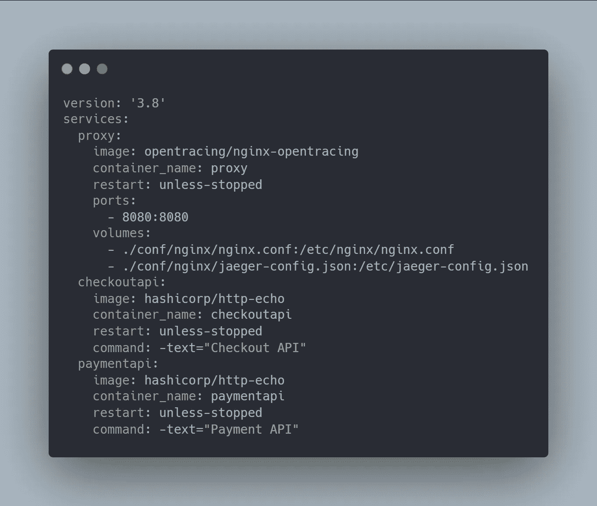
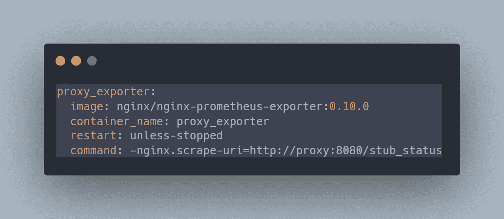
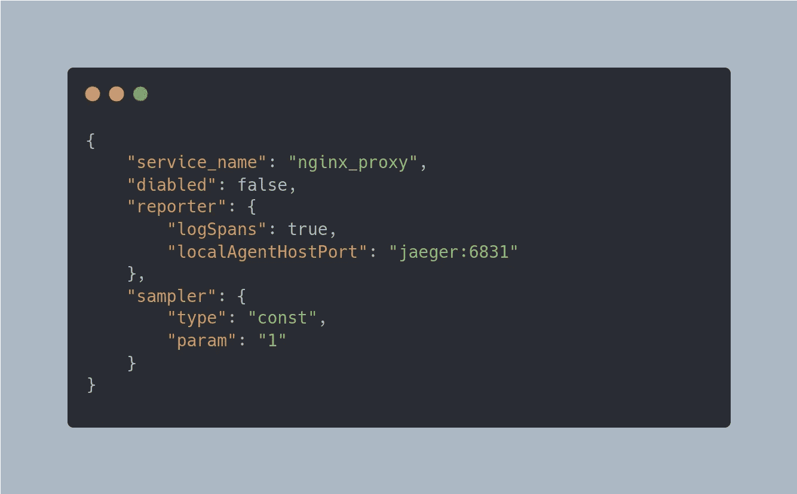
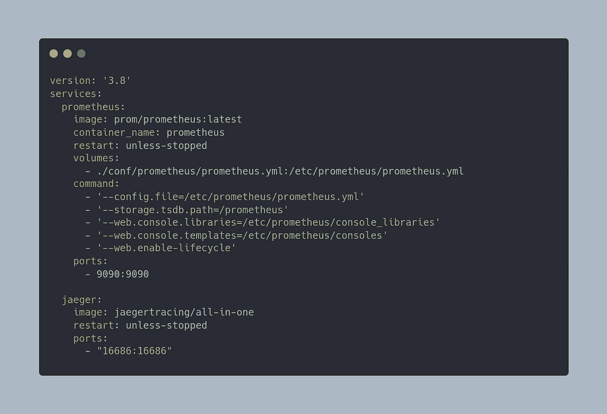
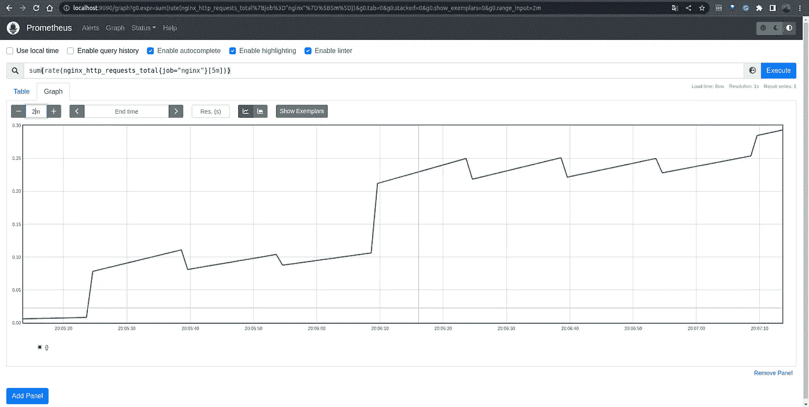
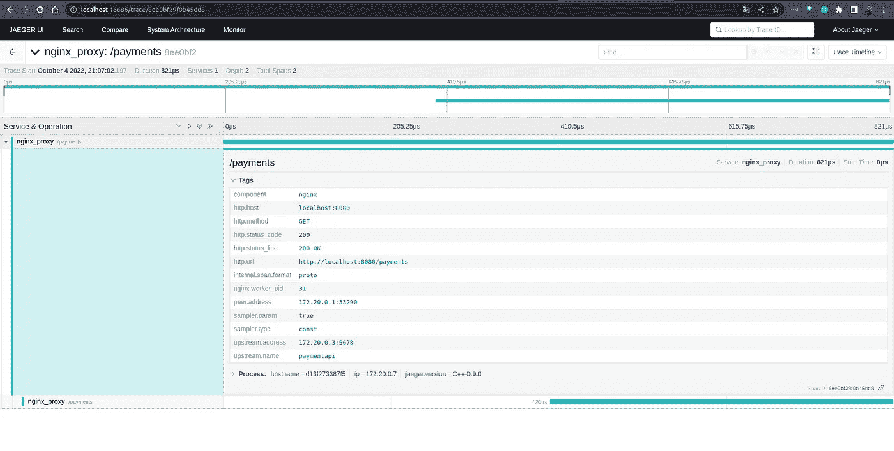

# 不使工程团队超负荷的可观察性策略——代理策略

> 原文：<https://itnext.io/observability-strategies-to-not-overload-engineering-teams-proxy-strategy-607d1007688?source=collection_archive---------3----------------------->

## web 代理是开始收集遥测数据的理想场所，不需要任何工程工作。

我在我的第一篇文章中提到的策略之一，[不使工程团队过载的可观察性策略](/observability-strategies-to-not-overload-engineering-teams-b2b53cc2b22f)，是从通常在你服务之前就存在的代理那里收集遥测数据。

图片来自 istockphoto.com

今天，我将向您展示如何使用诸如 [**【普罗米修斯】**](https://prometheus.io/) 和 [**Jaeger**](https://www.jaegertracing.io/) **等开源解决方案从 [NGINX 代理](https://www.nginx.com/)收集指标和跟踪。**

*为了让内容更干净，我打算省去一些像 Prometheus 和 NGINX 这样的设置。*

## 服务基础设施

使用下面的配置，让我们构建一个假场景，使用一个 echo 服务器来模拟 NGINX 代理后面的两个应用程序。

[](https://carbon.now.sh/?bg=rgba%28171%2C+184%2C+195%2C+1%29&t=one-dark&wt=none&l=auto&width=680&ds=true&dsyoff=20px&dsblur=68px&wc=true&wa=true&pv=56px&ph=56px&ln=false&fl=1&fm=Hack&fs=14px&lh=133%25&si=false&es=2x&wm=false&code=version%253A%2520%273.8%27%250Aservices%253A%250A%2520%2520proxy%253A%250A%2520%2520%2520%2520image%253A%2520nginx%250A%2520%2520%2520%2520container_name%253A%2520proxy%250A%2520%2520%2520%2520restart%253A%2520unless-stopped%250A%2520%2520%2520%2520ports%253A%250A%2520%2520%2520%2520%2520%2520-%25208080%253A8080%250A%2520%2520%2520%2520volumes%253A%250A%2520%2520%2520%2520%2520%2520-%2520.%252Fconf%252Fnginx%252Fnginx.conf%253A%252Fetc%252Fnginx%252Fnginx.conf%250A%2520%2520checkoutapi%253A%250A%2520%2520%2520%2520image%253A%2520hashicorp%252Fhttp-echo%250A%2520%2520%2520%2520container_name%253A%2520checkoutapi%250A%2520%2520%2520%2520restart%253A%2520unless-stopped%250A%2520%2520%2520%2520command%253A%2520-text%253D%2522Checkout%2520API%2522%250A%2520%2520paymentapi%253A%250A%2520%2520%2520%2520image%253A%2520hashicorp%252Fhttp-echo%250A%2520%2520%2520%2520container_name%253A%2520paymentapi%250A%2520%2520%2520%2520restart%253A%2520unless-stopped%250A%2520%2520%2520%2520command%253A%2520-text%253D%2522Payment%2520API%2522)

[应用 Docker 编写](https://carbon.now.sh/?bg=rgba%28171%2C+184%2C+195%2C+1%29&t=one-dark&wt=none&l=auto&width=680&ds=true&dsyoff=20px&dsblur=68px&wc=true&wa=true&pv=56px&ph=56px&ln=false&fl=1&fm=Hack&fs=14px&lh=133%25&si=false&es=2x&wm=false&code=version%253A%2520%273.8%27%250Aservices%253A%250A%2520%2520proxy%253A%250A%2520%2520%2520%2520image%253A%2520nginx%250A%2520%2520%2520%2520container_name%253A%2520proxy%250A%2520%2520%2520%2520restart%253A%2520unless-stopped%250A%2520%2520%2520%2520ports%253A%250A%2520%2520%2520%2520%2520%2520-%25208080%253A8080%250A%2520%2520%2520%2520volumes%253A%250A%2520%2520%2520%2520%2520%2520-%2520.%252Fconf%252Fnginx%252Fnginx.conf%253A%252Fetc%252Fnginx%252Fnginx.conf%250A%2520%2520checkoutapi%253A%250A%2520%2520%2520%2520image%253A%2520hashicorp%252Fhttp-echo%250A%2520%2520%2520%2520container_name%253A%2520checkoutapi%250A%2520%2520%2520%2520restart%253A%2520unless-stopped%250A%2520%2520%2520%2520command%253A%2520-text%253D%2522Checkout%2520API%2522%250A%2520%2520paymentapi%253A%250A%2520%2520%2520%2520image%253A%2520hashicorp%252Fhttp-echo%250A%2520%2520%2520%2520container_name%253A%2520paymentapi%250A%2520%2520%2520%2520restart%253A%2520unless-stopped%250A%2520%2520%2520%2520command%253A%2520-text%253D%2522Payment%2520API%2522)

在启动环境之后，您将有两个不同的服务正在运行，并且可以通过以下地址进行访问。

*   [http://localhost:8080/check out](http://localhost:8080/checkouts)
*   [http://localhost:8080/p](http://localhost:8080/checkouts) 付款

## 收集指标

我们必须利用 NGINX 导出器来收集指标，因为 NGINX 默认情况下不会公开它们。

**NGINX 导出器**

要启用 NGINX 导出器，我们只需将以下配置添加到 docker-compose 文件中。

[](https://carbon.now.sh/?bg=rgba%28171%2C+184%2C+195%2C+1%29&t=one-dark&wt=none&l=auto&width=680&ds=true&dsyoff=20px&dsblur=68px&wc=true&wa=true&pv=56px&ph=56px&ln=false&fl=1&fm=Hack&fs=14px&lh=133%25&si=false&es=2x&wm=false&code=version%253A%2520%273.8%27%250Aservices%253A%250A%2520%2520proxy%253A%250A%2520%2520%2520%2520image%253A%2520nginx%250A%2520%2520%2520%2520container_name%253A%2520proxy%250A%2520%2520%2520%2520restart%253A%2520unless-stopped%250A%2520%2520%2520%2520ports%253A%250A%2520%2520%2520%2520%2520%2520-%25208080%253A8080%250A%2520%2520%2520%2520volumes%253A%250A%2520%2520%2520%2520%2520%2520-%2520.%252Fconf%252Fnginx%252Fnginx.conf%253A%252Fetc%252Fnginx%252Fnginx.conf%250A%2520%2520checkoutapi%253A%250A%2520%2520%2520%2520image%253A%2520hashicorp%252Fhttp-echo%250A%2520%2520%2520%2520container_name%253A%2520checkoutapi%250A%2520%2520%2520%2520restart%253A%2520unless-stopped%250A%2520%2520%2520%2520command%253A%2520-text%253D%2522Checkout%2520API%2522%250A%2520%2520paymentapi%253A%250A%2520%2520%2520%2520image%253A%2520hashicorp%252Fhttp-echo%250A%2520%2520%2520%2520container_name%253A%2520paymentapi%250A%2520%2520%2520%2520restart%253A%2520unless-stopped%250A%2520%2520%2520%2520command%253A%2520-text%253D%2522Payment%2520API%2522)

[NGINX 导出器](https://carbon.now.sh/?bg=rgba%28171%2C+184%2C+195%2C+1%29&t=one-dark&wt=none&l=auto&width=680&ds=true&dsyoff=20px&dsblur=68px&wc=true&wa=true&pv=56px&ph=56px&ln=false&fl=1&fm=Hack&fs=14px&lh=133%25&si=false&es=2x&wm=false&code=version%253A%2520%273.8%27%250Aservices%253A%250A%2520%2520proxy%253A%250A%2520%2520%2520%2520image%253A%2520nginx%250A%2520%2520%2520%2520container_name%253A%2520proxy%250A%2520%2520%2520%2520restart%253A%2520unless-stopped%250A%2520%2520%2520%2520ports%253A%250A%2520%2520%2520%2520%2520%2520-%25208080%253A8080%250A%2520%2520%2520%2520volumes%253A%250A%2520%2520%2520%2520%2520%2520-%2520.%252Fconf%252Fnginx%252Fnginx.conf%253A%252Fetc%252Fnginx%252Fnginx.conf%250A%2520%2520checkoutapi%253A%250A%2520%2520%2520%2520image%253A%2520hashicorp%252Fhttp-echo%250A%2520%2520%2520%2520container_name%253A%2520checkoutapi%250A%2520%2520%2520%2520restart%253A%2520unless-stopped%250A%2520%2520%2520%2520command%253A%2520-text%253D%2522Checkout%2520API%2522%250A%2520%2520paymentapi%253A%250A%2520%2520%2520%2520image%253A%2520hashicorp%252Fhttp-echo%250A%2520%2520%2520%2520container_name%253A%2520paymentapi%250A%2520%2520%2520%2520restart%253A%2520unless-stopped%250A%2520%2520%2520%2520command%253A%2520-text%253D%2522Payment%2520API%2522)

如果目前提供的 NGINX 指标不足以满足您的用例，请查看[这篇](https://blog.ruanbekker.com/blog/2020/04/25/nginx-metrics-on-prometheus-with-the-nginx-log-exporter/)令人难以置信的文章，它展示了如何使用 NGINX 日志来生成 Prometheus 指标。

## 收集痕迹

因为我已经使用了 NGINX docker 映像，并在这个例子中嵌入了 OpenTracing 模块，所以我们只需要提供下面的配置。

[](https://carbon.now.sh/?bg=rgba%28171%2C184%2C195%2C0%29&t=one-dark&wt=none&l=application%2Fjson&width=680&ds=false&dsyoff=20px&dsblur=68px&wc=true&wa=true&pv=56px&ph=56px&ln=false&fl=1&fm=Hack&fs=14px&lh=133%25&si=false&es=2x&wm=false&code=%257B%250A%2520%2520%2520%2520%2522service_name%2522%253A%2520%2522nginx_proxy%2522%252C%250A%2520%2520%2520%2520%2522diabled%2522%253A%2520false%252C%250A%2520%2520%2520%2520%2522reporter%2522%253A%2520%257B%250A%2520%2520%2520%2520%2520%2520%2522logSpans%2522%253A%2520true%252C%250A%2520%2520%2520%2520%2520%2520%2522localAgentHostPort%2522%253A%2520%2522jaeger%253A6831%2522%250A%2520%2520%2520%2520%257D%252C%250A%2520%2520%2520%2520%2522sampler%2522%253A%2520%257B%250A%2520%2520%2520%2520%2520%2520%2522type%2522%253A%2520%2522const%2522%252C%250A%2520%2520%2520%2520%2520%2520%2522param%2522%253A%2520%25221%2522%250A%2520%2520%2520%2520%257D%250A%257D)

[jaeger-config.json](https://carbon.now.sh/?bg=rgba%28171%2C184%2C195%2C0%29&t=one-dark&wt=none&l=application%2Fjson&width=680&ds=false&dsyoff=20px&dsblur=68px&wc=true&wa=true&pv=56px&ph=56px&ln=false&fl=1&fm=Hack&fs=14px&lh=133%25&si=false&es=2x&wm=false&code=%257B%250A%2520%2520%2520%2520%2522service_name%2522%253A%2520%2522nginx_proxy%2522%252C%250A%2520%2520%2520%2520%2522diabled%2522%253A%2520false%252C%250A%2520%2520%2520%2520%2522reporter%2522%253A%2520%257B%250A%2520%2520%2520%2520%2520%2520%2522logSpans%2522%253A%2520true%252C%250A%2520%2520%2520%2520%2520%2520%2522localAgentHostPort%2522%253A%2520%2522jaeger%253A6831%2522%250A%2520%2520%2520%2520%257D%252C%250A%2520%2520%2520%2520%2522sampler%2522%253A%2520%257B%250A%2520%2520%2520%2520%2520%2520%2522type%2522%253A%2520%2522const%2522%252C%250A%2520%2520%2520%2520%2520%2520%2522param%2522%253A%2520%25221%2522%250A%2520%2520%2520%2520%257D%250A%257D)

这个配置对每个发送给 NGINX 代理的 HTTP 请求进行采样，并将其发送给 Jaeger。

## 可观测性基础设施

要启动**普罗米修斯**和**耶格**，你只需要运行以下容器:

[](https://carbon.now.sh/?bg=rgba%28171%2C184%2C195%2C0%29&t=one-dark&wt=none&l=application%2Fjson&width=680&ds=false&dsyoff=20px&dsblur=68px&wc=true&wa=true&pv=56px&ph=56px&ln=false&fl=1&fm=Hack&fs=14px&lh=133%25&si=false&es=2x&wm=false&code=%257B%250A%2520%2520%2520%2520%2522service_name%2522%253A%2520%2522nginx_proxy%2522%252C%250A%2520%2520%2520%2520%2522diabled%2522%253A%2520false%252C%250A%2520%2520%2520%2520%2522reporter%2522%253A%2520%257B%250A%2520%2520%2520%2520%2520%2520%2522logSpans%2522%253A%2520true%252C%250A%2520%2520%2520%2520%2520%2520%2522localAgentHostPort%2522%253A%2520%2522jaeger%253A6831%2522%250A%2520%2520%2520%2520%257D%252C%250A%2520%2520%2520%2520%2522sampler%2522%253A%2520%257B%250A%2520%2520%2520%2520%2520%2520%2522type%2522%253A%2520%2522const%2522%252C%250A%2520%2520%2520%2520%2520%2520%2522param%2522%253A%2520%25221%2522%250A%2520%2520%2520%2520%257D%250A%257D)

[可观测性基础设施](https://carbon.now.sh/?bg=rgba%28171%2C184%2C195%2C0%29&t=one-dark&wt=none&l=application%2Fjson&width=680&ds=false&dsyoff=20px&dsblur=68px&wc=true&wa=true&pv=56px&ph=56px&ln=false&fl=1&fm=Hack&fs=14px&lh=133%25&si=false&es=2x&wm=false&code=%257B%250A%2520%2520%2520%2520%2522service_name%2522%253A%2520%2522nginx_proxy%2522%252C%250A%2520%2520%2520%2520%2522diabled%2522%253A%2520false%252C%250A%2520%2520%2520%2520%2522reporter%2522%253A%2520%257B%250A%2520%2520%2520%2520%2520%2520%2522logSpans%2522%253A%2520true%252C%250A%2520%2520%2520%2520%2520%2520%2522localAgentHostPort%2522%253A%2520%2522jaeger%253A6831%2522%250A%2520%2520%2520%2520%257D%252C%250A%2520%2520%2520%2520%2522sampler%2522%253A%2520%257B%250A%2520%2520%2520%2520%2520%2520%2522type%2522%253A%2520%2522const%2522%252C%250A%2520%2520%2520%2520%2520%2520%2522param%2522%253A%2520%25221%2522%250A%2520%2520%2520%2520%257D%250A%257D)

## 最后的结果

是时候看结果了；所有这些配置将支持我们收集遥测数据，这些数据将有助于整个公司开始采用可观测性，而无需工程努力。

**普罗米修斯**

谈到指标，我们现在可以查询 NGINX 服务器处理的 HTTP 请求的数量，以及关于 NGINX 代理的许多其他指标。

NGINX — HTTP 请求总数指标

**追踪**

在 Tracing 视图中，我们可以跟踪整个平台上的请求流，并收集有用的数据来帮助团队理解性能问题以及复杂的分布式体系结构。

Jaeger —轨迹视图

## 结论

这是一个非常简单的例子，其主要思想是提供关于可以从代理层收集什么类型的遥测数据的见解；如果您需要更多的细节和上下文，您可以利用日志信息来生成详细的度量或者向跟踪添加额外的元数据。

我的 [GitHub 账户](https://github.com/nicolastakashi/o11y-strategies-medium)上有这段代码，你可以随意查看它，并在你的本地环境中运行它。

让我知道你是否正在利用你的公司来收集遥测数据或打算使用它。

谢谢😃