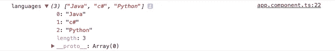
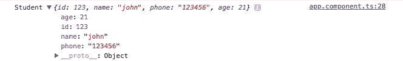
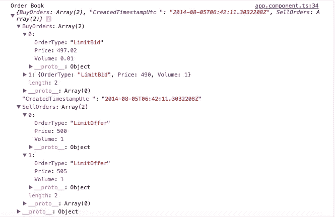

# 角度的可观测量

> 原文：<https://itnext.io/observables-in-angular-176b8010a4cd?source=collection_archive---------6----------------------->


大家好，

我希望你们都过得很好。让我们开始了解可观测值，以及我们为什么要使用它。

# 有哪些可观察到的现象？

angular 中的可观察值用于确保 API 调用是否返回特定的属性。

Observables 帮助您管理异步数据，比如来自后端服务的数据。Observables 在 Angular 内部使用，包括 Angular 的事件系统和它的 HTTP 客户端服务。为了使用 observables，Angular 使用了一个名为 Reactive Extensions (RxJS)的第三方库。

如果你想了解更多的细节，请查看下面的链接。https://angular.io/guide/observables
T3

# **■有什么好处？**

1.  可观测量用于具有不同-2 属性的数据。

2.Observables 实际上验证数据及其类型和性能，这比以旧的方式调用 API 要好得多。

3.为了应用程序的良好性能，并确保返回特定类型的数据，我们确实建议这样做。

Angular 利用 observables 作为接口来处理各种常见的异步操作。例如:EventEmitter 类扩展 Observable。HTTP 模块使用 observables 来处理 AJAX 请求和响应。

路由器和表单模块使用 observables 来监听和响应用户输入的事件。

# **如何使用？**
**Step-1** 我们来创建一个有角度的 app，

去你的终端。

```
ng new observable-app
```

**Step-2** 现在在不到 30 秒的时间内，用零编码创建一个完整的伪 REST API。这里我使用了 json-server。

[https://github.com/typicode/json-server](https://github.com/typicode/json-server)

```
npm install -g json-server
```

**步骤 3** 在根目录下创建一个 db.json 文件。

看起来，

```
{
  "languages": [
      "Java",
      "c#",
      "Python"
  ],
  "student": {
      "id": 123,
      "name": "john",
      "phone": "123456",
      "age": 21
  },
  "orderbook": {
      "BuyOrders": [{
              "OrderType": "LimitBid",
              "Price": 497.02000000,
              "Volume": 0.01000000
          },
          {
              "OrderType": "LimitBid",
              "Price": 490.00000000,
              "Volume": 1.00000000
          }
      ],
      "CreatedTimestampUtc ": "2014-08-05T06:42:11.3032208Z",
      "SellOrders": [{
              "OrderType": "LimitOffer",
              "Price": 500.00000000,
              "Volume": 1.00000000
          },
          {
              "OrderType": "LimitOffer",
              "Price": 505.00000000,
              "Volume": 1.00000000
          }
      ]
  },
  "rates": [
      {
          "CurrencyCodeA": "Aud",
          "CurrencyCodeB": "Usd",
          "Rate": 0.86830000
      }, {
          "CurrencyCodeA": "Usd",
          "CurrencyCodeB": "Aud",
          "Rate": 1.15170000
      }
  ],
  "latestprices": {
      "status": "ok",
      "prices": {
          "btc": {
              "bid": "2352",
              "ask": "3422",
              "last": "5232"
          },
          "ltc": {
              "bid": "0.342",
              "ask":"0.343",
              "last": "0.643"
          },
          "doge": {
              "bid": "23.5",
              "ask": "23.543",
              "last": "234"
          }
      }
  }
}
```

然后运行这个 json-server 来获得输出。

```
json-server --watch db.json --port 4201
```

这里我用的是—端口 4201，你可以在任何你喜欢的端口运行，除了 4200(因为已经被 angular 捕获了)。


**Step-4** 这里我们有一个数据，里面包含了多种类型的值，比如 integer，string。

为了识别 api 的数据类型，我将在/app 目录中创建一个模型。这对那些已经在同一个项目中工作的人或者新成员来说是非常有益的。因为它们不需要调用 api 并检查数据类型或检查 DB 表来识别数据类型。

/app/models/ → student.ts

→ orderbook.ts

**student.ts**

```
export interface Student {
  'id': number;
  'name': string;
  'phone': string;
  'age': number;
}
```

**orderbook.ts** ，

```
export interface OrderBook {
  BuyOrders: Array<{
      OrderType: string,
      Price: number,
      Volume: number
  }>;
  CreatedTimestampUtc: string;
  SellOrders: Array<{
      OrderType: string,
      Price: number,
      Volume: number
  }>;
}
```

那么，我们的 API 现在已经准备好了。让我们在服务中调用这些 API。

创建一个与数据通信的新服务。

```
ng g service apitest
```

apitest.service.ts

```
import { Injectable } from '@angular/core';
import { HttpClient } from '@angular/common/http';
import { Observable } from 'rxjs/Observable';

import { Student } from './models/student';
import { OrderBook } from './models/orderbook';

@Injectable()
export class ApitestService {

  languages:string = 'http://localhost:4201/languages';
  student:string = 'http://localhost:4201/student';
  orderBook:string = 'http://localhost:4201/orderbook';

  constructor(private httpClient: HttpClient) { }

  getLanguages(): Observable<any> {
    return this.httpClient.get(this.languages);
  }

  getStudent(): Observable<Student> {
    return this.httpClient.get<Student>(this.student);
  }

  getOrderBook(): Observable<OrderBook> {
    return this.httpClient.get<OrderBook>(this.orderBook);
  }
}
```

现在导入一些重要的库和服务

在 **app.module.ts** 中，

```
import { BrowserModule } from '@angular/platform-browser';
import { NgModule } from '@angular/core';
import { HttpClientModule } from '@angular/common/http';

import { AppComponent } from './app.component';
import { ApitestService } from './apitest.service';

@NgModule({
  declarations: [
    AppComponent
  ],
  imports: [
    BrowserModule,
    HttpClientModule
  ],
  providers: [ApitestService],
  bootstrap: [AppComponent]
})
export class AppModule { }
```

这里我在**导入**部分导入了 **HttpClientModule、ApitestService** 和
，在**提供者**中添加了 **HttpClientModule** 和
，添加了 **ApitestService** 。

**第 7 步**
转到 **app.component.ts**

```
import { Component, OnInit } from '@angular/core';
import { ApitestService } from './apitest.service';

@Component({
  selector: 'app-root',
  templateUrl: './app.component.html',
  styleUrls: ['./app.component.css']
})
export class AppComponent implements OnInit {
  constructor(private apitest: ApitestService) {}

  ngOnInit() {
    this.getLanguages();
    this.getStudent();
    this.getOrderBook();
  }

  getLanguages() {
    this.apitest.getLanguages().subscribe(function(data) {
      console.log('languages', data);
    });
  }

  getStudent() {
    this.apitest.getStudent().subscribe(function(data) {
      console.log('Student', data);
    });
  }

  getOrderBook() {
    this.apitest.getOrderBook().subscribe(function (data) {
      console.log("Order Book", data);
    });
  }
}
```

这里我们有获得结果的方法，并在 **ngOnInit()** 中调用这些方法。

**Step-8**所以我们准备检查结果。启动 ng 服务器。

```
ng s
```

去[http://localhost:4200/](http://localhost:4200/)
这里是结果，

**1。getLanguages()**



**2。getStudent()**



**3。getOrderBook()**



我添加了一些其他复杂的场景。请签入 git repo。
**下面是 git 回购，供大家参考。**
[https://github.com/alokrawat050/observable-app](https://github.com/alokrawat050/observable-app)

希望对你有帮助。

享受编码…


*原载于 qiita.com*[](https://qiita.com/alokrawat050/items/f334c83dfd247c3f6304)**。**