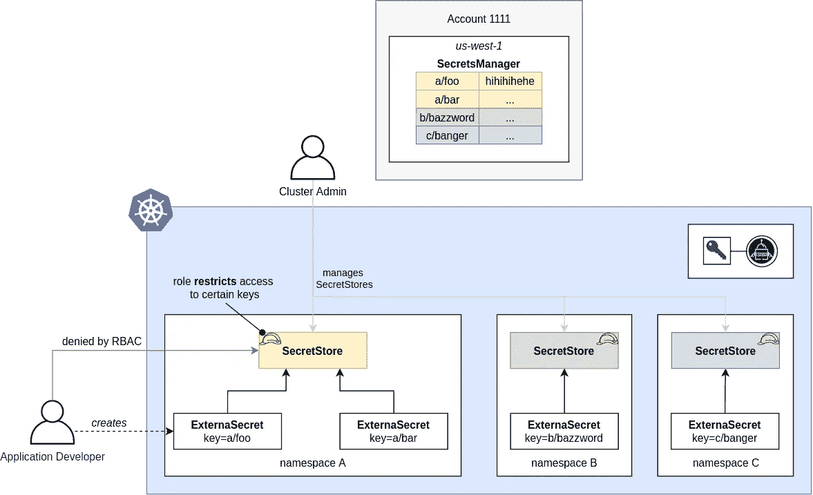

# 金融服务业三大 kubernetes 平台建设后的观察与思考(二)

> 原文：<https://itnext.io/observations-and-thoughts-after-building-3-kubernetes-platforms-in-financial-services-industry-158eba494528?source=collection_archive---------2----------------------->

在这个博客系列的第二部分，分享我对工作负载标识的使用以及如何根据我在 3 个 Kubernetes 平台上为我们的客户管理秘密的经验的观察。

# 工作负载身份

Kubernetes 使用服务帐户来表示工作负载。这些帐户仅在集群范围内可见，不与外部系统联合/集成。

在 Kubernetes 上运行的工作负载通常需要与外部云服务进行交互，例如 Bucket/Blob 存储、SQL 实例、密钥存储。为了允许使用目标服务对工作负载进行身份验证和授权，可以将一个身份(服务主体、服务帐户)附加到您的工作负载 pod。从而将 kubernetes 帐户连接到提供者的身份后端。

作为一等公民，GKE 在这一领域表现出色。AKS 有一个名为 AAD Pod Identity 的开源插件，直到今年 1 月 1 日。这是一个很难管理的组件。令人欣慰的是，微软现在已经取代了它的 AAD 工作负载身份(仍在预览版)。

主要经验教训:

*   每当工作负载需要与云服务交互时，使用工作负载标识。它避免了需要轮换帐户密钥或其他共享秘密。
*   工作负载身份是 GKE 的核心，并成为 AKS 上的黄金时段(我从同事那里听说过在 AKS 上使用工作负载身份的好消息)

# 秘密管理/外部化

多租户—每个名称空间有一个 SecretStore 的外部机密

在与受监管的组织打交道时，秘密管理总是一个热门话题。他们经常被“秘密是用 Base64 编码的”所困扰，看不到这一点，并立即想将秘密具体化。只是为了将它们与 Kubernetes 同步到“etcd 中的 base64”。

> *向客户解释 kubernetes 秘密的 base64 编码和静态数据加密背后的原因总是一件有趣的事情。*

为了解决“base64 崩溃”，GKE 提供了存储在 etcd (BYOK 或谷歌管理的密钥)中的数据的应用层加密作为核心功能。AKS 终于添加了 KMS etcd 加密(似乎是在最近 2 个月)。

现在来说说秘密外化吧！在过去的三年里，这个领域有了巨大的发展。当时，还没有让安全团队感到惊讶的多租户友好解决方案。这导致组织构建定制解决方案(不推荐)。快进到今天，有大量的选项可用，如外部秘密，标准操作程序，哈希公司保险库代理注射器(VAI)。我个人的选择是外部秘密。它涵盖了所有常见的 secret 后端，并支持开箱即用的多租户(每个租户配置自己的 secret store)。警告，有个比较老的项目叫 *Kubernetes 外秘*；离远点。我还发现 HashiCorp VAI 作为最终用户使用起来很糟糕(尽管运行时注入比同步更好)。

主要经验教训:

*   准备好解释 base64 编码，并将其与实际的静态加密分离开来
*   秘密外化现在盛行。解决方案要么将秘密同步到 kubernetes 中，要么在实例化时将它们注入到工作负载中。
*   [ExternalSecrets](https://external-secrets.io/v0.5.9/) 是这个领域的绝对赢家。
*   不要定制！有很多比我们聪明得多的公司/项目已经解决了这个问题。