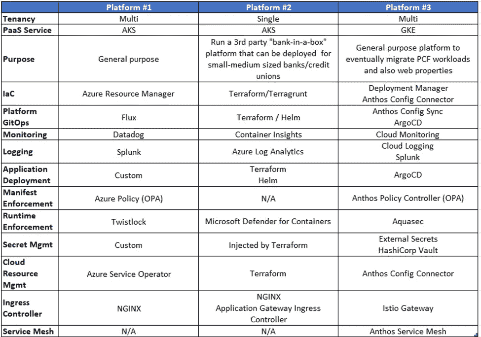

# 金融服务业三大 kubernetes 平台建设后的观察与思考(一)

> 原文：<https://itnext.io/observations-and-thoughts-after-building-3-kubernetes-platforms-in-financial-services-industry-6705511c8e9b?source=collection_archive---------0----------------------->

上周，我在加拿大完成了另一项金融服务/银行业的咨询任务。这结束了我的第三平台构建，以 Kubernetes 为基础。这些平台可以概括为:

平台摘要

整个周末，我都在反思这些平台，并开始思考这个领域在过去 3 年多的时间里发生了多少变化。我还反思了我看到和使用的工具(好的/坏的/难看的)以及在这些平台构建过程中做出的决策。

随着我在平台构建之间的进展，我努力确保过去的错误不会重演。我还专注于扩展在之前的迭代中没有做的事情，以扩展我在这个领域的技能(考虑到我在开始第一次构建时在 Kubernetes 中没有任何经验)

在这个博客系列中，我将分享我对各个领域的观察和思考。我的观察将通过高度监管的行业和大型组织(加拿大五大)的经验来进行。

第 1 部分(本条目)

*   Kubernetes PaaS 平台
*   网络管理
*   入口控制器

第二部分

*   工作负载身份
*   秘密管理、静态加密和外部化

第三部分

*   GitOps 工具
*   云资源管理/资源代理

# Kubernetes 平台

云服务提供商(CSP)将 Kubernetes 打包到 PaaS 产品中，并将其集成到他们的生态系统中。在与 AKS 和 GKE 合作后，我发现这两家供应商都跟上了上游的步伐，而且 AKS 发布新版本的速度更快一些。

CSP 提供身份和 RBAC(云身份，AAD)、网络(网络策略、CNI、伪装、出口管理)、入口(L7 负载平衡)和其他插件等集成。

AKS 倾向于从开源产品开始，一直保持这种状态，直到最终决定集成为附加产品(AAD Pod 身份和应用程序网关入口控制器)，而 GKE 则提前采取了集成方法。我更喜欢后一种方法，因为它感觉更好并且提供了支持。

# 网络管理

Kubernetes 改变了处理工作负载的模式。在 Kubernetes 之前，工作负载保持相当静态的地址，L4 防火墙是控制流量的方法。在 Kubernetes 中，工作负载现在是短暂的和可移植的，因此使得 L4 控制近乎过时。

> 然而，组织还没有完全接受在 L4 放弃控制权以获得更高级别的控制权。

在 Kubernetes 中，当流量在集群中时，网络策略通过使用标签来控制流量源/目标，从而帮助控制 L4 的流量。管理进出集群的流量必须借助 L4 防火墙，如果你喜欢冒险，还可以借助服务网格。

为工作负载的每个实例生成 IP 地址需要比常规虚拟机工作负载更大的 IP 空间。

> 许多组织努力寻找足够的地址空间来满足 pod 寻址需求。

IP 伪装(将 pod 范围隐藏在节点 IP 后面)和对 pod 使用 RFC6598 范围有助于缓解这一挑战。这种方法在 GKE 特别有效。

# 入口控制器

许多 Kubernetes 工作负载都暴露在 TLS/HTTPS 上。向客户端公开它们需要结合使用 L7 负载平衡器和入口控制器(最常见的模式)。

入口控制器是监控入口配置并将该配置转换为 L7 服务配置的运营商，如 nginx、HTTPS 负载平衡器(GCP)、应用网关(Azure)等。也就是说，并非所有入口控制器都是相同的。

Nginx 是最受欢迎的 L7 负载平衡器之一，它的使用已经很成熟了。然而，要利用高级功能，你必须付费订阅 nginx+(我没有用过)。

在 PaaS Kubernetes 中执行 L7 负载平衡时，通常使用云提供商集成。例如，AKS 拥有*应用网关入口控制器(AGIC)* ，它控制着来自 Kubernetes 的 Azure 应用网关(AppGw)。就我个人而言，我发现这种解决方案非常有限，性能也很差(入口配置可能需要 60 秒才能在 AppGw 中反映出来)。更新&修复 AGIC 有一个漫长的发布周期&缓慢推出。此外，针对项目记录的问题数量正在增加。TLDR:我不推荐 AGIC，这很遗憾，因为现在你失去了利用 AppGW 的网络应用防火墙和其他安全功能的能力。

最后，我最近使用了 Istio 入口控制器。Istio 引入了额外的资源，如*虚拟服务*和*目的规则*，这些资源现在扩展了 ingress 的功能，远远超出了基本 ingress 控制器的功能。我不会在这里深入研究服务网格能力…但是这为一个巨大的特性集打开了大门。总的来说，我对入口控制器非常满意。

为了结束这个主题，我们必须讨论 TLS 证书的使用。对入口控制器使用通配符证书是相当常见的。

> 组织不赞成使用通配符证书；但是也没有简单的解决方案来避免它们的使用

然而，这些组织也还没有准备好/能够在每个工作量的基础上即时颁发证书。当您的工作负载短暂且可移植时，这是一个要求。

证书生成仍然是一个复杂的手动过程，并且由服务请求和批准来处理。虽然像 cert-manager(开源 kubernetes 工具)和 GCP 上的 Certificate Authority Service 这样的工具简化了这项任务，但是管理证书颁发机构和证书生成的团队还没有朝着自动化的方向前进。

主要观察结果:

*   并非所有入口控制器都是相同的
*   NGINX 是一个被移植到 kubernetes 的成熟的国王
*   Istio 入口控制器是一把瑞士刀，功能齐全
*   自动化是关键—对于组织来说，证书集成仍然很困难。利用工具，如证书管理器和认证机构服务是必须的。