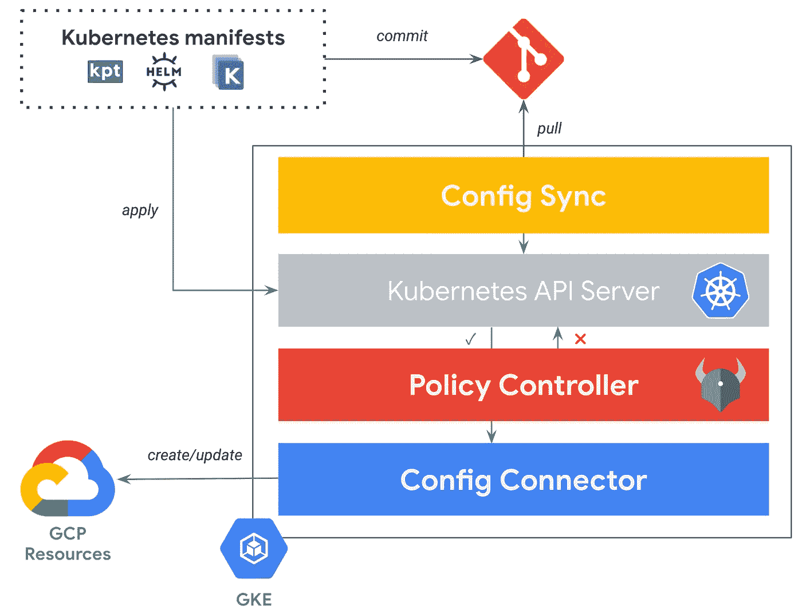

# 金融服务行业三大 kubernetes 平台建设后的观察与思考——第五部分——云资源代理

> 原文：<https://itnext.io/observations-and-thoughts-after-building-3-kubernetes-platforms-in-financial-services-industry-b6404baf9ce3?source=collection_archive---------7----------------------->

在这个博客系列的第五部分也是最后一部分，我将分享我在云资源代理领域的观察(从 Kubernetes 部署云资源。

以前的零件:

*   [第 1 部分](/observations-and-thoughts-after-building-3-kubernetes-platforms-in-financial-services-industry-6705511c8e9b) —概述，K8s 平台即服务产品，网络
*   [第二部分](/observations-and-thoughts-after-building-3-kubernetes-platforms-in-financial-services-industry-158eba494528) —工作负载身份、秘密管理/外部化
*   [第三部](/observations-and-thoughts-after-building-3-kubernetes-platforms-in-financial-services-industry-7d6c60206717) — GitOps
*   [第 4 部分](/observations-and-thoughts-after-building-3-kubernetes-platforms-in-financial-services-industry-e8bb24e381a2) —政策实施

配置连接器

# 云资源管理/资源代理

您知道现在可以部署云资源了吗？AKS 和 GKE 都有使用 YAML 部署云资源的工具。AKS 有 Azure 服务运营商，GKE 有 Anthos 配置连接器。这些工具遵循操作者模型，在该模型中，您提供一个资源声明，操作者去部署它，并确保它保持在期望的状态(从而解决配置漂移)

像任何东西一样，它是你可以使用的工具。它确实需要为多租户环境进行配置和强化。这类工具通常只与您的 CSP 资源交互；所以如果你需要将秘密外化到 Vault，那就靠你自己了。此外，部署基础设施现在正在迅速扩展，不仅仅是与 CSP 接口，还必须与拥有 API 的系统接口。这使得 Kubernetes 云资源管理成为另一个“孤岛”,您需要将其粘合到管道中。

根据我的经验，当您有非常基本的需求并且您的范围完全在 CSP 内时，从 Kubernetes 部署云资源效果很好。

有了 Terraform 这样的工具，我发现很难证明投资 Kubernetes 作为云资源管理解决方案是合理的。尤其是当您需要嵌入意见来创建可重用的部署工件时，或者当您想要进行重要的组合时。

当我使用 Azure Service Operator 时，它的成熟度还相当低(2.5 年前)。然而，它有一些增值功能，你通常必须自己构建，如数据库上的凭证轮换和在 AKV 中保存凭证。我参与的不够多，无法进行全面的评估……我确信从那以后，它已经发生了显著的变化。

在 GKE 上，Anthos Config Connector (ACC)可以作为托管服务或独立组件进行部署。请注意，ACC 版本与 GKE 版本相关联；因此，您必须使用最新的 GKE 版本来利用修复，这对于每年升级 Kubernetes 的组织来说是不成立的。谷歌正在推动客户远离部署管理器，除了 Terraform(后者更好)，ACC 也是推荐的目标之一。

主要观察结果:

*   Kubernetes 的云资源管理/资源代理价值有限
*   如果您需要在 CSP 之外进行集成，这种方法是不够的
*   如果您需要构建复杂的基础设施，这种方法是不够的
*   ACC 的变化速度比 GKE 快得多，它们的生命周期应该分离！