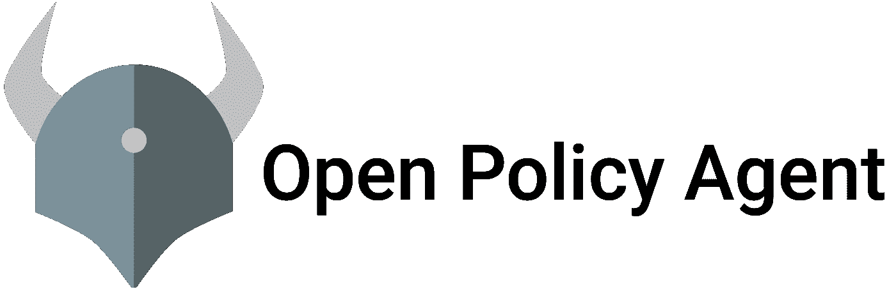

# 金融服务行业三大 kubernetes 平台建设后的观察与思考——第四部分——政策执行

> 原文：<https://itnext.io/observations-and-thoughts-after-building-3-kubernetes-platforms-in-financial-services-industry-e8bb24e381a2?source=collection_archive---------1----------------------->

在这个博客系列的第四部分中，我分享了我在策略执行领域的观察。

以前的零件:

*   [第 1 部分](/observations-and-thoughts-after-building-3-kubernetes-platforms-in-financial-services-industry-6705511c8e9b) —概述，K8s 平台即服务产品，网络
*   [第二部分](/observations-and-thoughts-after-building-3-kubernetes-platforms-in-financial-services-industry-158eba494528) —工作负载身份、秘密管理/外部化
*   [第三部](/observations-and-thoughts-after-building-3-kubernetes-platforms-in-financial-services-industry-7d6c60206717) — GitOps

OPA 标志

# 政策实施

策略执行和控制管理是在监管环境中构建安全 Kubernetes 平台的一个关键领域。有一整套开源工具(OPA Gatekeeper、Kyverno、Trivy、Falco)和付费解决方案(Aquasec、Twistlock)。这个解决方案还远未完成；请随意查看 CNCF 解决方案地图。

我的第一个观察是组织努力选择一个工具；他们想要全部。我建议从需求矩阵开始，根据需求调整工具。选择最佳匹配。

> *避免在同一控制空间重叠多个工具。*

您将会以重复的控制(努力)或实现中的差异而告终，导致用户的失望(系统 X 拒绝我错误 X，系统 Y 拒绝我错误 Y，等等；导致被千刀万剐而死)。

受监管的环境喜欢购买工具；尤其是在安全领域。Aquasec 和 Twistlock 是非常成熟的工具，涵盖了大量的控件。我认为这个领域已经饱和&成熟；因此，两者对你都有好处。然而，组织购买了工具，但是没有花费足够的精力来制度化和操作化它们。这些工具和你管理它们的努力一样有用。云提供商正在通过向基础平台添加越来越多的控制来慢慢蚕食这一领域。最好的例子是[微软容器防御者](https://docs.microsoft.com/en-us/azure/defender-for-cloud/defender-for-containers-introduction)。

OPA Gatekeeper 等开源工具已经成熟；但是需要专门的开发技能。用减压阀语制定政策并不适合所有人。云提供商通常会提供一个策略库，您可以引导您的平台控件。但是，迟早您需要创建自己的策略。这意味着建立开发生命周期、策略测试和发布管理。如果您的安全团队没有软件开发技能，这将是采用的一个重大障碍。

最后，云提供商通常会在这一领域增加价值:

*   Azure 策略提供单一窗格来查看 OPA 网关守护设备审核结果和集中管理
*   OPA Gatekeeper 是两个平台中的托管服务(GKE 上的 Anthos 策略控制器，AKS 上的 Azure 策略)。两者都提供了一组基本的策略供使用。

主要观察结果:

*   这是一个购买超过建设可能是更好的选择的领域
*   买一个工具还不够；像任何技术一样，它需要呵护和喂养
*   您将需要多种工具来涵盖整个范围；避免重叠。在有重叠的地方，为问题选择一个工具，避免重复。
*   向您的租户公开结果。中央小组没有时间去追逐一切。向左转，把责任放在可以解决问题的地方。
*   纵深防御很重要
*   有技巧的话，看看 OPA & Kyverno。在制定新策略之前，请务必查看现有的库。