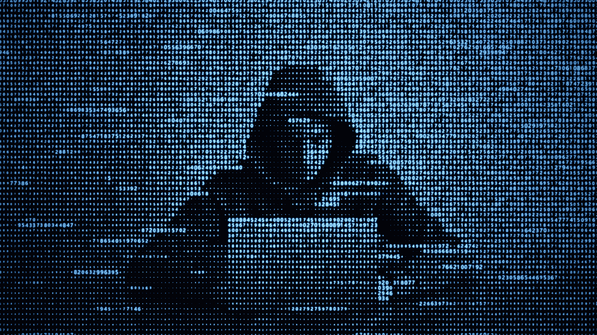

# 网络骗子和欺诈者的心理

> 原文：<https://itnext.io/observations-on-internet-scammers-and-frauds-20fe272dbee?source=collection_archive---------4----------------------->

我想先说一句，我没有受过正规的心理学教育，也不指望自己的发现 100%准确。我开始这个项目是出于对隔离初期的兴趣。我想有些人可能对我的观点感兴趣。我意识到我才 17 岁，对这个世界还有很多要学；这只是朝着这个方向迈出的一步。

去年，我对在线欺诈行业及其内部运作做了相当广泛的研究。虽然最初我对手机机器人非常感兴趣，但我的大部分研究最终围绕着导致人们犯下这些罪行的心理学展开。最初，我对这些人为什么以这种方式经营有一个非常简单的看法，认为这可能是一种异常的无知或对金钱的渴望。然而，当我开始做越来越多的研究时，我发现这个行业中的许多人实际上是相当普通的人，有家庭和孩子。这种认识让我花了将近一年的时间和各种各样的人谈论他们的道德观和人生观。在这篇文章中，我将打破一个基本的刻板印象，以及在线欺诈行业中人们的共同想法。

我想打破的第一个常见误解是，这些行业的人都是反社会的。虽然很容易看到他们的行为(偷信用卡，从无辜的人那里拿钱)并说这些人是恶意的，但我不同意这种假设。事实上，我发现这些人中的许多人非常清楚他们行为的后果，并且关心他们所影响的人。

我发现的一个相关的例子是一个叫做“b4u”(为你购买)的东西。在这种“服务”中，人们通常使用偷来的 Doordash、Ubereats 或 Postmates 账户，并收取少量费用为人们点餐。不言而喻，这是一件非常令人发指的事情，因为你剽窃了账户所有人。然而，我发现很多服务都有司机小费保证。尽管他们最初的选择很糟糕，但他们仍然希望确保司机能从他们的服务中得到小费。这显然不能补救这种情况，但至少显示了某种道德指南针。

我发现的另一个例子是一个礼品卡销售者，出于显而易见的原因，我不会说出他的名字。整个 12 月，他有一个特别的地方，如果有人能证明他们正在向无家可归者收容所捐款，他会提供尽可能多的偷来的礼品卡，以满足收容所的需求。当他从无辜的人那里偷走这些购物卡的时候，他也把这些钱重新分配给了大多数人认为是好的事业。不管你认为这是对还是错，很明显，这些人中的一些人是有道德的。话虽如此，我发现我有责任去了解这种不平衡的道德罗盘从何而来。

我的第一个观察是，这些骗子中有许多来自美国东部或英国。我发现这很有趣，并决定在纽约和费城等地深入了解骗子文化，这些地方是这些人的聚居地。通过进一步研究，我注意到的第一件事是，像纽约和费城这样的地方总是有大量的“骗子”和帮派人口。自 20 世纪 70 年代以来，令人难以置信的是，这两个城市都有帮派和犯罪问题。看到这里，我的第一反应是这是一个贫困问题。然而，一些观察阻止了我走这条路。如果这是一个贫困问题，大多数专家认为这是帮派的根本原因，为什么“帮派”不把他们的行动 100%转移到网上？虽然我能够在网上找到一些犯罪集团的例子，但我无法看到帮派的代表。这是当我意识到，这是相当于帮派，但更多的经济优势的人意识到帮派活动的危害。换句话说，这是一种新形式的帮派，纽约的普通中年白人男子都可以加入，而不用担心会失去生命。

意识到这一点后，我开始思考在纽约和整个东北部的历史上还有哪些帮派和诈骗活动。答案很简单，我差点错过了，暴民。几十年来，黑手党控制了纽约，贿赂警察，赚了大量的钱，并开创了欺诈行业。当我意识到这一点时，我立即去了我经常光顾的论坛，并注意到大多数用户都有像《教父》这样的电影中暴徒的个人资料照片。这些人崇拜暴徒和黑手党的生活方式。在这种偶像化中，他们找到了通往互联网黑暗部分的道路，做着诸如出售人们的信用卡之类的事情。

我发现的下一件事是，许多人的智力高于平均水平，他们觉得自己没有受到周围世界的刺激。他们通常对迷幻药、冥想、举重和大麻感兴趣。很多时候，当我进入这些聊天室时，他们会谈论他们使用什么运动前补充剂，甚至他们的饮食计划。这完全打破了我所期望的刻板印象；这些人的生活远离了欺诈。通常，许多人认为这些网络诈骗犯是被社会抛弃的“失败者”。虽然有些是，但大多数实际上是相当普通的人；他们有工作，有孩子，有妻子，只是在错误的道路上徘徊。

我观察到的另一个现象是，他们经常认为自己是“好人”，是那些把财富重新分配给理应得到财富的人的人。他们用诸如“这只会伤害银行”或“亚马逊可以因为像****一样对待他们的员工而受到 1000 美元的打击”这样的陈述来证明他们的行为。在我看来，这种对邪恶的辩护是我们大脑运作的基本部分。当我们做坏事或坏事时，我们的大脑不会认为我们做的事情很糟糕，而是更愿意保持舒适，并找到我们的行为实际上是好的方式。虽然这在一些规则不公平的地方可能是有益的，但在这些情况下对数百万普通人是有害的。

到目前为止，我们知道这些人通常是普通人，他们已经理想化了黑帮的生活方式，或者正在寻找一种方式来参与类似黑帮的活动，而没有黑帮带来的风险。接下来，我想谈谈网上欺诈情报，这是我前面稍微提到过的。

我的第一直觉是，这些人可能会降到平均智力水平，因为他们看不到自己行为的真正后果。然而，当我意识到他们实际上**确实**看到了这些后果时，我不得不重新思考我最初假设的这一方面。仅仅通过互联网很难看出他们到底有多聪明，所以我转而询问一些人他们以什么为生(这通常至少与智力有一些关联)。这个结果实际上让我非常震惊。在我询问的 47 人中，22 人在 IT 领域工作，13 人是没有工作的学生，2 人是律师，其余 12 人出于隐私原因不会说。这可能是我“研究”中最奇怪的部分。我从来没有想到两个最著名的网络诈骗犯在现实生活中竟然是律师。认为律师，那些被期望完全了解法律的人，会如此不小心地违反法律，这几乎是矛盾的。想想你的离婚律师，你最好的朋友，甚至是工作中的 IT 人员都可能是网络犯罪的主谋，这几乎是电影中的情节。具有讽刺意味的是，我认为这就是让这些人进入这个行业的原因，成为罗宾汉的想法。

如果有的话，我想这篇文章鼓励更多的同情和怜悯那些在网络犯罪空间。虽然这一声明可能会让一些人回头，但我认为它比我们目前的论述更有成效。在我看来，这些人越被视为像你我一样的人，他们就越不会进一步陷入网络犯罪。确保检查你的朋友和家人，如果你知道有人掉进这个兔子洞，鼓励他们改变。

如果您对本文有任何反馈或问题或顾虑，请随时在 twitter @ [Al3x9a](https://medium.com/u/ee2bf2b32512?source=post_page-----20fe272dbee--------------------------------) 上联系我。我确信我误解了某些行为和这些行为的原因，或者错过了某些事情，希望听到反馈。