# 观察亚马逊 EKS 上运行 Istio 的基于 gRPC 的微服务

> 原文：<https://itnext.io/observing-grpc-based-microservices-on-amazon-eks-running-istio-77ba90dd8cc0?source=collection_archive---------0----------------------->

## 使用 Jaeger、Zipkin、Prometheus、Grafana 和 Kiali 在运行 Istio 服务网格的亚马逊 EKS 上观察基于 gRPC 的 Kubernetes 应用程序

在之前的两篇文章中，[基于 Kubernetes 的带有 Istio 服务网格的微服务可观察性](/kubernetes-based-microservice-observability-with-istio-service-mesh-part-1-of-2-19084d13a866)，我们探索了一套流行的开源可观察性工具，可以轻松地与 Istio 服务网格集成。这些工具包括用于分布式事务监控的 **Jaeger** 和 **Zipkin** ，用于指标收集和警报的 **Prometheus** ，用于指标查询、可视化和警报的 **Grafana** ，以及用于 Istio 整体可观察性和管理的 **Kiali** 。我们完善了工具集，添加了用于日志处理和聚合的 **Fluent Bit** 到**Amazon cloud watch Container Insights**。我们使用这些工具观察了一个部署在**亚马逊弹性 Kubernetes 服务(亚马逊 EKS)** 集群上的分布式、基于微服务的 RESTful 应用程序。运行在 EKS 上的应用平台使用亚马逊文档数据库作为持久数据存储，使用亚马逊 MQ T21 来交换消息。

[](/kubernetes-based-microservice-observability-with-istio-service-mesh-part-1-of-2-19084d13a866) [## 基于 Kubernetes 的 Istio 服务网格的微服务可观测性:第 1 部分，共 2 部分

### 用 Istio 在亚马逊 EKS 上用 Jaeger，Prometheus，Grafana，Kiali，Fluent Bit 观察一个分布式系统…

itnext.io](/kubernetes-based-microservice-observability-with-istio-service-mesh-part-1-of-2-19084d13a866) 

在这篇文章中，我们将研究这些相同的可观察性工具来监控另一组基于 Go 的微服务，这些微服务使用[协议缓冲区](https://developers.google.com/protocol-buffers)(又名 *Protobuf* )通过 [gRPC](https://grpc.io/) (gRPC 远程过程调用)和 [HTTP/2](https://en.wikipedia.org/wiki/HTTP/2) 进行客户端-服务器通信，而不是更常见的 RESTful JSON over HTTP。我们将了解 Kubernetes、Istio 和 observability 工具如何与 gRPC 无缝协作，就像它们在亚马逊 EKS 网站上与 JSON over HTTP 的协作一样。

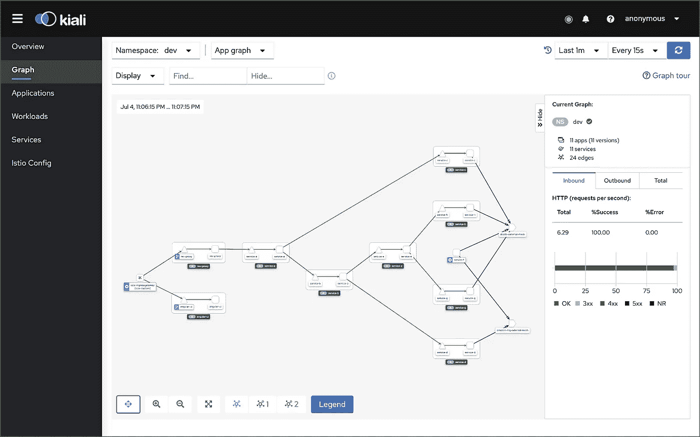

Kiali 管理控制台展示了基于 gRPC 的参考应用平台

# 技术

## gRPC


根据 [gRPC 项目](https://grpc.io/)，gRPC 是一个现代开源的高性能[远程过程调用](https://en.wikipedia.org/wiki/Remote_procedure_call) (RPC)框架，可以在任何环境下运行。借助对负载平衡、跟踪、运行状况检查和身份验证的可插拔支持，它可以高效地连接数据中心内和数据中心间的服务。gRPC 也适用于分布式计算的最后一英里，将设备、移动应用程序和浏览器连接到后端服务。

gRPC 最初是由谷歌创建的，十多年来，谷歌一直使用一个名为 Stubby 的通用 RPC 基础设施来连接其数据中心内和数据中心间运行的大量微服务。2015 年 3 月，谷歌决定打造 Stubby 的下一个版本，并将其开源。gRPC 现在在 Google 之外的许多组织中使用，包括 Square、网飞、CoreOS、Docker、CockroachDB、Cisco 和 Juniper Networks。gRPC 目前[支持十多种语言](https://grpc.io/docs/#official-support)，包括 C#、C++、Dart、Go、Java、Kotlin、Node、Objective-C、PHP、Python 和 Ruby。

根据婉如·费南多发布的被广泛引用的 2019 年测试,“gRPC 在接收数据时大约比 REST 快 7 倍&在发送该特定有效载荷的数据时大约比 REST 快 10 倍。这主要是由于协议缓冲区的紧密打包和 gRPC 对 HTTP/2 的使用。

## 协议缓冲区


使用 gRPC，您可以使用[协议缓冲区](https://developers.google.com/protocol-buffers)(又名 *Protobuf* )来定义您的服务，这是一个强大的二进制序列化工具集和语言。根据谷歌的说法，协议缓冲区是谷歌的语言中立、平台中立、可扩展的序列化结构化数据的机制——想想 XML，但更小、更快、更简单。Google 之前的文档声称协议缓冲区比 XML 小 3 到 10 倍，快 20 到 100 倍。

一旦您定义了您的[消息](https://developers.google.com/protocol-buffers/docs/overview#simple)，您就可以在您的`.proto`文件上运行针对您的应用程序语言的协议缓冲编译器来生成数据访问类。在`proto3`语言版本中，协议缓冲区目前支持 Java、Python、Objective-C、C++、Dart、Go、Ruby 和 C#中的生成代码，未来还会支持更多语言。在这篇文章中，我们已经为 [Go](https://github.com/protocolbuffers/protobuf-go) 编译了 protobufs。你可以在 Google 的[开发者门户](https://developers.google.com/protocol-buffers/docs/encoding)上阅读更多关于 Protobuf 的二进制 wire 格式。

# 参考应用平台

为了演示可观察性工具的使用，我们将在 AWS 上为亚马逊 EKS 部署一个参考应用程序平台。开发应用程序平台是为了展示不同的 Kubernetes 平台，如 EKS、GKE、AKS，以及服务网格、API 管理、可观察性、CI/CD、DevOps 和混沌工程等概念。该平台包括八个基于 Go 的微服务的后端，一般标记为服务 A-服务 H，一个基于 Angular 12 TypeScript 的前端 UI，一个基于 Go 的 gRPC 网关反向代理，四个 MongoDB 数据库和一个 RabbitMQ 消息队列。


参考应用平台的基于角度的用户界面

参考应用程序平台旨在生成基于 gRPC 的同步服务到服务 IPC(进程间通信)、基于异步 TCP 的服务到队列到服务通信以及基于 TCP 的服务到数据库通信。比如服务 A 调用服务 B 和服务 C；服务 B 调用服务 D 和服务 E；服务 D 向 RabbitMQ 队列发送一条消息，服务 F 使用这条消息并将其写入 MongoDB，依此类推。当应用程序被部署到运行 Istio 服务网格的 Kubernetes 集群时，可以使用 observability 工具来观察平台的分布式服务通信。

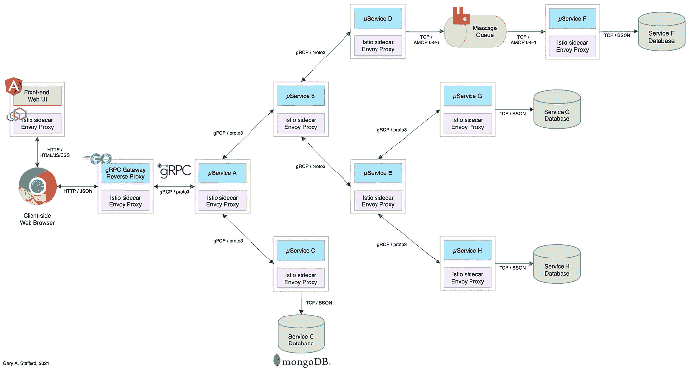

基于 gRPC 的参考应用平台的高层架构

# 转换为 gRPC 和协议缓冲区

在这篇文章中，八个 Go 微服务被修改为使用带有 HTTP/2 上的[协议缓冲区](https://developers.google.com/protocol-buffers/)的 [gRPC](https://grpc.io) ，而不是 HTTP 上的 JSON。具体来说，服务使用版本 3(又名 *proto3* )的协议缓冲区。使用 gRPC，gRPC 客户端调用 gRPC 服务器。该平台的一些服务是 gRPC 服务器，另一些是 gRPC 客户端，还有一些同时充当客户端和服务器。

## gRPC 网关

在上面修改后的平台架构图中，注意添加了 [gRPC 网关反向代理](https://github.com/grpc-ecosystem/grpc-gateway)，它取代了 API 边缘的服务 A。该代理将 RESTful HTTP API 转换为 gRPC，位于基于 Angular 的 Web UI 和服务 a 之间。为了演示起见，假设大多数 API 消费者需要 RESTful JSON over HTTP API，我们已经为该平台添加了一个 gRPC 网关反向代理。gRPC 网关代理基于 HTTP 的客户机上的 JSON 和基于 gRPC 的微服务之间的通信。gRPC 网关有助于同时提供 gRPC 和 RESTful 风格的 API。

来自 [grpc-gateway](https://github.com/grpc-ecosystem/grpc-gateway) GitHub 项目网站的图表展示了反向代理是如何工作的。

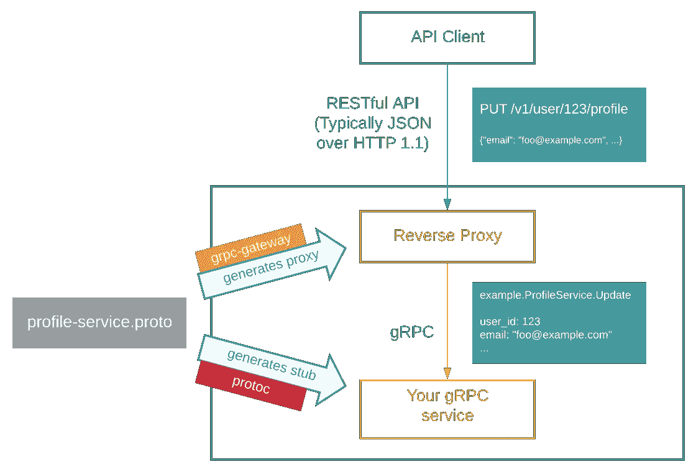

*图礼貌:*[*https://github.com/grpc-ecosystem/grpc-gateway*](https://github.com/grpc-ecosystem/grpc-gateway)

## gRPC 网关的替代方案

作为 gRPC 网关反向代理的替代方案，我们可以将基于 TypeScript 的 Angular UI 客户端转换为通过 gRPC 和 protobufs 进行通信，并直接与服务 a 进行通信。实现这一点的一个选项是 [gRPC Web](https://github.com/grpc/grpc-web) ，这是一个针对浏览器客户端的 gRPC JavaScript 实现。gRPC Web 客户端通过一个特殊的代理连接到 gRPC 服务，默认情况下是 Envoy。该项目的路线图包括 gRPC Web 在特定于语言的 Web 框架中得到支持的计划，这些语言包括 Python、Java 和 Node。

# 示范

为了继续这篇文章的演示，请回顾上一篇文章第一部分中详细介绍的安装说明，使用 Istio 服务网格部署和配置亚马逊 EKS 集群、Istio、亚马逊 MQ 和 DocumentDB。为了加速将修改后的基于 gRPC 的平台部署到`dev`名称空间，我在项目中包含了一个舵图`ref-app-grpc`。使用这个图表，您可以忽略前一篇文章中提到的将资源部署到`dev`名称空间的任何说明。参见图表的[自述文件](https://github.com/garystafford/k8s-istio-observe-backend/blob/2021-istio/helm/ref-app-grpc/README.md)获取进一步说明。

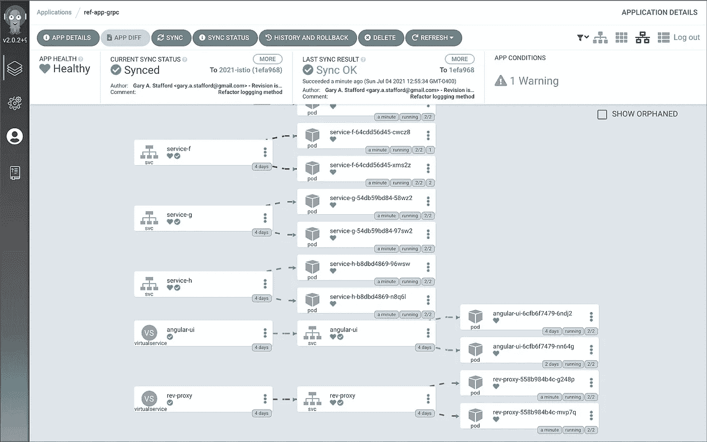

从 [Argo CD](https://argoproj.github.io/argo-cd/) 看部署的基于 gRPC 的参考应用平台

## 源代码

基于 gRPC 的微服务源代码、Kubernetes 资源和 Helm chart 位于`2021-istio`分支的[k8s-istio-observe-back end](https://github.com/garystafford/k8s-istio-observe-backend)项目存储库中。

[](https://github.com/garystafford/k8s-istio-observe-backend) [## garystafter/k8s-istio-observe-back end

### 两篇博文的源代码，基于 Kubernetes 的带有 Istio 服务网格的微服务可观察性。请参见…

github.com](https://github.com/garystafford/k8s-istio-observe-backend) 

这个项目存储库是您在这个演示中需要的唯一源代码。

```
git clone --branch 2021-istio --single-branch \
  [https://github.com/garystafford/k8s-istio-observe-backend.git](https://github.com/garystafford/k8s-istio-observe-backend.git)
```

可选地，基于角度的 web 客户端源代码位于新的`2021-grpc`分支上的[k8s-istio-observe-frontend](https://github.com/garystafford/k8s-istio-observe-frontend/tree/2021-grpc)存储库中。源 protobuf `.proto`文件和 buf 编译的 protobuf 文件位于 [pb-greeting](https://github.com/garystafford/pb-greeting) 和 [protobuf](https://github.com/garystafford/protobuf) 项目存储库中。对于本文的演示，您不需要克隆任何这些项目。

[](https://github.com/garystafford/k8s-istio-observe-frontend/tree/2021-grpc) [## garystafter/k8s-istio-observe-frontend

### 两篇博文的源代码，基于 Kubernetes 的带有 Istio 服务网格的微服务可观察性。

github.com](https://github.com/garystafford/k8s-istio-observe-frontend/tree/2021-grpc) [](https://github.com/garystafford/pb-greeting) [## garystafter/Pb-问候语

### 参考应用平台的协议缓冲区(Protobuf)文件，在 Istio observability 演示博客文章中使用。

github.com](https://github.com/garystafford/pb-greeting) [](https://github.com/garystafford/protobuf) [## garystafter/proto buf

### Protobuf 主库。

github.com](https://github.com/garystafford/protobuf) 

服务、UI 和反向代理的所有 Docker 映像都来自于 [Docker Hub](https://hub.docker.com/search?q=%22garystafford&type=image&sort=updated_at&order=desc) 。

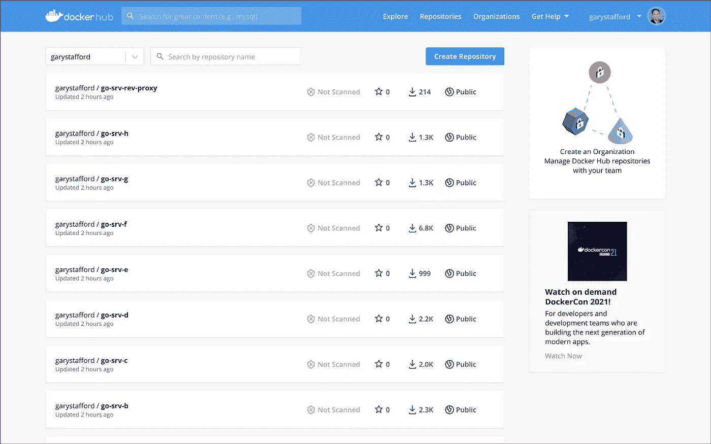

这篇文章的所有图片都位于 [Docker Hub](https://hub.docker.com/search?q=%22garystafford&type=image&sort=updated_at&order=desc)

# 代码更改

虽然这篇文章不是专门讨论为 gRPC 和 protobuf 编写 Go 的，但是为了更好地理解这些技术的可观测性需求和功能，与之前的基于 HTTP 的 JSON 服务相比，回顾一下代码变化是有帮助的。

## 微服务

首先，将下面显示的[服务 A](https://github.com/garystafford/k8s-istio-observe-backend/blob/2021-istio/services/protobuf-grpc/service-a-grpc/main.go) 的修订源代码与前一篇文章中的[原始代码](https://github.com/garystafford/k8s-istio-observe-backend/blob/2021-istio/services/json-rest/service-a/main.go)进行比较。该服务的代码几乎完全重写。例如，请注意服务 A 的以下代码更改，它与其他后端服务同义:

*   导入 [v3 greeting protobuf](https://github.com/garystafford/protobuf/tree/main/greeting/v3) 包；
*   本地问候语结构被替换为`pb.Greeting`结构；
*   所有服务现在都托管在端口`50051`上；
*   HTTP 服务器和所有 API 资源处理函数都被删除；
*   用于分布式跟踪的标头已从 HTTP 请求对象移动到在 gRPC `Context`类型中传递的元数据；
*   服务 A 既是 gRPC 客户端又是服务器，由 gRPC 网关反向代理调用；
*   主要的`GreetingHandler`函数被 protobuf 包的`Greeting`函数取代；
*   gRPC 客户端，比如服务 A，使用`CallGrpcService`函数调用 gRPC 服务器；
*   CORS 处理从服务中卸载到 Istio
*   记录方法基本没有变化；

修订的基于 gRPC 的服务 A 的源代码:

## 问候协议缓冲区

下面显示的是问候 v3 协议缓冲区`.proto`文件。最初在基于 RESTful JSON 的服务中被定义为结构的`Greeting`中的字段基本上保持不变，然而，我们现在有了一个[消息](https://developers.google.com/protocol-buffers/docs/overview)——包含一组类型化字段的集合。`GreetingRequest`由单个`Greeting`消息组成，而`GreetingResponse`消息由多个`repeated` ) `Greeting`消息组成。服务在其请求中传递一个`Greeting`消息，并接收一个由一个或多个消息组成的数组作为响应。

protobuf 是用流行的基于 Go 的协议编译器工具 [Buf](https://buf.build/) 编译的。使用 Buf，生成四个文件:Go、Go gRPC、gRPC Gateway 和 Swagger (OpenAPI v2)。

```
.
├── greeting.pb.go
├── greeting.pb.gw.go
├── greeting.swagger.json
└── greeting_grpc.pb.go
```

使用两个文件配置 Buf，`buf.yaml`:

```
version: v1beta1
name: buf.build/garystafford/pb-greeting
deps:
  - buf.build/beta/googleapis
  - buf.build/grpc-ecosystem/grpc-gateway
build:
  roots:
    - proto
lint:
  use:
    - DEFAULT
breaking:
  use:
    - FILE
```

还有，还有`buf.gen.yaml`:

```
version: v1beta1
plugins:
  - name: go
    out: ../protobuf
    opt:
      - paths=source_relative
  - name: go-grpc
    out: ../protobuf
    opt:
      - paths=source_relative
  - name: grpc-gateway
    out: ../protobuf
    opt:
      - paths=source_relative
      - generate_unbound_methods=true
  - name: openapiv2
    out: ../protobuf
    opt:
      - logtostderr=true
```

编译后的 protobuf 代码包含在 GitHub 上的 [protobuf](https://github.com/garystafford/protobuf/tree/main/greeting/v3) 项目中，v3 版本导入到各个微服务和反向代理中。下面是`greeting.pb.go`编译的 Go 文件的一个片段。

使用 Swagger，我们可以查看 greeting protocol buffers 的单一 RESTful API 资源，该资源通过 HTTP GET 方法公开。您可以使用基于 Docker 版本的 [Swagger UI](https://hub.docker.com/r/swaggerapi/swagger-ui/) 来查看`protoc`生成的 [swagger 定义](https://github.com/garystafford/protobuf/blob/main/greeting/v3/greeting.swagger.json)。

```
docker run -p 8080:8080 -d --name swagger-ui \
  -e SWAGGER_JSON=/tmp/greeting/v3/greeting.swagger.json \
  -v ${GOAPTH}/src/protobuf:/tmp swaggerapi/swagger-ui
```

Angular UI 向`/api/greeting`资源发出一个 HTTP GET 请求，该请求被转换成 gRPC 并代理给服务 A，由`Greeting`函数处理。

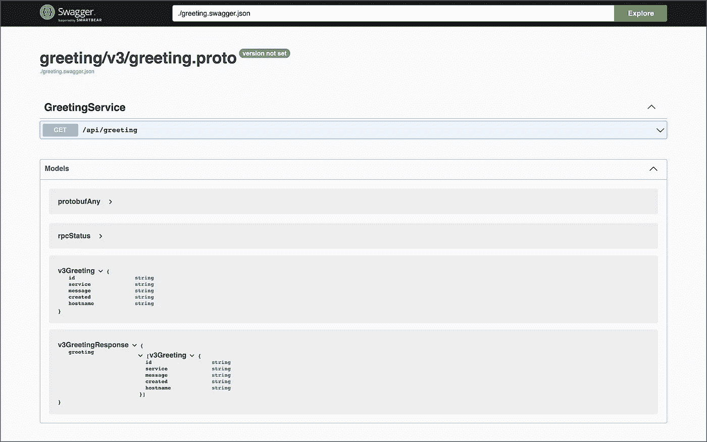

问候协议的大摇大摆的 UI 视图

## gRPC 网关反向代理

如前所述， [gRPC 网关](https://github.com/grpc-ecosystem/grpc-gateway)反向代理是新的，它将 RESTful HTTP API 翻译成 gRPC。在下面的代码示例中，请注意以下代码功能:

1.  导入 [v3 greeting protobuf](https://github.com/garystafford/protobuf/tree/main/greeting/v3) 包；
2.  `ServeMux`，一个请求复用器，将`http`请求匹配到模式，并调用相应的处理程序；
3.  `RegisterGreetingServiceHandlerFromEndpoint`注册服务`GreetingService`到`mux`的`http`处理程序。处理程序将请求转发给 gRPC 端点；
4.  `x-b3`用于分布式跟踪的请求头从传入的 HTTP 请求中收集，并传播到 gRPC `Context`类型的上游服务；

# Istio VirtualService 和 CORS

对于上一篇文章中的 RESTful 服务，CORS 由服务 A 处理。服务 A 允许 UI 向后端 API 的域发出跨源请求。由于 gRPC 网关不直接支持跨来源资源共享(CORS)策略，我们已经使用反向代理的`VirtualService`资源的`[CorsPolicy](https://istio.io/latest/docs/reference/config/networking/virtual-service/#CorsPolicy)`配置将 CORS 责任卸载给 Istio。转移这一职责使得 CORS 作为 YAML 的配置和掌舵图的一部分更容易管理。请参见下面的第 20–28 行。

# 支柱一:原木

借用 Jay Kreps 在 LinkedIn 工程博客上的一句话，日志是一个只追加的、完全有序的记录序列，按时间排序。记录的排序定义了“时间”的概念，因为左边的条目被定义为比右边的条目更老。日志是过去发生的事件的历史记录。日志几乎和计算机一样历史悠久，是许多分布式数据系统和实时应用程序架构的核心。

## 基于 Go 的微服务日志记录

有效的日志记录策略始于您记录什么、何时记录以及如何记录。作为平台日志策略的一部分，八个基于 Go 的微服务使用了 [Logrus](https://github.com/sirupsen/logrus) ，这是一个流行的 Go 结构化日志程序，于 2014 年首次发布。该平台的服务还实现了 Banzai Cloud 的 [logrus-runtime-formatter](https://github.com/banzaicloud/logrus-runtime-formatter) 。这两个日志包让我们能够更好地控制您记录的内容、记录的时间以及记录服务信息的方式。包的[推荐配置](https://github.com/banzaicloud/logrus-runtime-formatter#usage)是最小的。Logrus 的`JSONFormatter`为第三方系统提供了简单的解析，并将附加的上下文数据字段注入到日志条目中。

与 Go 的简单日志包 [log](https://golang.org/pkg/log/) 相比，Logrus 提供了几个优势。例如，日志条目不仅用于致命错误，也不应该在生产环境中输出所有详细日志条目。Logrus 能够记录七个级别的日志:跟踪、调试、信息、警告、错误、致命和紧急。平台微服务的日志级别可以在运行时使用环境变量进行更改。

Banzai Cloud 的 [logrus-runtime-formatter](https://github.com/banzaicloud/logrus-runtime-formatter) 自动用运行时和堆栈信息标记日志消息，包括函数名和行号——在故障排除时非常有用。在 Banzai Cloud(现在是思科的一部分)格式化程序上有一个很好的帖子，[Golang runtime Logrus Formatter](https://banzaicloud.com/blog/runtime-logging/)。


从 Amazon CloudWatch Insights 查看服务 A 日志条目

2020 年， [Logus](https://github.com/sirupsen/logrus) 进入维护模式。作者 Simon Eskildsen(Shopify 的首席工程师)表示，他们不会推出新功能。这并不意味着 Logrus 已经死了。Logrus 拥有超过 18，000 颗 GitHub 星，将继续维护其安全性、错误修复和性能。作者表示，现在存在许多 Logus 的奇妙替代品，如 [Zerolog](https://github.com/rs/zerolog) 、 [Zap](https://github.com/uber-go/zap) 和 [Apex](https://github.com/apex/log) 。

## 客户端角度 UI 日志记录

同样，我使用 [NGX Logger](https://www.npmjs.com/package/ngx-logger) 增强了 Angular UI 的日志记录。NGX Logger 是 angular 的一个简单的日志模块(*目前支持 Angular 6+* )。它允许“漂亮地打印”到控制台，并允许将日志消息发布到服务器端日志记录的 URL。对于本演示，UI 将只记录到 web 浏览器的控制台。与 Logrus 类似，NGX Logger 支持多个日志级别:跟踪、调试、信息、警告、错误、致命和关闭。然而，NGX Logger 不仅仅输出消息，还允许我们将格式正确的日志条目输出到浏览器的控制台。

日志输出的级别配置为取决于环境、生产或非生产。下面是 Chrome 中 Angular UI 的日志输出示例。因为 UI 的 Docker 映像是用生产配置构建的，所以日志级别被设置为`INFO`。您不希望将详细日志输出中的潜在敏感信息暴露给生产中的最终用户。

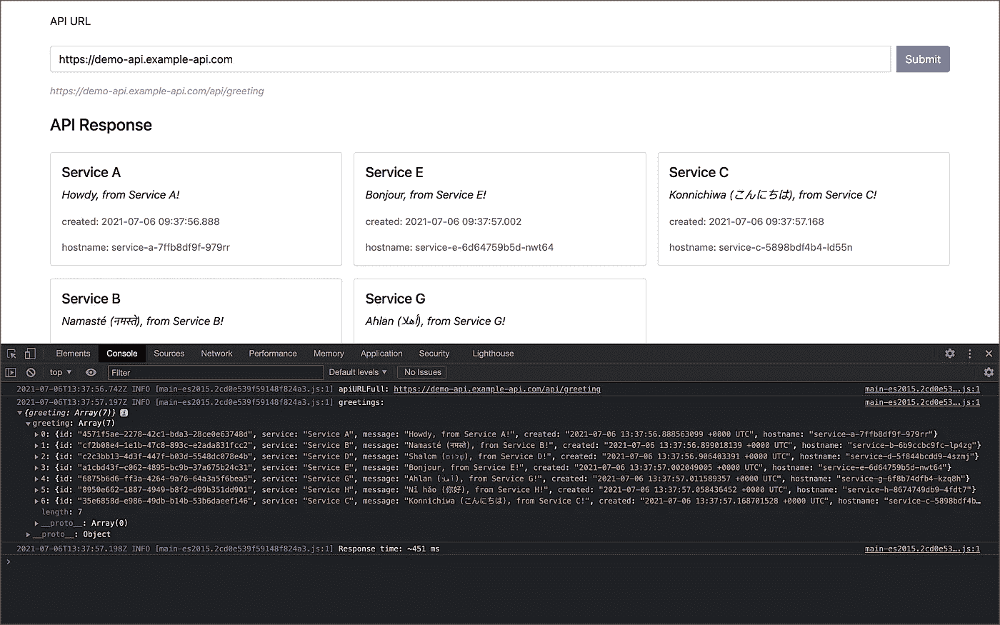

来自平台的 Angular UI 的客户端日志

通过向`app.module.ts`文件添加以下三元运算符来控制日志记录级别。

## 平台日志

基于在第一部分中构建、配置和部署的平台，您现在可以从多个来源访问日志。

1.  Amazon document db:Amazon cloud watch 审计和 Profiler 日志；
2.  亚马逊 MQ:亚马逊 CloudWatch 日志；
3.  亚马逊 EKS: API 服务器、审计、认证器、控制器管理器、调度器 CloudWatch 日志；
4.  Kubernetes 仪表板:个人 EKS Pod 和副本集日志；
5.  Kiali:单个 EKS 豆荚和集装箱原木；
6.  流畅位:EKS 性能、主机、数据面板、应用 CloudWatch 日志；

## 流畅位

根据 AWS 最近的一篇博客文章，[Fluent Bit Integration in CloudWatch Container Insights for EKS](https://aws.amazon.com/blogs/containers/fluent-bit-integration-in-cloudwatch-container-insights-for-eks/)， [Fluent Bit](https://fluentbit.io/) 是一个开源的多平台日志处理器和转发器，允许您从不同的来源收集数据和日志，并将其统一发送到不同的目的地，包括 cloud watch 日志。Fluent Bit 还完全兼容 Docker 和 Kubernetes 环境。使用新推出的 Fluent Bit `DaemonSet`，您可以将容器日志从您的 EKS 集群发送到 CloudWatch logs 进行日志存储和分析。

运行 Fluent Bit，EKS 集群的性能、主机、数据平面和应用程序日志也将在 Amazon CloudWatch 中提供。


来自演示的 EKS 集群的亚马逊云观察日志组

在应用程序日志组中，您可以访问每个参考应用程序组件的单独日志流。


来自应用程序日志组的 Amazon CloudWatch 日志流

在每个 CloudWatch 日志流中，您可以查看单个日志条目。

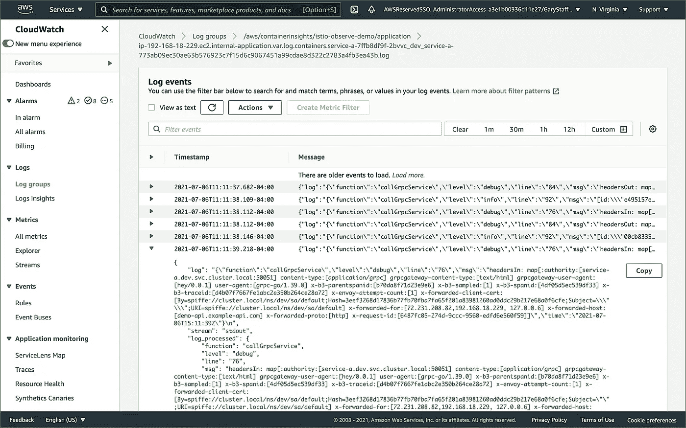

服务 A 的 Amazon CloudWatch 日志流

[CloudWatch Logs Insights](https://docs.aws.amazon.com/AmazonCloudWatch/latest/logs/AnalyzingLogData.html) 使您能够在亚马逊 CloudWatch 日志中交互式搜索和分析您的日志数据。您可以执行查询来帮助您更高效地响应操作问题。如果出现问题，您可以使用 CloudWatch Logs Insights 来确定潜在的原因并验证部署的修复。

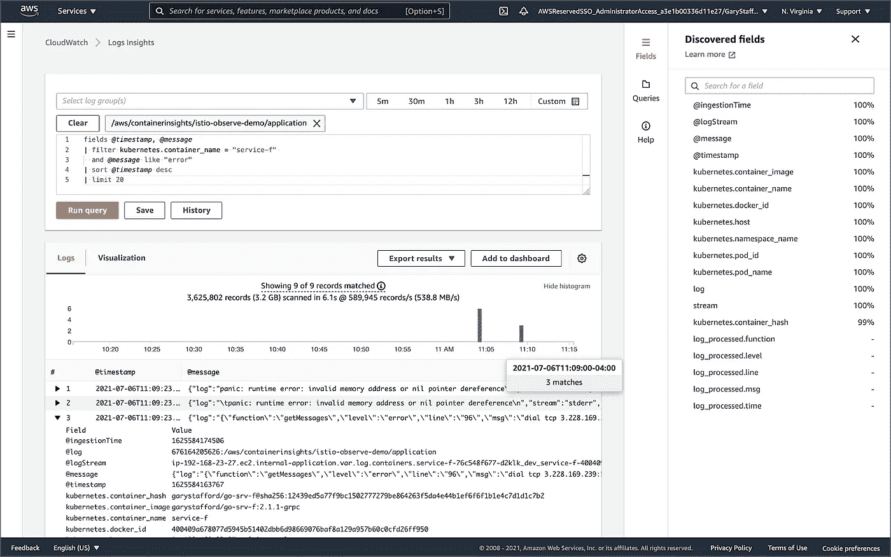

Amazon CloudWatch 日志洞察—在服务 F 的日志中发现的最新错误

CloudWatch Logs Insights 支持 [CloudWatch Logs Insights 查询语法](https://docs.aws.amazon.com/AmazonCloudWatch/latest/logs/CWL_QuerySyntax.html)，这是一种可以用来对日志组执行查询的查询语言。每个查询可以包含一个或多个查询命令，用 Unix 样式的管道字符(|)分隔。例如:

```
fields [@timestamp](http://twitter.com/timestamp), [@message](http://twitter.com/message)
| filter kubernetes.container_name = "service-f" 
  and [@message](http://twitter.com/message) like "error"
| sort [@timestamp](http://twitter.com/timestamp) desc
| limit 20
```

# 支柱二:衡量标准

对于指标，我们将检查[cloud watch Container Insights](https://docs.aws.amazon.com/AmazonCloudWatch/latest/monitoring/ContainerInsights.html)、 [Prometheus](https://prometheus.io/) 和 [Grafana](https://grafana.com/) 。Prometheus 和 Grafana 是您作为 Istio 部署的一部分安装的业界领先的工具。

# 普罗米修斯

[Prometheus](https://github.com/prometheus) 是一个开源系统监控和警报工具包，最初是在大约 2012 年 [SoundCloud](https://soundcloud.com/) 开发的。普罗米修斯于 2016 年加入[云原生计算基金会](https://cncf.io/) (CNCF)，作为继 [Kubernetes](https://kubernetes.io/) 之后主持的第二个项目。

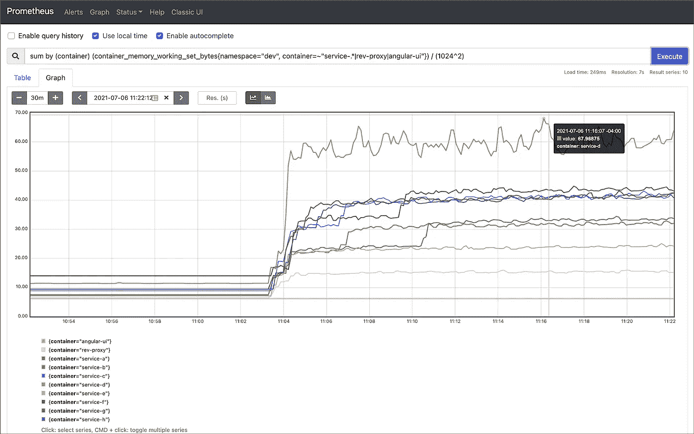

负载测试期间容器内存使用情况的普罗米修斯图

根据 [Istio](https://istio.io/latest/docs/ops/integrations/prometheus/) 的说法，Prometheus 插件是一个 Prometheus 服务器，预配置为收集 Istio 端点以收集指标。您可以将 Prometheus 与 Istio 一起使用，来记录跟踪 Istio 和服务网格中的应用程序的健康状况的指标。你可以使用像[格拉夫纳](https://istio.io/latest/docs/ops/integrations/grafana/)和[基阿利](https://istio.io/latest/docs/tasks/observability/kiali/)这样的工具来可视化度量。Istio Prometheus 插件仅用于演示，并未针对性能或安全性进行调整。

`[istioctl dashboard](https://istio.io/latest/docs/reference/commands/istioctl/#istioctl-dashboard)`命令提供了对所有 Istio web 用户界面的访问。运行 EKS 集群，安装 Istio，部署参考应用平台，从终端使用`[istioctl dashboard prometheus](https://istio.io/latest/docs/reference/commands/istioctl/#istioctl-dashboard-prometheus)`命令访问 Prometheus。您必须从终端登录 AWS 才能成功连接到 Prometheus。如果你没有登录 AWS，你会经常看到以下错误:`Error: not able to locate <tool_name> pod: Unauthorized`。由于我们使用的是 Istio 插件的非生产演示版本，因此访问 Prometheus 不需要认证和授权。

根据[普罗米修斯](https://prometheus.io/docs/prometheus/latest/querying/basics/)的说法，用户使用一种叫做 [PromQL](https://prometheus.io/docs/prometheus/latest/querying/basics/) (普罗米修斯查询语言)的函数式查询语言实时选择和汇总时序数据。表达式的结果既可以显示为图形，在 Prometheus 的表达式浏览器中以表格数据的形式查看，也可以由外部系统通过 Prometheus 的 [HTTP API](https://prometheus.io/docs/prometheus/latest/querying/api/) 使用。表达式浏览器包括一个下拉菜单，其中包含所有可用的指标作为构建查询的起点。下面是一些 PromQL 的例子，它们是在撰写本文时开发的。

```
istio_agent_go_info{kubernetes_namespace="dev"}istio_build{kubernetes_namespace="dev"}up{alpha_eksctl_io_cluster_name="istio-observe-demo", job="kubernetes-nodes"}sum by (pod) (rate(container_network_transmit_packets_total{stack="reference-app",namespace="dev",pod=~"service-.*"}[5m]))sum by (instance) (istio_requests_total{source_app="istio-ingressgateway",connection_security_policy="mutual_tls",response_code="200"})sum by (response_code) (istio_requests_total{source_app="istio-ingressgateway",connection_security_policy="mutual_tls",response_code!~"200|0"})
```

## 普罗米修斯蜜蜂

Prometheus 既有一个 [HTTP API](https://prometheus.io/docs/prometheus/latest/querying/api/#http-api) 又有一个[管理 API](https://prometheus.io/docs/prometheus/latest/management_api/) 。除了 Prometheus UI 之外，还有许多有用的端点，可在`[http://localhost:9090/graph](http://localhost:9090/graph)`获得。例如，列出所有命令行配置标志的 Prometheus HTTP API 端点在`[http://localhost:9090/api/v1/status/flags](http://localhost:9090/api/v1/status/flags)`可用。列出所有可用普罗米修斯指标的端点可在`[http://localhost:9090/api/v1/label/__name__/values](http://localhost:9090/api/v1/label/__name__/values)`获得；本演示中超过 951 项指标。


在`[http://localhost:9090/metrics](http://localhost:9090/metrics)`可以找到 Prometheus 端点，它列出了许多可用的指标，用`HELP`和`TYPE`来解释它们的功能。


## 了解指标

除了这些端点，Istio 导出并通过 Prometheus 提供的标准服务水平指标可在 [Istio 标准指标](https://istio.io/latest/docs/reference/config/metrics/#metrics)文档中找到。在他们的 GitHub 网站上的 cAdvisor [README](https://github.com/google/cadvisor/blob/master/docs/storage/prometheus.md#prometheus-container-metrics) 中也可以找到 Prometheus 中许多可用指标的解释。正如在这篇 [AWS 博客文章](https://aws.amazon.com/blogs/containers/monitoring-amazon-eks-on-aws-fargate-using-prometheus-and-grafana/)中提到的，cAdvisor 指标也可以通过命令行使用以下命令获得:

```
export NODE=$(kubectl get nodes | sed -n '2 p' | awk {'print $1'})kubectl get --raw "/api/v1/nodes/${NODE}/proxy/metrics/cadvisor"
```

## 观察指标

下面是部署到 EKS 的后端微服务容器的示例图。graph PromQL 表达式返回工作集内存量，包括最近访问的内存、脏内存和内核内存(`container_memory_working_set_bytes`)，按 pod 求和，以兆字节(MB)为单位。在显示的时间段内，服务上没有负载。

```
sum by (pod) (container_memory_working_set_bytes{namespace="dev", container=~"service-.*|rev-proxy|angular-ui"}) / (1024^2)
```


`container_memory_working_set_bytes`度量与`kubectl top`命令使用的度量相同(不是`container_memory_usage_bytes`)。省略`--containers=true`标志将输出 pod 对容器的统计数据。

```
> kubectl top pod -n dev --containers=true | \
    grep -v istio-proxy | sort -k 4 -rPOD                           NAME          CPU(cores) MEMORY(bytes)
service-d-69d7469cbf-ts4t7    service-d     135m       13Mi
service-d-69d7469cbf-6thmz    service-d     156m       13Mi
service-d-69d7469cbf-nl7th    service-d     118m       12Mi
service-d-69d7469cbf-fz5bh    service-d     118m       12Mi
service-d-69d7469cbf-89995    service-d     136m       11Mi
service-d-69d7469cbf-g4pfm    service-d     106m       10Mi
service-h-69576c4c8c-x9ccl    service-h      33m        9Mi
service-h-69576c4c8c-gtjc9    service-h      33m        9Mi
service-h-69576c4c8c-bjgfm    service-h      45m        9Mi
service-h-69576c4c8c-8fk6z    service-h      38m        9Mi
service-h-69576c4c8c-55rld    service-h      36m        9Mi
service-h-69576c4c8c-4xpb5    service-h      41m        9Mi
...
```

在另一个 Prometheus 示例中，PromQL 查询表达式返回以 [CPU 单位](https://kubernetes.io/docs/tasks/configure-pod-container/assign-cpu-resource/#cpu-units) (1 个 CPU = 1 个 AWS vCPU)度量的 CPU 资源的每秒[速率，该速率是在过去 5 分钟内根据范围向量中的时间序列由 pod 求和得到的。在此期间，后端服务处于使用`hey`的 15 个并发用户的一致模拟负载下。在此期间，四个服务 D 单元消耗了最多的 CPU 单元。](https://prometheus.io/docs/prometheus/latest/querying/functions/#rate)

```
sum by (pod) (rate(container_cpu_usage_seconds_total{namespace="dev", container=~"service-.*|rev-proxy|angular-ui"}[5m])) * 1000
```

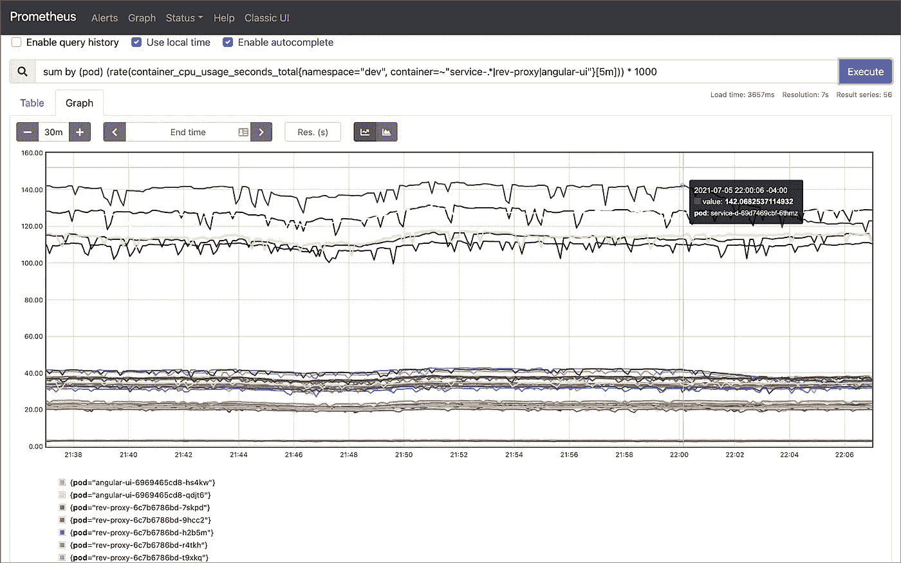

`container_cpu_usage_seconds_total`度量与`kubectl top`命令使用的度量相同。上面的 PromQL 表达式将查询结果乘以 1，000，以匹配来自`kubectl top`的结果，如下所示。

```
> kubectl top pod -n dev --sort-by=cpuNAME                          CPU(cores)   MEMORY(bytes)
service-d-69d7469cbf-6thmz    159m         60Mi
service-d-69d7469cbf-89995    143m         61Mi
service-d-69d7469cbf-ts4t7    140m         59Mi
service-d-69d7469cbf-fz5bh    135m         58Mi
service-d-69d7469cbf-nl7th    132m         61Mi
service-d-69d7469cbf-g4pfm    119m         62Mi
service-g-c7d68fd94-w5t66      59m         58Mi
service-f-7dc8f64799-qj8qv     56m         55Mi
service-c-69fbc964db-knggt     56m         58Mi
service-h-69576c4c8c-8fk6z     55m         58Mi
service-h-69576c4c8c-4xpb5     55m         58Mi
service-g-c7d68fd94-5cdc2      54m         58Mi
...
```

## 限制

普罗米修斯也暴露了容器资源的限制。例如，在参考平台的后端服务上设置的内存限制，使用`container_spec_memory_limit_bytes`指标以兆字节(MB)为单位显示。当与服务消耗的实时资源一起查看时，这些指标有助于正确配置和监控 Kubernetes 管理功能，如[水平 Pod 自动缩放器](https://kubernetes.io/docs/tasks/run-application/horizontal-pod-autoscale/)。

```
sum by (container) (container_spec_memory_limit_bytes{namespace="dev", container=~"service-.*|rev-proxy|angular-ui"}) / (1024^2) / count by (container) (container_spec_memory_limit_bytes{namespace="dev", container=~"service-.*|rev-proxy|angular-ui"})
```

或者，Pod 的内存限制:

```
sum by (pod) (container_spec_memory_limit_bytes{namespace="dev"}) / (1024^2)
```

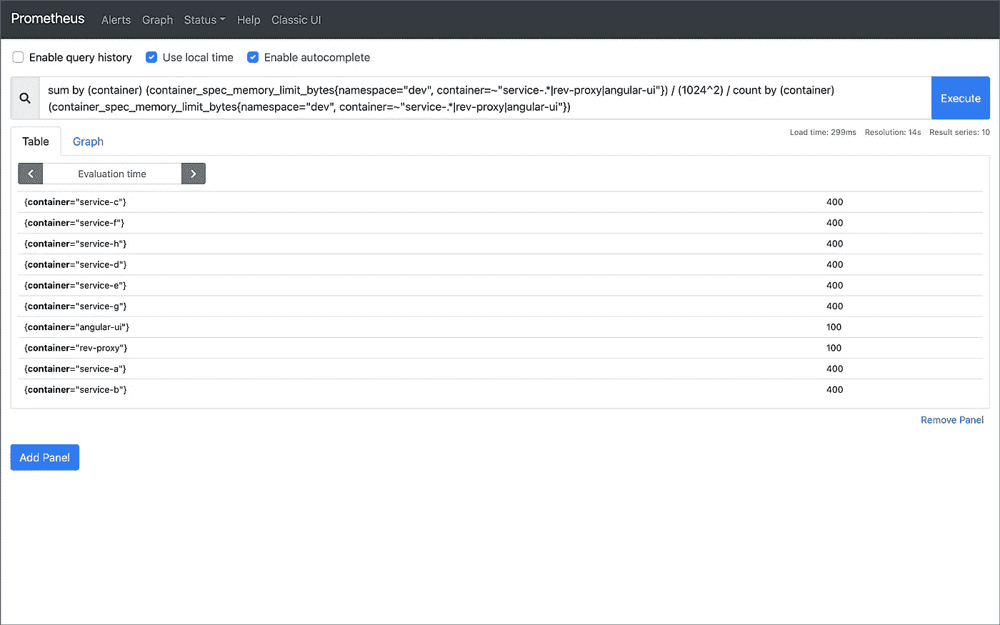

## 聚类指标

Prometheus 还包含关于 Istio 组件、Kubernetes 组件和 EKS 集群的指标。例如，`istio-observe-demo` EKS 集群的`managed-ng-1`受管节点组中五个`m5.large` EC2 工作节点的总可用内存(GB)。

```
machine_memory_bytes{alpha_eksctl_io_cluster_name="istio-observe-demo", alpha_eksctl_io_nodegroup_name="managed-ng-1"} / (1024^3)
```

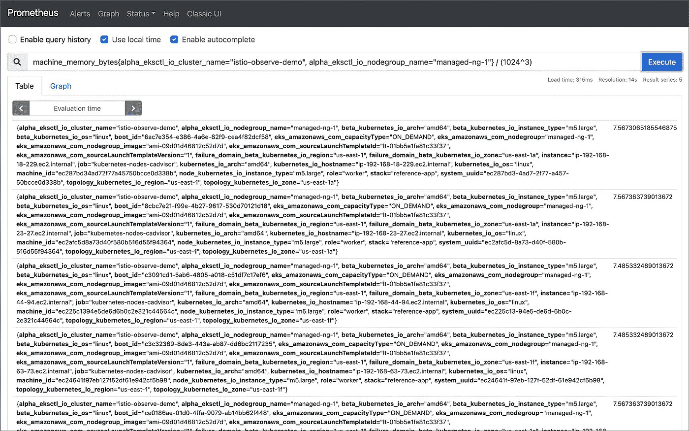

对于物理核心总数，使用`machine_cpu_physical_core`指标，对于 vCPU 核心，使用`machine_cpu_cores`指标。

# 格拉夫纳

Grafana 称自己是领先的时间序列分析开源软件。根据 [Grafana Labs 的说法，](https://grafana.com/grafana) Grafana 允许您查询、可视化、提醒和了解您的指标，无论它们存储在哪里。您可以轻松创建、浏览和共享视觉效果丰富的数据驱动仪表板。Grafana 还允许用户可视化地为他们最重要的指标定义警报规则。Grafana 将不断评估规则，并可以发送通知。

如果您使用前一篇文章的[第一部分](/kubernetes-based-microservice-observability-with-istio-service-mesh-part-1-of-2-19084d13a866)中演示的 Istio addons 过程部署了 Grafana，请访问与其他工具类似的 Grafana:

```
istioctl dashboard grafana
```

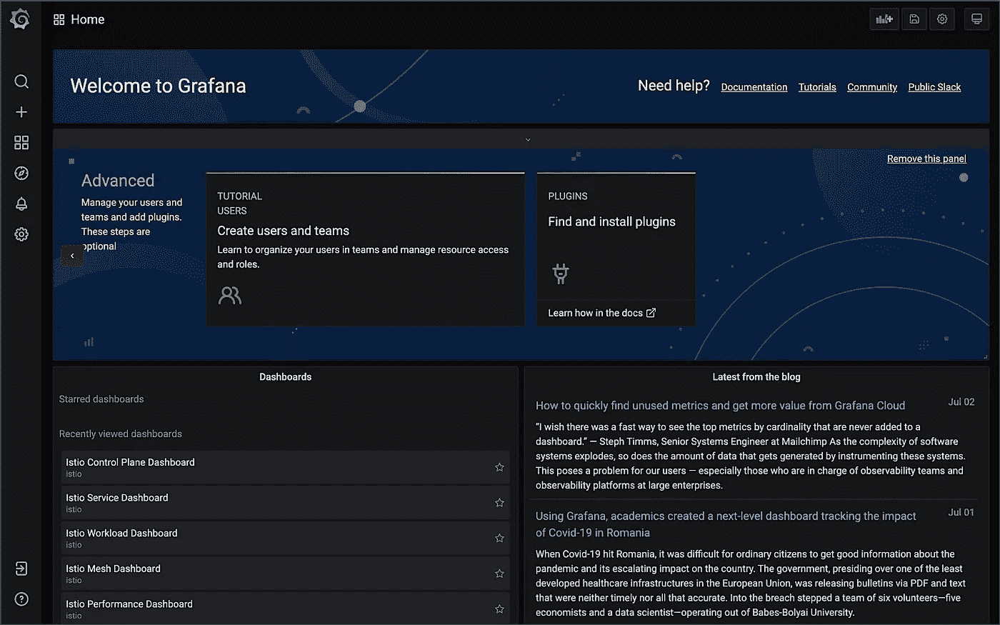

Grafana 主页

据[消息，Istio](https://istio.io/docs/tasks/telemetry/using-istio-dashboard/#about-the-grafana-add-on) ， [Grafana](https://grafana.com/) 是一款开源监控解决方案，用于为 Istio 配置仪表盘。您可以使用 Grafana 来监控服务网格中 Istio 和应用程序的健康状况。虽然您可以构建自己的仪表板，但 Istio 为网格和控制平面的所有最重要指标提供了一组预配置的仪表板。预配置的仪表板使用 Prometheus 作为数据源。

*   [Mesh Dashboard](https://grafana.com/grafana/dashboards/7639) 提供了 Mesh 中所有服务的概述。
*   [Service Dashboard](https://grafana.com/grafana/dashboards/7636) 提供了服务指标的详细分解。
*   [工作负载仪表板](https://grafana.com/grafana/dashboards/7630)提供工作负载指标的详细细分。
*   [性能仪表板](https://grafana.com/grafana/dashboards/11829)监控网格的资源使用情况。
*   [控制面板仪表板](https://grafana.com/grafana/dashboards/7645)监控控制面板的健康和性能。

下面是一个 [Istio Mesh 仪表板](https://grafana.com/grafana/dashboards/7639)的例子，过滤后显示了在`dev`名称空间中运行的八个后端服务工作负载。在此期间，后端服务处于使用`hey`的大约 20 个并发用户的一致模拟负载下。您可以观察这些工作负载的请求的 p50、p90 和 p99 延迟。

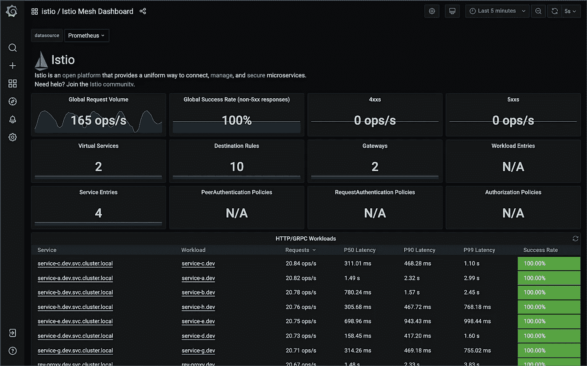

Istio 网格操控板视图

仪表板由 Grafana 中的基本可视化构建模块[面板](https://grafana.com/docs/grafana/latest/panels/)构建而成。每个面板都有一个特定于所选数据源(在本例中为 Prometheus)的查询编辑器。查询编辑器允许您编写(PromQL)查询。例如，下面是负责 Istio Mesh 仪表板中显示的 p50 延迟面板的 PromQL 表达式查询。

```
label_join((histogram_quantile(0.50, sum(rate(istio_request_duration_milliseconds_bucket{reporter="source"}[1m])) by (le, destination_workload, destination_workload_namespace)) / 1000) or histogram_quantile(0.50, sum(rate(istio_request_duration_seconds_bucket{reporter="source"}[1m])) by (le, destination_workload, destination_workload_namespace)), "destination_workload_var", ".", "destination_workload", "destination_workload_namespace")
```

下面是一个 [Istio 工作负荷仪表板](https://grafana.com/grafana/dashboards/7630)的例子。仪表板包含三个部分:常规、入站工作负载和出站工作负载。这里，我们过滤了来自参考平台后端服务在`dev`名称空间中的出站流量。


Istio 工作量仪表板视图

下面是 Istio 工作负载仪表板的另一个视图，仪表板的入站工作负载部分被过滤为一个工作负载，即 gRPC 网关。gRPC 网关接受来自 Istio 入口网关的传入流量，如仪表板面板所示。

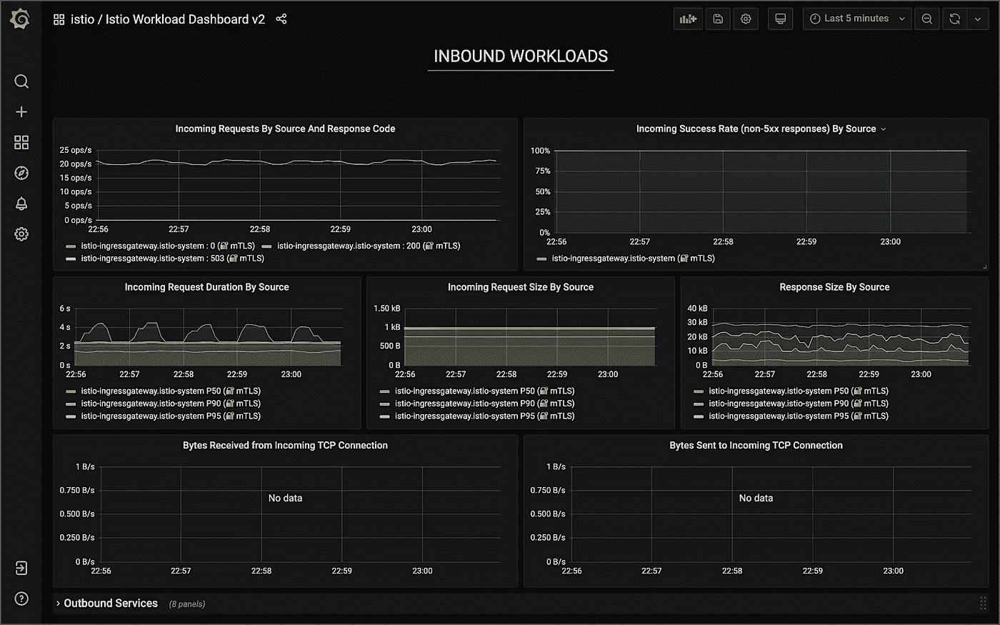

Istio 工作量仪表板视图

Grafana 提供了浏览面板的能力。 [Explore](https://grafana.com/docs/grafana/latest/explore/) 去掉了仪表板和面板选项，以便您可以专注于查询。下面是一个面板示例，根据`istio_tcp_sent_bytes_total`指标，显示了服务 F 的基于 TCP 的出口流量的稳定流。服务 F 消耗 RabbitMQ 队列(Amazon MQ)上的消息，并将消息写入 MongoDB (DocumentDB)。

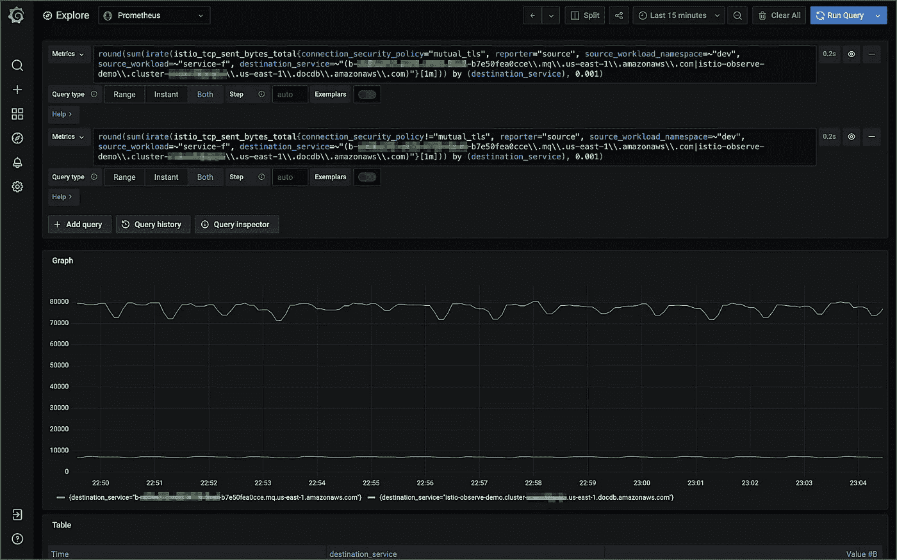

探索 Grafana 仪表板面板

## Istio 性能

您可以使用 [Istio 性能仪表板](https://grafana.com/grafana/dashboards/11829)监控 Istio 的资源使用情况。

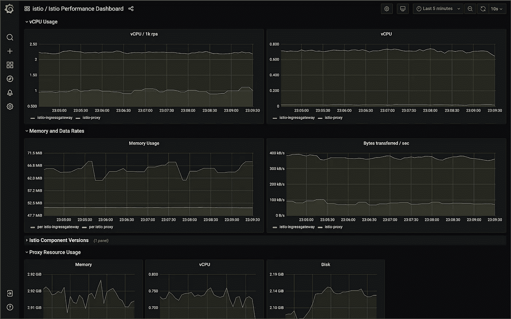

Istio 性能仪表板视图

## 附加仪表板

Grafana 提供了一个包含官方和社区构建的仪表板的网站，其中包括上述 Istio 仪表板。将仪表板导入 Grafana 实例非常简单，只需复制仪表板 URL 或 Grafana 仪表板站点提供的 ID，并将其粘贴到 Grafana 实例的仪表板导入选项中。但是，请注意，并不是 Grafan 网站中的每个 Kubernetes 仪表板都与您的特定版本的 Kubernetes、Istio 或 EKS 兼容，也不依赖 Prometheus 作为数据源。因此，您可能必须测试和调整导入的仪表板，以使它们工作。


下面是一个由的[instruments 团队开发的](https://grafana.com/orgs/instrumentisto)[Kubernetes cluster monitoring(via Prometheus)](https://grafana.com/grafana/dashboards/315)(仪表板 ID 315)的导入社区仪表板示例。


## 发信号

有效的可观察性策略必须不仅仅包括可视化结果的能力。有效的策略还必须检测异常情况，并通知(提醒)适当的资源或直接解决事故。格拉夫纳和普罗米修斯一样，能够发出警报和通知。您可以直观地定义关键指标的警报规则。然后，Grafana 将根据规则持续评估指标，并在违反预定义阈值时发送通知。

Prometheus 支持多个流行的[通知渠道](http://docs.grafana.org/alerting/notifications/#all-supported-notifier)，包括 PagerDuty、HipChat、Email、Kafka、Slack。下面是一个 Prometheus 通知通道的示例，它向 Slack 支持通道发送预警通知。


下面是一个基于 300 [毫 cpu](https://kubernetes.io/docs/concepts/configuration/manage-resources-containers/#meaning-of-cpu) 或毫核心(m)的任意高 CPU 使用率的警报示例。当单个 pod 的 CPU 使用率超过该值超过 3 分钟时，将会发送警报。高 CPU 使用率可能是由于水平 Pod 自动缩放器不起作用，或者 HPA 已达到其`maxReplicas`限制，或者集群的现有工作节点中没有足够的资源来调度额外的 Pod。


由警报触发，Prometheus 向指定的 Slack 信道发送详细的通知。


# 亚马逊云观察容器洞察

最后，在指标类别中，[Amazon cloud watch Container Insights](https://docs.aws.amazon.com/AmazonCloudWatch/latest/monitoring/ContainerInsights.html)从您的容器化应用和微服务中收集、汇总、总结和可视化指标和日志。可以根据 Container Insights 收集的指标设置 CloudWatch 警报。Container Insights 可用于亚马逊弹性容器服务(Amazon ECS)，包括亚马逊 EC2 上的 Fargate、亚马逊 EKS 和 Kubernetes 平台。


在亚马逊 EKS，Container Insights 使用 CloudWatch 代理的容器化版本来发现集群中所有正在运行的容器。然后，它在性能堆栈的每一层收集性能数据。Container Insights 使用[嵌入式指标格式](https://docs.aws.amazon.com/AmazonCloudWatch/latest/monitoring/CloudWatch_Embedded_Metric_Format.html)收集数据作为性能日志事件。这些性能日志事件是使用结构化 JSON 模式的条目，该模式支持大规模接收和存储高基数数据。

在[之前的帖子](/kubernetes-based-microservice-observability-with-istio-service-mesh-part-1-of-2-19084d13a866)中，我们还为 Prometheus 安装了 cloud watch Container Insights monitoring，它可以自动从容器化的系统和工作负载中发现 Prometheus 指标。

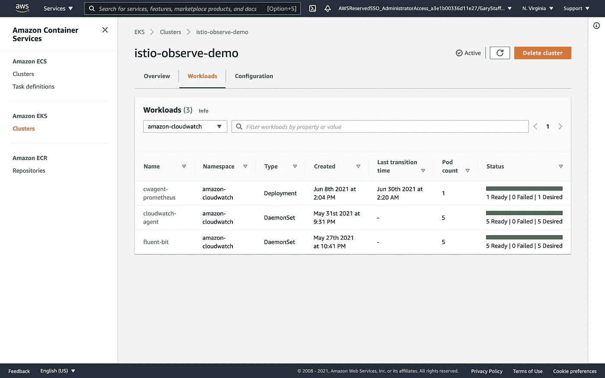

下面是一个基本性能监控 CloudWatch Container Insights 仪表板的示例。仪表板被过滤到 EKS 集群的`dev`名称空间，参考应用程序平台在此运行。在此期间，使用`hey`将后端服务置于模拟负载下。随着应用程序负载的增加，根据容器请求的资源和 HPA 配置,“容器数量”从 20 个容器增加到 56 个容器。还有一个 CloudWatch 警报，显示在屏幕右侧。任意高水平的网络传输活动触发了警报。

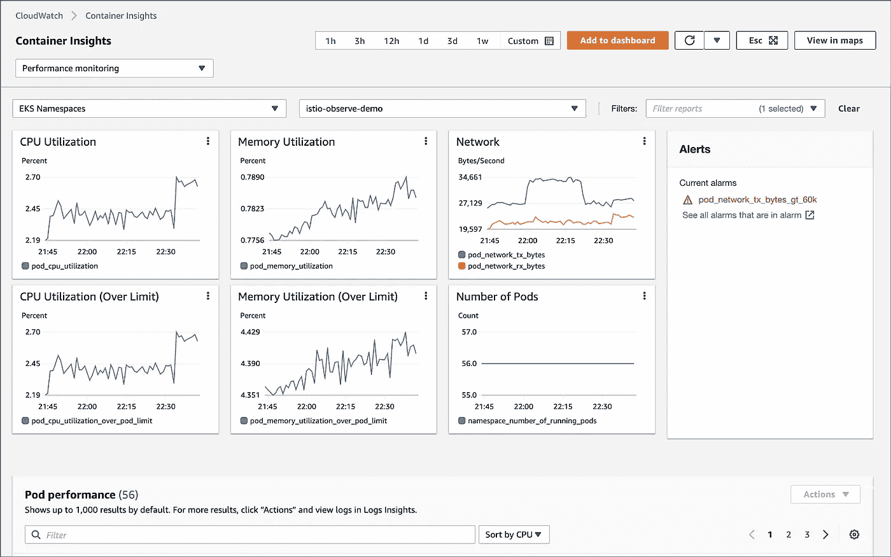

接下来是 Container Insights 在 CPU 模式下的容器图视图示例。您可以看到`dev`名称空间的可视化表示，其中显示了每个后端服务的`Service`和`Deployment`资源。

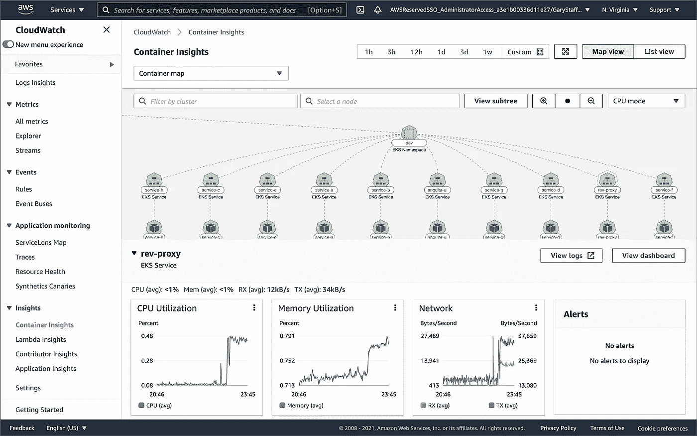

下面有一个警告图标，指示集群上的警报被触发。

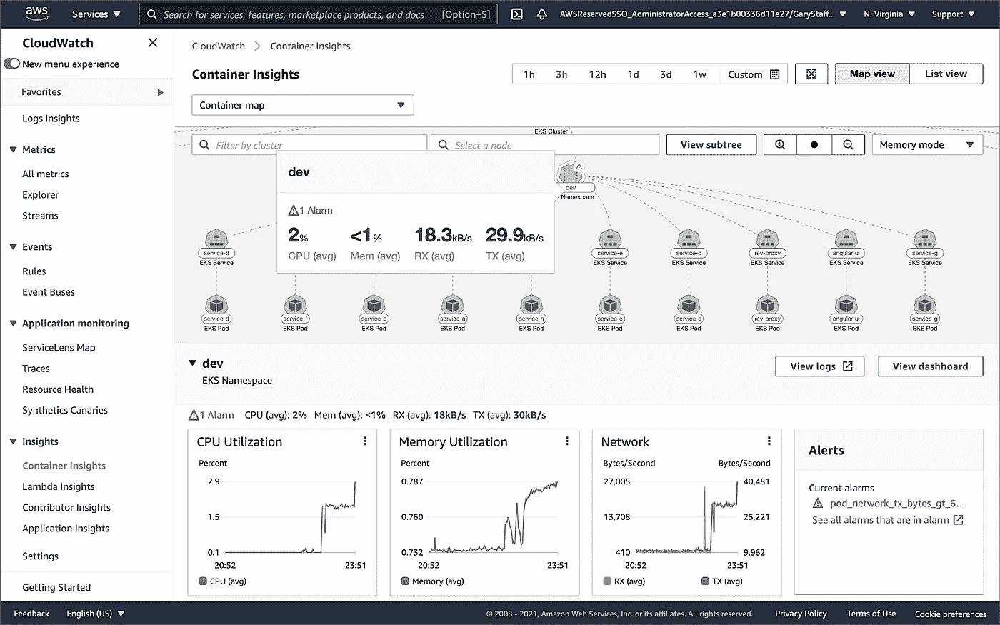

最后，CloudWatch Insights 允许您从 CloudWatch Insights 跳转到 CloudWatch Log Insights 控制台。CloudWatch Insights 还将为您编写 CloudWatch Insights 查询。下面，我们从 CloudWatch Insights 性能监控控制台中的 Service D container metrics 视图直接转到 CloudWatch Log Insights 控制台，带有一个查询，准备运行。


# 支柱 3:痕迹

据[开放跟踪网站](https://opentracing.io/docs/overview/what-is-tracing/)报道，分布式跟踪，也称为分布式请求跟踪，用于分析和监控应用程序，尤其是那些使用微服务架构构建的应用程序。分布式跟踪有助于查明故障发生的位置以及导致低性能的原因。

## 标题传播

根据 [Istio](https://istio.io/docs/tasks/telemetry/distributed-tracing/#understanding-what-happened) 的说法，头传播可以通过客户端库来完成，比如 [Zipkin](https://zipkin.io/pages/tracers_instrumentation.html) 或者 [Jaeger](https://github.com/jaegertracing/jaeger-client-java/tree/master/jaeger-core#b3-propagation) 。报头传播也可以手动完成，称为跟踪上下文传播，记录在[分布式跟踪任务](https://istio.io/latest/docs/tasks/observability/distributed-tracing/overview/#trace-context-propagation)中。或者，Istio 代理可以自动发送跨度。应用程序需要传播适当的 HTTP 头，以便当代理发送跨度信息时，跨度可以正确地关联到单个跟踪中。为了实现这一点，应用程序需要从传入请求到任何传出请求收集并传播以下标头。

*   `x-request-id`
*   `x-b3-traceid`
*   `x-b3-spanid`
*   `x-b3-parentspanid`
*   `x-b3-sampled`
*   `x-b3-flags`
*   `x-ot-span-context`

标题起源于 Zipkin 项目的一部分。报头的 B3 部分以 Zipkin 的原名命名，**B**ig**B**rother**B**ird。跨服务调用传递这些头被称为 [B3 传播](https://github.com/openzipkin/b3-propagation)。根据 [Zipkin](https://www.envoyproxy.io/docs/envoy/latest/intro/arch_overview/observability/tracing#arch-overview-tracing) 的说法，这些属性会在进程内传播，并最终传播到下游(通常通过 HTTP 头),以确保源自同一个根的所有活动都被收集在一起。

为了用 Jaeger 和 Zipkin 演示分布式跟踪，gRPC 网关传递 b3 头。基于 RESTful JSON 的服务在 HTTP 请求对象中传递这些头，而使用 gRPC，这些头在 gRPC `Context`对象中传递。以下代码已添加到 gRPC 网关中。Istio sidecar 代理([特使](https://www.envoyproxy.io/))生成初始的[头](https://istio.io/latest/about/faq/#distributed-tracing)，然后这些头被传播到整个服务调用链。关键是只传播下游请求中带有值的头，如下面的代码所示。

在下面的 CloudWatch 日志中，我们看到了一个记录在服务 a 的日志消息中的 HTTP 请求头的例子。`b3`头从 gRPC 网关反向代理传播到基于 gRPC 的 Go 服务。标头传播确保了跨整个服务调用链的完整分布式跟踪。

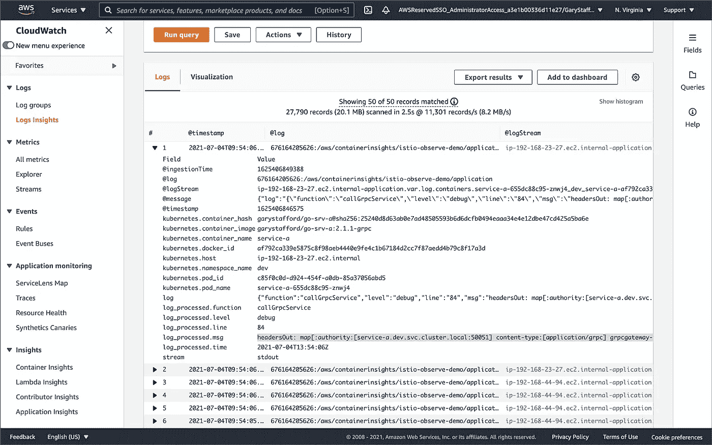

显示服务 A 的日志条目的 CloudWatch 日志洞察控制台

从服务 A 传播的标头如下所示。注意从 gRPC 网关反向代理传播的`b3`报头。

## 贼鸥

根据他们的网站介绍， [Jaeger](https://www.jaegertracing.io/docs/1.10/) 受 [Dapper](https://research.google.com/pubs/pub36356.html) 和 [OpenZipkin](http://zipkin.io/) 的启发，是一个由[优步科技](http://uber.github.io/)开源发布的分布式追踪系统。Jaeger 用于对基于微服务的分布式系统进行监控和故障排除，包括分布式上下文传播、分布式事务监控、根本原因分析、服务依赖性分析以及性能和延迟优化。Jaeger 网站包含 Jaeger 架构和一般追踪相关术语的有用概述。

如果您使用上一篇文章的第一部分中演示的 Istio addons 过程部署了 Jaeger，请像访问其他工具一样访问 Jaeger:

```
istioctl dashboard jaeger
```

以下是 Jaeger UI 的搜索视图示例，显示了一段时间内 Angular UI 和 Istio Ingress 网关服务的搜索结果。我们在顶部看到跟踪时间线，下面是跟踪结果列表。正如在 Jaeger [网站](https://www.jaegertracing.io/docs/1.10/architecture/)上讨论的那样，一条轨迹由跨度组成。span 表示 Jaeger 中具有操作名称的逻辑工作单元。踪迹是通过系统的执行路径，并且可以被认为是[有向无环图](https://en.wikipedia.org/wiki/Directed_acyclic_graph) (DAG)的[跨度](https://www.jaegertracing.io/docs/1.10/architecture#span)。如果您使用过像 Apache Spark 这样的系统，您可能已经熟悉 Dag 的概念。

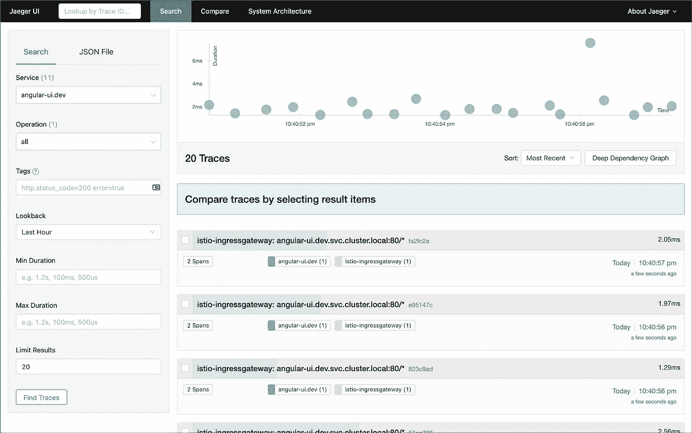

最新的角度 UI 跟踪

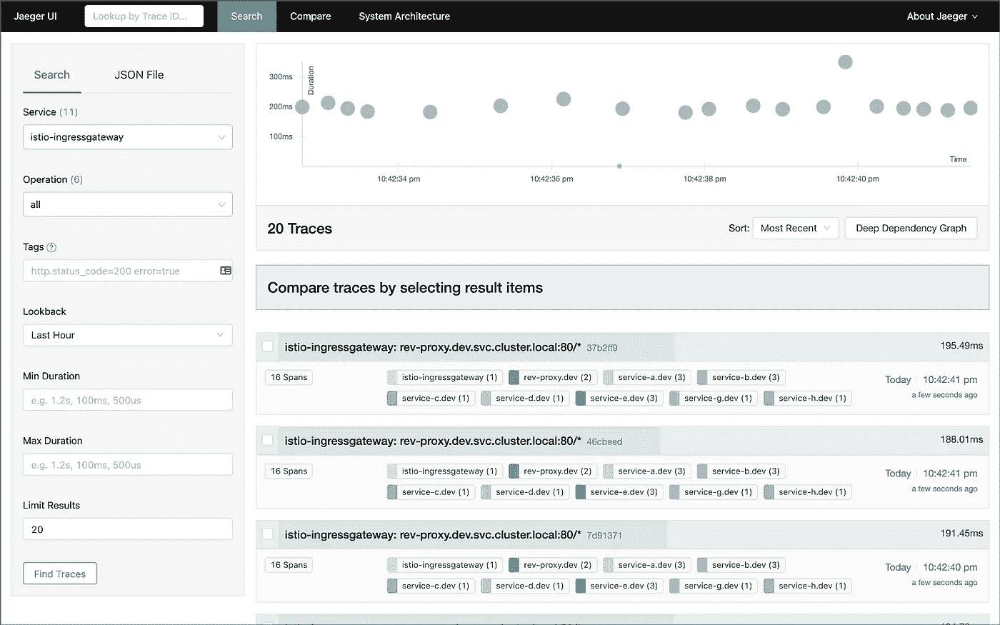

最新的 Istio 入口网关跟踪

下面是 Jaeger 的轨迹时间线模式中单个轨迹的详细视图。这 16 个跨度涵盖了参考平台的 9 个组件:7 个后端服务、gRPC 网关和 Istio 入口网关。每个跨度都有单独的计时，总跟踪时间为 195.49 毫秒，跟踪中的根跨度是 Istio 入口网关。加载在最终用户网络浏览器中的 Angular UI 通过 Istio 入口网关调用 gRPC 网关。从那里，我们看到了我们的服务到服务 IPC 的预期流程。服务 A 调用服务 B 和服务 c，服务 B 调用服务 E，服务 E 调用服务 G 和服务 h。

在这个演示中，跟踪既没有跨越 RabbitMQ 消息队列，也没有跨越 MongoDB。您将不会看到包含通过 RabbitMQ 从服务 D 到服务 F 的调用的跟踪。

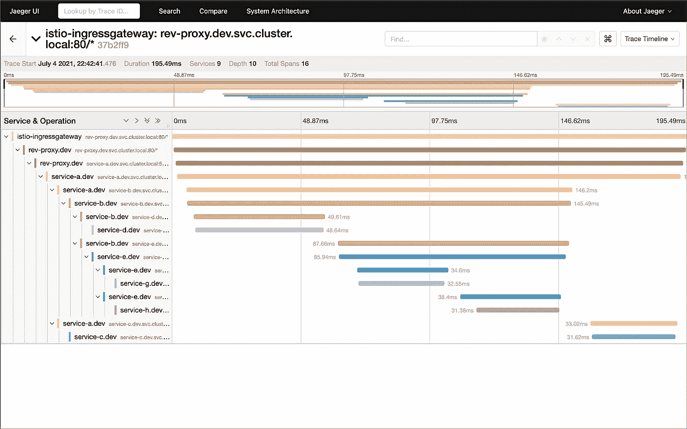

Istio 入口网关分布式跟踪的详细视图

跟踪时间线的可视化展示了参考平台的服务到服务 IPC 的同步性质，而不是使用 RabbitMQ 消息队列的解耦通信的异步性质。服务 A 等待其调用链中的每个服务做出响应，然后将其响应返回给请求者。

在 Jaeger 的跟踪时间线视图中，您可以钻取包含附加元数据的单个跨度。span 的元数据包括被调用的 API 端点 URL、HTTP 方法、响应状态和其他几个头。

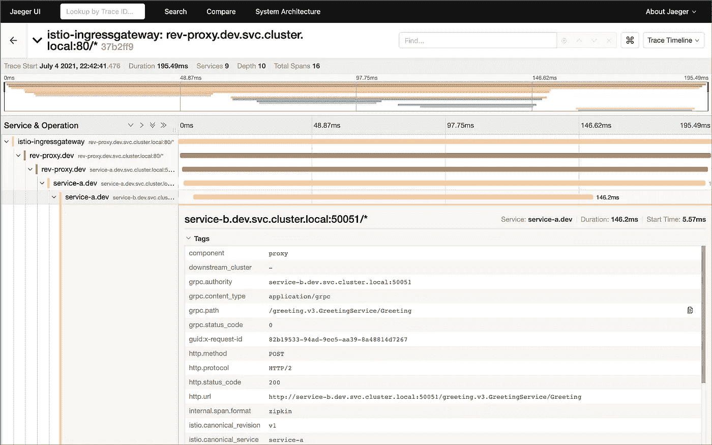

Istio 入口网关分布式跟踪的详细视图

跟踪统计视图也是可用的。

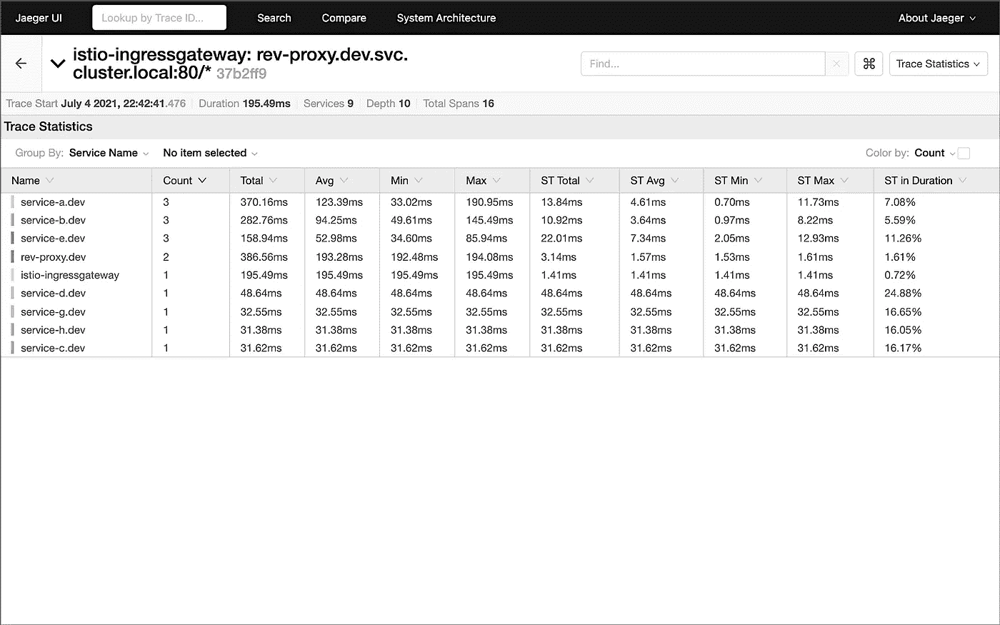

Istio 入口网关分布式跟踪的跟踪统计信息

此外，Jaeger 还有一个实验性的轨迹图形模式，可以显示同一轨迹的图形视图。


Jaeger 还包括一个比较跟踪功能和两个依赖视图:力定向图和 DAG。我发现这两种观点与基亚利相比都相当原始。缺少对 Kiali 的访问，这些视图作为依赖图没有多大用处。

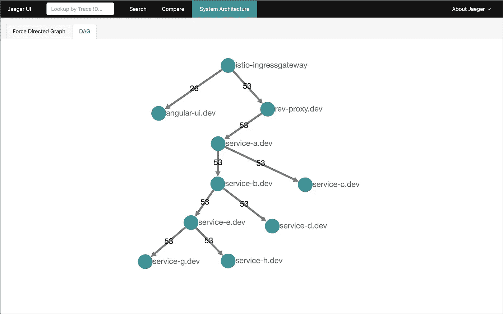

# 齐普金

Zipkin 是一个分布式跟踪系统，它帮助收集解决服务架构中的延迟问题所需的时间数据。根据 2012 年在 [Twitter 的工程博客](https://blog.twitter.com/engineering/en_us/a/2012/distributed-systems-tracing-with-zipkin)上的一篇帖子，Zipkin 是在 Twitter 的第一个黑客周期间作为一个项目开始的。在那一周，他们实施了一个基本版本的[谷歌衣冠楚楚](http://research.google.com/pubs/pub36356.html)节俭纸。

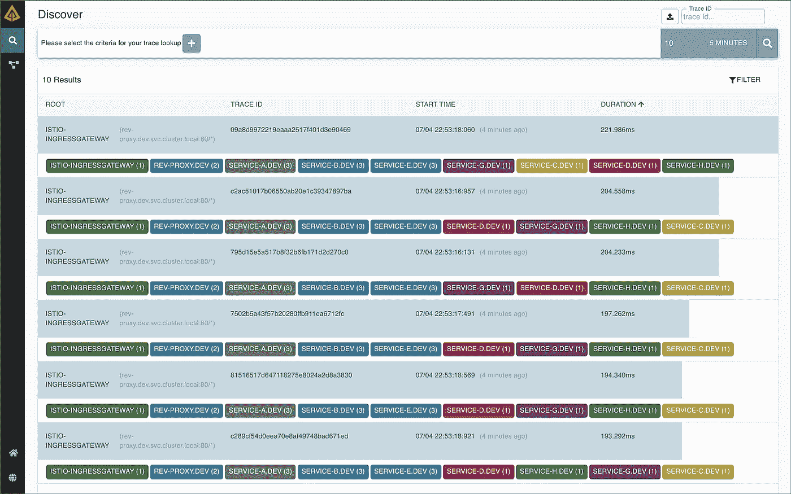

在 Zipkin 中搜索最新踪迹的结果

Zipkin 和 Jaeger 在能力上非常相似。我选择在这篇文章中关注耶格，因为比起齐普金，我更喜欢它。如果你想尝试 Zipkin 而不是 Jaeger，你可以使用以下命令从 Istio addons extras 目录中移除 Jaeger 并[安装 Zipkin](https://istio.io/latest/docs/ops/integrations/zipkin/) 。在帖子的第一部分，我们在部署 Istio 插件时没有默认安装 Zipkin。请注意，在同一个 Kubernetes 集群中同时运行这两个工具会导致不可预测的跟踪结果。

```
kubectl delete -f [https://raw.githubusercontent.com/istio/istio/release-1.10/samples/addons/jaeger.yaml](https://raw.githubusercontent.com/istio/istio/release-1.10/samples/addons/jaeger.yaml)kubectl apply -f [https://raw.githubusercontent.com/istio/istio/release-1.10/samples/addons/extras/zipkin.yaml](https://raw.githubusercontent.com/istio/istio/release-1.10/samples/addons/extras/zipkin.yaml)
```

访问 Zipkin 类似于其他观察工具:

```
istioctl dashboard zipkin
```

下面是一个在 Zipkin 的 UI 中可视化的分布式轨迹的例子，包含 16 个跨度，类似于上面显示的 Jaeger 中可视化的轨迹。该跨度包含参考平台的八个组件:八个后端服务中的七个和 Istio 入口网关。每个跨度都有单独的时序，总跟踪时间约为 221 ms。

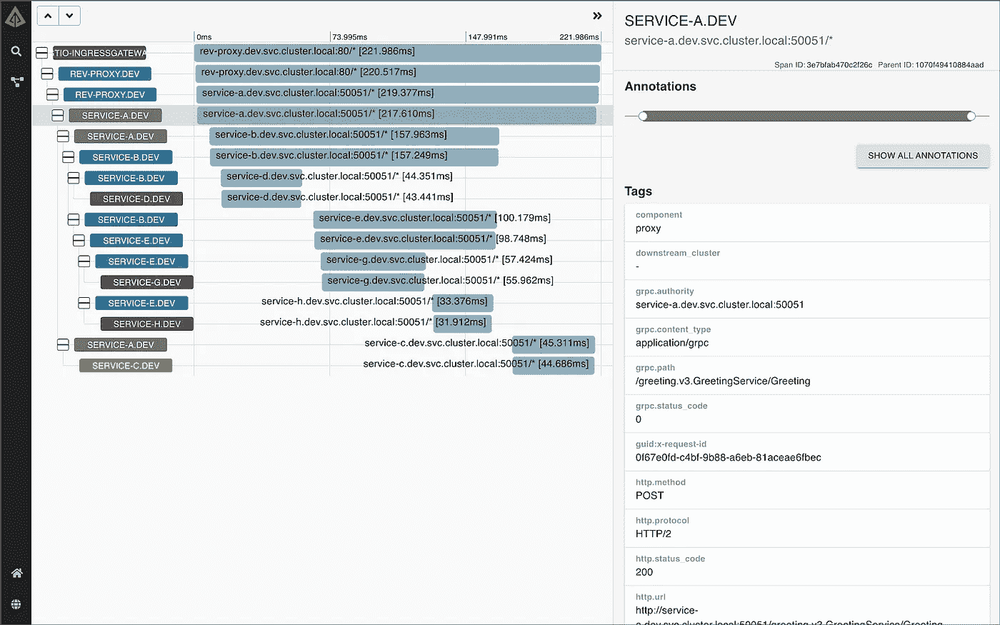

Zipkin 中分布式跟踪的详细视图

Zipkin 还可以基于分布式跟踪可视化一个依赖图。下面是一个 24 小时内的流量模拟示例，显示了参考平台组件之间的网络流量，以依赖关系图的形式显示。

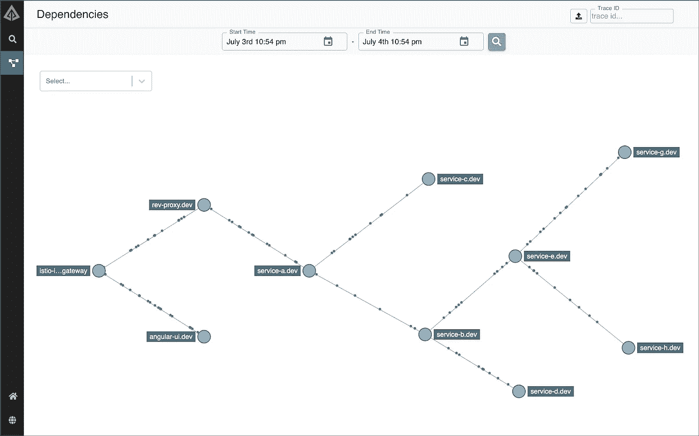

显示 24 小时内流量的 Zipkin 依赖图

# Kiali:微服务可观察性

根据他们的网站所说，Kiali 是一个基于 Istio 的服务网格的管理控制台。它提供了仪表板和可观察性，并允许您使用健壮的配置和验证功能来操作网格。它通过推断流量拓扑和显示网格的健康状况来显示服务网格的结构。Kiali 提供了详细的指标、强大的验证、Grafana 访问以及与 Jaeger 的分布式跟踪的强大集成。

如果您使用上一篇文章的第一部分中的[演示的 Istio addons 过程部署了 Kaili，请像访问其他工具一样访问 Kiali:](/kubernetes-based-microservice-observability-with-istio-service-mesh-part-1-of-2-19084d13a866)

```
istioctl dashboard kaili
```

为了提高安全性，使用 Istio 文档中提到的[可定制安装](https://istio.io/latest/docs/ops/integrations/kiali/#option-2-customizable-install)安装最新版本的 Kaili。使用 Kiali 的[Install via Kiali Server Helm Chart](https://kiali.io/documentation/latest/quick-start/#_install_via_kiali_server_helm_chart)选项添加了基于令牌的身份验证，类似于 Kubernetes 仪表板。


Kiali 的 Overview 选项卡提供了 Istio 服务网格中所有名称空间的全局视图，以及每个名称空间中应用程序的数量。

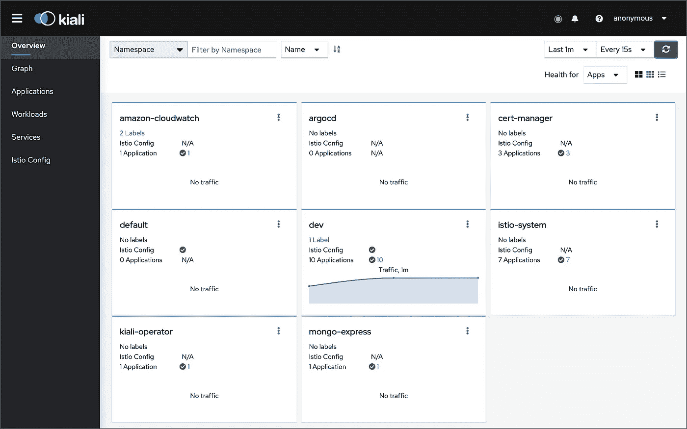

Kiali UI 中的 Graph 选项卡表示在 Istio 服务网格中运行的组件。下面，过滤集群的`dev`名称空间，我们可以观察到 Kiali 映射了 11 个应用程序(工作负载)、11 个服务和 24 个边缘(一个图形术语)。具体来说，我们看到位于服务网格边缘的 Istio Ingres 代理、gRPC 网关、Angular UI 和八个后端服务，所有这些服务都有各自的 Envoy 代理侧柜，它们都在接收流量(在本例中，服务 F 没有从另一个服务接收任何直接流量)、外部 DocumentDB 出口点和外部 Amazon MQ 出口点。请注意 Istio 中服务到服务的流量是如何流动的，从服务到它的 sidecar 代理，再到另一个服务的 sidecar 代理，最后到服务。

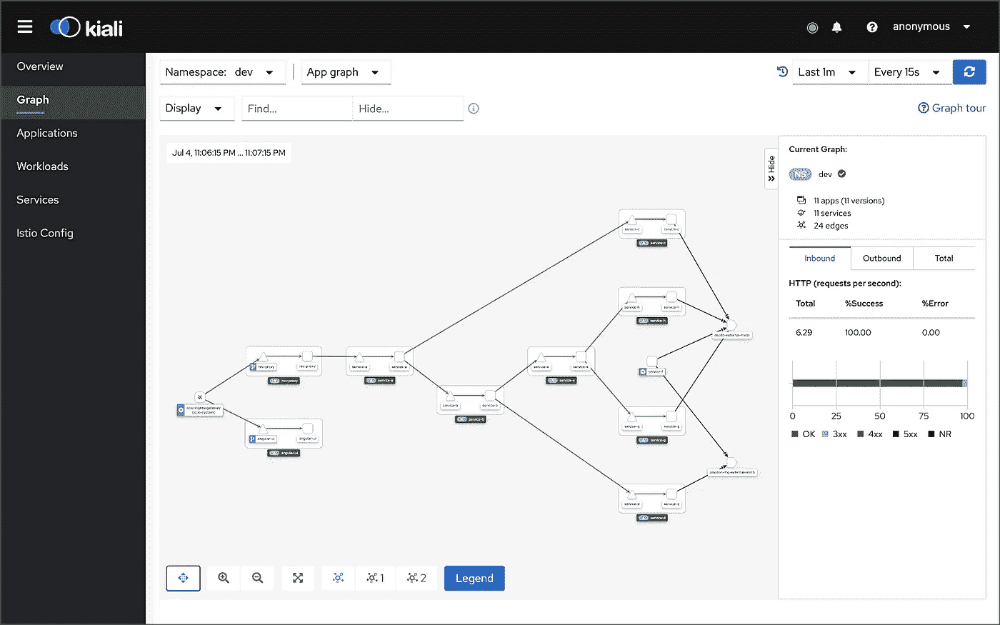

Kiali 允许您放大并关注图表中的单个组件及其各个指标。

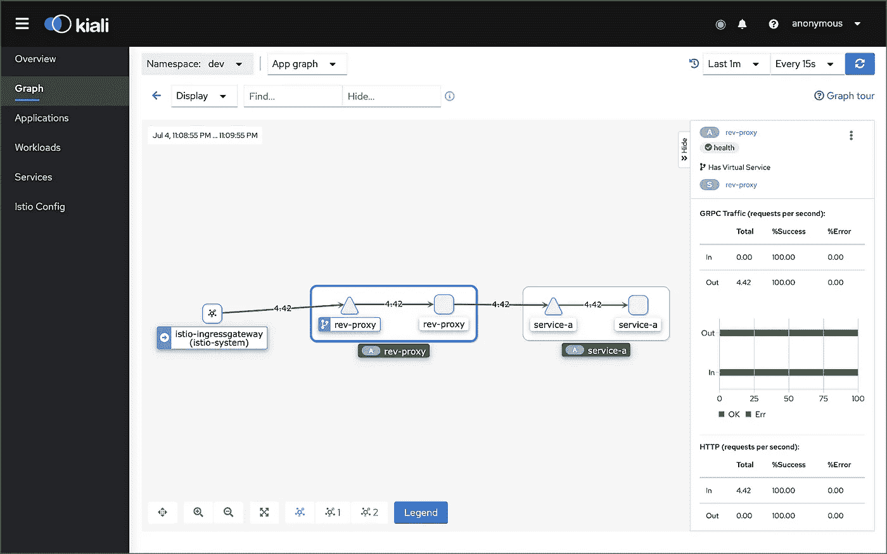

Kiali 还可以显示图中每条边的平均请求时间和其他指标(两个组件之间的通信)。Kaili 甚至可以使用 Kiali 的重放功能显示给定时间段内的这些指标，如下所示。

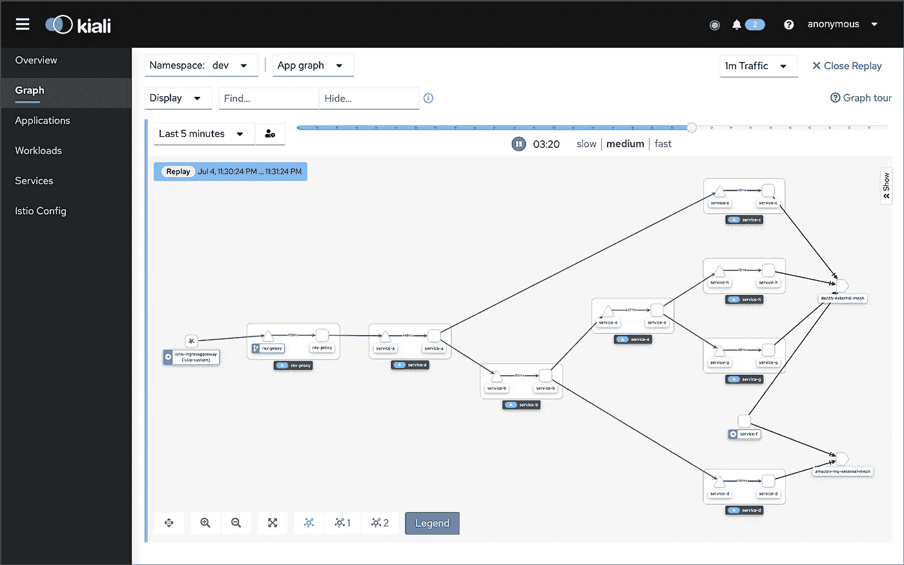

“应用程序”选项卡列出了所有应用程序、它们的名称空间和标签。

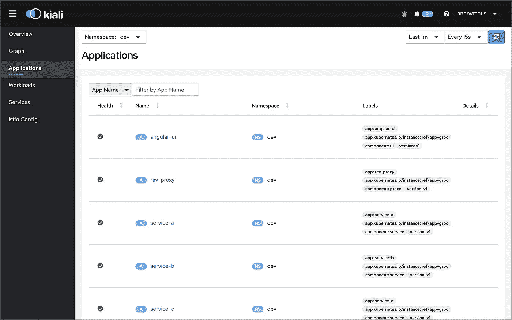

您可以在“应用程序”和“工作负载”选项卡上深入查看单个组件，并查看更多详细信息。详细信息包括总体运行状况、pod 和 Istio 配置状态。下面是对`dev`名称空间中服务 A 工作负载的概述。

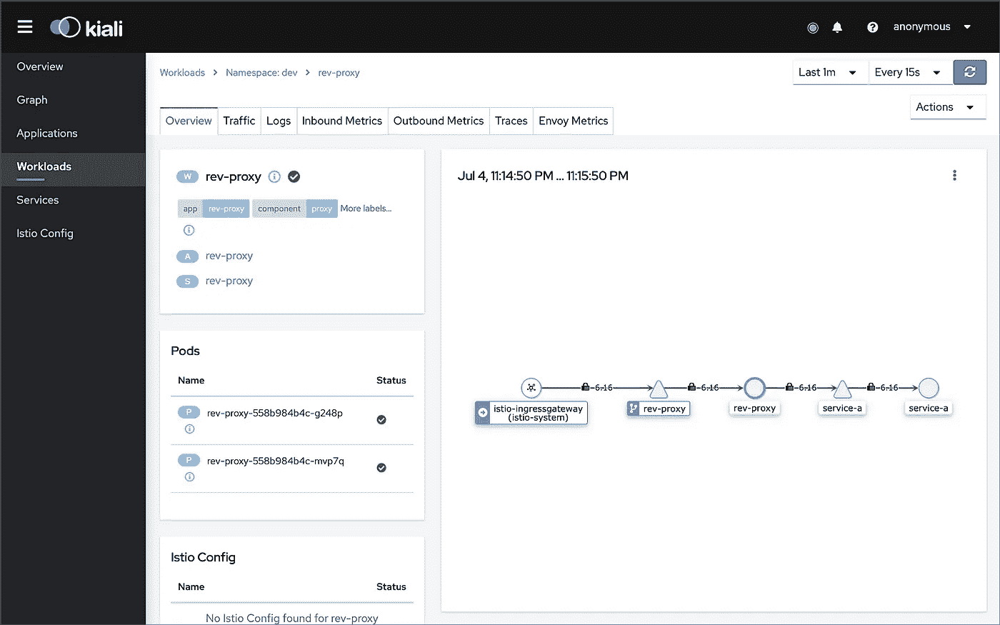

工作负载详细视图还包括入站和出站网络指标。下面是一个在`dev`名称空间中服务 A 出站的例子。

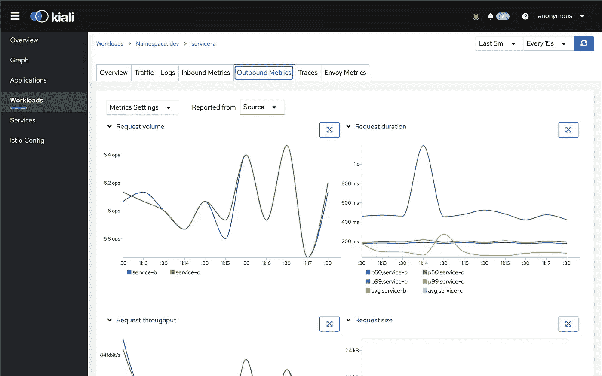

Kiali 还可以让您访问单个 pod 的集装箱日志。尽管日志访问不如前面讨论的其他日志源那样用户友好，但是在 Kiali 中，除了度量(与 Grafana 集成)、跟踪(与 Jaeger 集成)和网格可视化之外，还可以使用日志，这可以作为非常有效的单一观察平台。

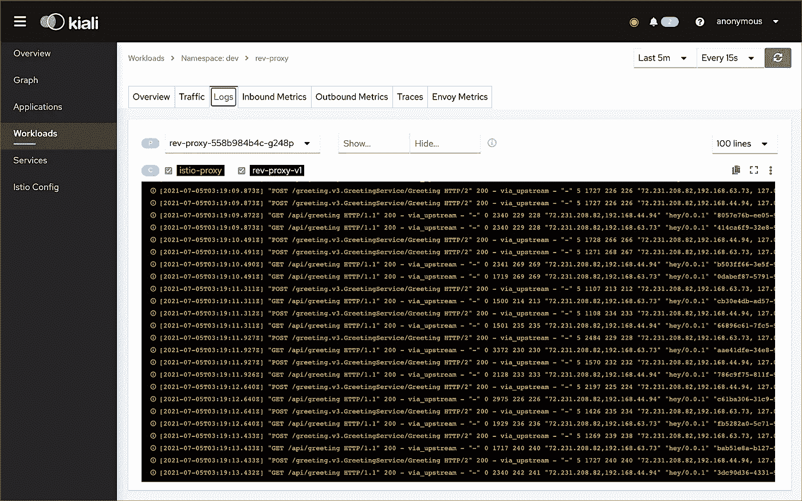

Kiali 还有一个 Istio 配置选项卡。Istio 配置选项卡显示用户环境中存在的所有可用 Istio 配置对象的列表。

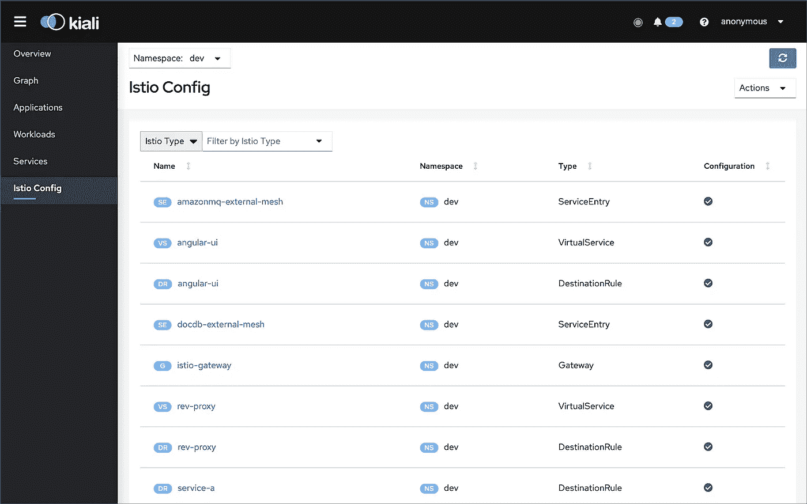

您可以使用 Kiali 来配置和管理 Istio 服务网格及其安装的资源。使用 Kiali，您实际上可以修改已部署的资源，类似于使用`kubectl edit`命令。

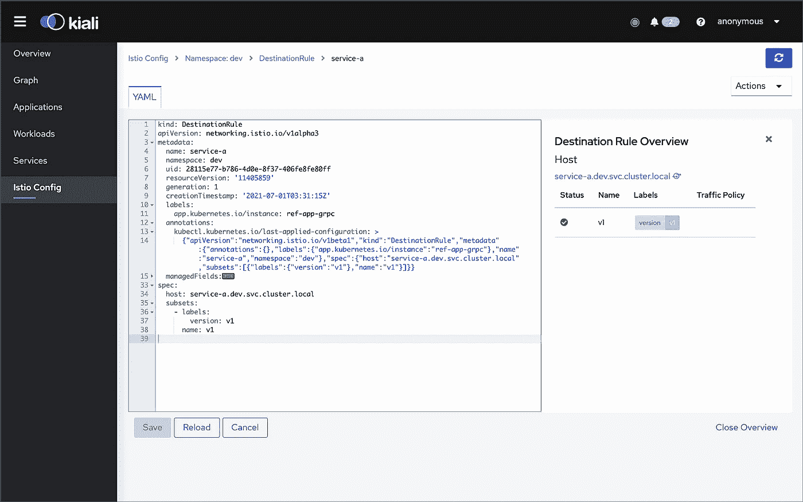

我经常发现 Kiali 是我解决平台问题的第一站。一旦我确定了有问题的特定组件或通信路径，我就会通过 Grafana 仪表板查看特定的应用程序日志和 Prometheus 指标。

# 拆毁

要拆除 EKS 集群、DocumentDB 集群和 Amazon MQ broker，请使用以下命令:

```
# EKS cluster
eksctl delete cluster --name $CLUSTER_NAME# Amazon MQ
aws mq list-brokers | jq -r '.BrokerSummaries[] | .BrokerId'aws mq delete-broker --broker-id **{{ your_broker_id }}**# DocumentDB
aws docdb describe-db-clusters \
    | jq -r '.DBClusters[] | .DbClusterResourceId'aws docdb delete-db-cluster \
    --db-cluster-identifier **{{ your_cluster_id }}**
```

# 结论

在这篇文章中，我们探索了一组流行的开源可观察性工具，它们很容易与 Istio 服务网格集成。这些工具包括用于分布式事务监控的 Jaeger 和 Zipkin，用于指标收集和警报的 Prometheus，用于指标查询、可视化和警报的 Grafana，以及用于 Istio 整体可观察性和管理的 Kiali。我们使用 Fluent Bit 完善了工具集，用于日志处理和转发到 Amazon cloud watch Container Insights。使用这些工具，我们成功地观察了部署到亚马逊 EKS 的基于 gRPC 的分布式参考应用平台。

这篇博客代表我自己的观点，而不是我的雇主亚马逊网络服务公司(AWS)的观点。所有产品名称、徽标和品牌都是其各自所有者的财产。