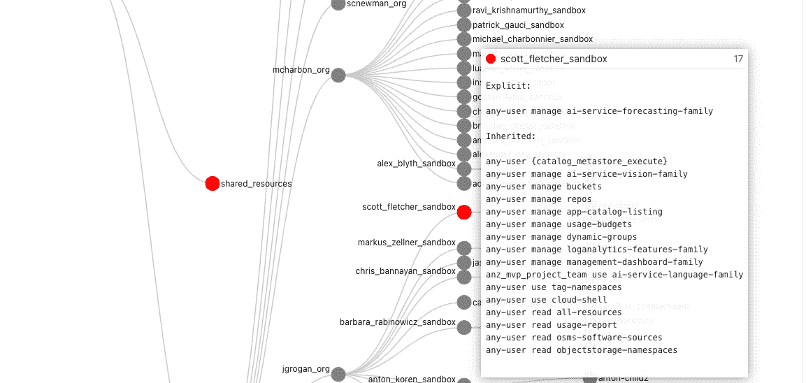
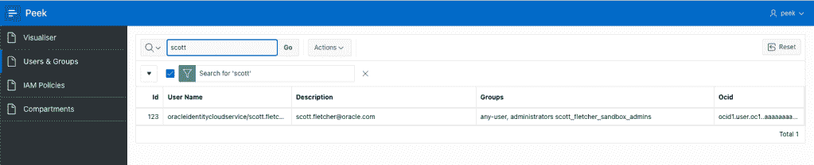

# OCI 用户访问检查变得简单

> 原文：<https://itnext.io/oci-user-access-review-made-easy-5393c9a7abfa?source=collection_archive---------5----------------------->

我相信我们都同意，采用云战略是很棒的。它提供了许多机会和好处。然而，云治理是一个困扰安全性、合规性和管理团队的持续问题，Oracle 等云供应商一直在努力解决这一问题。

如果你正在读这篇文章，你可能已经被问过或听过至少一次:

> 在我们的环境中，谁可以访问什么？
> 
> *-任何安全/合规经理*

答案应该简单明了。然而，现实可能是大量的手动时间和工作、电子表格，以及在云控制台上无休止的点击。如果你是手动操作，那么我同意，是时候你可以专注于更重要的任务了。

**试图回答这些问题的挑战:**

*   *存在哪些用户，他们属于哪些群体？*
*   *我的 OCI 租赁隔间结构是什么样的？*
*   *用户明确创建了哪些策略？*
*   *用户在我的租赁中有哪些权限？*
*   *我的租赁中是否有任何过度/不符合政策的&权限？*

这些复杂的关系不容易用类似表格的格式来表示和解释。在 OCI 生态系统中:

*   用户可以与身份提供者联合，并且可以属于一个或多个联合或本地 IAM 组，
*   可以为“任何用户”或一个组定义策略，
*   策略是继承的，这意味着它们适用于应用策略的所有子隔离专区。

为了简化工作，我使用 Oracle 工具和服务创建了一个名为“Peek”的解决方案来简化 OCI 租约和用户权限的审计。

注意:如果您拥有 IAM 域名而非 IDCS 的 OCI 租约，请使用这些说明[https://medium . com/@ scotti . Fletcher . 1/OCI-IAM-Domains-user-access-review-385 a580 F7 ba 0](https://medium.com/@scotti.fletcher.1/oci-iam-domains-user-access-review-385a580f7ba0)而不是下面的说明。

Peek 由一个带有 MySQL 的 Docker 容器、OCI CLI 和一个 Ruby 脚本组成，并使用 Oracle APEX 实例来查看数据和可视化这些复杂的关系。下面是一段演示和解释 Peek 的视频短片:

运行 Peek yourself 非常简单，只需 20 分钟即可完成设置。但是，在我们开始之前，您需要满足几个先决条件:

*   运行 Peek 容器的 [Docker](https://www.docker.com/) 环境，
*   对一个 [Oracle APEX](https://apex.oracle.com/en/) 实例的运行和管理访问权限，
*   一个 [OCI-CLI 配置文件](https://docs.oracle.com/en-us/iaas/Content/API/SDKDocs/cliconfigure.htm)，以及一个有效的 OCI API 密钥，供您的租户中具有[读取权限的用户使用](https://docs.oracle.com/en-us/iaas/Content/Identity/Concepts/policies.htm)，
*   以及可选的 [Oracle 身份云服务/ IAM 身份域实例](https://www.oracle.com/au/security/cloud-security/identity-cloud/)。

## **将 Peek 安装到 Oracle APEX 中**

首先，我们将 Peek 应用程序安装并配置到您的 APEX 实例中。如果您没有现有的 APEX 实例，您可以通过 OCI 控制台创建一个。

1.  使用默认设置创建 APEX 实例，例如数据库版本 19c、1 OCPU、1TB 存储或您希望使用的设置。
2.  使用您在创建过程中指定的管理员用户密码登录 APEX 实例。
3.  点击“创建工作区”，输入
    数据库用户:PEEK
    密码:<强密码>
    工作区名称:PEEK
4.  点击“登录查看”，它显示在页面顶部的绿色警告框中。
5.  输入您在步骤 3 中创建的用户凭据。
6.  从 Github 下载 Peek 应用程序 ZIP 文件[https://Github . com/scotti-Fletcher/Peek-apex/blob/main/Peek-apex-1.0 . ZIP](https://github.com/scotti-fletcher/peek-apex/blob/main/peek-apex-1.0.zip)
7.  从 App Builder 下拉菜单中选择“导入”。
8.  选择下载的文件，确保选择了文件类型“数据库应用程序、页面或组件导出”，然后单击下一步。
9.  将显示文件导入确认，单击下一步。
10.  将显示安装数据库应用程序，您可以接受所有默认值。单击“安装应用程序”。
11.  将显示安装应用程序确认，单击下一步。
12.  单击安装。
13.  单击“编辑应用程序”。
14.  从 SQL Workshop 下拉菜单中选择“SQL 脚本”。
15.  从 Github 下载 Peek 应用程序数据库脚本[https://Github . com/scotti-Fletcher/Peek-apex/blob/main/Peek-apex-db . SQL](https://github.com/scotti-fletcher/peek-apex/blob/main/peek-apex-db.sql)
16.  编辑 SQL 文件，并将 p_email_address 和 p_web_password 的值更新为您想要使用的值。强烈建议您选择一个新的、唯一的、强密码。
17.  点击上传，选择您在第 15 步下载并在第 16 步编辑的文件，在脚本名称中输入“Install ”,点击上传。
18.  在上传的脚本上单击运行按钮。
19.  单击“立即运行”。
20.  点击右上角菜单中的“管理用户和组”。
21.  单击 API 用户。
22.  点击“分组分配”
23.  从左侧列表框中选择所有“oracle.dbtools.role.autorest.*”组，并将其添加到右侧列表框中。
24.  单击“应用更改”
25.  要确认您的 APEX ORDS RESTful 服务配置正确，您可以运行:
    `curl -i -k --user API:<password from Step 16> https://<your apex hostname>/ords/peek/grant/`
    ，您应该会收到一个带有 JSON 主体的 HTTP 200 响应。

## **如果您有 Oracle 身份域云服务**

这部分是可选的。但是，如果您使用 IDCS 来映射和可视化 IDCS / IAM 组关系，我们必须配置 IDCS，以允许我们的 Docker 容器从 IDCS API 检索信息。

*注意:Oracle 身份云服务正在成为 OCI IAM 身份域。在不久的将来，我将更新该指南，以包括特定于身份域的说明。*

1.  登录您的 Oracle 身份云服务控制台。
2.  从左侧菜单中选择应用程序。
3.  点击“添加”，选择“机密应用”创建一个新的应用。
4.  将应用程序命名为“Peek”，可以选择提供描述，然后单击“下一步”。
5.  选择“立即将此应用程序配置为客户端”并选中“资源所有者”复选框。
6.  向下滚动至“授予客户端对 Identity Cloud Service 管理 API 的访问权限”,然后单击添加。
7.  选择“审计管理员”并单击添加。
8.  向上滚动并单击下一步。
9.  在“向其他应用程序公开 API”页面上，选择“以后跳过”，然后单击“下一步”。
10.  在“Web 层策略”页面上，选择“以后跳过”，然后单击“下一步”。
11.  单击“完成”,将显示您的客户端 ID 和客户端密码。将这些记录在文本文件中以备后用，然后单击关闭。
12.  点击“激活”。这一点很重要，否则您的 API 调用将会失败。

## **收集所需的输入值**

在运行 docker 容器之前，我们首先需要收集 Docker 容器中运行的 Ruby 脚本所需的一些附加细节，具体来说:

*   你在 OCI 的租约 OCID。
*   OCI IAM 网址。
*   APEX 实例的 URL。
*   您为 APEX API 用户创建的凭证。
*   您的本地目录的完整路径，您的 OCI 配置和。pem 密钥存在。

如果您有一个 IDCS 实例:

*   先前创建的 IDCS 客户端 ID。
*   先前创造的 IDCS 秘密。
*   您的 IDCS 实例的 URL。
*   IDP 集成的 OCID。

下面是如何获得这些值的说明。我建议在文本文件中记下它们的值，因为我们将把这些值作为环境变量传递给 Docker 容器。

## **寻找您的 OCI 租赁 OCID**

在 OCI 控制台中，导航到“身份和安全”并单击隔离专区。您的租赁 OCID 应该是第一行，悬停在 OCID，然后单击复制

在文本编辑器中添加一行:

`OCI_TENANCY_OCID = <value from clipboard>`

## **查找您的 IAM 网址**

您的 IAM 网址将是`https://identity.<oci-region>.oraclecloud.com`。您需要将“< oci-region >”替换为您订阅的地区之一。举个例子，我的 URL 看起来像`[https://identity.ap-sydney-1.oraclecloud.com](https://identity.ap-sydney-1.oraclecloud.com)`

替换后，将该行添加到您的文本编辑器中:

`OCI_IAM_URL = https://identity.<oci-region>.oraclecloud.com`

## **查找您的 APEX 网址**

从 OCI 控制台单击“启动 Apex ”,并从您的 web 浏览器地址栏复制主机名。例如，URL 看起来像`https://yj6g7sq14zvoj-peek.adb.ap-sydney-1.oraclecloudapps.com`。请注意，结尾不应该有尾随的正斜杠。

将这一行添加到文本文件中:

`APEX_URL = <Your APEX URL>`

## **找到你的 OCI 配置目录**

OCI CLI 配置通常位于~/中。oci/。配置文件必须包含 Docker 容器将使用的默认配置文件。~/。oci/ directory 还必须包含。pem 键。如果您的~/中有多个配置文件。oci/config 文件，您可能希望创建一个单独的目录，只包含 config 和。pem 键仅用于此活动。举个例子我的~/。oci/目录看起来像:

`scott@scott-mac ~ % ls -alh /Users/scott/.oci
drwxr-xr-x 6 scott staff 192B 15 Jun 14:59 .
drwxr-x---+ 58 scott staff 1.8K 20 Jun 11:55 ..
-rw-------@ 1 scott staff 1.7K 7 Apr 15:12 mykey.pem
-rw-------@ 1 scott staff 610B 15 Jun 14:59 config`

注意，我使用的是目录的完整路径，在将这个目录挂载到 Docker 容器时，我将使用这个完整路径。

如果您没有配置联盟，您可以跳到[运行 Peek Docker 容器](https://redthunder.blog/2022/06/20/oci-user-access-review-made-easy/#runningpeek)

## **查找您的 IDCS 网址**

在 OCI 控制台中，导航到“Identity & Security ”,然后单击“Federation ”,单击您的联合提供商，例如，我的联合提供商名为 OracleIdentityCloudService。

从显示的“Oracle Identity Cloud Service Console”URL 中复制主机名(不含路径)。例如，它看起来像`[https://idcs-5dfhhd61c419aad5d31c8.identity.oraclecloud.com](https://idcs-5dfhhd61c419aad5d31c8.identity.oraclecloud.com)`

将此行添加到您的文本编辑器中:

`IDCS_URL = <Your IDCS URL>`

## **查找您的 IDP ID**

要获取您的 IDP ID，请运行 OCI 命令行界面命令:

`oci iam identity-provider list --protocol SAML2 --compartment-id <your tenancy OCID>`

这将返回一个 JSON 响应，因为它是一个“id”字段。例如，它看起来像`ocid1.saml2idp.oc1..aaaaaaaaosb62razrasjddsjdsjjsdsbto655kdfvow5ipfb4i7yina`

将这一行添加到文本文件中:

`IDP_ID = <your IDP OCID>`

最后，将这些值添加到文本文件中:

`IDCS_CLIENT_ID = <Client ID from Step 11>
IDCS_SECRET = <Secret from Step 11>`

# **运行 Peek Docker 容器**

在我们运行 Docker 容器之前，您需要确保您的文本文件中有所有正确的值。它应该包含以下值:

`APEX_USERNAME=API
APEX_PASSWORD=<Password from Step 16>
OCI_TENANCY_OCID=<Your Tenancy OCID>
OCI_IAM_URL=<Your IAM URL>
APEX_URL=<Your APEX Hostname>
#If you're using IDCS
IDCS_CLIENT_ID=<Client ID from Step 11>
IDCS_SECRET=<Secret from Step 11>
IDCS_URL=<Your IDCS Hostname>
IDP_ID=<Your IDP OCID>`

通过运行以下命令提取 Docker 容器

`docker pull scottfletcher/oci-peek:latest`

使用以下命令从映像启动 Peek Docker 容器:

`docker run -it --name peek \
--mount type=bind,source=/Full/Path/To/.oci/,target=/root/.oci/,readonly \
-e OCI_TENANCY_OCID=<from text file> \
-e OCI_IAM_URL=<from text file> \
-e APEX_URL=<from text file> \
-e APEX_USERNAME=API \
-e APEX_PASSWORD=<from text file> \
-e IDCS_URL=<from text file> \
-e IDP_ID=<from text file> \
-e IDCS_CLIENT_ID=<from text file> \
-e IDCS_SECRET=<from text file> \
scottfletcher/oci-peek`

注意:您需要将/Full/Path/替换为/。oci/ value 到您的本地目录，如前面所解释的。还要确保您的键名、等号和值之间没有空格，如图所示。

Docker 容器将启动，信息将填充到 APEX 实例中。填充用户和组大约需要 5-10 分钟，之后您将能够在 APEX 应用程序中看到这些结果:

根据租户中用户、组、隔离专区和策略的数量，整个过程可能需要一个小时左右才能完成。

映射用户和组、隔离舱和策略后，可视化树将开始填充。随着每个用户权限树的创建，它将通过 API 被推送到 APEX，您可以开始您的用户访问检查。

当这个过程完成后，容器中的 Ruby 脚本将会终止，您可以在终端的 Docker 输出中看到这一点。然后，您可以停止 Docker 容器。

要重新运行该流程，只需启动另一个 docker 容器。存储在 APEX 数据库中的所有先前结果将被删除，新结果将被填充。

关于如何在 Peek 中查看和解释数据的更多信息，我建议观看本文开头的视频。

## **一些最终意见**

*   如本文所述，使用随机生成的强密码。还要注意凭证存储在哪里，以及谁可以访问它们。
*   作为一名安全从业者，我总是建议在运行代码之前检查它。脚本代码位于 Docker 容器的/peek 中
*   如果你有任何问题，想要一些解释结果的帮助，请随时与我在 scott.fletcher@oracle.com 联系。
*   最后，我将在下一个版本中更新该解决方案，以便与 IAM 身份域一起使用。如果你想在那之前使用 Peek，请在评论中告诉我。

我希望这篇文章对你有所帮助，也希望它是帮助你进行 OCI 用户访问审查的有用工具。

*原载于 2022 年 6 月 20 日*[*http://red thunder . blog*](https://redthunder.blog/2022/06/20/oci-user-access-review-made-easy/)*。*