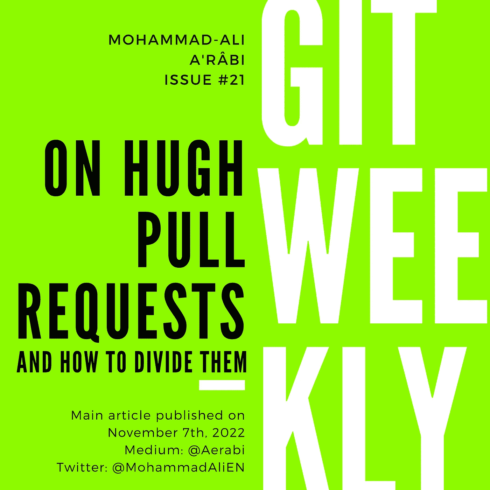

# 巨大的拉动请求

> 原文：<https://itnext.io/of-the-huge-pull-requests-b851d45fe9e?source=collection_archive---------0----------------------->

## 以及如何划分它们

[Git 周刊](https://medium.com/@aerabi/list/git-weekly-9fe103e35b4b) #21
等级:中级🥈

让一个工程师检查一个有 20 行代码变更的拉请求，他们会发现其中有 10 个问题。让他们回顾 500 行变更，他们会说 LGTM——在我看来不错。



我不喜欢大尺寸的 PRs。我完全反对在一次公关中解决多个问题。在我上一个工作场所，我做得太过分了，对拉取请求设置了以下规则:

1.  “拉”请求中的变更不能超过 500 行，
2.  所有提交消息都必须遵循特定的格式，
3.  当 PR 被接受时，它必须被压缩成一个提交，然后这个提交被 ff 合并。

规则(1)之所以存在，是因为超过 500 行太大了，除非有特殊情况，并且有大量自动代码更改，例如从 NPM 包锁版本 1 升级到版本 2。这是我们案例中唯一的例外，因为我们没有提交任何其他自动生成的代码。

尽管 500 行代码变更是极限，我们试图创造一种更小的 PRs 的文化。

规则(2)也分两部分执行:

*   我们有一个提交消息 linter 来检查提交消息，
*   我们有一些软规则，例如，提交消息必须包含一个到它正在解决的问题的链接。

然后，根据规则(3)，我们有一个规则，即每个公关必须解决一个问题。如果代码中缺少某些东西，我们想要解决它，那么我们必须首先在问题跟踪系统中创建一个问题，然后在 PR 和提交消息中链接它。这有助于提高可见度。

# 重大问题

到目前为止一切顺利。但有时问题又太大了。假设“将该服务迁移到 AWS”。这对于单个 PR 和单个 commit 来说都太大了。

这就是我们通常的工作方式:

*   创建特征分支，
*   开始解决这个问题，做一些小的承诺，
*   公开公关评论，
*   当一切正常时，将提交压缩成一个。

为什么？因为:

1.  拥有多次提交有助于更好地审查和更好地处理代码审查。您可能只是回复一个提交来处理一个评论。评论者可能对正在发生的事情有更好的理解。如果您在单独的提交中处理注释，那么在处理注释时会有更好的可视性。
2.  如果你做了多次提交，然后意识到 PR 太大，你可以把它分成几份，例如，为每一次提交创建一个新的 PR，然后让他们分别被检查。

> 你承诺的越多，你就越能灵活地将一份公关分成多份。

# 如何分解拉取请求

让我们假设在您的分支中有 3 个提交，您想从它们中生成 3 个单独的 PRs。首先，做一个 git 日志，在某个地方记录提交散列。

```
git log --oneline
```

回应与此类似:

```
**e6e9196** (HEAD -> aerabi/fix-icon, origin/aerabi/fix-icon) :gear: Add build and push scripts
**3dc3a5a** :pencil: Update the README **df059e5** :wrench: Add icon and update metadata
**30c4219** (origin/master, master) :wrench: Load the list of Git Weekly issues and render it (#2)
**4d5389c** :pencil: Add README
**41d064b** :gear: Initial commit
```

因此，我们希望从这 3 个提交中产生 3 个分支:

*   ⚙️添加构建和推送脚本
*   📝更新自述文件
*   🔧添加图标并更新元数据

## 三个简单的 PRs

回到主分支，并从中创建一个新分支:

```
git switch master
git switch -c aerabi/add-icon-and-metadata
```

然后仔细挑选第一个提交:

```
git cherry-pick **df059e5**
```

提交将被带到这个分支。然后，从这个分支上创建另一个分支，并在那里进行另一次精选:

```
git switch -c aerabi/update-readme
git cherry-pick **3dc3a5a**
```

下次再做一次:

```
git switch -c aerabi/add-build-and-push-scripts
git cherry-pick **e6e9196**
```

通过这样做，我们创建了 3 个分支，每个分支都在另一个分支之上。然后，我们将它们推送到远程分支机构，并从中创建 PRs。

> 注意:让它们一个一个地合并，一旦前面的合并了，就把剩下的重新组合。

## 四个 PRs

如果其中一个提交也很大，我们需要将它分解成两个或更多的提交，那么我们需要在开始前面提到的过程之前这样做。

要了解如何分解提交，请参考以下文章:

*   [在 Git 中拆分提交](/git-split-commit-b42a609a6bf3)

# 最后的话

Git 有[三种合并分支的方式](/git-merge-vs-rebase-938950fb218)。人们可以简单地进行挤压合并，而不是挤压然后进行 ff 合并。我倾向于前者，原因如下:

*   当进行挤压合并时，通常发生在 git 软件中，例如 GitHub 或 GitLab。进行挤压合并的人可以在点击合并按钮之前编辑提交消息。首先，合并者可以是维护者或评审者，这与作者不是同一个人，我相信作者是必须编写或修改提交消息的人。其次，如果您有一个检查提交消息的 CI 作业，它不能检查在 GitHub 上动态编辑的提交消息。
*   进行 ff-merge 将使 git 更容易理解合并到主节点的提交是 feature 分支中的同一个提交，并使重新定基更容易。

我每周都会在 git 上写一篇博文。

*   [订阅](https://medium.com/subscribe/@aerabi)my Medium publishes，以便在新一期 Git 周刊出版时获得通知。
*   在 Twitter 上关注[我，了解更多其他平台上发布的更新和文章。](https://twitter.com/MohammadAliEN)