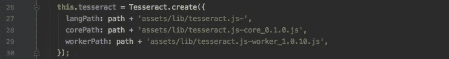
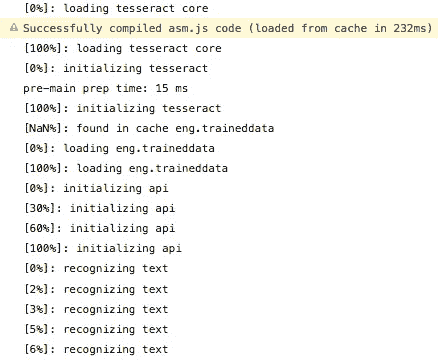

# 使用 TesseractJS 和 Ionic 的离线 OCR

> 原文：<https://itnext.io/offline-ocr-with-tesseractjs-and-ionic-5054fc7eef86?source=collection_archive---------3----------------------->


你可能有一千个理由希望在你的下一个应用程序中使用光学字符识别(OCR ),谷歌和亚马逊都是完成这项任务的强大云工具。

当您处理敏感数据和/或需要您的应用程序 100%离线运行时，事情会变得更加有趣。

在我开发识别数字的离线应用的过程中，我遇到了 Ionic 和 Cordova 的多个存储库。有些已经过时，有些根本不起作用。几乎所有的文本识别库都是基于[宇宙魔方](https://github.com/tesseract-ocr/tesseract)，包括流行的[宇宙魔方](https://github.com/naptha/tesseract.js)。

现在，TesseractJS 已经有了很好的文档，应该很容易启动和运行。然而，在撰写本文时，您会在自述文件中提供的 CDN 链接上遇到 404。此外，在为我的应用程序项目进行*本地安装*时，我遇到了其他几个障碍，我将在本文中解决这些问题。

# 从爱奥尼亚开始

*如果你对建立一个 Ionic 项目不感兴趣，你可以跳过这一部分。*

假设你已经安装了 [Ionic，](https://ionicframework.com/getting-started)如果你还没有的话，继续创建一个新项目。

```
ionic start tesseractApp blank
```

在您的新项目中，我们将继续安装`tesseract.js`并创建一个**提供者**。如果你不知道提供者是什么，它是一个服务类，我们将在其中实现我们的 OCR 逻辑，以便稍后在整个应用程序的任何地方使用。

```
cd tesseractApp
npm install tesseract.js --save
ionic g provider OcrProvider
```

在您喜欢的编辑器中打开新的提供者`src/providers/ocr/ocr.ts`。让我们导入宇宙魔方，它看起来像这样:

```
**import** { Injectable } **from** '@angular/core';
**import** Tesseract **from** 'tesseract.js';

@Injectable()
**export class** OcrProvider { constructor() {
    console.log('Hello OcrProvider');
  }}
```

此时，您实际上已经准备好在应用程序中使用 Tesseract 类了。但是我们还没有完成，我们想要一个本地的，100%离线安装。

# 让宇宙魔方离线工作



如果您阅读过 GitHub 上的 TesseractJS 自述文件，您会看到本地安装的说明，要求您在使用识别功能之前创建一个 Tesseract 实例。

```
Tesseract.create({
    workerPath: '/path/to/worker.js',
    langPath: '/path/to/lang/',
    corePath: '/path/to/core.js',
});
```

## 在爱奥尼亚启动宇宙魔方

在我们的 Ionic 项目中，让我们将上面的片段放在我们的`OcrProvider`的`constructor`中:

```
**import** { Injectable } **from** '@angular/core';// Import Tesseract. **import** Tesseract **from** 'tesseract.js';

@Injectable()
**export class** OcrProvider { /**
   * Add a variable for our tesseract instance.
   */  
  private readonly **tesseract**; constructor() {
    console.log('Hello OcrProvider'); /**
     * Create our tesseract instance.
     */
    **this**.tesseract = Tesseract.**create**({
      **workerPath**: '/path/to/worker.js',
      **langPath**: '/path/to/lang/',
      **corePath**: '/path/to/core.js',
    }); }}
```

上面我们在`OcrProvider`的开头声明了一个变量`tesseract`。如果你想知道`private readonly`的语法，`private`意味着变量只能从`OcrProvider`内部访问，`readonly`保护变量不被`constructor`之外的任何地方更改。

## 获取本地宇宙魔方文件

对于我们的宇宙魔方安装，我们需要三种类型的文件。

1.  TesseractJS 工作者
2.  训练有素的语言文件
3.  宇宙魔方核心

你可以从 *naptha* 的 GitHub repo 的 [dist 文件夹](https://github.com/naptha/tesseract.js/tree/master/dist)中直接抓取`worker.js`和`core.js`。

这些文件在 Ionic 应用中的一个好位置可能是:`src/assets/lib`(新目录)。


现在，我们需要拿到语言文件。通常它们可以在 [tessdata_best](https://github.com/tesseract-ocr/tessdata_best) 下的原始宇宙魔方存储库中找到。但是 TesseractJS 期望**gzipped***trained data，如果你想节省带宽或者保持你的应用包较小，这是很有意义的。*

*如果我们没有在本地配置中运行 TesseractJS，我们可以从同一个地方获取那些 gzipped traineddata 语言文件，就像 tessera ctjs 会下载它们一样:*

```
*https://cdn.rawgit.com/naptha/tessdata/gh-pages/3.02/*
```

*也就是说 *naptha* 的另一个 GitHub repo:*

*[**https://github.com/naptha/tessdata/tree/gh-pages/3.02**](https://github.com/naptha/tessdata/tree/gh-pages/3.02)*

*获取所有你需要的语言，并将它们保存在`assets`下的新`lib`文件夹中。为了清楚起见，我在我的文件前面加上了 *tesseract.js-* ，所以`eng.traineddata.gz`变成了`tesseract.js-eng.traineddata.gz`。*

*最后，用新路径调整您的`OcrProvider`:*

```
***this**.tesseract = Tesseract.**create**({
  **workerPath**: '/assets/lib/tesseract.js-worker_1.0.10.js',
  **langPath**: '/assets/lib/lang/tesseract.js-',
  **corePath**: '/assets/lib/tesseract.js-core_0.1.0.js',
});*
```

# *使用 Tesseract.js 从图像中识别文本*

**

*现在该喂野兽了。如果您有一个数据 url (base64 编码的图像)或一个 HTML ``元素，这两者都是好的。对于``元素，确保等待它加载。*

*在 Ionic 或 Angular 中，您可以使用`(load)`事件发射器:*

```
 **
```

*在普通的 JavaScript 中，您可以挂钩到`onload`:*

```
**
```

*所以让我们已经认识了一些数字！向您的 OcrProvider 添加一个方法，例如`public recognizeText(image)`，它与 Tesseract 交互，如下所示:*

```
*const tesseractConfig = {
  // If you want to set the language explicitly:
  **lang**: 'eng', 
  // You can play around with half-documented options:
  **tessedit_char_whitelist**: ' 0123456789',
};**this**.tesseract.**recognize**(image, tesseractConfig)
  .**progress**((v) => {
    // v.status is a textual string of what Tesseract is doing
    // v.progress is a 0 - 1 decimal representation of the progress.
    // The progress resets for each new v.status,
    // but the major event is v.status == "recognizing text**".** console.log(v.status, status.**progress**);  })
  .**catch**((err) => {
    console.error('OcrProvider: Failed to analyze text.', err);
  })
  .**then**((result) => {
    // Result contains these elements:
    // blocks: Array
    // confidence: 0 - 100
    // html: string
    // lines: string[]
    // oem: "DEFAULT"
    // paragraphs: string[]
    // psm: "SINGLE_BLOCK"
    // symbols: Array
    // text: string
    // version: "3.04.00"
    // words: string[] // I chose to use a regex to find the 
    // correct format out of result.text.  
  });*
```

## *接下来*

*如果你想看我如何使用 Ionic Native [相机预览](https://ionicframework.com/docs/native/camera-preview/)插件让用户在自定义帧内查看、调整和拍摄某些东西，然后再将它们传送到宇宙魔方，请告诉我！*

# *让我们压扁一些虫子*

*这里有几个问题，你最好早点想到，而不是像我一样，相信一切都正常，然后花几个小时调试。来自宇宙魔方的错误消息往往非常隐晦，甚至很难被识别为来自宇宙魔方。*

## *DataCloneError:无法克隆对象*

*在完成了下载 TesseractJS、语言训练数据文件和建立一个新的 Ionic 项目的所有工作之后，这个错误消息可能意味着任何事情。相反，它实际上表明一切都在工作——至少几乎是这样。宇宙魔方还活着，还在呼吸，但是你给了它一些它不理解的图像数据。Woops，说说清楚的错误信息。*

*如果你碰巧用`@ViewChild('myImg') img;`得到了你的图像，确保用`this.img.nativeElement`提供宇宙魔方。*

## *Tesseract.reconize 不返回承诺*

*它看起来很熟悉它的`catch`和`then`回调方法，但是和`progress`一起，它并不是一个常规的承诺。我试图把它链接成一个常规的承诺，结果有些混乱，所以我最后把它包装成这样:*

```
*return new Promise<string>((resolve, reject) => { **this**.tesseract.**recognize**(image)
    .**progress**((v) => console.log(v))
    .**catch**((err) => reject(err))
    .**then**((result) => resolve(result.text));});*
```

## *无法扩大内存阵列*

*同样，很难找到任何关于这个错误的具体参考。我的结论是，宇宙魔方核心是用一些固定大小的内存数组编译的。我试图用各种建议的参数手动配置内存数组的大小，但是没有任何帮助。*

*最后，我使用了缩放和裁剪相机拍摄的图像的组合。显然，为了保持宇宙魔方预测的准确性，我们不想过多地牺牲图像质量，但在我的例子中，我知道用户将要拍摄的媒体格式，并围绕它建立一个框架。当用户调整框架内的文本时，我可以通过编程将图像裁剪成三部分，并通过 Tesseract 一次运行一部分。*

*如果有人知道如何扩大内存数组，请告诉我！*

## *语法错误:无法在“assets/lib/tessera CT . js-worker _ 1 . 0 . 10 . js”处加载工作脚本*

*因此，这个“语法错误”是那些真正让你毛骨悚然的神秘信息之一。当您从错误中复制/粘贴路径时，文件加载正常。但是 Tesseract.js 试图告诉您，它更喜欢本地文件的完整路径。*

*该解决方案将使主机可以在`Tesseract.create`中的三个路径中的每一个路径前添加前缀。*

```
*const host = window.location.protocol + '//' 
  + window.location.hostname
  + (window.location.port ? ':' + window.location.port : '')
  + '/';*
```

***Woops，这个在安卓上不行。***

*我个人正在努力寻找一个好方法来确定我们心爱的`assets`目录的完整路径，跨平台！以上用`ionic serve`就可以了，但是由于安卓的“主机”看起来更像`file://android_asset/`，所以上面的`host`就只是`file:///`。*

*这里有一个丑陋的*主机*适用于 Android、iOS *和* `ionic serve`:*

```
***const** href = window.location.href;**const** hashIndex = href.indexOf('#');**const** lastSlashIndex = href.substr(0, 
  hashIndex > -1 ? hashIndex : **null** ).lastIndexOf('/');**const** host = href.substr(0, 
  lastSlashIndex > -1 ? lastSlashIndex : **null** ) + '/';*
```

## *Android 上的 Traineddata 语言文件消失了*

*另一个问题是关于它的文档很少，不是关于宇宙魔方，而是一般的 Android！所以貌似安卓不喜欢**。gz** 文件，有些人用它来完全阻止他们的项目构建。*

*在 Ionic/Cordova 中，似乎这个问题已经通过剥离他们的**文件而被*解决了。gz*** 扩展。因此，我们的项目构建成功，只有当我们启动应用程序时，我们才意识到 traineddata 语言文件已被重命名，无法由 Tesseract 加载。*

*我到处寻找如何包含**。Android 应用中的 gz** 文件，最终放弃，发现了一些好消息！traineddata.gz 文件不是由巨大的宇宙魔方核心加载的，而是由未缩小的`worker.js`加载的。*

*它就在 8421 行的显眼位置:*

```
*8420**: var** lang = req.options.lang;
8421**: var** langfile = lang + '.traineddata.gz'; // Hello, friend!
8422**: var** url = req.workerOptions.langPath + langfile;*
```

*解决办法很明显！我只是重命名了我的 traineddata 语言文件，去掉了**。gz** 扩展我自己，所以没有机器人可以为我做。然后剥离掉**。gz** 在`worker.js`线 8421 也一样，瞧！*

*`tesseract.js-eng.traineddata.gz`变成了`tesseract.js-eng.traineddata`*

*(记住这仍然是一个 gzip 文件)。*

*如果有人知道是怎么回事。gz-Android 上的文件，请告诉我！*

*我希望你学到了一些东西，我知道我做到了。*

*如果这以任何方式帮助了你，请留下评论和一个或五个掌声。*

*我错过了什么吗？还是你在纠结一些我忘记掩盖的错误？告诉我，我会尽力帮忙的。*

***更新:**在多次请求演示该功能的工作库之后，我现在已经创建了一个:【https://github.com/westphalen/ionic-tesseract-app】T2*