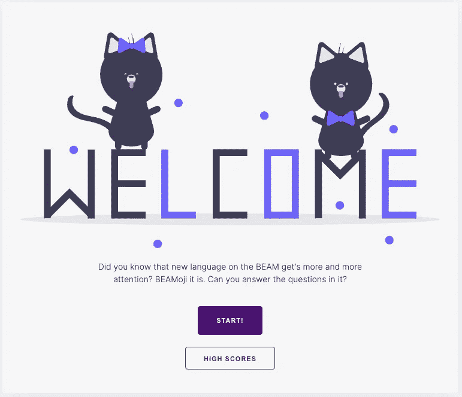

# 哦，二郎！🤯

> 原文：<https://itnext.io/oh-erlang-885379e8bf7e?source=collection_archive---------4----------------------->

## 我们为#SpawnFest 2021 做了什么

差不多十年了，我耐心但积极地等待着。最后，时候到了！我能够再次参加我一直最喜欢的黑客马拉松:[](https://spawnfest.org)*。在本文中，我将展示 Mariano、 [Manuel](https://medium.com/u/7081b45b4fd3?source=post_page-----885379e8bf7e--------------------------------) 、Tetiana 和我如何在过去的 48 小时内尽可能多地使用 Erlang 模块。*

**

*对，就是我们！*

# *背景*

*让我从一点个人历史开始…👴🏻*

*回到 2011 年，当时我是布宜诺斯艾利斯最年轻的 [Inakos](https://medium.com/u/ff261d008b59?source=post_page-----885379e8bf7e--------------------------------) 之一， [Chad](https://medium.com/u/57773967d56e?source=post_page-----885379e8bf7e--------------------------------) (或者是 [Chad](https://medium.com/u/e325456b4d2c?source=post_page-----885379e8bf7e--------------------------------) ？)、Manuel、[、Marcos](https://medium.com/u/cfaa95384131?source=post_page-----885379e8bf7e--------------------------------) 和我花了两天时间锁在房子里为一个竞赛写 Erlang 代码。那次比赛是有史以来第一次产卵节。这真是一次奇妙的经历，尤其是对于那些远离世界领先开发者社区中心的人来说。*

*看一下伊纳基的这个演讲，你就会明白当时在布宜诺斯艾利斯做一名 Erlang dev 是什么感觉。*

*第二年我们又玩了一次。但是，在第二届之后，组织者停止了比赛。😢*

*我们等了一会儿…⏲…希望能够再次参与。*

*五年后的 2017 年，[马科斯](https://medium.com/u/cfaa95384131?source=post_page-----885379e8bf7e--------------------------------)和我决定掌握自己的事情:我们开始组织比赛。我们基本上是从零开始做的*，*，但是我们很幸运有很多人帮助我们。我们组织了 2017、2018、2019 三个版本(最后两个还有 [Juan](https://medium.com/u/e152fdf17cbf?source=post_page-----885379e8bf7e--------------------------------) 和 [Darío](https://medium.com/u/8d1ce1f48bb0?source=post_page-----885379e8bf7e--------------------------------) )。*

*这仍然是我一生中最有意义的经历之一。如果由我决定，我会再做无数次。但是我仍然渴望有机会再次和 T10 比赛。这一点，加上其他情况，促使我们寻求 Fiqus 的帮助，以组织 2020 年的活动。然而，同样的情况也阻止了我组建团队并参加比赛。我最终帮了组织者一点忙。🤷‍♂*

*今年，我们也开始寻找其他人来照顾这个组织(这次是无限期的**，幸运的是我们找到了*梁之友* ( [巴勃罗](https://medium.com/u/5fc59fe20548?source=post_page-----885379e8bf7e--------------------------------)、保罗、[布莱恩](https://medium.com/u/70fb8775dcea?source=post_page-----885379e8bf7e--------------------------------)和来自二郎生态系统基金会的菲利普)。***

**距离上一次差不多 10 年了，我终于又能玩了！🎉**

# **比莫基·🪄**

**我们花了相当长的时间来组建团队，但从一开始，我们就非常清楚我们想要在这场比赛中实现的目标:**

> **我们想玩得开心，而不是匆忙**
> 
> **建造一些有趣的东西。**

**这正是我们所做的。
我们写了有史以来最搞笑的 rebar3 插件: [**BEAMoji**](https://hex.pm/packages/beamoji) **。****

## **什么是比目鱼？🤌**

**BEAMoji 是一个添加了`rebar3 emojify`命令的插件，它可以让你把代码中所有无聊的原子变成有趣的、有创造力的、进步的，(为什么不呢？)自动本地化… **表情符号！****

**你想要一个例子吗？不多说…**

****

**要不要自己测试一下？当然…**

**将此添加到您的`rebar.config`:**

```
**{deps, [**beamoji**]}
{project_plugins, [**beamoji**]}.**
```

**然后更新您的 dep 并运行…**

```
**$ rebar3 emojify**
```

**您应该会看到类似这样的输出…**

```
**===> **emojifying** your code with beamoji_emojilist_translator…
===> **emojifying** src/your_module.erl with beamoji_emojilist_translator…**
```

**然后，您的模块将从…😑**

```
****search**(P, [H | T]) ->
    case P(H) of
        **true** ->
            {**value**, H};
        **false** ->
            **search**(P, T)
    end;
**search**(P, []) ->
    **false**.**
```

**…到…😱**

```
**'🆘👀🍎🌈💿️❤️'(P, [H | T]) ->
    case P(H) of
        '🦖🌈🦄👀' ->
            {'✌️🍎🦙🦄👀', H};
        '🔥🍎🦙🆘👀' ->
            '🆘👀🍎🌈💿️❤️'(P, T)
    end;
'🆘👀🍎🌈💿️❤️'(P, []) ->
    '🔥🍎🦙🆘👀'.**
```

**…或者…🤩**

```
**'👀️'(P, [H | T]) ->
    case P(H) of
        '✔️' ->
            {'⚖️', H};
        '❌' ->
            '👀'(P, T)
    end;
'👀'(P, []) ->
    '❌'.**
```

**…取决于你决定使用什么样的*翻译器*。**

## **译者🗣**

**BEAMoji 有 3 个翻译器，你可以使用`rebar emojify — translator your_favorite_translator`来选择。它们中的每一个都会使用不同的策略将你的原子转化为表情符号(或转化为表情符号):**

*   **这个翻译器是默认的。它有一个已知原子的字典，并将每个原子映射到一个合理的表情符号。您可以在上面的最后一个示例中看到它的运行。**
*   ****base moji:**这个翻译器最初是一个类似 Base64 的表情符号，但我们在这个过程中让它变得更加直观。检查你是否能找到表情符号和它们所代表的东西之间的关系！🕵️‍♂️**
*   ****MultiWords:** 这个翻译器就像 **EmojiList** ，但是它可以在一个原子中处理多个单词，只要你使用`snake_case`来编写它们。**

## **解析转换⏪**

**仅仅将原子替换成它们的表情符号可能会破坏你的代码，因为许多原子有特定的含义，如`true`、`false`、`undefined`、`error`、`ok`等。它们中的许多也被用作模块和函数名。我们不能只是瞬间改变他们。**

**为了使 emojified 模块工作，我们在翻译过程中添加属性来运行解析转换，并告诉它最初使用的是哪个翻译器，以便解析转换可以在模块被发送到编译器之前“demojify”模块。**

**以这种方式，表情符号是给人类的，编译器看这个模块就像没有翻译一样。这是你我之间的小秘密。🤫**

# **经验教训🤓**

**将文字转换成表情符号不是一件小事。我们在周末实现了我们的目标。我们甚至在 hex.pm 上发布了这个项目。但是我们不得不在这个过程中绕过一些障碍，并且我们从这些经历中学到了很多有价值的经验。我们在回购 中详细介绍了这些 [**。去看看他们！这里和那里都有一些有趣的地方。**](https://github.com/spawnfest/beamoji/blob/%E2%93%82%EF%B8%8F/ACHIEVEMENTS.md)**

**我们想与大家分享这一学习经历。所以我们想邀请你和我们一起继续学习。为此，我们准备了一个世界闻名的小聪明🐇小测验。快来试试你的表情技能吧！**

**[](https://quiz.elixircards.co.uk/BEAMoji)**