# 使用 Hyper-V 的 Windows 10 上的 OKD 4.5 单节点集群

> 原文：<https://itnext.io/okd-4-5-single-node-cluster-on-windows-10-using-hyper-v-3ffb7b369245?source=collection_archive---------0----------------------->

***更新时间:2020 年 7 月 29 日***

谁想在他们的 Windows 10 工作站上运行 OKD 4 SNC？我就是其中之一。

本指南面向那些希望在现有工作站(最低 24GB 内存)上试用 ODK 4，而不购买额外硬件(如 NUC 或家庭实验室服务器)的人。

OpenShift (OCP)有 [CodeReady Containers](https://developers.redhat.com/products/codeready-containers/overview) ，你可以在本地机器上建立一个 OpenShift 集群用于开发和测试。目前，CodeReady 容器的 OKD 版本仍在开发中。本指南将指导您使用 Hyper-V 在 Windows 10(专业版、企业版或教育版)工作站上安装 OKD 4.5 单节点集群

# 虚拟机概述:

对于这次安装，我使用了 32GB 内存的 Windows 10 Pro 笔记本电脑。以下是虚拟机和网络布局的细分:

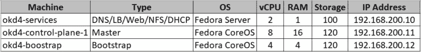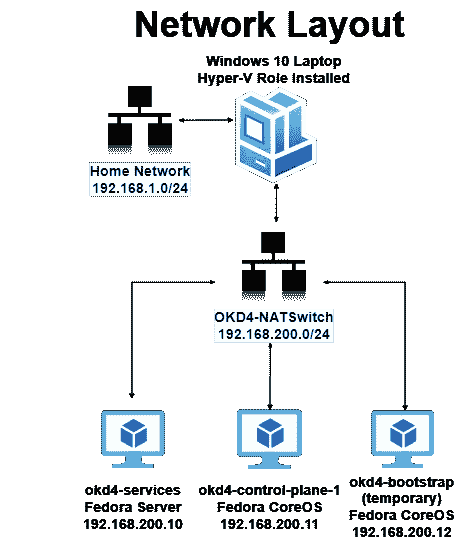

# 使用 PowerShell 启用 Hyper-V

以管理员身份打开 PowerShell 控制台，并运行以下命令:

```
Enable-WindowsOptionalFeature -Online -FeatureName Microsoft-Hyper-V -All
```

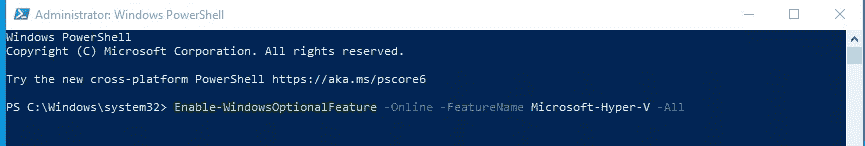

如果找不到该命令，请确定您正在以管理员身份运行 PowerShell。

安装完成后，重新启动。

# 使用 Powershell 在 Hyper-V 中创建 NAT 交换机

以管理员身份打开 PowerShell 控制台，运行以下命令创建虚拟交换机:

```
$Natswitchname = “OKD4-NATSwitch”
$NATNetwork = “192.168.200.0”
$NATrouteraddress = “192.168.200.1”
$NATPrefixLength = “24”New-VMSwitch –SwitchName $Natswitchname –SwitchType Internal –Verbose
$natswitch = Get-NetAdapter | where {(($_.name -like (“vEthernet ($Natswitchname)”)))}
New-NetIPAddress $NATrouteraddress -PrefixLength $NATPrefixLength -InterfaceIndex $natswitch.interfaceindex -Verbose
$NATNetworkFull = $NATNetwork + “/” + $NATPrefixLength
New-NetNat -Name HyperV-NatNetwork -InternalIPInterfaceAddressPrefix $NATNetworkFull -Verbose
```

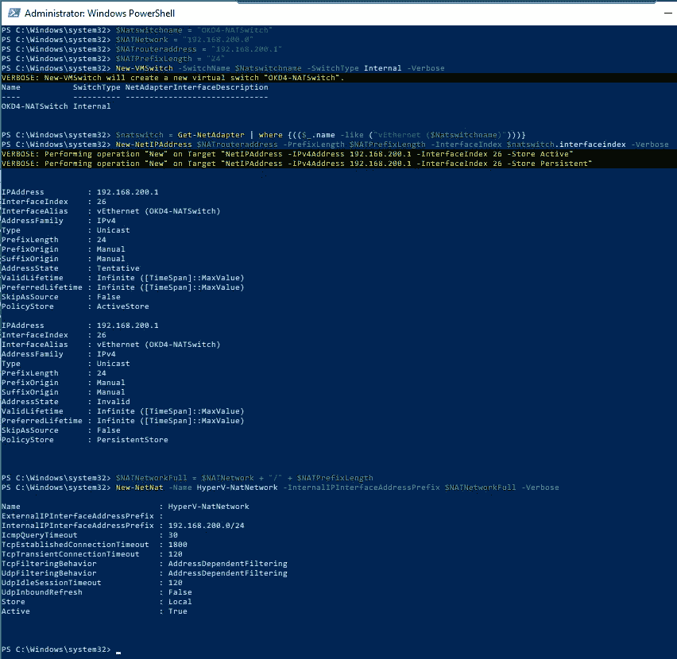

打开 Hyper-V 管理器，然后打开虚拟交换机管理器，并验证 OKD4-NATSwitch 是否已创建。

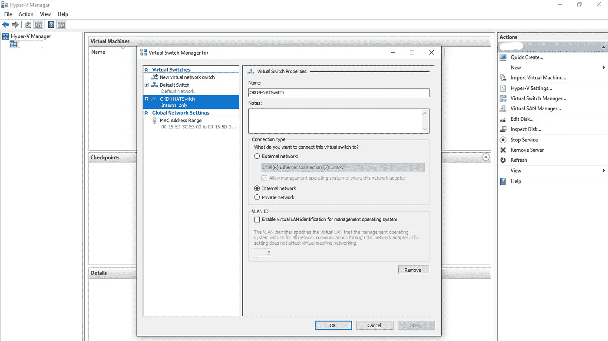

# 创建 ok D4-服务虚拟机:

okd-4 服务虚拟机用于托管 DNS、haproxy、DHCP 和 web 服务。

[下载](https://getfedora.org/en/server/download/)Fedora 服务器标准 ISO。

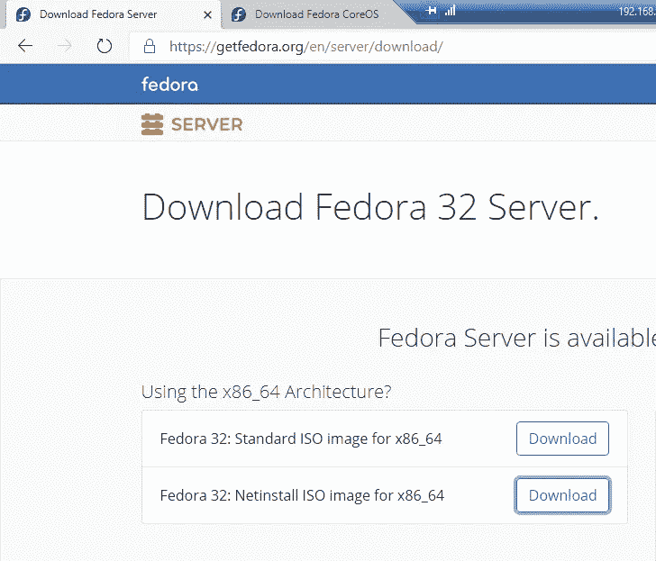

打开 Hyper-V 管理器并创建一个新的虚拟机。

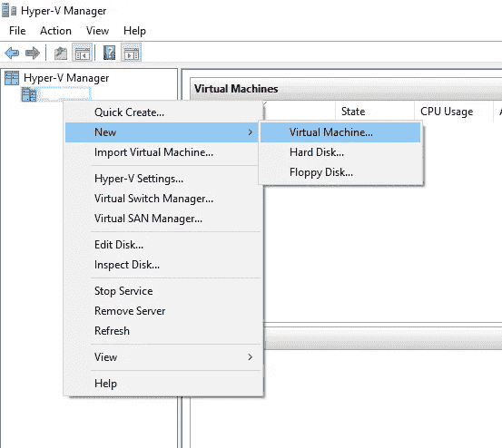

选择虚拟机的名称并选择位置。

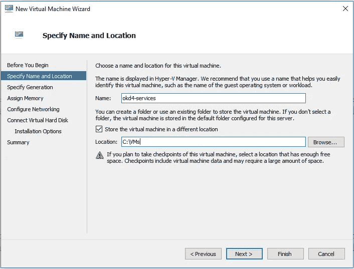

选择第二代。

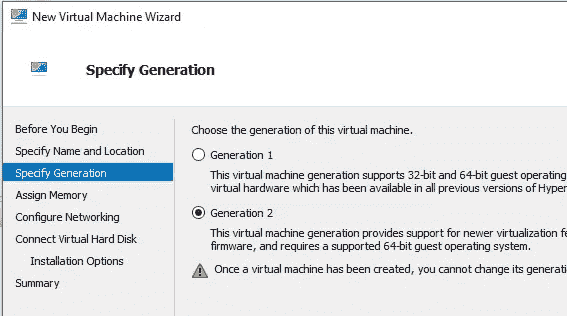

将启动内存设置为 1024 MB。

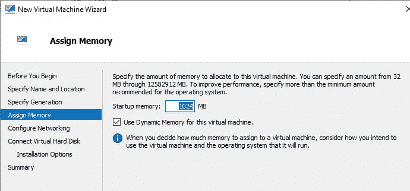

选择 OKD4-NATSwitch 连接。

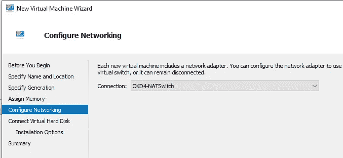

创建虚拟硬盘。我使用了默认值。

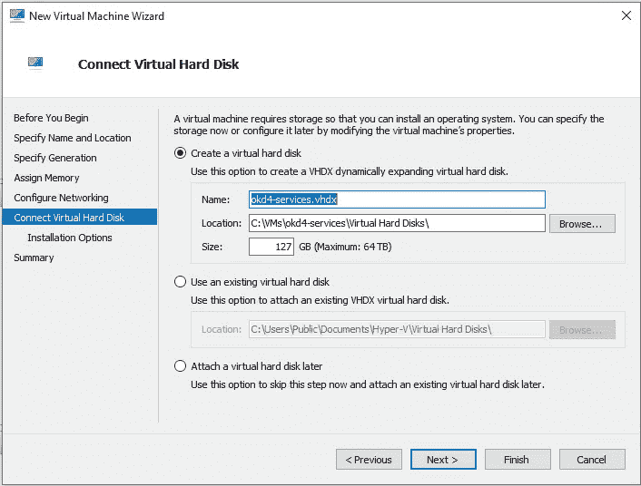

选择“从可引导镜像文件安装…”并浏览到您的 Fedora 服务器 ISO。然后单击完成。

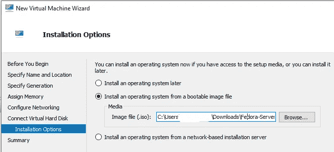

编辑虚拟机设置，并将引导顺序更改为 HD、DVD、网络。

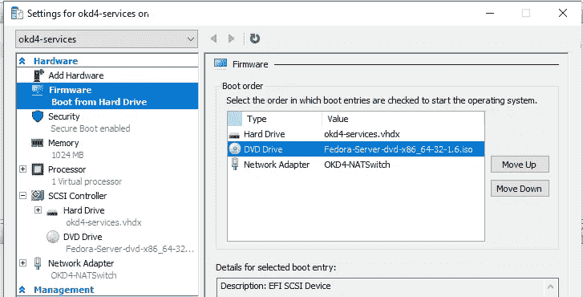

禁用安全启动。

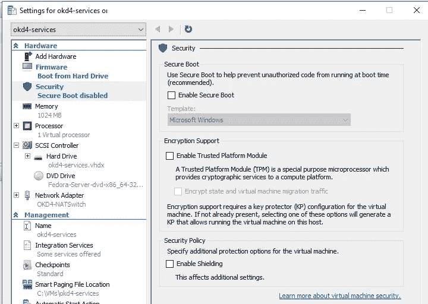

将您的虚拟处理器更改为“2”。


将动态内存改为最小 512MB，最大 1024MB。然后启动虚拟机。

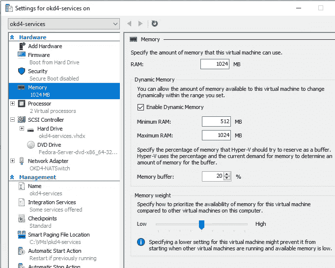

# 在 okd4-services 虚拟机上安装 Fedora Server 32:

运行安装程序并选择您的安装目的地。

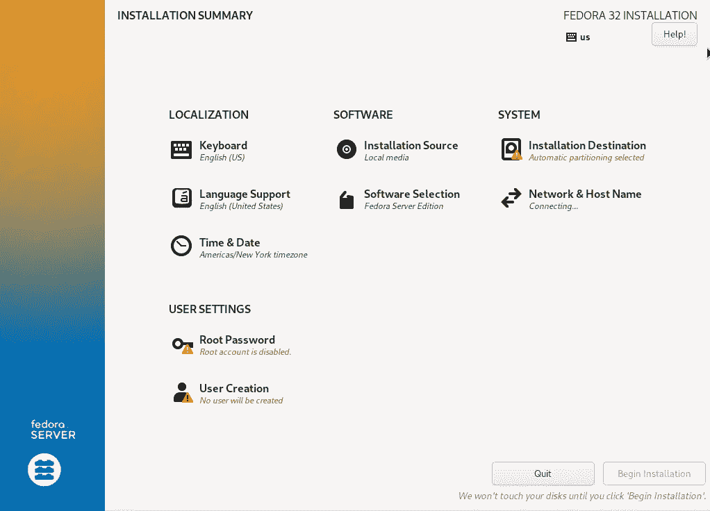

对于软件选择，选择“Fedora 定制操作系统”并包括“客户代理”附加组件。

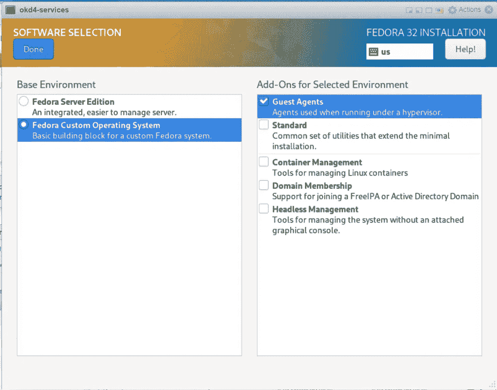

启用连接到虚拟机网络的 NIC，并将主机名设置为 okd4-services，然后单击 Apply。单击“配置”、“IPv4 设置”,将方法更改为“手动”,并设置所示的 IP 设置，然后单击“保存”。

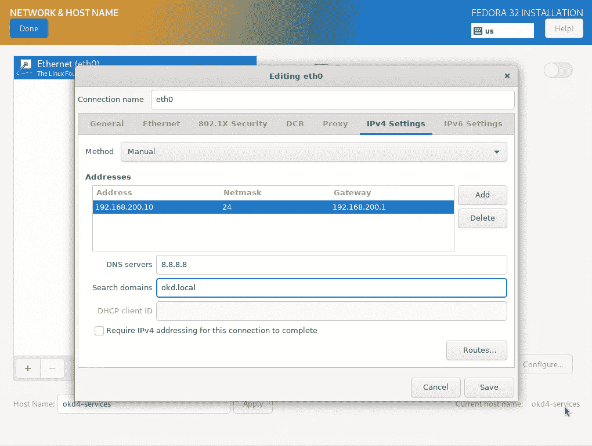

设置 Root 密码，创建一个管理员用户并设置密码。单击“开始安装”开始安装。

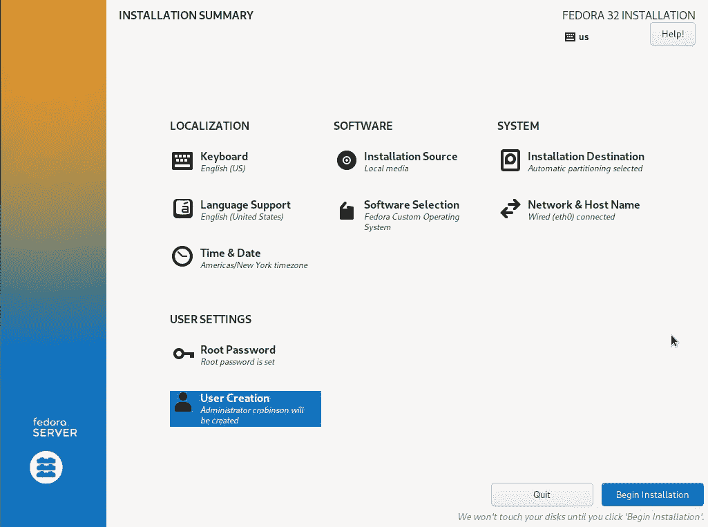

安装完成后，打开命令提示符并通过 SSH 连接到 okd4-services 虚拟机。

```
ssh 192.168.200.10
```

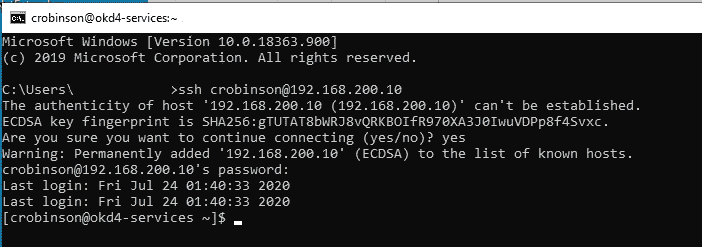

安装附加软件包，更新操作系统，然后重新启动。

```
sudo dnf install -y git wget vim
sudo dnf update -y  && sudo systemctl reboot
```

# 配置 ok D4-服务虚拟机以托管各种服务:

okd 4-服务虚拟机用于提供 DHCP、DNS、NFS 导出、web 服务器和负载平衡。

在 okd4-services 虚拟机上打开一个终端，克隆包含 DHCP、DNS、HAProxy 和 install-conf.yaml 示例文件的 okd4-snc-hyperv repo:

```
cd
git clone [https://github.com/cragr/okd4-snc-hyperv.git](https://github.com/CountPickering/okd4_files.git)
cd okd4-snc-hyperv
```

# 安装 DHCP(DHCP)

```
sudo dnf -y install dhcp-server
sudo cp dhcpd.conf /etc/dhcp/
sudo systemctl enable --now dhcpd
sudo firewall-cmd --add-service=dhcp --permanent
sudo firewall-cmd --reload
```

# 安装绑定(DNS)

```
sudo dnf -y install bind bind-utils
```

复制命名的配置文件和区域:

```
sudo cp named.conf /etc/named.conf
sudo cp named.conf.local /etc/named/
sudo mkdir /etc/named/zones
sudo cp db* /etc/named/zones
```

启用并启动命名:

```
sudo systemctl enable named
sudo systemctl start named
sudo systemctl status named
```

创建防火墙规则:

```
sudo firewall-cmd --permanent --add-port=53/udp
sudo firewall-cmd --reload
```

将 okd4-services 虚拟机上的 DNS 更改为 127.0.0.1:

```
sudo nmcli connection modify eth0 ipv4.dns "127.0.0.1"
```

在 okd4-services 虚拟机上重新启动网络服务:

```
sudo systemctl restart NetworkManager
```

在 okd4-services 上测试 DNS。

```
dig okd.local
dig –x 192.168.200.10
```

DNS 正常工作时，您应该会看到以下结果:

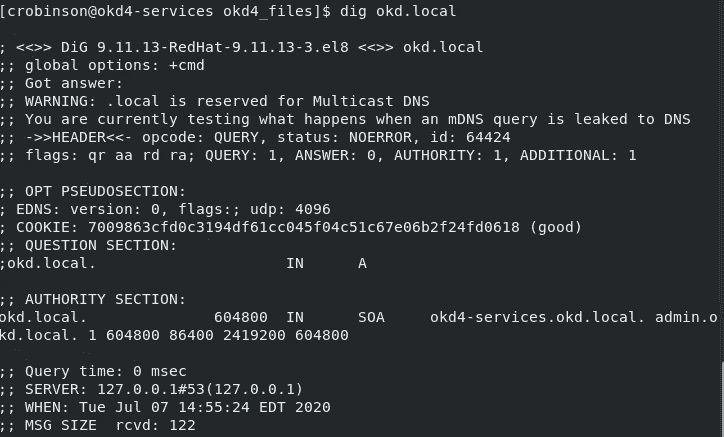

在提升的 Powershell 窗口中，在 HyperV-NATSwitch 上设置 DNS 以匹配 okd 4-services IP 192 . 168 . 200 . 10，以便您可以解析 DNS 条目。

```
Get-NetIpInterface ‘*(OKD4-NATSwitch)’ | Set-DnsClientServerAddress -ServerAddress ‘192.168.200.10’
```

确保您能够 nslookup test . apps . lab . okd . local

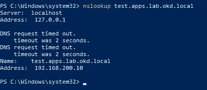

# 安装 HAProxy:

在 okd4-services 终端运行:

```
sudo dnf install haproxy -y
```

从 git okd4_files 目录中复制 haproxy 配置:

```
sudo cp haproxy.cfg /etc/haproxy/haproxy.cfg
```

启动、启用和验证 HA 代理服务:

```
sudo setsebool -P haproxy_connect_any 1
sudo systemctl enable haproxy
sudo systemctl start haproxy
sudo systemctl status haproxy
```

添加 OKD 防火墙端口:

```
sudo firewall-cmd --permanent --add-port=6443/tcp
sudo firewall-cmd --permanent --add-port=22623/tcp
sudo firewall-cmd --permanent --add-service=http
sudo firewall-cmd --permanent --add-service=https
sudo firewall-cmd --reload
```

# 安装阿帕奇/HTTPD

```
sudo dnf install -y httpd
```

将 httpd 监听端口更改为 8080:

```
sudo sed -i 's/Listen 80/Listen 8080/' /etc/httpd/conf/httpd.conf
```

在防火墙上启用并启动 httpd 服务/允许端口 8080:

```
sudo setsebool -P httpd_read_user_content 1
sudo systemctl enable httpd
sudo systemctl start httpd
sudo firewall-cmd --permanent --add-port=8080/tcp
sudo firewall-cmd --reload
```

测试 web 服务器:

```
curl localhost:8080
```

成功的卷发应该是这样的:


# 下载 openshift-installer 和 oc 客户端:

到 okd 4-服务虚拟机的 SSH

要下载最新的 oc 客户端和 openshift-install 二进制文件，您需要使用 oc 客户端的现有版本。

从 [OKD 发布页面](https://github.com/openshift/okd/releases)下载 4.5 版本的 oc 客户端并打开 shift-install。示例:

```
cd
wget https://github.com/openshift/okd/releases/download/4.5.0-0.okd-2020-07-29-070316/openshift-client-linux-4.5.0-0.okd-2020-07-29-070316.tar.gz
wget https://github.com/openshift/okd/releases/download/4.5.0-0.okd-2020-07-29-070316/openshift-install-linux-4.5.0-0.okd-2020-07-29-070316.tar.gz
```

解压 oc 客户端的 okd 版本，打开 shift-install:

```
tar -zxvf openshift-client-linux-4.5.0-0.okd-2020-07-29-070316.tar.gz
tar -zxvf openshift-install-linux-4.5.0-0.okd-2020-07-29-070316.tar.gz
```

将 kubectl、oc 和 openshift-install 移动到/usr/local/bin 并显示版本:

```
sudo mv kubectl oc openshift-install /usr/local/bin/
oc version
openshift-install version
```

最新版本可在 https://origin-release.svc.ci.openshift.org[获得](https://origin-release.svc.ci.openshift.org/)

# 设置 openshift-installer:

在 install-config.yaml 中，您可以使用来自 RedHat 的 pull-secret 或默认的" { " auths ":{ " fake ":{ " auth ":" bar " } } "作为 pull-secret。

如果您还没有 SSH 密钥，请生成一个。

```
ssh-keygen
```

创建安装目录并复制 install-config.yaml 文件:

```
cd
mkdir install_dir
cp okd4-snc-hyperv/install-config.yaml ./install_dir
```

编辑 install_dir 中的 install-config.yaml 并添加您的 ssh 密钥。备份 install-config.yaml，因为它将在生成清单时被删除:

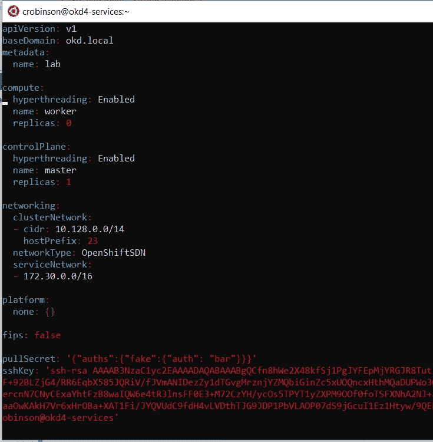

```
vim ./install_dir/install-config.yaml
cp ./install_dir/install-config.yaml ./install_dir/install-config.yaml.bak
```

为集群生成 Kubernetes 清单，忽略警告:

```
openshift-install create manifests --dir=install_dir/
```

现在，您可以创建点火配置:

```
openshift-install create ignition-configs --dir=install_dir/
```

**注意:**如果你重用 install_dir，确保它是空的。隐藏文件是在生成配置后创建的，在第二次尝试使用同一文件夹之前，应该删除这些文件。

# 在 web 服务器上托管点火和 Fedora CoreOS 文件:

在/var/www/html 中创建 okd4 目录:

```
sudo mkdir /var/www/html/okd4
```

将 install_dir 内容复制到/var/www/html/okd4 并设置权限:

```
sudo cp -R install_dir/* /var/www/html/okd4/
sudo chown -R apache: /var/www/html/
sudo chmod -R 755 /var/www/html/
```

测试 web 服务器:

```
curl localhost:8080/okd4/metadata.json
```

下载 [Fedora CoreOS](https://getfedora.org/coreos/download/) 裸机 bios 镜像和 sig 文件，并缩短文件名:

```
cd /var/www/html/okd4/
sudo wget https://builds.coreos.fedoraproject.org/prod/streams/stable/builds/32.20200715.3.0/x86_64/fedora-coreos-32.20200715.3.0-metal.x86_64.raw.xz
sudo wget https://builds.coreos.fedoraproject.org/prod/streams/stable/builds/32.20200715.3.0/x86_64/fedora-coreos-32.20200715.3.0-metal.x86_64.raw.xz.sig
sudo mv fedora-coreos-32.20200715.3.0-metal.x86_64.raw.xz fcos.raw.xz
sudo mv fedora-coreos-32.20200715.3.0-metal.x86_64.raw.xz.sig fcos.raw.xz.sig
sudo chown -R apache: /var/www/html/
sudo chmod -R 755 /var/www/html/
```

# 创建引导和主节点:

下载 [Fedora CoreOS 裸机 ISO](https://getfedora.org/coreos/download/) 并保存到你的下载文件夹。

撰写本文时最新的稳定版本是 32.20200715.3.0


使用本文开头的电子表格中的 CPU 和 RAM 值，在 Hyper-V 管理器中创建两个 ODK 节点(okd 4-引导和 okd 4-控制平面-1 ):

## **ok D4-自举:**

打开 Hyper-V 管理器并创建一个新的虚拟机。


选择虚拟机的名称并选择位置。

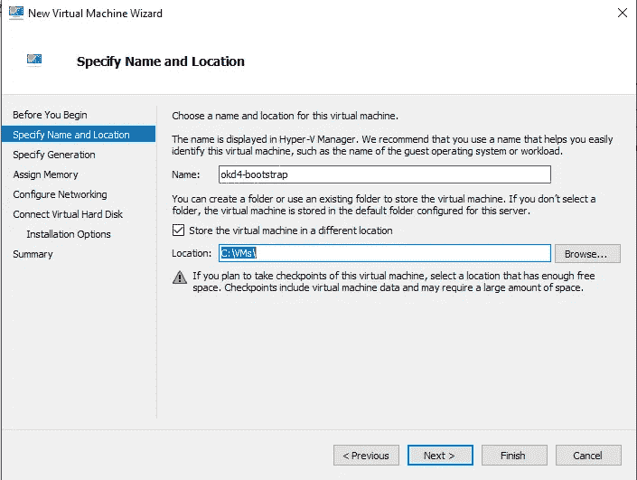

选择第二代。

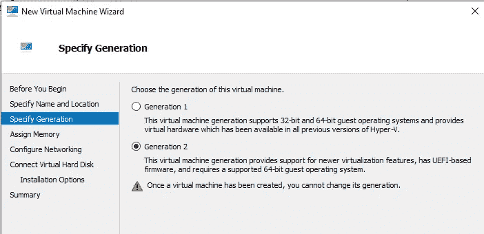

使用“分配内存”的默认设置，我们稍后会对此进行编辑。


选择 OKD4-NATSwitch 连接。

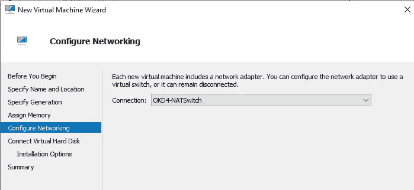

创建虚拟硬盘。我使用了默认值。

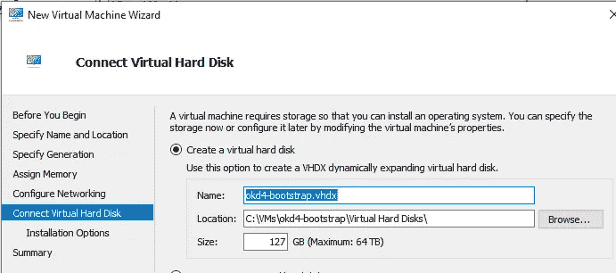

选择“从可引导镜像文件安装…”并浏览到您的 Fedora CoreOS ISO。然后单击完成。

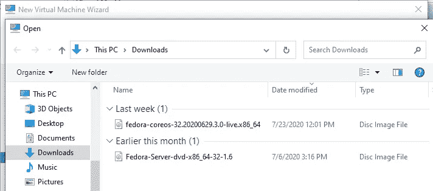

通过选择虚拟机并单击设置来编辑虚拟机…

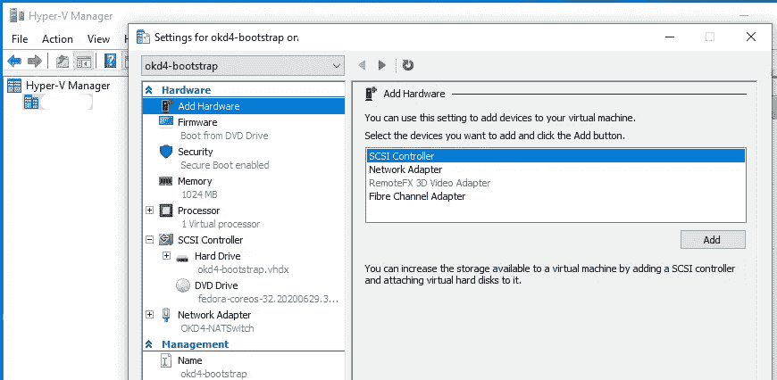

将引导顺序编辑为 HD、DVD、网络。禁用安全启动。将虚拟处理器增加到 4 个。

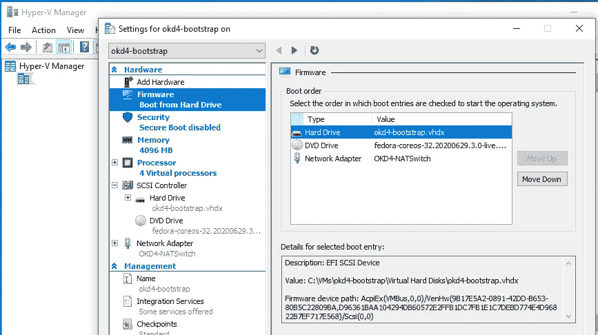

编辑内存，最小 512MB，最大 4096 MB

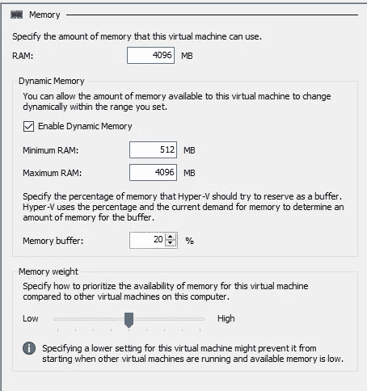

接下来创建 ok D4-控制平面-1 虚拟机。

## **ok D4-控制平面-1**

使用与 okd4-bootstrap 虚拟机相同的步骤创建 okd4-control-plane-1 虚拟机，不同之处在于将 CPU 增加到 4 个或更多，并将内存增加到 16384 MB。

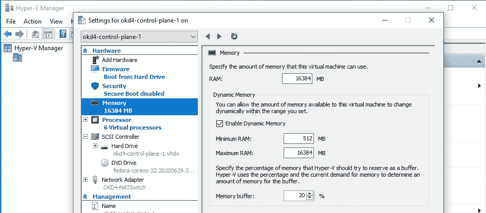

您应该最终拥有以下虚拟机:

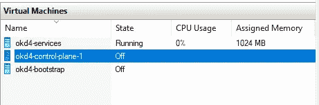

# 设置静态 DHCP 租约:

打开 odk4-bootstrap 虚拟机和 okd4-control-plane-1 节点的电源，转到虚拟机设置、网络适配器、高级功能，并记下 Mac 地址。

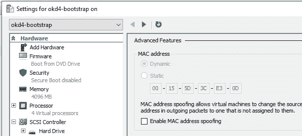

更新两个节点的硬件以太网地址。

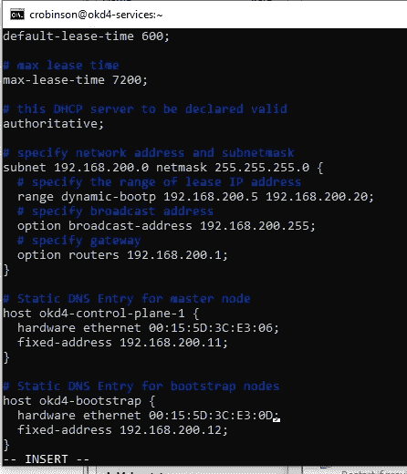

在 okd4-services 节点上重新启动 dhcpd 服务。

```
sudo systemctl restart dhcpd
```

# 启动引导过程:

重置虚拟机并允许其启动。

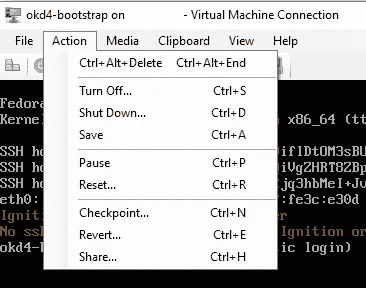

验证它使用正确的 IP 地址启动:

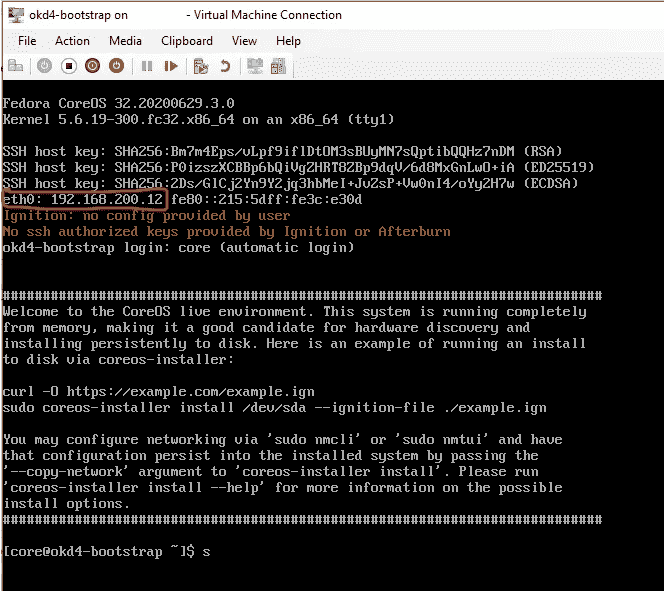

下载点火文件并使用 bootstrap.ign 启动安装程序

```
curl -O [http://192.168.200.10:8080/okd4/bootstrap.ign](http://192.168.200.10:8080/okd4/bootstrap.ign)
sudo coreos-installer install /dev/sda --ignition-file **./bootstrap.ign**
```

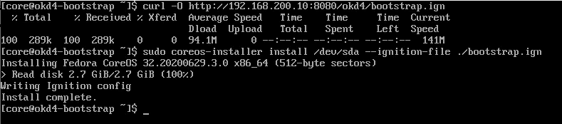

安装完成后，关闭虚拟机并弹出 iso。

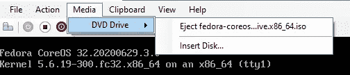

启动虚拟机。如果成功，引导过程就开始了。

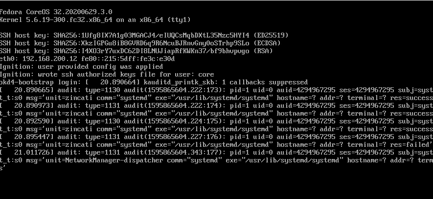

# 启动控制平面 1 节点:

除了使用 master.ign 之外，从引导节点重复相同的步骤

```
curl -O [http://192.168.200.10:8080/okd4/bootstrap.ign](http://192.168.200.10:8080/okd4/bootstrap.ign)
sudo coreos-installer install /dev/sda --ignition-file **./master.ign**
```

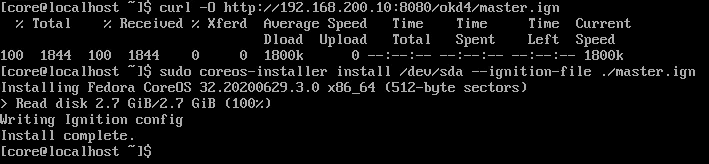

安装完成后，关闭虚拟机并弹出 iso。


启动虚拟机。

控制面板将显示错误，直到引导程序继续运行。这很正常，耐心一点就好。

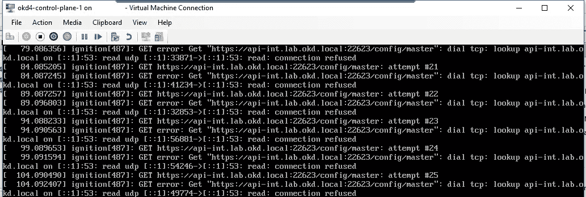

# 监控引导安装:

您可以从 okd4-services 节点监控引导过程:

```
openshift-install --dir=install_dir/ wait-for bootstrap-complete --log-level=debug
```

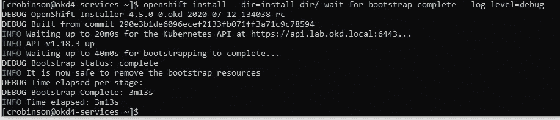

引导过程可能需要 30 分钟以上，完成后，您可以关闭引导节点。现在是编辑/etc/haproxy/haproxy.cfg、注释掉引导节点并重新加载 haproxy 服务的好时机。

```
sudo sed -i '/ okd4-bootstrap /s/^/#/' /etc/haproxy/haproxy.cfg
sudo systemctl reload haproxy
```

# 登录集群并检查状态:

既然控制平面节点已经在线，您应该能够登录 oc 客户端了。使用以下命令登录并检查集群的状态:

```
export KUBECONFIG=~/install_dir/auth/kubeconfig
oc whoami
oc get nodes
```


检查集群操作符的状态。

```
oc get clusteroperators
```

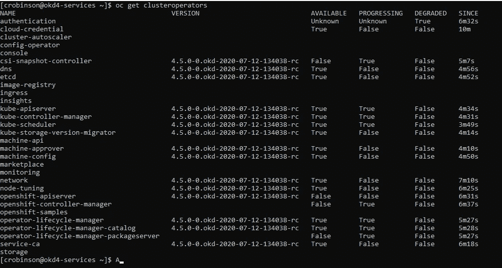

一旦控制台操作员有空，请登录 web 控制台。从 install_dir/auth 文件夹中获取您的 kubeadmin 密码:

```
cat install_dir/auth/kubeadmin-password
```


打开您的网络浏览器进入[https://console-openshift-console.apps.lab.okd.local/](https://console-openshift-console.apps.lab.okd.local/)，使用上面的密码以 kubeadmin 身份登录:


群集状态可能仍然显示正在升级，并且它会继续完成安装。

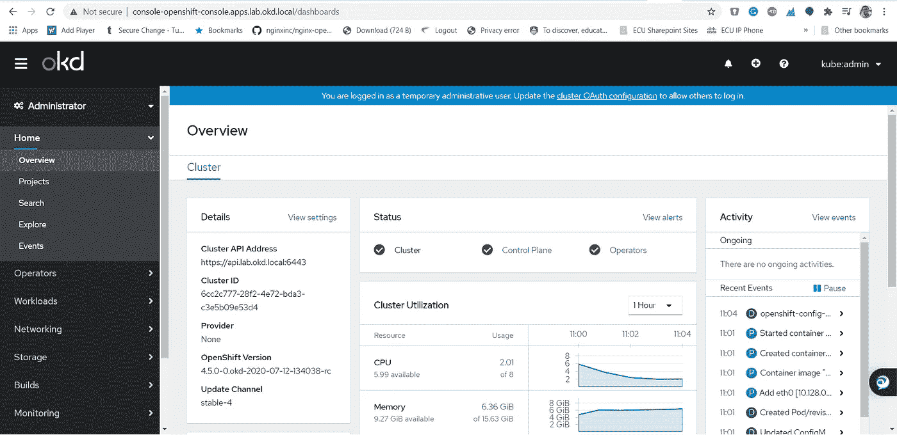

# 持久存储:

在我们完成这个项目之前，我们需要为我们的注册表创建一些持久存储。让我们将 okd4-services VM 配置为 NFS 服务器，并将其用于持久存储。

登录到您的 okd4-services 虚拟机，并开始设置一个 NFS 服务器。以下命令安装必要的包，启用服务，并配置文件和文件夹权限。

```
sudo dnf install -y nfs-utils
sudo systemctl enable nfs-server rpcbind
sudo systemctl start nfs-server rpcbind
sudo mkdir -p /var/nfsshare/registry
sudo chmod -R 777 /var/nfsshare
sudo chown -R nobody:nobody /var/nfsshare
```

创建 NFS 导出

在新的/etc/exports 文件“/var/NFS share 192 . 168 . 200 . 0/24(rw，sync，no_root_squash，no_all_squash，no_wdelay)”中添加这一行

```
echo '/var/nfsshare 192.168.200.0/24(rw,sync,no_root_squash,no_all_squash,no_wdelay)' | sudo tee /etc/exports
```

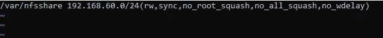

重新启动 nfs 服务器服务并添加防火墙规则:

```
sudo setsebool -P nfs_export_all_rw 1
sudo systemctl restart nfs-server
sudo firewall-cmd --permanent --zone=public --add-service mountd
sudo firewall-cmd --permanent --zone=public --add-service rpc-bind
sudo firewall-cmd --permanent --zone=public --add-service nfs
sudo firewall-cmd --reload
```

# 注册表配置:

在 NFS 共享上创建一个永久卷。使用 git repo 中 okd4_files 文件夹中的 registry_py.yaml:

```
oc create -f okd4-snc-hyperv/registry_pv.yaml
oc get pv
```

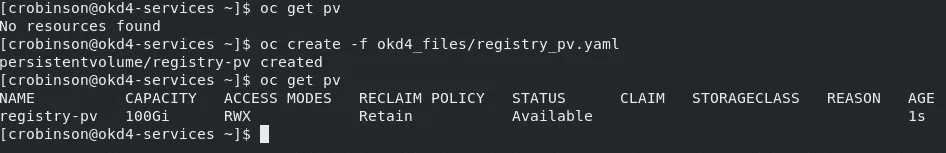

编辑图像注册表操作符:

```
oc edit configs.imageregistry.operator.openshift.io
```

将管理状态从“已删除”更改为“已管理”。在存储下:添加 pvc:和 claim: blank 以附加 PV 并自动保存您的更改:

```
managementState: Managedstorage:
    pvc:
      claim:
```

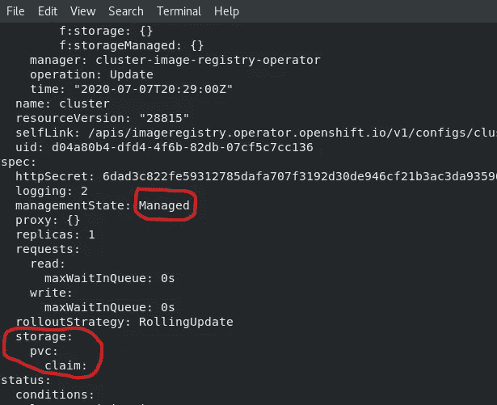

检查您的持久卷，现在应该声明:

```
oc get pv
```


检查导出大小，它应该为零。在下一节中，我们将推送至注册表，文件大小不应为零。

```
du -sh /var/nfsshare/registry
```

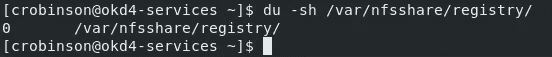

在下一节中，我们将创建一个 WordPress 项目并将其推送到注册表中。推送后，NFS 导出应该显示 200+ MB。

# 创建 WordPress 项目:

创建一个新的 OKD 项目。

```
oc new-project wordpress-test
```

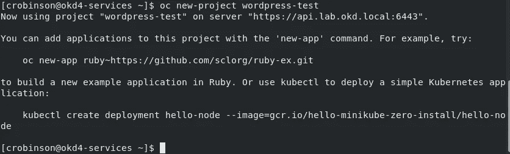

使用 docker hub 中的 centos php73 s2i 映像创建一个新应用程序，并使用 WordPress GitHub repo 作为源代码。公开服务以创建路由。

```
oc new-app centos/php-73-centos7~[https://github.com/WordPress/WordPress.git](https://github.com/WordPress/WordPress.git)
oc expose svc/wordpress
```

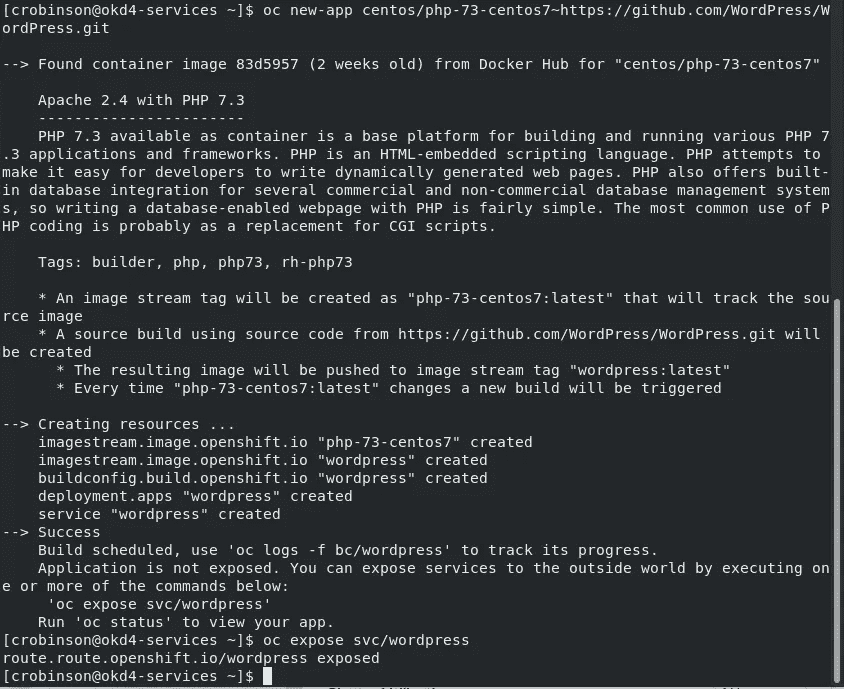

使用 centos7 MariaDB 映像和一些环境变量创建一个新应用程序:

```
oc new-app centos/mariadb-103-centos7 --name mariadb --env MYSQL_DATABASE=wordpress --env MYSQL_USER=wordpress --env MYSQL_PASSWORD=wordpress
```

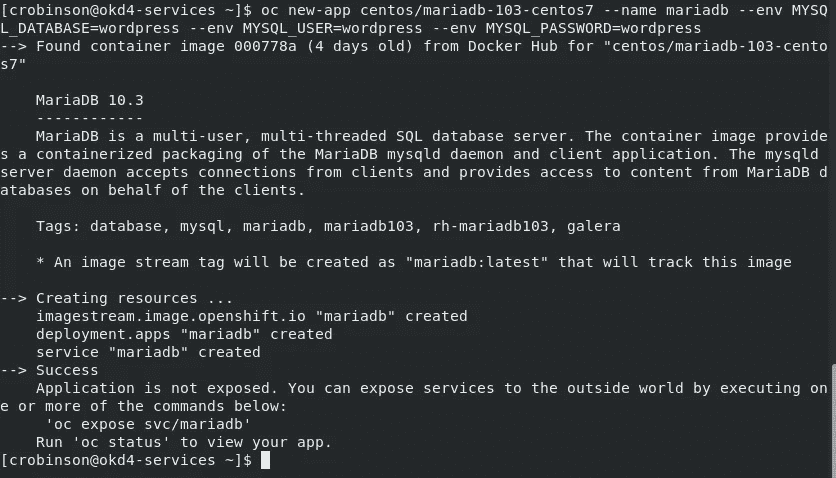

打开 OpenShift 控制台，浏览到 WordPress-test 项目。一旦 WordPress 图像被构建并准备好，它将是深蓝色的，就像 MariaDB 实例所示:


点击 WordPress 对象，然后点击路线，在你的网络浏览器中打开它:

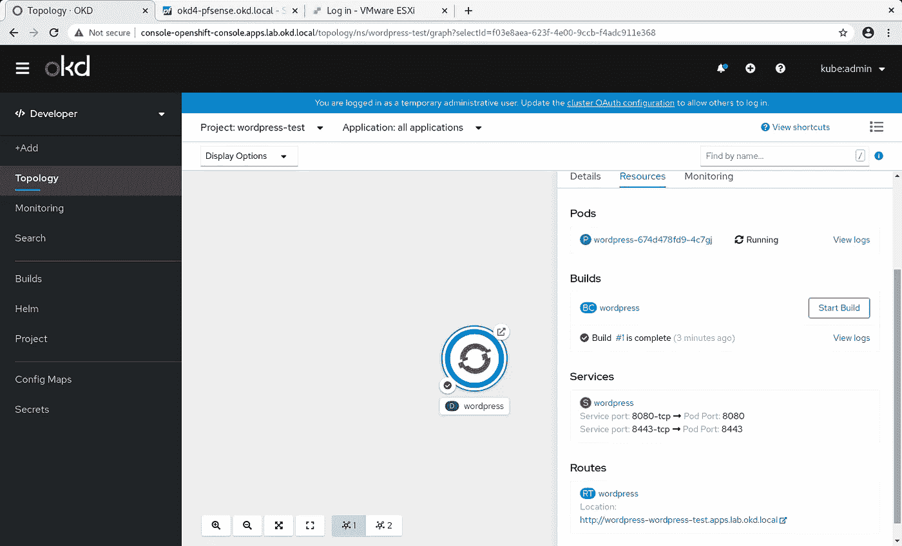

你应该看到 WordPress 设置配置，点击让我们开始。

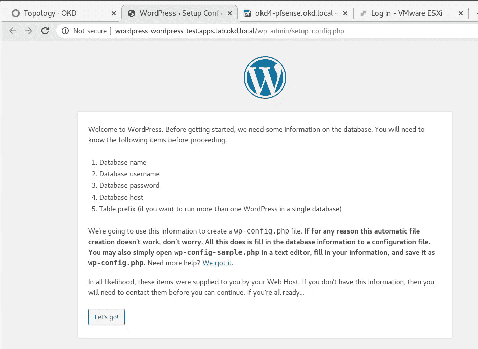

如图所示，填写数据库、用户名、密码和数据库主机，并运行安装程序:

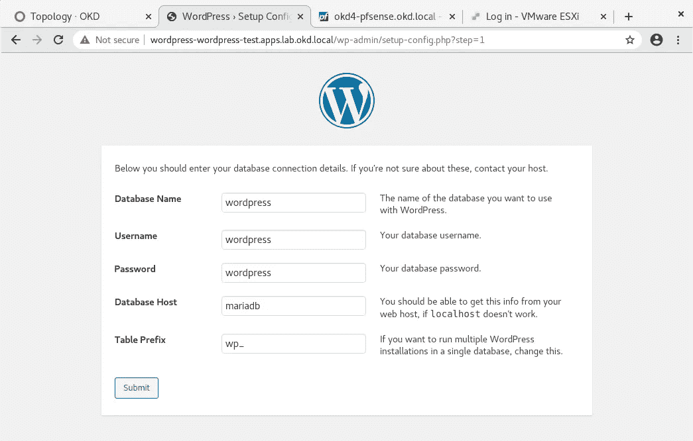

填写欢迎信息并点击安装 WordPress。


登录，你应该有一个工作的 WordPress 安装:

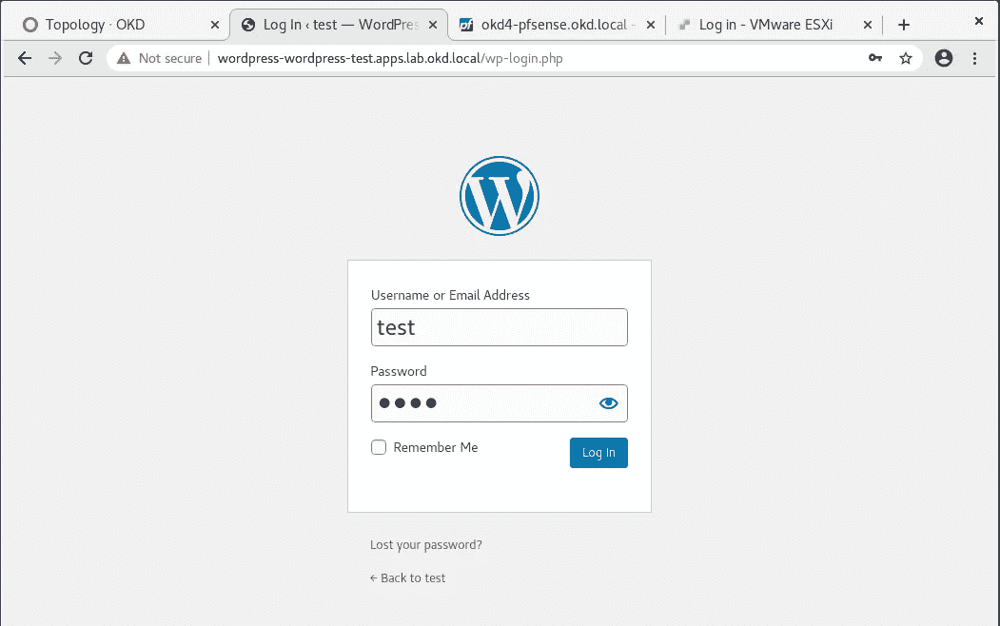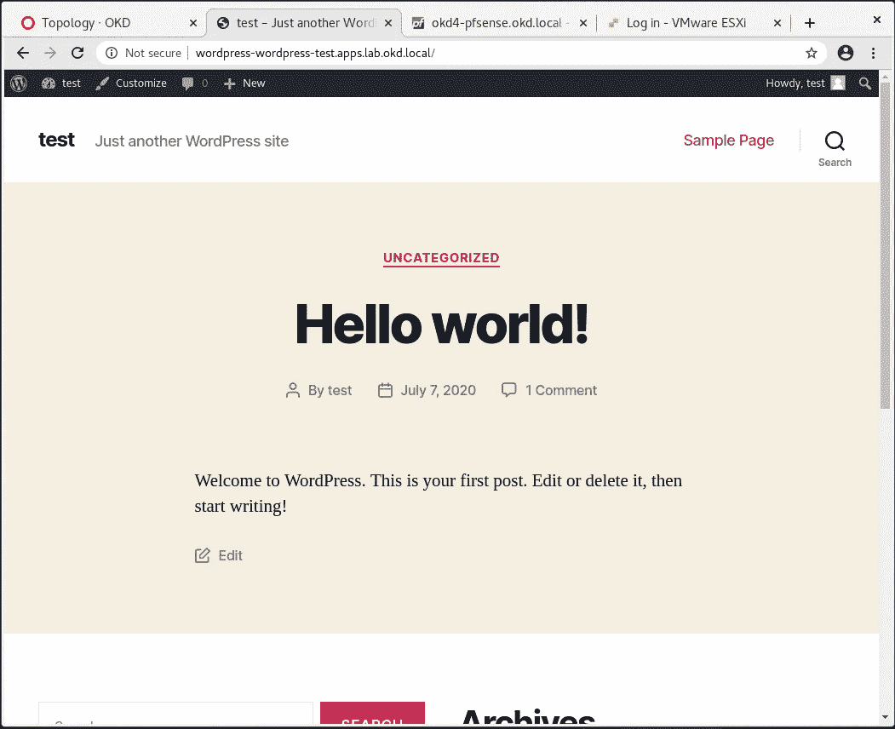

在 okd4-services 虚拟机上检查 NFS 导出的大小。大小应该在 300MB 左右。

```
du -sh /var/nfsshare/registry/
```


您刚刚验证了您的永久卷正在工作。

# HTPasswd 安装程序:

kubeadmin 是一个临时用户。设置本地用户最简单的方法是使用 htpasswd。

```
cd
cd okd4-snc-hyperv
htpasswd -c -B -b users.htpasswd testuser testpassword
```

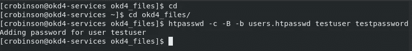

使用您生成的 users.htpasswd 文件在 openshift-config 项目中创建一个秘密:

```
oc create secret generic htpass-secret --from-file=htpasswd=users.htpasswd -n openshift-config
```

添加身份提供者。

```
oc apply -f htpasswd_provider.yaml
```

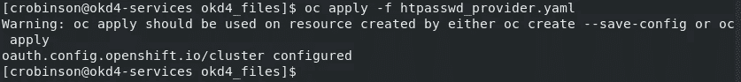

注销 OpenShift 控制台。然后选择 htpasswd_provider，用 testuser 和 testpassword 凭证登录。

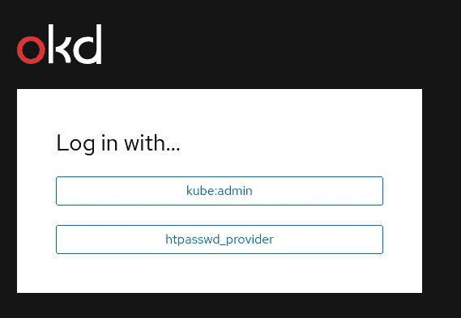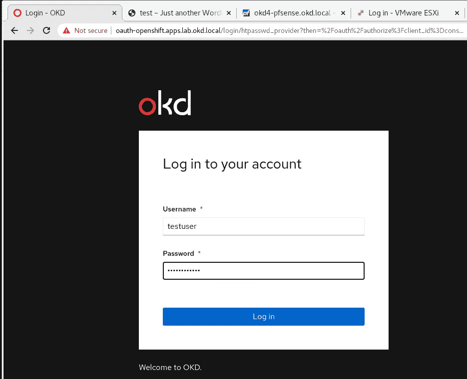

如果您访问管理员页面，您应该看不到任何项目:

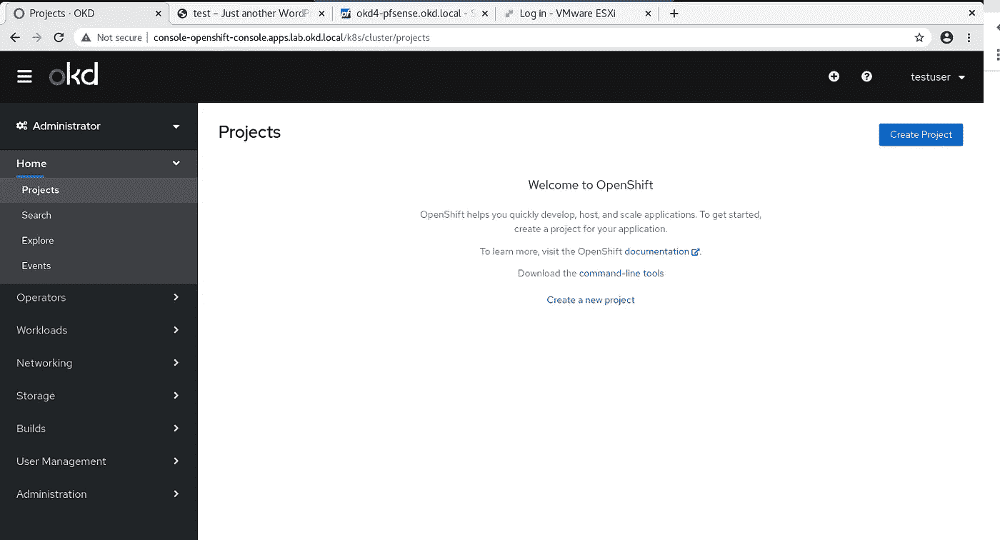

授予您自己集群管理权限，项目应该立即填充:

```
oc adm policy add-cluster-role-to-user cluster-admin testuser
```

您的用户现在应该拥有集群管理员级别的访问权限:

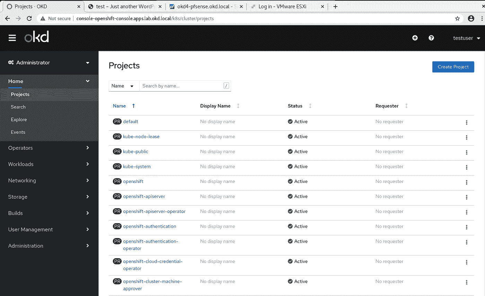

# 恭喜你。您已经创建了一个 OKD 单节点集群！

希望您已经创建了一个 OKD 单节点集群，并在这个过程中学到了一些东西。在这一点上，你应该有一个良好的基础来修补 OKD 和继续学习。

这里有一些资源可以帮助你的旅程:

要报告问题，请使用[https://github.com/openshift/okd Github Repo:](https://github.com/openshift/okd)T2

如需支持，请查看 [k8s Slack](https://slack.k8s.io/) 上的#openshift-users 频道

OKD 工作组每两周召开一次会议，讨论发展和下一步措施。会议日程和地点在[open shift/社区报告](https://github.com/openshift/community/projects/1#card-28309038)中记录。

okd-wg 的谷歌小组:[https://groups.google.com/forum/#!forum/okd-wg](https://groups.google.com/forum/#!forum/okd-wg)