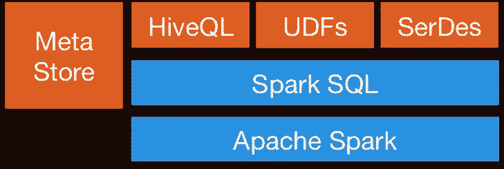
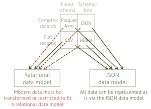
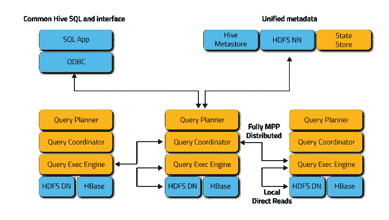
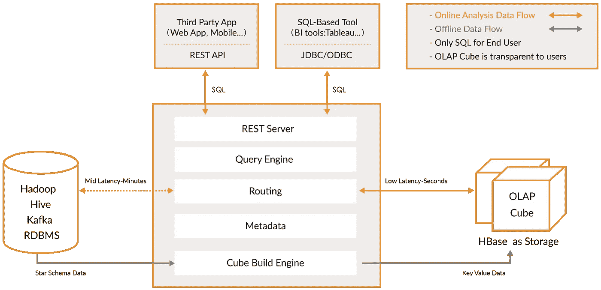
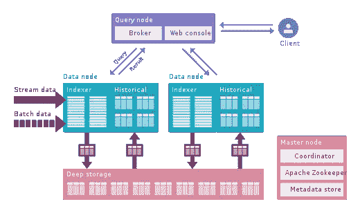
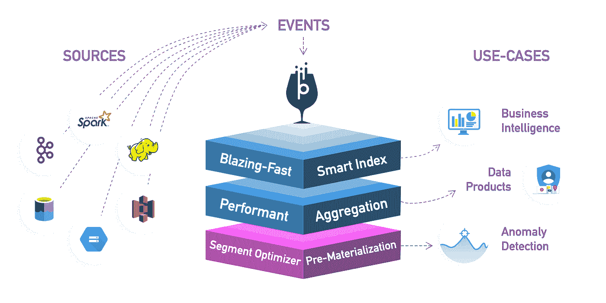

# 面向大数据的 OLAP 查询引擎

> 原文：<https://itnext.io/olap-query-engines-for-big-data-5f17b88d6ebc?source=collection_archive---------0----------------------->

# 介绍

本文摘自我之前的文章 [**大数据管道秘方**](/big-data-pipeline-recipe-c416c1782908) 。在这篇文章中，我将只关注用于数据分析的**大数据查询引擎**。

如果您在这里，是因为您已经接收了原始数据，对其进行了处理，现在可以供下游系统使用了。

用于查询数据的工具有很多种，每一种都有其优点和缺点。他们中的大多数关注于 OLAP，但是很少有人也为 OLTP 进行了优化。一些使用标准格式，只专注于运行查询，而另一些使用自己的格式/存储将处理推送到数据源，以提高性能。有些针对使用星型或雪花型模式的数据仓库进行了优化，而有些则更加灵活。总而言之，**这些是不同的考虑因素** s:

*   数据仓库与数据湖
*   Hadoop 与独立版
*   OLAP vs OLTP
*   查询引擎与 OLAP 引擎

我们还应该考虑具有查询功能的处理引擎。

# 处理引擎

我们在上一节中描述的大多数引擎都可以连接到元数据服务器，如 **Hive** 并运行查询、创建视图等。这是创建细化报告层的常见用例。

[**Spark SQL**](https://spark.apache.org/sql/) 提供了一种无缝混合 SQL 查询和 Spark 程序的方法，所以你可以混合 [DataFrame](https://www.tutorialspoint.com/spark_sql/spark_sql_dataframes.htm) API 和 SQL。它通过 **JDBC** 或 ODBC 具有 Hive 集成和标准连接；因此，您可以通过 Spark 将 [Tableau](https://www.tableau.com/) 、 [Looker](https://looker.com/) 或任何 BI 工具连接到您的数据。

**Apache Flink** 也提供了 [SQL](https://ci.apache.org/projects/flink/flink-docs-stable/dev/table/sql/) API。Flink 的 SQL 支持基于实现 SQL 标准的 [Apache 方解石](https://calcite.apache.org/)。它还通过`HiveCatalog`与 [Hive](https://ci.apache.org/projects/flink/flink-docs-stable/dev/table/hive/) 集成。例如，用户可以使用`HiveCatalog`将 Kafka 或 ElasticSearch 表存储在 Hive Metastore 中，并在以后的 SQL 查询中重用它们。

**Kafka** 也提供了 [SQL](https://www.confluent.io/blog/ksql-streaming-sql-for-apache-kafka/) 功能，一般来说，大多数处理引擎都提供 SQL 接口。

# 查询引擎

这类工具侧重于以统一的方式查询**不同的数据源和格式**。这个想法是使用 **SQL** 查询来查询您的数据湖，就像它是一个关系数据库一样，尽管它有一些限制。其中一些工具还可以查询 NoSQL 的数据库等等。这些工具为外部工具提供了一个 JDBC 接口，例如 [Tableau](https://www.tableau.com/) 或 [Looker](https://looker.com/) ，以一种安全的方式连接到您的数据湖。查询引擎是最慢的选择，但是提供了最大的灵活性。

*   [**阿帕奇猪**](https://pig.apache.org/) :它是和 Hive 一起出现的最早的查询语言之一。它有自己不同于 SQL 的语言。Pig 程序的显著特性是它们的结构服从于大量的**并行化**，这反过来使它们能够处理非常大的数据集。它并没有因为新的基于 SQL 的引擎而衰落。
*   [**Presto**](https://prestodb.io/) :由脸书开源发布，它是一个开源的**分布式 SQL 查询引擎**，用于针对各种规模的数据源运行交互式分析查询。Presto 允许查询数据所在的位置，包括 Hive、Cassandra、关系数据库和文件系统。它可以在几秒钟内对大型数据集执行查询。它独立于 Hadoop，但集成了它的大多数工具，尤其是运行 SQL 查询的 Hive。
*   [**Apache Drill**](https://drill.apache.org/) :为 Hadoop、NoSQL 甚至云存储提供无模式的 SQL 查询引擎。它独立于 Hadoop，但与 Hive 等生态系统工具有许多集成。单个查询可以连接来自多个数据存储的数据，执行特定于每个数据存储的优化。它很好地允许分析师像对待表格一样对待任何数据，即使他们正在读一个文件。 **Drill 完全支持标准 SQL** 。业务用户、分析师和数据科学家可以使用标准 BI/分析工具，如 [Tableau](https://www.tableau.com/) 、 [Qlik](https://www.qlik.com/us) 和 Excel，通过利用 Drill 的 JDBC 和 ODBC 驱动程序与非关系型数据存储进行交互。此外，开发人员可以在他们的定制应用程序中利用 Drill 的简单 REST API 来创建漂亮的可视化效果。

钻孔模型

# OLTP 数据库

尽管 Hadoop 针对 OLAP 进行了优化，但是如果您想为交互式应用程序执行 OLTP 查询，仍然有一些选项。

[**h base**](https://hbase.apache.org/)**从设计上来说，它的 ACID 属性非常有限，因为它是按规模构建的，不提供现成的 ACID 功能，但它可以用于一些 OLTP 场景。**

**[**Apache Phoenix**](https://phoenix.apache.org/index.html)构建在 HBase 之上，提供了一种在 Hadoop 生态系统中执行 OTLP 查询的方式。Apache Phoenix 与 Spark、Hive、Pig、Flume 和 Map Reduce 等其他 Hadoop 产品完全集成。它还可以存储元数据，并通过 DDL 命令支持表创建和版本化增量变更。它相当**快**，比使用 Drill 或其他查询引擎要快。**

**您可以使用 Hadoop 生态系统之外的任何大规模数据库，如 **Cassandra、YugaByteDB、ScyllaDB for OTLP** 。**

**最后，在任何类型的快速数据库(如 MongoDB 或 MySQL)中有一个数据子集(通常是最新的)是非常常见的。上面提到的**查询引擎****可以在单个查询中连接慢速和快速数据存储之间的数据。****

# **分布式搜索索引**

**这些工具提供了一种**存储和搜索非结构化文本数据**的方式，它们存在于 Hadoop 生态系统之外，因为它们需要特殊的结构来存储数据。其思想是使用一个 [**倒排索引**](https://en.wikipedia.org/wiki/Search_engine_indexing) 来执行快速查找。除了文本搜索之外，这项技术还可以用于广泛的用例，比如存储日志、事件等。有两个主要选项:**

*   **[**Solr**](https://lucene.apache.org/solr/) :它是一个流行的、高速的、开源的企业搜索平台，构建于 Apache[**Lucene**](https://lucene.apache.org/)之上。Solr 是可靠的、可扩展的和容错的，提供分布式索引、复制和负载平衡查询、自动故障转移和恢复、集中式配置等等。它对于文本搜索来说很棒，但与 [ElasticSearch](https://en.wikipedia.org/wiki/Elasticsearch) 相比，它的使用案例有限。**
*   **[**elastic search**](https://en.wikipedia.org/wiki/Elasticsearch):它也是一个非常受欢迎的分布式索引，但它已经发展成为自己的生态系统，涵盖了许多用例，如 [APM](https://www.elastic.co/apm) ，搜索，文本存储，分析，仪表板，机器学习等等。它绝对是您工具箱中的一个工具，无论是用于开发还是用于数据管道，因为它非常通用。它还可以存储和搜索视频和图像。**

****ElasticSearch** 可用作**快速存储层 f** 或高级搜索功能的数据湖。如果您将数据存储在一个键值型的大型数据库中，比如 HBase 或 Cassandra，由于缺少连接，它们提供的搜索功能非常有限；你可以将 ElasticSearch 放在前面执行查询，返回 id，然后在你的数据库上进行快速查找。**

**它也可用于**分析**；您可以导出您的数据，对其进行索引，然后使用 [**Kibana**](https://www.elastic.co/kibana) 进行查询，创建仪表盘、报告等，您可以添加直方图、复杂聚合，甚至在您的数据上运行机器学习算法。弹性生态系统庞大，值得探索。**

****

# **OLAP 数据库**

**在这个类别中，我们有数据库，它也可以为模式和查询功能提供元数据存储。与查询引擎相比，这些工具还提供存储，并可以在数据仓库的情况下实施某些模式(*星型模式*)。这些工具使用 SQL 语法和 Spark，其他框架可以与之交互。**

*   **[**Apache Hive**](https://hive.apache.org/) :我们已经讨论过 Hive 作为 Spark 和其他工具的中央模式存储库，因此它们可以使用 **SQL** ，但是 Hive 也可以存储数据，因此您可以将它用作**数据仓库。**可以访问 **HDFS** 或 **HBase** 。当查询 Hive 时，它利用了 [Apache Tez](http://tez.apache.org/) 、 [Apache Spark](http://spark.apache.org/) 或 [MapReduce](http://hadoop.apache.org/docs/current/hadoop-mapreduce-client/hadoop-mapreduce-client-core/MapReduceTutorial.html) ，比 Tez 或 Spark 快得多。它还有一种叫做 HPL-SQL 的过程语言。Hive it 是 Spark SQL 非常流行的元存储。**
*   **[**Apache Impala**](https://impala.apache.org/) :这是 Hadoop 的原生**分析数据库**，你可以用它来存储数据，并以高效的方式进行查询。它可以使用 [**Hcatalog**](https://cwiki.apache.org/confluence/display/Hive/HCatalog) 连接到 Hive 获取元数据。Impala 为 Hadoop 上的 BI/分析查询提供**低延迟和高并发**(不是 Apache Hive 等批处理框架提供的)。Impala 还可以线性扩展，即使在多租户环境中也比 Hive 更适合查询。Impala 集成了原生 Hadoop 安全性和 Kerberos 进行身份验证，因此您可以安全地管理数据访问。它使用 **HBase** 和 **HDFS** 进行数据存储。**

****

*   **[**Apache Tajo**](https://tajo.apache.org/) :是 Hadoop 的另一个**数据仓库**。Tajo 是为存储在 HDFS 和其他数据源上的大数据集的低延迟和可伸缩的特别查询、在线聚合和 ETL 而设计的。它与**Hive****Metastore**集成，以访问公共模式。它有许多查询优化，它是可伸缩的，容错的，并提供了一个 JDBC 接口。**
*   **[**阿帕奇麒麟**](https://kylin.apache.org/) :阿帕奇麒麟是一个较新的分布式**分析数据仓库**。Kylin 的速度非常快，所以它可以用来补充其他一些数据库，如 Hive，用于对性能很重要的用例，如仪表板或交互式报告，它可能是最好的 OLAP 数据仓库，但更难使用，另一个问题是因为高维度，你需要更多的存储空间。其想法是，如果查询引擎或 Hive 不够快，您可以在 Kylin 中创建一个“*多维数据集*”，这是一个为 OLAP 优化的多维表，具有**预先计算的**值，您可以从您的仪表板或交互式报告中查询这些值。它可以直接从 Spark 构建立方体，甚至可以从 Kafka 近乎实时地构建立方体。**

****

# **OLAP 发动机**

**在这一类别中，我包括**较新的引擎**，它们是以前的 OLAP 数据库的演变，提供了更多功能，创建了一个**一体化分析平台**。实际上，它们是前两个类别的**混合体**，为你的 OLAP 数据库添加了**索引**。它们生活在 Hadoop 平台之外，但是紧密集成在一起。在这种情况下，您通常会跳过处理阶段，直接使用这些工具进行摄取。**

**他们试图以统一的方式解决**查询实时和历史数据**的问题，这样一旦实时数据可用，您就可以立即查询实时数据和历史数据，并且延迟较低，这样您就可以构建交互式应用程序和仪表板。这些工具在许多情况下允许查询原始数据，几乎不需要以 ELT 的方式进行转换，但是性能很好，比常规的 OLAP 数据库更好。**

**它们的共同点是，它们提供了数据的统一视图、实时和批量数据接收、分布式索引、自己的数据格式、SQL 支持、JDBC 接口、冷热数据支持、多种集成和元数据存储。**

*   **[**阿帕奇德鲁伊**](https://druid.apache.org/) :是最著名的实时 OLAP 引擎。它专注于时间序列数据，但也可以用于任何类型的数据。它使用自己的**列格式**，可以大幅压缩数据，它有很多内置的优化，如**倒排索引**，文本编码，自动数据汇总等等。使用延迟非常低的[宁静](https://druid.apache.org/docs/latest/ingestion/tranquility.html)或 Kafka 实时摄取数据，数据以针对写入优化的行格式保存在内存中，但一旦到达，就可以像以前摄取的数据一样进行查询。负责将数据异步移动到深层存储系统(如 HDFS)的后台任务。当数据移动到深层存储时，它被转换成按时间划分的更小的块，称为**段**，这些段针对低延迟查询进行了高度优化。It 段有一个时间戳，几个维度，您可以使用它来过滤和执行聚合；和作为预先计算的集合的度量。对于批量接收，它将数据直接保存到数据段中。它支持推和拉摄取。它与 **Hive、**甚至 [**NiFi**](https://nifi.apache.org/) **有**集成**。**它可以使用 Hive metastore，并支持 Hive SQL 查询，然后转换为 Druid 使用的 JSON 查询。Hive 集成支持 JDBC，因此您可以连接任何 BI 工具。它也有自己的元数据存储，通常是 MySQL。它可以接收大量数据，并且可以很好地扩展。主要问题是它有很多组件，很难管理和部署。**

****

**德鲁伊建筑**

*   **[**阿帕奇皮诺**](https://pinot.apache.org/) :是 LinkedIn 开源的德鲁伊的较新替代品。与 Druid 相比，它提供了**更低的延迟**，这要归功于提供部分预计算的 *Startree* 索引，因此它可以用于面向用户的应用程序(它曾用于获取 LinkedIn 提要)。它使用一个**排序索引**，而不是速度更快的倒排索引。它有一个可扩展的插件架构，也有许多集成，但不支持配置单元。它还统一了批处理和实时处理，提供了快速接收、智能索引和分段存储数据。与德鲁伊相比，它更容易部署，速度也更快，但是目前它还有点不成熟。**

****

**阿帕奇皮诺**

*   **[**ClickHouse**](https://clickhouse.tech/) :用 C++编写，这个引擎为 OLAP 查询提供了难以置信的性能，尤其是聚合。它看起来像一个关系数据库，所以你可以很容易地建模数据。它非常容易设置，有许多集成。**

****

**点击之家**

**查看这篇详细对比三款发动机的 [**文章**](https://medium.com/@leventov/comparison-of-the-open-source-olap-systems-for-big-data-clickhouse-druid-and-pinot-8e042a5ed1c7) 。同样，从小处着手，在做决定之前了解你的数据，这些新的引擎非常强大，但很难使用。如果你能等几个小时，那么使用批处理和数据库，如 Hive 或 Tajo 然后使用 Kylin 来加速您的 OLAP 查询，使它们更具交互性。如果这还不够，你需要更低的延迟和实时数据，考虑 OLAP 引擎。德鲁伊更适合实时分析。麒麟更专注于 OLAP 案件。德鲁伊作为实时流和卡夫卡有很好的融合；Kylin 从 Hive 或者 Kafka 批量取数据；尽管计划了实时摄取。**

**最后， [**Greenplum**](https://greenplum.org/) 是另一个更加**专注 AI** 的 OLAP 引擎。**

****

**Presto/Drill 提供更大的灵活性，麒麟大潜伏，德鲁伊和皮诺，两全其美。**

## **数据可视化**

**最后，对于**可视化**你有几个商业工具，如 [Qlik](https://www.qlik.com/us) 、 [Looker](https://looker.com/) 或 [Tableau](https://www.tableau.com/) 。**

**对于开源，检查 [**超集**](https://github.com/apache/incubator-superset) ，一个支持我们提到的所有工具的神奇工具，有一个很棒的编辑器，它真的很快，它使用 SQLAlchemy 来支持许多数据库。**

**[**元数据库**](https://github.com/metabase/metabase) 或者 [**猎鹰**](https://github.com/uwdata/falcon) 都是其他很棒的选择。**

# **结论**

**我们似乎有很多工具可以用来查询你的数据。从像 Presto 这样灵活的查询引擎到像 Kylin 这样高性能的数据仓库。**没有单一的解决方案**，我的建议是了解你的数据，从小处着手。查询引擎是一个很好的起点，因为它非常灵活。然后，对于不同的用例，您可能需要添加更多的工具来满足您的 SLA。**

**要特别注意像**德鲁伊**或**皮诺**这样的新工具，它们提供了一种以非常低的延迟分析大量数据的简单方法，缩小了 OLTP 和 OLAP 在性能方面的差距。您可能会想到处理、预计算聚合等。但是如果你想简化你的管道，考虑这些工具。**

**我希望你喜欢这篇文章。欢迎发表评论或分享这篇文章。跟随[***me***](https://twitter.com/JavierRamosRod)**进行未来岗位。****