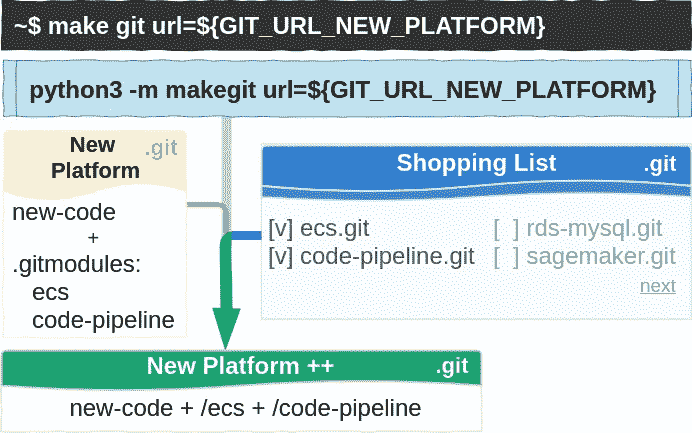
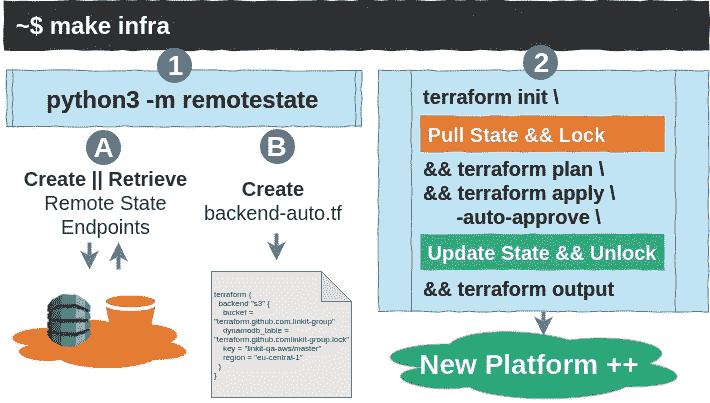
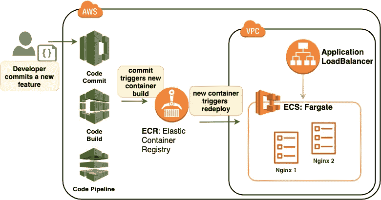

# 自动化一切 AWS 上的云容器供应

> 原文：<https://itnext.io/on-automating-everything-cloud-container-provisioning-on-aws-ae88db5efad3?source=collection_archive---------5----------------------->


[张家瑜](https://unsplash.com/@danielkcheung?utm_source=medium&utm_medium=referral)在 [Unsplash](https://unsplash.com?utm_source=medium&utm_medium=referral) 上拍照

让我们谈谈如何应用持续部署和集成(CI/CD)来将一些服务上线 GitOps 方式。简而言之，我们喜欢向 Git 提交新特性，并通过微服务将这些特性立即推送给用户。面向开发人员的命令行如下所示:

```
git commit -am "add new feature X for product Y" \
  && git push
```

在输入上面的代码行之后，一个管道就开始了，东西被测试和(重新)部署([蓝绿色](https://martinfowler.com/bliki/BlueGreenDeployment.html)风格)，之后最终用户消费更新的服务。在 Git 中，版本回滚简单地通过恢复到以前的版本来工作，服务相应地改变回来。

本文主要是关于在应用 infra-as-code 本身之前将自动化部分放置到位——为寻找更快部署平台的方法这一永无止境的渴望服务。最后，我们创建了一个平台，将 Dockerfiles 转换为在 AWS Fargate 上运行的服务。

# 低维护运营成本

现代基础设施工作包括服务和管理无数平台，按需即时交付。这意味着——更重要的是——自动化。

我们从补充这个 [Docker & Makefile](/docker-makefile-x-ops-sharing-infra-as-code-parts-ea6fa0d22946) 部分开始，将基础架构作为代码推送到公共云平台。这些是最终应该完成工作的一行程序:

```
# Make-Git: create a build repository
make git url=${GIT_URL_NEW_PLATFORM}# Make-Infra: deploy the infrastructure
make infra
```

不包括评论，那是两行代码。第一个是 Make-Git，用于在新的部署对象中提取代码部分。第二个——Make-Infra——处理部署本身。

注意，所有代码都可以在 Github 上获得。本文的最后一节提供了到存储库的链接(Dockerfile 到 Fargate)。

## 制造 Git

Make-Git 有助于在新项目中重用现有的代码片段。该工具是 GIT-子树和-子模块的包装器。我们在一个地方维护单独的代码部分，并在需要时加入。



图 1: Make-Git

Make-Git(图 1)基于. gitmodules 中的配置，将现有的——可重用的——部分引入到一个新的平台中。

Make-Git 是一个 Python 模块，通过 [PyPi](https://pypi.org/) 安装:

```
python3 -m pip install makegit
```

这一行没必要抄。该模块是由 Dockerfile 添加的，将在本文的最后一章演示。Makefile 中的条目:

```
git:
     $(RUN_DOCK) "GIT_URL=\"$(URL)\" makegit"
```

那个 git 目标触发了这个~/。容器运行时的别名功能:

```
# compressed for readability purposes
function __makegit(){
    ...
    python3 -m makegit --url "${GIT_URL}"
    ...
    return $return_code
}
alias makegit='__makegit'
```

该设置允许在容器内部运行 Python3 模块，从那里收集所需的 GIT 存储库。

通过使用~/。别名文件我们可以在前后添加代码，甚至可以使用特殊字符——引号、管道和重定向——众所周知，这些字符在 Makefile 中很难转义。

## 通过提交部署基础架构— VIM 用户奖励

我逐渐习惯了持续提交和推送代码——每隔几分钟到 10 分钟——以获得微小增量的即时反馈。如果你是 VIM 用户，你可能会喜欢这个~/。vimrc 片段:

~/.vimrc 代码片段

键入*:P*——抱歉，没有双关语的意思——提交并推送代码，或者键入 *:W* 仅提交代码。这是针对 VIM 的，但是每个 [IDE](https://en.wikipedia.org/wiki/Integrated_development_environment) 都应该能够运行类似的功能——可以随意从~/中复制。vimrc 片段有选择地。

## 制造基础设施

作为代码的基础部分是用 Terraform 编写的，因为我有现成的代码——它只需要我做出有限的贡献。使用 Terraform 的好理由是:

*   **集成:**一个连接所有相关云提供商的代码库。
*   记录:可用的蓝图有助于启动新项目。
*   **可配置** [**远程状态**](https://www.terraform.io/docs/state/remote.html) **:** 这有助于处理共享项目。

免责声明。如果你只使用 AWS，CloudFormation 可以说是一个更好的选择——它的自动回滚和深度 AWS 集成是最棒的。我将在下一篇文章中分享 CloudFormation 版本，在这篇文章中，我坚持使用 Terraform。

在生产设置中，Terraform 要求在运行实际的部署代码之前，首先设置和检索状态。多亏了一些 Python 自动化和 Makefile 的魔力，我们把它们都压缩到了一个调用中。



图 2:制造基础设施

图 2 中的制造基础示意图。通过 Makefile 调用 Python 模块 RemoteState 来设置 Terraform 状态材料(1)，然后使用普通的 Terraform 构建命令来部署 infra (2)。

## 关于 Terraform 远程状态

在企业环境中，Terraform 通常由一个或多个团队使用，以确保应用安全操作[远程状态&锁定](https://medium.com/@jessgreb01/how-to-terraform-locking-state-in-s3-2dc9a5665cb6)。

*   **远程状态**。Terraform 将服务 id 和端点等基础细节写入状态文件[中。将此文件存储在远程位置，提供了关于已部署基础架构的单一真实来源—存储在 S3。](https://www.terraform.io/docs/state/)
*   **锁定**。一次只能运行一个更新过程。我们通过在数据库(存储在 DynamoDB 中)中设置一个锁条目来实现这一点。

一个常见的问题是，不正确的后端文件很容易导致错误状态，这很难进行故障排除和恢复。为了解决这个问题，RemoteState 模块自动创建了这个文件。

## 在远程状态—模块上

远程状态模块创建:

*   AWS 上的 DynamoDB 和 S3 零件，如果这些零件尚不存在。
*   供 Terraform 使用的后端文件— terraform/backend-auto.tf

该模块从当前的 GIT 存储库中获取信息——由 Make-Git 提取。AWS 键和区域信息从缺省的~/中加载。AWS/凭据和~/。aws/config 文件([见 AWS CLI 说明](https://docs.aws.amazon.com/cli/latest/userguide/cli-chap-configure.html))。

这将安装 RemoteState 模块:

```
python3 -m pip install remotestate
```

与 Make-Git 类似，这个一行程序包含在 docker 文件中。Makefile 中的条目:

```
remote:
        $(RUN_DOCK) "remotestate"
```

~/中的包装函数。别名:

```
# compressed for readability purposes
function __remotestate(){
    ...
    cd "${PROJECT_PATH}" && \
        python3 -m remotestate --git "build/buildrepo"
    ...
    return $return_code
}
alias remotestate='__remotestate'
```

RemoteState 期望在“build/buildrepo”目录中有一个 GIT 存储库，由 Make-Git 在前面的章节中创建，以检索在。git/config。RemoteState 从 URL 自动导出 DynamoDB 表和 S3 桶的名称，在下一节中，我们将解释这是如何工作的

## RemoteState:命名方案

RemoteState 负责根据 GIT 存储库 URL 的输入来命名 DynamoDB 表和 S3 桶。假设使用以下 URL:

```
GIT_URL = [https://github.com/LINKIT-Group/aws-cicd-demo](https://github.com/LINKIT-Group/aws-cicd-demo)
```

这可以分解为以下几个部分:

```
# composed from ${GIT_URL}
GIT_HOST = github.com
GIT_ORGANISATION = LINKIT-Group
GIT_REPO_NAME = aws-cicd-demo
GIT_URI = ${GIT_HOST}/${GIT_ORGANISATION}/${GIT_REPO_NAME}# defaults -- optionally retrieved from ${GIT_URL}
GIT_BRANCH = master
```

该信息用于创建 DynamoDB 和 S3 的名称。所有字符都是小写的:

```
# note that one set of DynamoDB tables is created to hold all repositories within one group (GIT_ORGANISATION).# DynamoDB Table base name -- not a Table itself
DYNAMO_TABLE_NAME = terraform.${GIT_HOST}.${GIT_ORGANISATION}# table for locking
DYNAMO_TABLE_NAME_LOCK = ${DYNAMO_TABLE_NAME}.lock# table to store key=${GIT_URI}, value=${S3_BUCKET_NAME} -pairs
DYNAMO_TABLE_NAME_LOCK = ${DYNAMO_TABLE_NAME}.s3# Python Code example
import time
def time_string():
   """Return current time in micro-second (usec) as a string"""
   return str(round(time.time()*10**6))CREATION_TIME_MICROSEC = time_string()
# Bucketname must be globally unique--why we add the microseconds.S3_BUCKET_NAME = ${DYNAMO_TABLE_NAME}-${CREATION_TIME_MICROSEC}
```

## Terraform 故障排除

要运行 Terraform，Makefile 中有以下几行:

```
infra:
        $(RUN_DOCK) "remotestate"
        $(RUN_DOCK) "terraform init \
        && terraform plan \
        && terraform apply -auto-approve \
        && terraform output"
destroy:
        $(RUN_DOCK) "terraform destroy -auto-approve"
```

这很好，但是用于管理或排除部署的基础设施故障的所有其他 Terraform 命令又如何呢？按如下方式输入容器:

```
make shell
```

进入容器后，您可以直接键入单独的 Terraform 命令来排除故障和修复问题。

## 低维护运营:总结

团队成员现在可以通过应用 Make-Git 来获取 GIT 存储库，并使用 Make-Infra 创建基础设施。

这两个过程的主要优点是团队成员不需要处理内部配置，在降低风险的同时加速交付。不用说，一切都是自动化的。

# 码头文件到法盖特

前面几节是关于高效地创建和部署新平台的。在这一部分，是时候交付承诺的 CI/CD 平台了。

**附加先决条件**

*   AWS 账户——这可以通过[免费](https://aws.amazon.com/free)获得。
*   码头工人。安装说明: [Ubuntu](https://docs.docker.com/install/linux/docker-ce/ubuntu/#install-docker-ce) 或者 [Mac](https://docs.docker.com/docker-for-mac/install/) 。
*   能够在您的主机系统上运行“ [make](https://www.tutorialspoint.com/unix_commands/make.htm) ”。大多数 Unix、Linux 和 Mac 系统默认都有这个——在 Windows 上，我推荐 Ubuntu VM。

我推荐使用一个干净的 AWS 账号或者一个专用的测试区域来玩。我还假设你有一些使用 AWS 的经验，并了解我们正在建设什么。

## AWS 上用于无服务器容器的构建管道



图 AWS 中的 CI/CD + ECS

假设您的系统已经准备好—参见上面的先决条件列表—以下代码行部署该平台:

```
# retrieve deploytools, this repository holds MakeGit and MakeInfra
git clone [https://github.com/LINKIT-Group/deploytools](https://github.com/LINKIT-Group/deploytools.git)
cd deploytools# collect the code to deploy our demo
# code is put in the build/ directory
make git url=https://github.com/linkit-group/aws-cicd-demo# deploy the demo
# note: ensure ~/.aws is setup properly!
make infra
```

构建基础设施大约需要 5 分钟——刚好够喝一杯咖啡、茶或吃点点心。如果一切顺利，您应该会在控制台上看到以下 Terraform 输出:

```
# Apply complete! Resources: 47 added, 0 changed, 0 destroyed.
```

请注意 AWS 法案正在运行。大约一天几美元。

现在是时候访问应用程序了。登录 AWS 控制台，进入 EC2 -> Loadbalancers，这里你会发现一个应用负载平衡器:“app-demo-backend-test-alb”。单击它，打开“描述”选项卡，复制“DNS 名称”下的值，并将其粘贴到浏览器窗口中。

您应该从应用程序负载平衡器那里得到以下错误消息:

```
503 Service Temporarily Unavailable
```

您得到这个错误消息是因为还没有应用程序。我们只创建了构建平台，等待我们推送应用代码。

## 推送应用程序代码

是时候和开发者换帽子了。让我们安装一个 Nginx 容器，向世界问好。我们克隆[这个存储库](https://github.com/LINKIT-Group/nginx-docker-helloworld.git)，将内容复制/粘贴到 CodeCommit 存储库中，并通过提交和推送进行部署。

通过浏览到 AWS 控制台-> CodeCommit 来检索${CODECOMMIT_URL}。应该有一个名为“app-${random-chars}”的存储库，单击它并转到“克隆 URL”。选择“克隆 SSH”并复制字符串。

如果这是您第一次克隆 CodeCommit 存储库，您会得到一个拒绝访问的错误。首先，按照这些[指令](https://docs.aws.amazon.com/codecommit/latest/userguide/setting-up-ssh-unixes.html?icmpid=docs_acc_console_connect_np)设置一个 SSH 密钥(步骤 3)。

```
# clone CodeCommit repository -- first time its empty
git clone ${CODECOMMIT_URL}# clone nginx demo code
git clone [https://github.com/LINKIT-Group/nginx-docker-helloworld](https://github.com/LINKIT-Group/nginx-docker-helloworld.git)# copy/ paste to CodeCommit repo
cp nginx-docker-helloworld/* ${CODECOMMIT_REPO}/# commit and push -- this will trigger a container deployment
cd ${CODECOMMIT_REPO}
git add *
git commit -am "add feature X for product Y"
git push
```

现在是休息放松的时候了。您可以通过浏览 AWS 控制台-> CodePipeLine 来查看流程，并刷新指向容器的 URL。

如果您收到“Hello world”消息，它会按设计工作，我们就完成了。

```
# delete the platform
make destroy# note this will not clean up the S3 bucket and DynamoDB table used by Terraform backend. These must be deleted separately if no longer needed.
```

# 开始的结束

我希望已经证明您可以停止使用 EC2-instances 进行简单的服务。您是否注意到 ECS-Fargate 也不插入 EC2？—这些是无服务器容器。

下一步是看看我们能在多大程度上扩展它，并开始节省管理大型容器集群的时间——不再有笨重的 EC2 实例！

对我来说，另一项工作是用纯 CloudFormation 替换所有的 Terraform 代码，并切换到 Lambda-only 以实现自动化粘合。

希望在以后的文章中分享其中之一(或两者)。

感谢阅读！