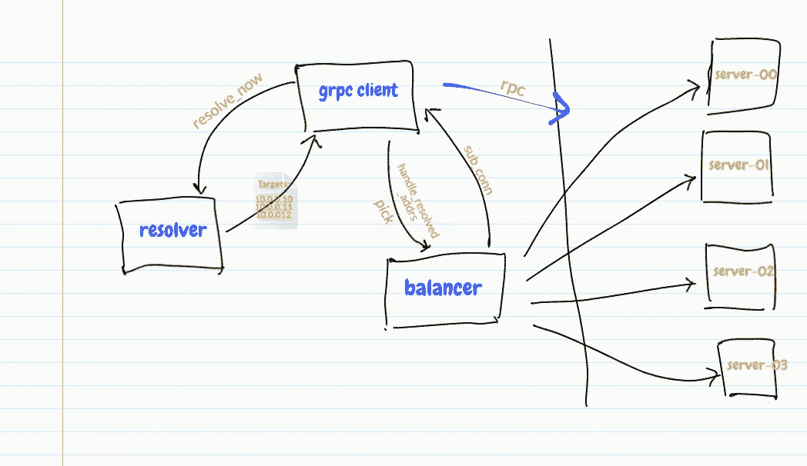
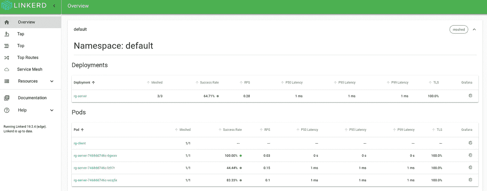
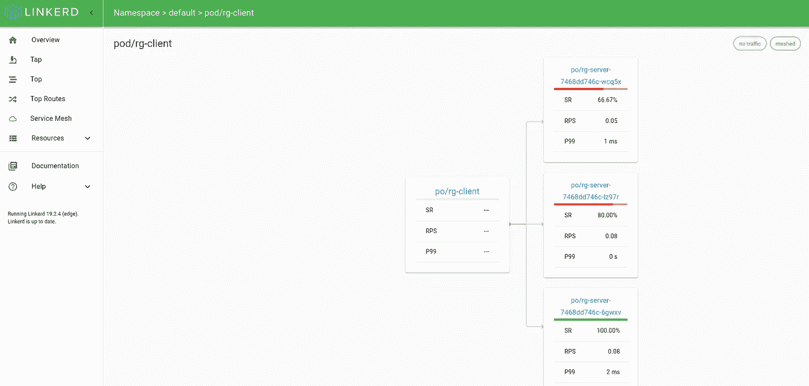

# gRPC 负载均衡研究

> 原文：<https://itnext.io/on-grpc-load-balancing-683257c5b7b3?source=collection_archive---------1----------------------->

继 William 在 Kubernetes without Tears 上发表了关于 [*gRPC 负载均衡的帖子之后，我开始有兴趣了解实现 gRPC 负载均衡实际需要做多少工作。*](https://kubernetes.io/blog/2018/11/07/grpc-load-balancing-on-kubernetes-without-tears/)

在这篇文章中，我想与你分享我所学到的关于使用 [gRPC-Go](https://godoc.org/google.golang.org/grpc) `[balancer](https://godoc.org/google.golang.org/grpc/balancer)`和`[resolver](https://godoc.org/google.golang.org/grpc/resolver)`包来实现简单的客户端循环负载均衡。然后，我将展示如何使用 Linkerd 2 自动对 gRPC 流量进行负载平衡，而无需更改任何应用程序代码或部署额外的负载平衡器。

我已经在我的 [GitHub repo](https://github.com/ihcsim/routeguide) 上发布了这篇文章中使用的代码。gRPC 应用程序经过以下测试:

*   去 1.11.5
*   议定书 3.6.1
*   gRPC 1.18

# 它是如何工作的

让我们探索 gRPC 客户端负载平衡工作所需的两个主要组件；[名称解析器](https://github.com/grpc/grpc/blob/master/doc/naming.md)和[负载平衡策略](https://github.com/grpc/grpc/blob/master/doc/load-balancing.md)。



## 名字解析

当 gRPC 客户机想要与 gRPC 服务器进行交互时，它首先尝试通过向解析器发出名称解析请求来解析服务器名称。解析器返回已解析的 IP 地址列表。每个 IP 地址都与一个指示器相关联，用于确定它是后端地址还是负载平衡器地址。此外，还会返回一个[服务配置](https://github.com/grpc/grpc/blob/master/doc/service_config.md)对象，其中包含有关使用哪个负载平衡策略的信息。

默认情况下，gRPC 使用`dns`作为它的默认名称系统。

出于代码演示的目的，让我们使用`manual`解析器。在客户端应用程序代码中，我们可以像这样创建和注册解析器:

```
// create a manual.Resolver with a random scheme
resolver, _ := manual.GenerateAndRegisterManualResolver()// define the initial list of addresses
resolver.InitialAddrs([]resolver.Address{
  resolver.Address{Addr:"10.0.0.10", Type: resolver.Backend},
  resolver.Address{Addr:"10.0.0.11", Type: resolver.Backend},
  resolver.Address{Addr:"10.0.0.12", Type: resolver.Backend},
})// set the default name resolution scheme to that of the resolver
resolver.SetDefaultScheme(resolver.Scheme())
```

1.  `manual.GenerateAndRegisterManualResolver()`方法返回一个`manual.Resolver`类型的解析器。这个解析器是用随机命名方案创建的。由于解析的 IP 地址是手动添加的(在步骤 2 中)，所以这个解析器的方案是什么并不重要。
2.  `manual.InitialAddrs()`方法允许我们注册一个用于命名解析的地址列表。
3.  最后，`resolver.SetDefaultScheme()`方法用于将应用程序的默认命名解析方案设置为新解析器的方案。

有了这个，每当客户端需要解析服务器名称时，解析器将总是返回这些(**并且只返回这些**)注册的地址。

## 负载平衡策略

第二个组件是负载平衡策略。gRPC-Go 库中的两个内置策略是`roundrobin`和`grpclb`策略。`grpclb` 策略通常与像[这样的外部负载平衡器一起使用。还有一个](https://github.com/bsm/grpclb)`[base](https://godoc.org/google.golang.org/grpc/balancer/base)`策略，通常用于构建更复杂的拣选算法。

对于解析器返回的每个非负载平衡器地址，负载平衡策略创建一个到该地址的新子连接。然后，该策略返回一个选取器，该选取器为客户端提供一个接口，以检索用于进行 RPC 调用的子连接。

以下代码片段显示了如何通过将客户端循环负载平衡策略指定为`grpc.DialOption`来启用它:

```
opts := []grpc.DialOption{
  grpc.WithBalancerName(roundrobin.Name)),
  // ....
}
conn, err := grpc.Dial(serverAddr, opts...)
```

# 运行应用程序

本例中使用的 gRPC 服务器和客户端应用程序基于 [gRPC Basic - Go](https://grpc.io/docs/tutorials/basic/go.html) 页面上的`routeguide`示例，并做了以下修改:

*   服务器实现健康检查，并使用拦截器来模拟错误响应。
*   客户端可以在`firehose`或`repeat-N`模式下启动。`firehose`模式导致客户端在一个无限循环中向所有 4 个 API 发出随机调用。`repeat-N`模式更适合需要更多控制和可预测性的测试，通过向预先选择的 API 发出 N 个调用，然后终止。

可以使用`make server`目标来启动服务器。

```
$ make server 
go build -o ./cmd/server/server ./cmd/server/ 
./cmd/server/server -port=8080 -fault-percent=0.3 
2019/02/20 20:08:49 [main] fault percentage: 30% 
2019/02/20 20:08:49 [main] hostname: orca:8080
```

通过运行以下命令，在不进行负载平衡的情况下启动客户端:

```
$ ENABLE_LOAD_BALANCING=false make client
go build -o ./cmd/client/client ./cmd/client/ 
./cmd/client/client \ 
        -server=:8080 \ 
        -timeout=20s \ 
        -mode=REPEATN \ 
        -api=GetFeature \ 
        -n=15 \ 
        -enable-load-balancing=false \ 
        -server-ipv4=127.0.0.1:8080,127.0.0.1:8081,127.0.0.1:8082
2019/02/18 20:35:35 [main] connecting to server at :8080 
2019/02/18 20:35:35 [main] running in REPEATN mode 
2019/02/18 20:35:35 [main] calling getfeature 15 times 
2019/02/18 20:35:35 [GetFeature] (req) latitude:402133926 longitude:-743613249 
2019/02/18 20:35:35 [GetFeature] (resp) (**server=orca:8080**) location:<latitude:402133926 longitude:-743613249 > 
2019/02/18 20:35:38 [GetFeature] (req) latitude:411349992 longitude:-743694161 
2019/02/18 20:35:38 [GetFeature] (resp) (**server=orca:8080**) location:<latitude:411349992 longitude:-743694161 > 
2019/02/18 20:35:41 [GetFeature] (req) latitude:416855156 longitude:-744420597 
...
```

默认情况下，客户端被配置为调用`GetFeature` API 15 次。从客户端日志中注意到，所有响应都来自`orca:8080`。

现在在端口 8081 和 8082 上再启动两个服务器实例:

```
$ SERVER_PORT=8081 make server &
$ SERVER_PORT=8082 make server &
```

在启用负载平衡的情况下重新启动客户端:

```
$ make client
go build -o ./cmd/client/client ./cmd/client/ 
./cmd/client/client \ 
        -server=:8080 \ 
        -timeout=20s \ 
        -mode=REPEATN \ 
        -api=GetFeature \ 
        -n=15 \ 
        -enable-load-balancing=true \ 
        -server-ipv4=127.0.0.1:8080,127.0.0.1:8081,127.0.0.1:8082
2019/02/18 20:58:07 [main] load balancing scheme: round_robin 
2019/02/18 20:58:07 [main] resolver type: manual 
2019/02/18 20:58:07 [main] connecting to server at :8080 
2019/02/18 20:58:07 [main] running in REPEATN mode 
2019/02/18 20:58:07 [main] calling getfeature 15 times 
2019/02/18 20:58:07 [GetFeature] (req) latitude:402133926 longitude:-743613249 
2019/02/18 20:58:07 [GetFeature] (resp) (**server=orca:8081**) location:<latitude:402133926 longitude:-743613249 > 
2019/02/18 20:58:10 [GetFeature] (req) latitude:411349992 longitude:-743694161 
2019/02/18 20:58:10 [GetFeature] (resp) (**server=orca:8082**) location:<latitude:411349992 longitude:-743694161 > 
2019/02/18 20:58:13 [GetFeature] (req) latitude:416855156 longitude:-744420597 
2019/02/18 20:58:13 [GetFeature] (resp) (**server=orca:8080**) name:"103-271 Tempaloni Road, Ellenville, NY 12428, USA" location:<latitude:416855156 longitude:-744420597 > 
2019/02/18 20:58:16 [GetFeature] (req) latitude:409146138 longitude:-746188906 
2019/02/18 20:58:16 [GetFeature] (resp) (**server=orca:8081**) name:"Berkshire Valley Management Area Trail, Jefferson, NJ, USA" location:<latitude:409146138 longitude:-746188906 > 
...
```

我们可以看到响应是从`orca:8080`、`orca:8081`和`orca:8082`返回的。

太好了！看起来我们的客户端循环负载平衡在本地主机上工作👍 👍 🎈 🎈。

# 在 Kubernetes

我们试着在 Kubernetes 上运行一下。 [k8s-server.yaml](https://github.com/ihcsim/routeguide/blob/master/k8s-server.yaml) 和 [k8s.client.yaml](https://github.com/ihcsim/routeguide/blob/master/k8s-client.yaml) 清单文件将部署 3 个 gRPC 服务器副本和一个 gRPC 客户端。服务器和客户机都从它们的配置图中读取它们的配置。

默认情况下，客户端被配置为使用`dns`解析器类型。我们将无法使用`manual`解析器类型，因为我们事先不知道服务器的 pod IP。我们也没有一个监视器来监视 pod 的 IP 地址。

以下是客户端的默认配置:

```
kind: ConfigMap
apiVersion: v1
metadata:
  name: rg-client-config
  labels:
    app: rg-client
data:
  SERVER_HOST: rg-server.default.svc.cluster.local
  SERVER_PORT: "80"
  GRPC_TIMEOUT: 60s
  MODE: repeatn
  MAX_REPEAT: "20"
  REMOTE_API: GetFeature
  ENABLE_LOAD_BALANCING: "true"
  RESOLVER_TYPE: dns
```

要将服务器和客户机部署到 Kubernetes 集群，运行:

```
$ make deploy
```

客户端日志显示所有响应都是从一个(而不是所有)服务器实例返回的。这令人失望，但并不奇怪😦。

```
$ kubectl logs -f rg-client 
2019/02/20 05:27:21 [main] load balancing scheme: round_robin 
2019/02/20 05:27:21 [main] resolver type: dns 
2019/02/20 05:27:21 [main] connecting to server at rg-server.default.svc.cluster.local:80 
2019/02/20 05:27:21 [main] running in repeatn mode 
2019/02/20 05:27:21 [main] calling GetFeature 20 times 
2019/02/20 05:27:21 [GetFeature] (req) latitude:402133926 longitude:-743613249 
2019/02/20 05:27:21 [GetFeature] (resp) (**server=rg-server-6c49b4dcf5-c7bxm:80**) location:<latitude:402133926 longitude:-743613249 > 
2019/02/20 05:27:24 [GetFeature] (req) latitude:410873075 longitude:-744459023 
2019/02/20 05:27:24 [GetFeature] (resp) (**server=rg-server-6c49b4dcf5-c7bxm:80**) name:"Clinton Road, West Milford, NJ 07480, USA" location:<latitude:410873075 longitude:-744459023 > 
2019/02/20 05:27:27 [GetFeature] (req) latitude:414777405 longitude:-740615601 
2019/02/20 05:27:27 [GetFeature] (resp) (**server=rg-server-6c49b4dcf5-c7bxm:80**) location:<latitude:414777405 longitude:-740615601 > 
2019/02/20 05:27:30 [GetFeature] (req) latitude:415301720 longitude:-748416257 
2019/02/20 05:27:30 [GetFeature] (resp) (**server=rg-server-6c49b4dcf5-c7bxm:80**) name:"282 Lakeview Drive Road, Highland Lake, NY 12743, USA" location:<latitude:415301720 longitude:-748416257
 > 
....
```

# 使用 Linkerd 2

让我们安装 Linkerd 2，并使用它来启用自动 gRPC 负载平衡和(作为额外奖励)TLS 加密连接。

安装 Linkerd 控制平面:

```
$ linkerd install --tls=optional | kubectl apply -f - 
```

通过更新客户端配置图来禁用客户端循环负载平衡:

```
kind: ConfigMap
apiVersion: v1
metadata:
  name: rg-client-config
  labels:
    app: rg-client
data:
  SERVER_HOST: rg-server.default.svc.cluster.local
  SERVER_PORT: "80"
  GRPC_TIMEOUT: 60s
  MODE: repeatn
  MAX_REPEAT: "20"
  REMOTE_API: GetFeature
  **ENABLE_LOAD_BALANCING: "false"**
  RESOLVER_TYPE: dns
```

网格化并部署服务器和客户端:

```
$ linkerd inject --tls=optional k8s-server.yaml | kubectl apply -f -
$ linkerd inject --tls=optional k8s-client.yaml | kubectl apply -f -
```

现在查看客户端日志，我们可以看到所有 3 台服务器都返回了响应。

```
$ kubectl logs -f rg-client rg-client 
2019/02/20 05:50:21 [main] connecting to server at rg-server.default.svc.cluster.local:80 
2019/02/20 05:50:21 [main] running in repeatn mode 
2019/02/20 05:50:21 [main] calling GetFeature 20 times 
2019/02/20 05:50:21 [GetFeature] (req) latitude:402133926 longitude:-743613249 
2019/02/20 05:50:21 [GetFeature] (resp) (**server=rg-server-b7b84d954-fh9q2:80**) location:<latitude:402133926 longitude:-743613249 > 
2019/02/20 05:50:24 [GetFeature] (req) latitude:410873075 longitude:-744459023 
2019/02/20 05:50:24 [GetFeature] (resp) (**server=rg-server-b7b84d954-9ttc7:80**) name:"Clinton Road, West Milford, NJ 07480, USA" location:<latitude:410873075 longitude:-744459023 > 
2019/02/20 05:50:27 [GetFeature] (req) latitude:414777405 longitude:-740615601 
2019/02/20 05:50:27 [GetFeature] (resp) (**server=rg-server-b7b84d954-s2vx5:80**) location:<latitude:414777405 longitude:-740615601 > 
2019/02/20 05:50:30 [GetFeature] (req) latitude:415301720 longitude:-748416257 
2019/02/20 05:50:30 [GetFeature] (resp) (**server=rg-server-b7b84d954-fh9q2:80**) name:"282 Lakeview Drive Road, Highland Lake, NY 12743, USA" location:<latitude:415301720 longitude:-748416257 
> 
2019/02/20 05:50:33 [GetFeature] (req) latitude:402647019 longitude:-747071791 
2019/02/20 05:50:33 [GetFeature] (resp) (**server=rg-server-b7b84d954-fh9q2:80**) name:"330 Evelyn Avenue, Hamilton Township, NJ 08619, USA" location:<latitude:402647019 longitude:-747071791 > 
2019/02/20 05:50:36 [GetFeature] (req) latitude:405957808 longitude:-743255336 
2019/02/20 05:50:36 [GetFeature] (resp) (**server=rg-server-b7b84d954-fh9q2:80**) name:"82-104 Amherst Avenue, Colonia, NJ 07067, USA" location:<latitude:405957808 longitude:-743255336 > 
....
```

查看 Linkerd 仪表板，请注意:

*   TLS 自动启用。
*   可以观察到由注入故障引起的请求失败。



屏幕截图 gRPC 客户端和服务器副本之间的流量摘要



截图 2:每台服务器的成功率和每秒请求数

简单吧？😄

# 结论

我们研究了如何使用 gRPC-Go `balancer`和`resolver`包实现客户端循环负载平衡。虽然没有很多代码要写，但我确实花了一些时间来弄清楚不同的部分是如何组合在一起的。

我们看到了`dns`域名系统如何在 Kubernetes 上不起作用，因为 Kubernetes 的默认内部负载平衡工作在 L4 级别。gRPC 是 L7 协议。

然后，我们将 Linkerd 2 部署到集群中。使用`linkerd inject`命令，我们能够将 gRPC 服务器和客户机结合起来，实现自动 gRPC 负载平衡和 TLS。我们这样做没有改变应用程序代码，额外的 YAML 文件，也没有部署外部负载平衡器。

# 脚注

[1]https://grpc.io/blog/loadbalancing

[2][https://github . com/grpc/grpc/blob/master/doc/load-balancing . MD # workflow](https://github.com/grpc/grpc/blob/master/doc/load-balancing.md#workflow)