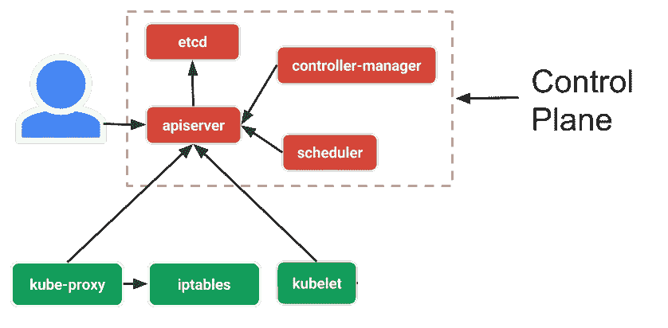
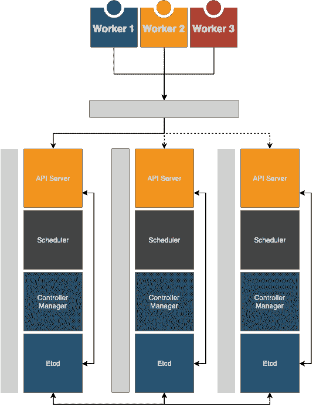

# 内部 HA Kubernetes 集群

> 原文：<https://itnext.io/on-premise-ha-kubernetes-cluster-15e41f18bd12?source=collection_archive---------2----------------------->

## 在建立生产 Kubernetes 集群时克服基础设施限制


瑞安·帕克在 [Unsplash](https://unsplash.com/search/photos/storage?utm_source=unsplash&utm_medium=referral&utm_content=creditCopyText) 上的照片

*考虑到配置的便利性、网络和成本，我们进行了彻底的搜索，选择了一家托管提供商，并按照我们想要的方式设置了许多专用服务器。*

出于演示目的，我假设我们有 **9** 台专用服务器。

这是我的另一篇文章的后续。

[](https://medium.com/@anisinanaj/kubernetes-on-premise-8ceffa48fee5) [## 在内部配置 Kubernetes

### 概述在你自己的服务器上设置 Kubernetes，分析这种方法的问题以及如何克服…

medium.com](https://medium.com/@anisinanaj/kubernetes-on-premise-8ceffa48fee5) 

# 高可用性

那么为什么是 9 台服务器呢？到目前为止，我们可以把构成星团的部分分成 3 个部分。我们有*存储*、*控制平面*和*工作者*节点。

# 工作节点

毫无疑问，工作者节点需要不止一个，否则使用 Kubernetes 就没有意义。所以我们选择 3，因为我们需要保证多数法则*一半加二分之一*。

假设我们正在部署一个应用程序，我们需要它高度可用。我们复制它两次。但是，如果一个拷贝由于某种原因出现故障，我们就不再处于高可用性环境中了。因此，为了保证这种情况，我们需要 3 个副本，因此，如果这 3 个副本中的任何一个因未知原因而失败，我们都不必担心，而是可以专注于对失败的副本进行故障排除。

服务器也是如此。如果一台服务器出现故障或者我们需要进入维护模式，我们可以关闭一台服务器，而不用担心我们的生产应用程序。

# 制导机

在我的上一篇文章中，我用单节点控制平面设置了集群。为了理解与该设计相关的问题，我们先来看看控制平面是如何工作的。

它由一个键-值数据库组成，其中存储了所有配置和部署指令，即`etcd.`然后是`controller manager`，它确保集群的状态与`etcd.`中的配置相匹配。`scheduler`决定资源(即 pod)去往哪个节点。最后，`api server`为集群管理和节点间的通信公开了一个 REST API。



控制平面架构

上述所有组件都被设计为可扩展的。最重要的组件是数据库。**如果失败，我们将失去所有关于部署和其他资源的配置**因此 Kubernetes 不能保证所有应用程序都可用。因为 ETCD 是一个内存数据库，它依赖于服务器。如果服务器出现故障，数据库就会丢失。

> 因此，我们需要确保，如果一台服务器出现故障，我们仍然可以正常运行。我们需要将控制平面置于高可用性状态。这就是为什么我们需要 3 台服务器。

虽然这种方法有些复杂，但是首先让我们看看如何配置它。

## 控制平面设置

我将我的服务器称为 *kube-cp-1* 、 *kube-cp-2* 、 *kube-cp-3* ，我将假设我的服务器分别有以下主机名*kube-cp-1.com、kube-cp-2.com、kube-cp-3.com*

根据文档，我将 ssh 到每个服务器，并按照我以前的文章中描述的那样设置它们，稍加修改，Kubernetes 现在支持 docker 的最新版本。

```
sudo apt-get install \
    apt-transport-https \
    ca-certificates \
    curl \
    gnupg2 \
    software-properties-commoncurl -fsSL [https://download.docker.com/linux/debian/gpg](https://download.docker.com/linux/debian/gpg) | sudo apt-key add -sudo apt-key fingerprint 0EBFCD88sudo add-apt-repository \
   "deb [arch=amd64] [https://download.docker.com/linux/debian](https://download.docker.com/linux/debian) \
   $(lsb_release -cs) \
   stable"apt-get update
apt-get install docker-ce
```

此时，我们可以安装 Kubernetes 包。

```
apt-get update && apt-get install -y apt-transport-https curlcurl -s [https://packages.cloud.google.com/apt/doc/apt-key.gpg](https://packages.cloud.google.com/apt/doc/apt-key.gpg) | apt-key add -cat <<EOF >/etc/apt/sources.list.d/kubernetes.list
deb [https://apt.kubernetes.io/](https://apt.kubernetes.io/) kubernetes-xenial main
EOFapt-get update
apt-get install -y kubelet kubeadm kubectl
apt-mark hold kubelet kubeadm kubectl
```

最后，关闭一些操作系统功能和最终检查。

```
# The swap should be turned off
swapoff -a# Remove the line that contains **swap** from /etc/fstab
nano /etc/fstab# Check that all servers have different mac addresses
ip link# Check that all servers have a different product ID
sudo cat /sys/class/dmi/id/product_uuid
```

我们必须在指定给控制平面的所有服务器上执行上述操作。完成后，我们现在可以初始化集群。

首先，我将使用以下命令生成令牌

```
kubeadm token generate
```

现在，我将创建一个包含一些配置参数的文件。

```
apiVersion: kubeadm.k8s.io/v1beta1
kind: ClusterConfiguration
kubernetesVersion: stableetcd:
 local:
  serverCertSANs:
  - 10.10.1.1
  - 10.10.1.2
  - 10.10.1.3
  - localhost
  - 127.0.0.1
  - kube-cp-1.com
  - kube-cp-2.com
  - kube-cp-3.com
  - lb.kube-cp.com
  peerCertSANs:
  - 10.10.1.1
  - 10.10.1.2
  - 10.10.1.3
  - localhost
  - 127.0.0.1
  - kube-cp-1.com
  - kube-cp-2.com
  - kube-cp-3.com
  - lb.kube-cp.comapiServer:
  certSANs:
  - 10.10.1.1
  - 10.10.1.2
  - 10.10.1.3
  - localhost
  - 127.0.0.1
  - kube-cp-1.com
  - kube-cp-2.com
  - kube-cp-3.com
  - lb.kube-cp.comcontrolPlaneEndpoint: "lb.control_plane:6443"
networking:
  serviceSubnet: "10.32.0.0/162
  podSubnet: "10.244.0.0/16"
  dnsDomain: "cluster.local"
```

这个配置文件主要用于定义自签名证书应该工作的不同地址。这里我们包括所有控制平面 IP、主机名、本地主机、127.0.0.1 和一个特殊域*lb.kube-cp.com*。还要记住`podSubnet`和`serviceSubnet`是专用于[法兰绒](https://github.com/coreos/flannel)的，它是一种通用 CNI。

为了理解我们为什么需要特殊的域 lb.kube-cp.com，我们首先需要深入研究一下 **controlPlaneEndpoint** 配置属性。

## **控制平面端点**

如前所述，所有其他节点都通过 API 服务器与控制平面通信。这个 API 服务器需要通过一个由**控制计划端点**定义的端点来访问。默认情况下，它使用初始化 Kubernetes 的第一个服务器的 ip，虽然它在单节点控制平面上工作，但它在 HA 控制平面上存在问题。

第一种情况是有三个控制平面服务器，每个都有自己的 IP 地址。设置好 Kubernetes 之后，我们将 **controlPlaneEndpoint** 设置为第一台服务器的 IP。所有工作节点都引用该 IP。最后，我们有了一个 HA 控制平面，但是所有的服务都指向一个服务器来获取所有的信息。如果该服务器出现故障，尽管控制平面本身已启动，但群集将无法工作，因为所有工作节点都将引用一个失效的服务器。(所有部署继续工作)

第二个场景利用了一个**神奇的 IP 地址**，它总是指向一个活动的控制平面节点。这样，对于三个控制平面，当第一个出现故障时，IP 会自动切换到其中一个正常工作的控制平面。为了让一切正常工作，我们将 controlPlaneEndpoint 设置为这个神奇的 IP 地址或主机名。


具有 VIP 和保持活动状态的高可用性控制平面

有不同的方法来设置这个神奇的 IP 地址，每一个都提出了自己的挑战。一个常见的方法是使用 [**Keepalived**](http://keepalived.org) ，这是一个强大的工具，可以做各种事情，其中之一就是创建一个**虚拟 IP** 或 **VIP** 。这种方法的一个问题是，它假设所有节点之间有一个公共的 VLAN，因为它在 VLAN 上创建了 VIP，并且只能在 VLAN 的上下文中访问。

例如，我们创建一个 VLAN，并将所有 6 个 Kubernetes 服务器(3 个主服务器和 3 个工作服务器)的网络接口配置为连接到同一个虚拟网络(根据提供商的不同，可能无法创建一个虚拟网络)。现在，所有这些服务器的本地 IP 都将对其他服务器可见，如 10.0.0.1、10.0.0.2 等。可以在此网络上配置 Keepalived，以创建新的 IP (10.0.1.1)并根据一组规则在控制平面节点之间切换，这些规则可以是服务器是否停机，也可以是它们的优先级。



具有 CDN 负载平衡的高可用性控制面板

不过，有一种更简单的方法可以解决我们的问题。我们需要一个地址来访问我们的控制平面节点。可以是一个 **IP 地址**或者一个**域名**。假设我们可以为这组服务器创建一个新的域名。如果其中一个失败了，我如何让它在它们之间切换。错误的做法是，一旦我们收到主服务器出现故障的**警报**，就手动将域名切换到第二台服务器。有一个更智能的方法来解决这个问题，那就是通过 DNS 级别的负载平衡器。比如 [**CloudFlare**](https://www.cloudflare.com/load-balancing/) 就提供这种服务。您可以配置带有自定义健康检查的域名级别负载平衡，以便所需的域名(**lb.kube-cp.com**)自动切换到健康服务器。

您也可以创建自己的负载均衡器，也许可以使用 MetalLB，但是由于显而易见的原因，这需要至少 3 台额外的服务器。

## 包装它

总结一下这个话题，这里有两件事需要记住。

*   监控是任何类型的任何群集的一个重要元素，即使对于后台组件(如控制面板)也是如此
*   根据不同的用例，有不同的平衡请求的方法。对于控制平面，DNS 负载平衡可能就足够了。

最后，为控制面板启动三台服务器，这些是命令。

我们只在一台服务器上初始化集群。

```
kubeadm init \
  --config /root/master.yml \
  --skip-token-print
```

完成后，我们像这样将证书复制到其他服务器。

从上述服务器:

```
USER=root
DIR=/etc/kubernetes/pki
CONTROL_PLANE_IPS="10.10.1.2 10.10.1.3"for host in ${CONTROL_PLANE_IPS}; do
    scp ${DIR}/ca.crt "${USER}"@$host:${DIR}/ca.crt
    scp ${DIR}/ca.key "${USER}"@$host:${DIR}/ca.key
    scp ${DIR}/sa.key "${USER}"@$host:${DIR}/sa.key
    scp ${DIR}/sa.pub "${USER}"@$host:${DIR}/sa.pub
    scp ${DIR}/front-proxy-ca.crt "${USER}"@$host:${DIR}/front-proxy-ca.crt
    scp ${DIR}/front-proxy-ca.key "${USER}"@$host:${DIR}/front-proxy-ca.key
    scp ${DIR}/etcd/ca.crt "${USER}"@$host:${DIR}/etcd/ca.crt
    scp ${DIR}/etcd/ca.key "${USER}"@$host:${DIR}/etcd/ca.key
done
```

该脚本假设第一个节点可以通过 SSH 对其他两个节点进行 root 访问。取自 [**文档** **此处**](https://kubernetes.io/docs/setup/production-environment/tools/kubeadm/high-availability/#manual-certs) 并稍加更新使其具有单一命令。

再次从第一个节点我们得到**加入命令**

```
kubeadm token create --print-join-command
```

并使用它像这样连接另外两个节点(`JOIN_COMMAND`是执行上述命令的结果)

```
JOIN_COMMAND --control-plane
```

通过这最后一步，我们有了一个完全工作的高可用性控制平面，Kubernetes 集群为工作节点做好了准备。现在，只要执行下面的命令，我们就可以得到一个完全正常工作的 K8s 集群。

```
JOIN_COMMAN
```

# 储存；储备

这部分变得太长了，所以我把它移到了一篇单独的文章里，你可以在这里找到。

[](https://medium.com/@anisinanaj/storage-on-kubernetes-efa0a5b4f858) [## Kubernetes 上的存储

### 所以我告诉 Kubernetes 部署一个 php 应用程序来生成 pdf 文件，将“生成”状态存储在…

medium.com](https://medium.com/@anisinanaj/storage-on-kubernetes-efa0a5b4f858) 

# 网络

关于网络和如何使集群更快的考虑将在另一篇文章中继续。

[](https://medium.com/@anisinanaj/kubernetes-cluster-networking-ad77eb4f826b) [## Kubernetes 集群和网络

### 让我们来看看我们需要如何连接所有的服务器来充分利用它们。文章由此继续…

medium.com](https://medium.com/@anisinanaj/kubernetes-cluster-networking-ad77eb4f826b) 

# 完成这个循环。

要使集群运行起来，还缺少一些东西。

查看这篇文章。

[](https://medium.com/@anisinanaj/completing-the-kubernetes-setup-7462383ab3c) [## 完成循环(K8s)

### 在上一篇文章中，我解释了如何打开 HA K8s 集群。但这只是 Kubernetes 的裸装…

medium.com](https://medium.com/@anisinanaj/completing-the-kubernetes-setup-7462383ab3c) 

我希望我涵盖了一切。感谢你有耐心读到这里。
敬请关注更多:)