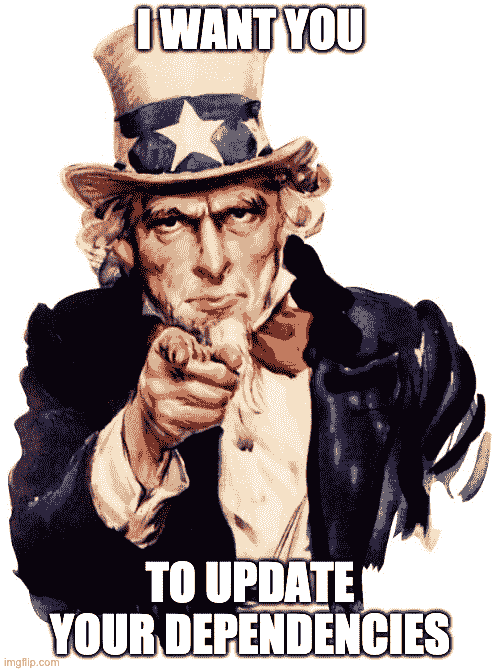
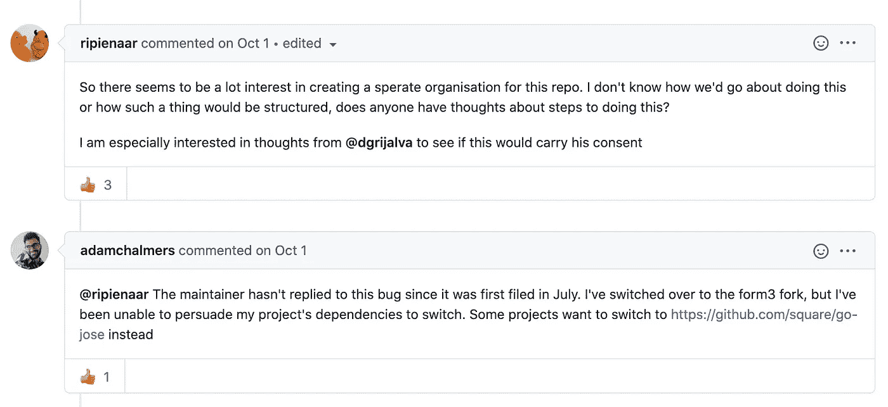
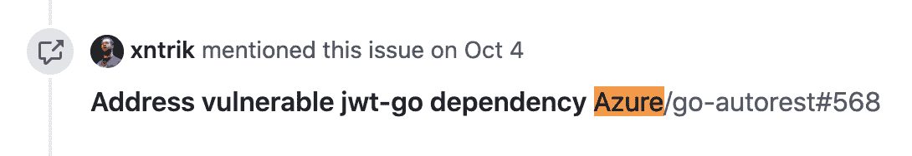
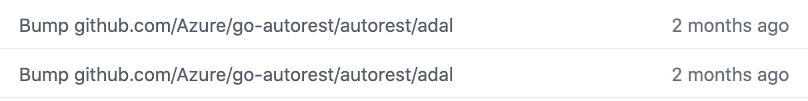
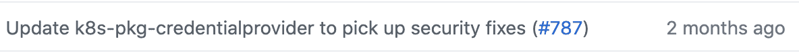

# 关于更新依赖关系

> 原文：<https://itnext.io/on-updating-dependencies-d298f2509af5?source=collection_archive---------3----------------------->

# 以及开源的互联网络。

这不是另一个谈论开源代码中有多少 CVE([很多](https://www.coreinfrastructure.org/programs/census-program-ii/))或者 CVE 系统有多难用([非常](https://www.csoonline.com/article/3444496/autonomy-and-the-death-of-cves.html))的帖子。它也不是关于维护人员如何低薪超负荷工作([令人沮丧地如此](http://antirez.com/news/129))，尽管它确实触及了这些话题。这是一个关于更新依赖关系的另一个原因的帖子，一个我刚刚意识到的原因。



为什么不呢？只需要一分钟…

我正在使用 snyk CLI 查看我的一些代码库中的 CVE。我有一些空闲时间，想看看能不能修几个。我从 tek ton[开始，这是一个我帮助维护的项目。运行 snyk 显示了一个高严重性漏洞！](http://tekton.dev)

```
$ snyk testTesting /Users/dlorenc/go/src/github.com/tektoncd/pipeline…✗ High severity vulnerability found in github.com/dgrijalva/jwt-go
```

不知何故，我记得在 Twitter 上听说过这个问题，并决定尝试修复它，看看会发生什么。我不认为 JSON Web 令牌在 Tekton 中的任何地方都被使用过，所以这可能不会影响我们的代码，但是让红色 x 消失也无妨。

我真的不知道这种依赖性从何而来，也不知道如何着手解决这个问题。 [Go modules](https://blog.golang.org/migrating-to-go-modules) 附带了一个很好的工具来解释你的依赖树，所以我尝试了一下，并且能够快速地追踪到依赖来自我代码中的什么地方。

```
$ go mod why github.com/dgrijalva/jwt-go
# github.com/dgrijalva/jwt-gogithub.com/tektoncd/pipeline/pkg/pod
github.com/google/go-containerregistry/pkg/authn/k8schain
github.com/vdemeester/k8s-pkg-credentialprovider/azure
github.com/Azure/go-autorest/autorest/adal
github.com/dgrijalva/jwt-go
```

在这种情况下，它是一个间接依赖，所以我不能通过直接更新来修复它。我需要用它来更新东西。我浏览了一下软件包 repo，看看修复了什么，是否可以更新一下，然后我碰到了开源中最可悲的事情之一——一个被放弃的项目。一个[修复](https://github.com/dgrijalva/jwt-go/issues/428)已经等待了一段时间，但是没有人来合并它:



这对维护者来说是悲哀的，对依赖这个库的人来说也是悲哀的——总的来说是悲哀的。这是另一个更大的讨论主题，我会在其他时间写。从阅读关于公关/问题的讨论中，看起来有一些分叉，但没有一个明确的替代物。我在 [Azure/go-autorest](http://github.com/azure/go-autorest) 库中看到了一个问题的参考，这是我列表中的下一个问题:



我在那里跳起来，看到他们能够通过用一个[分支](https://github.com/form3tech-oss/jwt-go)替换这种依赖性来前进。对我来说是个好消息！我只需要将更新后的 Azure/go-autorest 库放入我的树中。接下来是[文森特·德米斯特](https://twitter.com/vdemeest)的[k8s-pkg-凭证提供者](https://github.com/vdemeester/k8s-pkg-credentialprovider)图书馆。我对这些代码非常熟悉，所以我很有信心，如果他还没有修复的话，我也能修复。我早该知道的，当然文森特几个月前就已经说过了。他是台机器！



好了，现在我们开始我维护的代码。名单上的下一个是 google/go-containerregistry 。我开始感觉有点糟糕——我没有足够密切地注意到这个多少被广泛使用的[库(200 多个导入)被标记为高严重性漏洞。幸运的是，网上一个善良的陌生人(感谢](https://pkg.go.dev/github.com/google/go-containerregistry/pkg/name)[马库斯·托姆斯](https://twitter.com/markusthoemmes)！)已经[处理好](https://github.com/google/go-containerregistry/pull/787)了，我的共同维护者[杰森·霍尔](https://twitter.com/imjasonh)和[马特·摩尔](https://twitter.com/mattomata)已经把它合并了。



所以我所要做的就是在泰克顿应用补丁。一次快速的[公关](https://github.com/tektoncd/pipeline/pull/3628)(然后花了几天时间调试和修复新未能通过[测试](https://github.com/tektoncd/pipeline/pull/3632))让我开始做生意。在这一点上，我真的只是出于某种模糊的动机去实际修复一些东西，尽管我不认为这个漏洞真的影响了 Tekton。其他任何一周，我可能会停下来，或者被一些重要的事情分心。

也许这只是我想出了花这么多时间修复一个可能不相关的 CVE 警告的事后合理化，但我说服自己这根本不是浪费时间。我刚刚解除了依赖图中的下一组项目(很可能是我负责的更多项目，抱歉是互联网……)的更新和修复。他们甚至可能以不同的方式使用依赖关系，导致 CVE 影响他们！

我并没有假装我在这里做了大量的社区服务，但它确实让我意识到，一旦你发布了供他人重用的代码，你就成为了更大的开源图的一部分。

在这个网络中，做一个负责任的公民需要跟上时代，接受变化，即使这些变化与你的代码无关。

我很高兴看到所有新的自动化工作在开源世界中起飞，使这变得更容易和更快。[依赖机器人](https://dependabot.com/)公关是可怕的。CI 服务使合并这些 PRs 变得更容易，风险更低。**更快、更频繁的更新使得更新更快更容易。**

我的同事 [David Wheeler](http://twitter.com/drdavidawheeler) 最近和我分享了 [libyear](https://libyear.com/) 指标，我真的很喜欢。Libyears 反映了一种几乎看得见摸得着的方法来衡量一棵依赖树到底有多老。令我兴奋的是，我们甚至可以随着时间的推移来跟踪这一点，看看像[dependent bot](https://dependabot.com/)和其他工具对降低整个语言生态系统的寿命有何影响！

也许真正的 CVE 修复是我们一路上结交的朋友？

如果你对这些话题感兴趣，来和我一起努力为每个人改善开源的状态吧！我与 [CDF](http://cd.foundation) 合作，让发布安全软件变得更加容易和安全；与 [OpenSSF](http://openssf.org) 合作，提高我们都依赖的关键开源软件的安全性；当我想玩 yaml 和 cats 时，与 [Tekton](http://tek) 项目合作。

特别感谢:

*   戴夫·格里贾尔瓦(Dave Grijalva)费力不讨好地让这么多人用了这么长时间的图书馆。
*   [Form3.tech](https://github.com/form3tech-oss) 这么快就准备好替换库。
*   azure/go-autorest 的维护者、 [Vincent Demeester](https://twitter.com/vdemeest) 、[Markus th Mme](https://twitter.com/markusthoemmes)、杰森·霍尔和 [Matt Moore](http://twitter.com/mattomata) 在整个 go 模块生态系统中快速应用了这个补丁。
*   当然，还有我一路使用或接触过其代码的所有人！