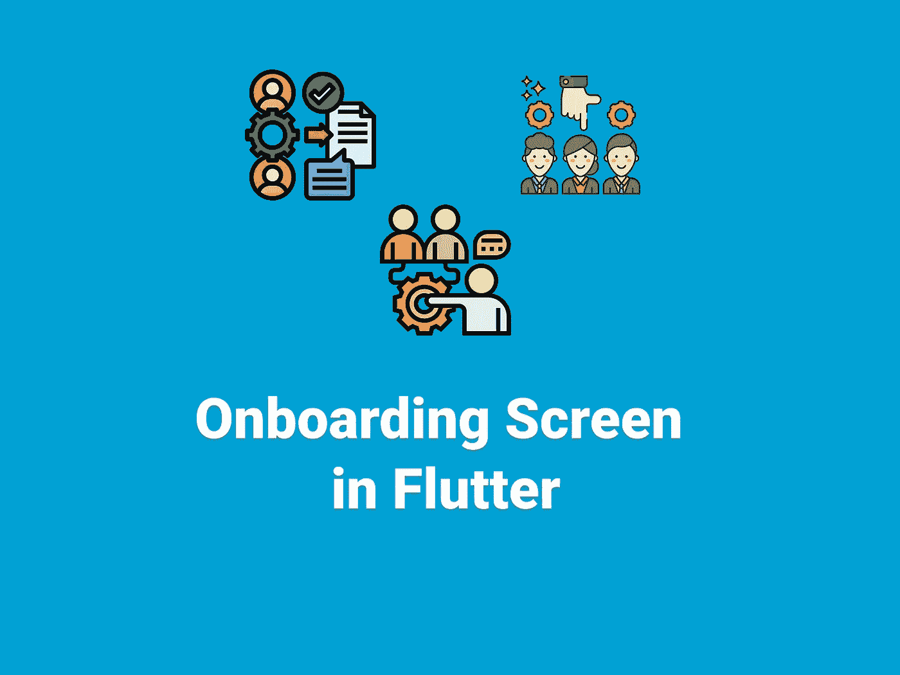
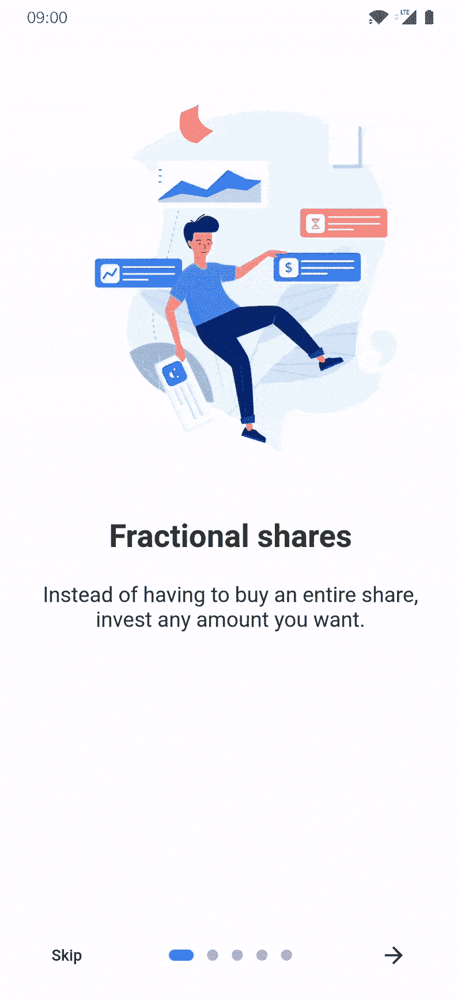

# 颤振中的 Onboarding 屏幕

> 原文：<https://itnext.io/onboarding-screen-in-flutter-6ad55cf131cc?source=collection_archive---------1----------------------->

## 颤动中的介绍屏幕



现在的手机应用程序都有一个应用程序介绍界面。这样他们就可以向用户展示他们应用程序的功能。解释应用程序，让用户留在应用程序中，这确实是一个重要的方面。事不宜迟，让我们开始吧。包的创建者是这样解释包的👇 👇

> 介绍屏幕允许你有一个启动屏幕，例如，在那里你可以解释你的应用程序。这个小部件是非常可定制的一个伟大的设计。
> 
> 使用另一个包， [dots_indicator](https://github.com/Pyozer/dots_indicator) ，也是我创建的。

# 动机



## 入门指南

[](https://pub.dev/packages/introduction_screen) [## 简介 _ 屏幕|颤动包

### 介绍屏幕允许你有一个启动屏幕，例如，在那里你可以解释你的应用程序。这个小部件是…

公共开发](https://pub.dev/packages/introduction_screen) 

*   首先，让我们将包添加到我们的`pubspec.yaml`

```
dependencies:
  introduction_screen: ^2.1.0
```

*   这样一来，让我们创建我们的介绍屏幕。首先，让我们为自己创建一个`introduction_page.dart`。

*   你可以使用你自己的插件来做你的页面，但是`PageViewModel`这个包也很不错。因此，让我们为我们的介绍屏幕制作一些页面。

*   在添加了你想要的页面之后，让我们确保用户在第一次打开应用程序时只看到这个介绍屏幕。所以我们需要将 [Hive](https://pub.dev/packages/hive) 或[共享首选项](https://pub.dev/packages/shared_preferences)包也添加到我们的`pubspec.yaml`文件中。在这篇文章中，我将使用 Hive 包，如果你想知道如何使用 Hive 包，你可以在这里查看👇 👇

[](/save-your-data-locally-in-flutter-with-hive-11ec5d30fb55) [## 用 Hive 在 Flutter 中本地保存您的数据

### Flutter 中最快的非 SQL 数据库解决方案之一

itnext.io](/save-your-data-locally-in-flutter-with-hive-11ec5d30fb55) [](/flutter-save-data-to-local-storage-with-hive-nosql-database-package-8a0de834f313) [## 颤振保存数据到本地存储与蜂房 NoSQL 数据库包

### Hive 是一个用纯 Dart 编写的轻量级、速度极快的键值数据库。

itnext.io](/flutter-save-data-to-local-storage-with-hive-nosql-database-package-8a0de834f313) 

*   为了只显示一次，我们需要给我们的`introduction_page.dart`添加一些东西。

*   然后让我们控制我们的`home_page.dart`。所以我们只能向用户显示一次。

*   仅此而已。我们成功地创建了我们的介绍屏幕。

你可以在这里找到一个工作示例👇 👇

[](https://github.com/SncOne/Onboarding-Screen) [## GitHub-SNC one/on boarding-Screen

### 此时您不能执行该操作。您已使用另一个标签页或窗口登录。您已在另一个选项卡中注销，或者…

github.com](https://github.com/SncOne/Onboarding-Screen) 

**感谢您的阅读！**👏👏

如果你喜欢这篇文章，请点击👏按钮(你知道你可以升到 50 吗？)

另外，别忘了关注我，在你的社交网站上分享这篇文章！也让你的朋友知道吧！！