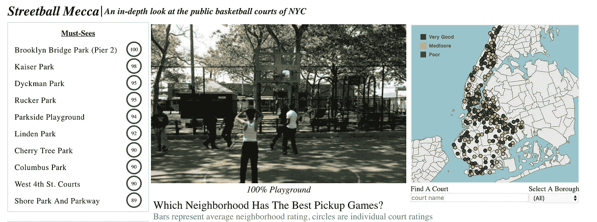

# 一种过滤 D3 交互式仪表板的方法

> 原文：<https://itnext.io/one-approach-to-filtering-a-d3-interactive-dashboard-f63e0244f77d?source=collection_archive---------2----------------------->



任何交互式 D3 仪表板中需要的一个关键需求是，基于用户对一个或多个应用过滤器的选择来呈现数据的逻辑实现。它的设计应该是灵活的，并且能够根据用户要求包括额外的过滤器。

## 仪表板设计

这个仪表板设计的想法是基于[大卫·围攻](https://interworks.com/people/david-siegel/)的 [Tableau 项目](https://interworks.com/blog/dsiegel/2018/02/02/streetball-mecca-mapping-nyc-basketball-courts-tableau/)的发现，这是我在帮助一名学生寻找基于纽约市篮球场的数据集时偶然发现的。数据集仅限于曼哈顿和布鲁克林。然而，这是一个很好的起点，而且由于我过去曾经使用过 Tableau，我知道我们可以通过下载项目来访问现有的数据。一旦我开始与仪表板交互，我就想到这将是一个使用 D3 重新创建的伟大项目。

设计本身包括几个部分，每个部分都允许用户与可视化交互。这需要附上 D3 **。on()** 每个元素的事件监听器会调用适当的过滤函数。虽然有几个明显不同的过滤器，仪表板还允许用户与单个元素进行交互，这些元素本身可以启动数据的重新呈现。通过一些试验和错误，我相信我实现了一个可靠的方法来跟踪可能的过滤器选项。

## 滤波器设计

完成滤波逻辑的第一步是决定最终设计将采用哪些滤波器。以下是用户可以使用的明确定义的过滤器:

*   神话；传奇
*   找个法院
*   选择一个区

用户还可以通过以下方式进行交互:

*   点击地图或条形图上的特定法院
*   在“必看”和“远离”部分点击特定的法庭
*   将鼠标悬停在特定的球场或公园上以启动工具提示

根据需求，我决定将过滤器选项组织成一个对象数组。每个对象包含一个被设置为过滤器名称的**键**和一个**值**，该值最初被设置为一个空字符串，然后根据用户交互进行更新。

```
let filters = [
  {key:'Overall court grouping',value:''},
  {key:'Borough',value:''},
  {key:'Name',value:''}
```

基于激活过滤器来负责过滤数据集的函数有:

1.  **findActiveFilters():** 返回一个仅包含活动过滤器的数组
2.  **runFilter():** 返回基于单个筛选值的筛选数据数组
3.  **filterData():** 调用 **findAcitveFilters** 并将项目数组和单个过滤器传递给 **runFilter。**然后返回过滤元素的最终数组

函数在过滤器数组中循环，只返回那些有值的过滤器。

```
function findActiveFilters() {
  return filters.filter(d => d.value);
}
```

**runFilter(arr，filter)** 函数执行实际的过滤并返回一个新的过滤值数组。它将为每个活动过滤器调用，并传递要过滤的数组。

```
function runFilter(arr,filter){
  return arr.filter( d => {
    return d[filter.key] == filter.value
  })
}
```

**filterData()** 函数调用 **findActiveFilters()** 函数来确定哪些过滤器是活动的，并将结果存储在 **activeFilters** 中。然后，它对数组进行循环，并在第一个循环中传递**run filter()****all data**数组，在每个附加循环中传递 **filteredData** 数组。该过程继续减少基于后续过滤器的元素数量。

```
function filterData() {
  let filteredData = [];
  let activeFilters = findActiveFilters();
  activeFilters.forEach(d => {
    if (filteredData.length == 0) {
      filteredData = runFilter(allData, d);
    } else {
      filteredData = runFilter(filteredData, d);
    }
  });
  return filteredData;
}
```

## 初始化图例过滤器

过滤系统就绪后，现在由各个过滤器(如图例)首先调用它们的支持过滤功能，这些功能执行特定于该过滤器的操作。一旦完成，它就调用 **filterData()** 函数。

初始化图例过滤器需要附加一个**。on('click '，filterLegend** )事件到每个渲染的图例。这里的回调， **filterLegend，**是特定于过滤器的函数，并通过 D3 的**数据绑定传递给绑定到该对象的实际元素。**

```
let legends = gLegends.enter().append('g')
    .on('click', filterLegend)
```

尽管您在上面的配置中看不到被传递的元素，但是如果我们重新配置它，如下所示，那么很明显 **filterLegend** 确实被直接传递给了元素。

```
let legends = gLegends.enter().append('g')
    .on('click', d => filterLegend(d)
```

在 **filterLegend()** 函数中，我们首先评估如果用户连续点击相同的图例 2x，是否需要重置图例值。如果实现该逻辑，则**设置**滤波器[0]。值**转换为空字符串，并重新运行**render legend(legend . domain())**函数，向其传递图例值数组。**

```
let legend = d3.scaleOrdinal()
  .domain(["Very Good", "Mediocre", "Poor"])
  .range(["#008000", "#FF9933", "#003399"]);function filterLegend(legendVal){
  if(filters[0].value == legendVal) {
    filters[0].value = ''
    renderLegend(legend.domain())
  } else {
      filters[0].value = legendVal
      renderLegend([legendVal])
  } 
  clearFilterParkValue()
  findActiveFilters().length ? 
     showFilteredData(filterData()) :  showAllData();
  filterBarChartBasedOnLegend()}
```

然后 **else** 负责设置**滤波器[0]。value** 设置为选择的值，然后调用**render legend([legend val])**作为只有一个图例值的数组。renderLegend()函数是最初渲染图例的函数，它被配置为利用 D3 的**更新**和**退出**生命周期来转换图例的不透明度，这取决于哪一个是活动的。

此外，还会调用以下函数:

*   调用 **clearFilterParkValue()** 来重置所有特定于公园的过滤器
*   三元运算符调用 **showFilteredData()** 或 **showAllData()**
*   调用**filterBarChartBasedOnLegend()**重置条形图

## 附加过滤功能

还创建了几个附加的过滤器类型函数来控制过滤。这里我要提到的另外两个是 **filterBorough()** 和 **filterPark()。**这两个本质上与 **filterLegend()** 做的一样，但是，具体是在那些过滤器的上下文中做。我把它们列在下面作为参考。

```
function filterBorough(boroughVal) {
  filters[2].value = "";
  if (boroughVal == "all") {
    filters[1].value = "";
    showAllData()
  } else {
    filters[1].value = boroughVal;
    filteredData = allData.filter(d => d.Borough == boroughVal)
    renderBarChart(nestingData(filteredData));
    renderTopParks(filteredData)
    renderBottomParks(filteredData)
  }
  findActiveFilters().length ? 
     showFilteredData(filterData()) : showAllData();
  clearFilterParkValue()
}function filterPark(parkVal) {
  if(filters[2].value == parkVal.Name ) {
     clearFilterParkValue()
  } else {
    filterParkValue(parkVal)
  }
  findActiveFilters().length ? 
    showFilteredData(filterData()) :  showAllData();
}
```

# 结论

整个过滤器功能需要花相当多的时间来完成，因为每个功能都有一些细微的差别。几个支持函数被配置为支持每个过滤器，过滤器可以依次调用它们自己的支持函数。最后，需要进行一次大的重构，以使它可以在不同的数据集上重用，我将在构建下一个仪表板时考虑这一点。

这是[链接](https://codepen.io/jkeohan/project/full/ZvKkKE)到正在进行的项目。如果任何人对如何进一步简化流程有任何反馈、建议或想法，我很乐意听取您的意见。