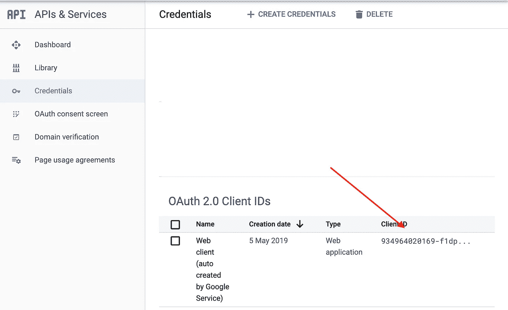
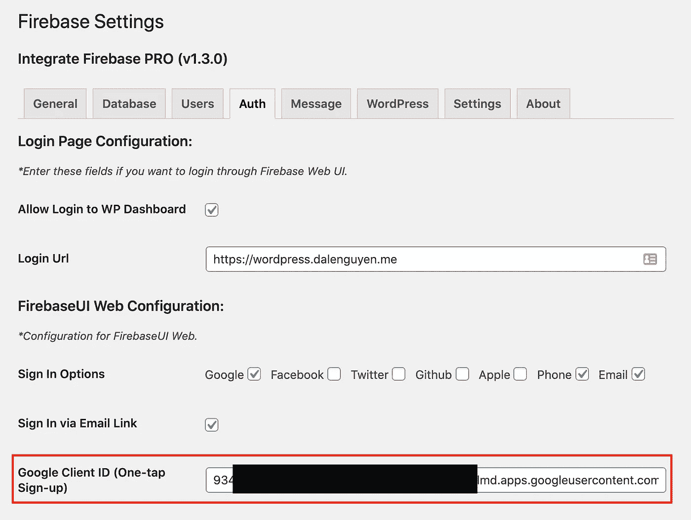
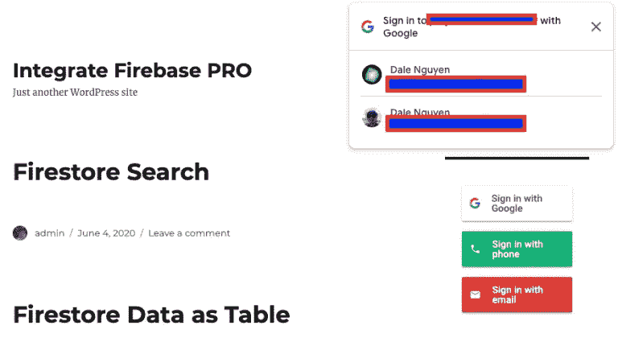
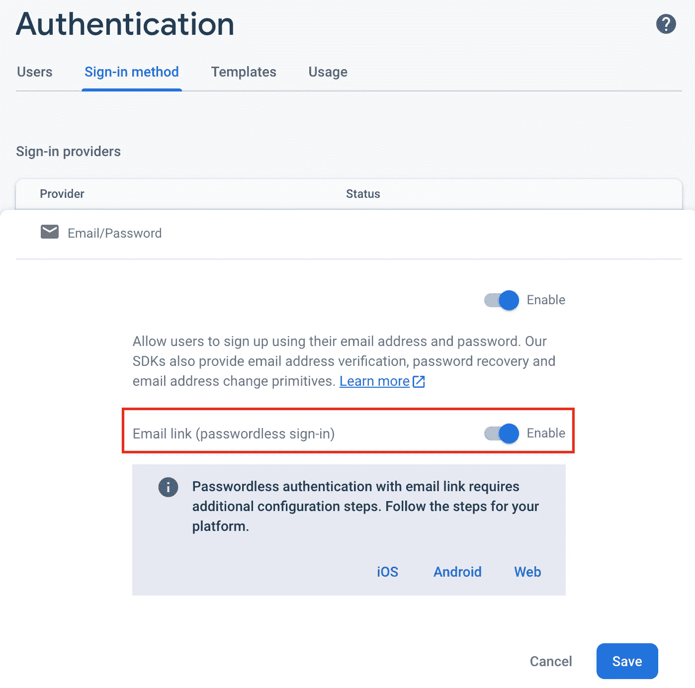
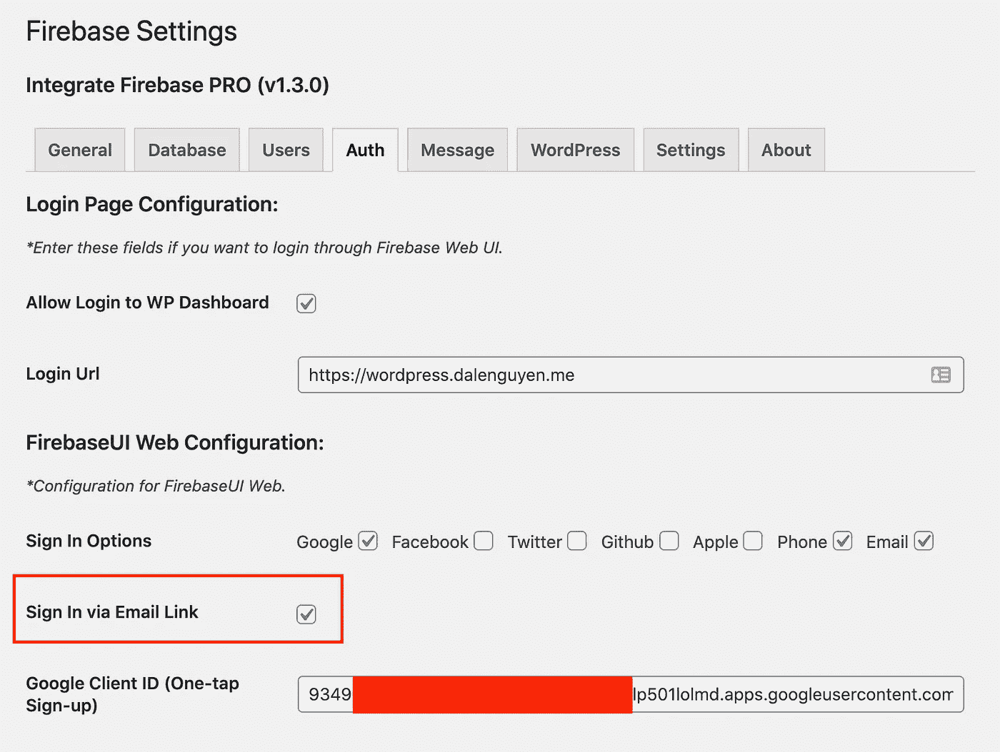
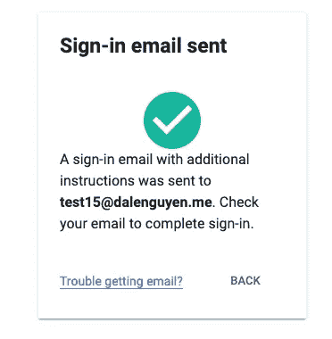

# 一键登录 WordPress & Firebase 或通过电子邮件链接

> 原文：<https://itnext.io/one-click-login-to-wordpress-firebase-or-via-email-link-d7610d71cd23?source=collection_archive---------3----------------------->

> 如果你对 Integrate Firebase PRO 版本感兴趣，请阅读完整的更新文档:[https://firebase-wordpress-docs.readthedocs.io/](https://firebase-wordpress-docs.readthedocs.io/)

【https://wordpress.dalenguyen.me/】演示:[T5](https://wordpress.dalenguyen.me/)

*   文章 1: [如何将 Firebase 集成到 WordPress](/how-to-integrate-firebase-and-wordpress-b017ee274687)
*   第 2 篇:[如何从 Firestore 检索数据并显示在 WordPress 上](/how-to-retrieve-data-from-firestore-and-display-on-wordpress-8638854a762e)
*   第 3 篇:[如何在 WordPress 中使用 Firebase 自定义声明](https://medium.com/@dalenguyen/how-to-work-with-firebase-custom-claims-in-wordpress-aaf83965bd20?sk=85786e3739d42b18c3e2c7344bc5f436)
*   第 4 条:[从 WordPress 保存数据到 Firebase(实时+ Firestore)](/how-to-save-data-from-wordpress-to-firebase-realtime-firestore-2eda917d01fb)
*   第五篇: [Firebase WordPress 用户集成](/firebase-wordpress-user-integration-c18a28e41cbd)
*   第 6 篇:[如何在 WordPress Dashboard 中管理 Firebase 用户](/firebase-users-management-in-wordpress-dashboard-61b4a1ca066)
*   第 7 条:[如何将数据从 WordPress 同步到 Firebase](/sync-data-from-wordpress-to-firebase-d6e5860d3a06)
*   第八条: [**一键登录到 WordPress & Firebase 或者通过电子邮件链接**](https://medium.com/@dalenguyen/one-click-login-to-wordpress-firebase-or-via-email-link-d7610d71cd23)
*   第 9 条:[从 WordPress 上传文件到云存储](https://medium.com/@dalenguyen/upload-files-to-cloud-storage-from-wordpress-e8acc8ce70cd)
*   第十条:[远程 URL 登录到 Firebase & WordPress](/remote-url-login-to-firebase-wordpress-2027fad7c159)
*   第 11 条:[添加 Firebase 认证到 WordPress 的 2 种方法& WooCommerce](https://dalenguyen.medium.com/2-ways-to-add-firebase-authentication-to-wordpress-woocommerce-df500c3b104e)
*   第 12 条:[如何将 WooCommerce 购买数据发送到 Firebase](https://dalenguyen.medium.com/how-to-send-woocommerce-purchase-data-to-firebase-8c8b4c8cff39)
*   第 13 条:[从 WordPress](https://dalenguyen.medium.com/create-manage-firebase-database-from-wordpress-13347d8ffb2e) 创建&管理 Firebase 数据库

密码已经过时了。记住用户名和密码以便登录一个网站可能很容易，10 个网站怎么样？

那么，一键登录并注册 WordPress & Firebase 怎么样？

# 一键注册

这是来自[谷歌](https://developers.google.com/identity/one-tap/web/)的一个功能。只需轻轻一点就可以注册新用户，不会因为注册屏幕而打断他们。用户在你的网站上获得一个安全的、基于令牌的、无密码的账户，受他们的谷歌账户保护。

*获取谷歌客户端 ID*

*应用谷歌客户端 ID*

之后，当客户访问您的网站时，会弹出一个窗口，允许他们一键注册。

*一键注册*

# 通过电子邮件链接登录

*允许 Firebase 中的电子邮件链接*

*允许通过电子邮件链接登录*

*通过电子邮件链接登录*